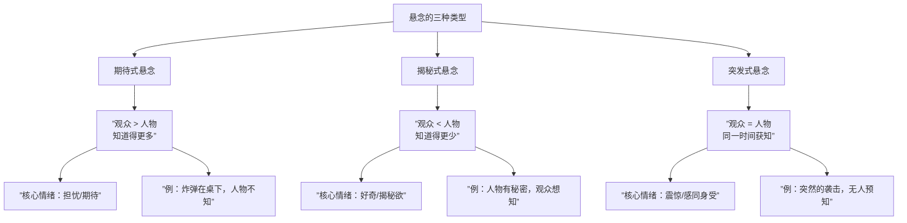

# 第13课：悬念的类型与策略

## 悬念的本质：观众期待 x 人物移情

悬念不是"观众不知道会发生什么"，恰恰相反——**悬念是观众知道（或预感）会发生什么，但因为在乎人物而产生强烈的期待与焦虑**。悬念的公式可以简化为：

> **悬念 = 观众期待 x 人物移情**

如果没有移情，观众不在乎人物的命运，那么再大的危险也无法产生悬念。这就是为什么恐怖片中如果人物塑造扁平，观众只会觉得"血腥"而不会"紧张"。

> [!TIP] 核心认知
> 编剧是信息的**释放者**，而非信息的**隐藏者**。好的悬念不在于"藏"，而在于"露"——让观众知道得足够多，从而产生期待和担忧。

### 观影心理学三分支

在进入悬念的具体技巧之前，我们需要理解观影心理学的三大分支：

1. **创作心理学** —— 编剧如何通过结构设计操控观众情绪
2. **人物心理学** —— 人物动机与行为的心理逻辑
3. **观影心理学** —— 观众在观影过程中的心理机制（悬念理论属于此分支）

悬念理论正是观影心理学的核心内容——它研究的是：**信息的不对称分布如何影响观众的情绪体验**。

---

## 三种悬念类型

根据**观众与人物之间信息量的对比关系**，悬念可以分为三种基本类型。下表呈现了它们的核心差异：

### 同一情节的三种悬念写法

以"房间里有炸弹"这一核心事件为例，三种悬念类型的写法完全不同：

| 维度 | 期待式悬念 | 揭秘式悬念 | 突发式悬念 |
|------|-----------|-----------|-----------|
| **信息分配** | 观众知道炸弹在桌下，人物不知道 | 观众看到人物紧张地看桌子，但不知道下面有什么 | 观众和人物同时听到"嘀"声 |
| **观众情绪** | "别坐下！桌子下有炸弹！"（焦虑） | "桌子下面到底是什么？"（好奇） | "天哪！"（震惊） |
| **银幕时间** | 可拉伸到很长（希区柯克经典理论） | 相对较短（揭秘后就失去悬念） | 极短（瞬间爆发） |
| **适用场景** | 高潮铺垫、倒计时情境 | 悬疑推理、人物秘密 | 动作场面、突发转折 |

> [!TIP] 希区柯克的炸弹理论
> 希区柯克有段经典阐述：如果三个人在玩牌，突然炸弹爆炸，观众得到的是**10秒钟的震惊**。但如果观众提前知道炸弹在桌下，看着人物若无其事地打牌，观众得到的是**10分钟的悬念**。这就是期待式悬念的力量——**信息优势 = 情绪杠杆**。

---

## 期待式悬念四大策略

期待式悬念是编剧最需要掌握的技巧，因为它能让观众持续处于紧张和期待之中。共有四大策略：

### 策略一：戏剧反讽（后知后觉的人物）

**戏剧反讽**（Dramatic Irony）指观众拥有"上帝视角"，比人物知道得更多，从而产生一种"居高临下"的优越感和焦急感。这也是**情节喜剧**的核心创作原理。

> [!EXAMPLE] 《北京爱情故事》电梯戏
> 陈思诚的角色偷偷在电梯里放屁，但不知道电梯里的其他人能闻到——观众都知道却无法告诉人物。这个场景的喜剧效果完全建立在"观众知道而人物不知道"的信息落差上。

**三种喜剧类型对照：**
- **动作喜剧** —— 靠夸张动作和肢体语言制造笑料
- **荒诞喜剧** —— 靠不合逻辑的情境制造笑料
- **情节喜剧** —— 靠**戏剧反讽**制造笑料（编剧最值得学习的类型）

### 策略二：悬而未决

在关键时刻留下未解决的悬念，迫使观众继续观看。这个策略的实战应用非常广泛：

- **分线索交叉剪辑** —— 一条线索在高潮处切断，切换到另一条线索（如《盗梦空间》四层梦境交叉剪辑）
- **剧集结尾悬念（Cliffhanger）** —— 在每集结尾留下爆炸性信息
- **场景内部的悬置** —— 在同一场景中，人物正在接近真相时被意外打断

### 策略三：已知危险

三种形式：

1. **观众看到人物的危险** —— 一辆车正在接近盲人角色（经典模式）
2. **人物看到别人的危险** —— 主角看到另一个人即将落入陷阱（双重悬念：主角能否成功救人）
3. **人物本身就是危险** —— 观众知道这个人物有暴力倾向，但其他人物不知道

> [!EXAMPLE] 《屏住呼吸》
> 盲人老兵的设定本身就是"已知危险"。观众知道他有着超乎常人的听觉和战斗力，看三个年轻人在房间里偷窃时，每一秒都提心吊胆。危险不是突然出现的，而是一直存在、不断升级的。

### 策略四：设计未来

**设计未来**指编剧提前向观众"预告"某种可能性，然后让观众等待这个可能性是否成真。高级的写法是**设计两套招数**：

- **第一套招数** —— 预告（让观众知道人物将要做什么）
- **第二套招数** —— 执行（让人物具体实施）

两套招数之间可以产生错位、偏离、反转，形成丰富的叙事层次。

> [!TIP] 心中一计
> "心中一计"是**简化版的设计未来**。它只设计一套招数：人物心中产生一个计划，然后看这个计划是否成功。这是非常基础但有效的悬念写法，适用于大多数商业类型片。

---

## 揭秘式悬念：秘密与人物神秘感

揭秘式悬念的核心是**观众知道自己不知道**，因此产生好奇心。

### 按照动作写，而非按照信息写

很多新手编剧写"揭秘"时，会让两个人物坐在咖啡馆里对话："你到底有什么秘密？"，这是最无效的写法。

正确的做法是：**按照动作来揭示秘密**。让人物在行动中暴露自己的秘密，而不是通过对话"说出来"。

> [!WARNING] 常见误区
> 不要让人物对着观众/其他人物"坦白"自己的秘密。秘密应该通过人物的**行为、选择、与他人互动的方式**自然流露。让观众自己"发现"秘密，而不是被"告知"秘密。

### 人物神秘感 vs 故弄玄虚

好的神秘感是**有底牌的神秘**——编剧自己知道这个人物为什么神秘，只是在合适的时机释放信息。不好的神秘感是编剧自己也不知道——纯粹是为了神秘而神秘。

---

## 突发式悬念：震惊的心理学

突发式悬念的核心不在于信息不对称，而在于**同步体验**——观众和人物同时面对意外。

### 三种突发式悬念技巧

| 技巧 | 原理 | 经典案例 |
|------|------|---------|
| **无能为力/抻开时间** | 人物想做什么但做不到，时间被主观拉伸 | 希区柯克《后窗》——主角腿骨折无法行动 |
| **时间压迫/定时炸弹** | 明确的时间限制制造紧迫感 | 所有"倒计时"情境 |
| **未知危险/未知环境** | 危险来源不确定，"此处无人胜有人" | 《蝴蝶梦》——Rebecca从未出现但无处不在 |

> [!EXAMPLE] 《后窗》中的时间技巧
> 希区柯克在《后窗》中创造了教科书式的"无能为力"情境：主角杰弗瑞腿骨折，只能坐在轮椅上通过窗户观察邻居。当怀疑对面发生了谋杀案时，他**无法行动**，只能眼睁睁地看着——而观众和他一样被束缚在轮椅上。屏幕时间在这一刻被"拉伸"了，每一秒都像一分钟那么长。

> [!EXAMPLE] 《Psycho》（惊魂记）的突发式悬念
> 希区柯克在《Psycho》的淋浴戏中颠覆了自己的理论——他没有提前"预告"杀人，而是让观众和女主一起猝不及防。观众前一秒还认为这是一部"偷窃+逃亡"的犯罪片，后一秒女主角就被杀了。这就是突发式悬念的力量：**颠覆预期，制造震惊**。

### 此处无人胜有人

这是未知环境技巧中最精妙的一招——**让一个缺席的人物成为最大的戏剧驱动力**。

在《蝴蝶梦》中，女主角嫁给德温特先生后搬进曼德利庄园，但她处处能感觉到前女主人Rebecca的存在。Rebecca已经死了，但她的**存在感比活着的人更强**。管家丹弗斯太太对Rebecca的忠诚、庄园中的每个角落都有Rebecca的痕迹——这个从未出场的人物成为全片最大的悬念源头。

> [!TIP] 编剧心法
> 想想你的故事里，谁"从不出现但无处不在"？这个人物的缺席可能是最好的悬念。

---

## 课堂小结：悬念的总分总结构

好的电影故事通常有一个**总悬念**（贯穿全片的核心问题）和若干**分悬念**（每个段落/场景中的小问题）。总悬念与分悬念之间形成"总分总"结构：

1. **总悬念建立** —— 激励事件后，观众知道故事的核心问题是什么
2. **分悬念递进** —— 每个场景/段落提出一个小悬念，解决后引出下一个
3. **总悬念解决** —— 高潮段落，所有分悬念汇入总悬念的最终解决

> [!QUESTION] 自我检测

点击展开检测题

**Q1：悬念的核心公式是什么？为什么人物移情如此重要？**

悬念 = 观众期待 x 人物移情。如果没有移情，观众不在乎人物命运，危险再大也无法产生悬念。好的悬念建立在观众对人物的关心之上。

**Q2：三种悬念类型如何划分？各举一部电影为例。**
- **期待式悬念**（观众知道得更多）：《釜山行》——观众知道僵尸在车厢那头，人物不知道
- **揭秘式悬念**（观众知道得更少）：《目击者》——观众想揭开真相，信息逐层释放
- **突发式悬念**（观众和人物知道一样多）：《Psycho》淋浴戏——没人知道会发生什么

**Q3：期待式悬念有哪四大策略？请简述每个策略的核心要点。**
1. **戏剧反讽** —— 观众有上帝视角，人物后知后觉；情节喜剧的核心原理
2. **悬而未决** —— 在线索/剧集/场景结尾留下未解决的悬念
3. **已知危险** —— 观众看到人物的危险/人物看到别人的危险/人物本身就是危险
4. **设计未来** —— 两套招数（预告+执行），产生错位与反转

**Q4：什么是"此处无人胜有人"？请用《蝴蝶梦》举例说明。**

让一个缺席（已故/离开）的人物成为最大的戏剧驱动力。在《蝴蝶梦》中，Rebecca从未出现但无处不在，她的存在通过庄园布局和管家丹弗斯太太的忠诚不断被强化，产生巨大的悬念和压迫感。

**Q5：什么是"心中一计"？它和"设计未来"有什么区别？**

"心中一计"是简化版的设计未来，只用一套招数：人物产生计划 → 看计划能否实现。而"设计未来"是两套招数：预告 + 执行，两者之间可以有错位和反转，层次更丰富。

---

## 拓展阅读

- **下一课**：[[0014-fu-bi-yu-kong-jian-de-xi-ju-xing|第14课：伏笔与空间的戏剧性]]
- 推荐观摩希区柯克全集，重点关注他对"信息分配"的处理
- 推荐分析《釜山行》中"期待式悬念"的逐场运用