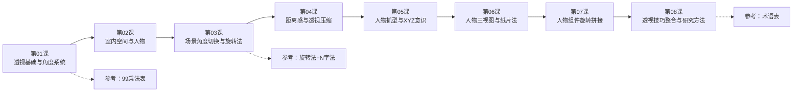

# 透视基础课程地图

## 课程信息

- **课程**: Krenz 基础透视与结构 第16期
- **讲师**: Krenz（K大）
- **总课时**: 8堂主课 + 补充课 + 作业攻略
- **核心工具**: 99乘法表（16格方块系统）

## 学习路径

## 课程模块

### 模块一：基础框架（L1）

| 知识点 | 掌握程度 |
|--------|----------|
| 摄影机与被拍摄物体的关系 | ★★★ 融会贯通 |
| 一点/两点/三点透视的摄影机解释 | ★★★ 融会贯通 |
| 99乘法表16格系统 | ★★★ 融会贯通 |
| 倍增法（1变2） | ★★★ 融会贯通 |
| 纸片法/盾牌法 | ★★☆ 理解概念 |
| 控笔与反透视 | ★★☆ 需要练习 |

### 模块二：空间构建（L2-L4）

| 知识点 | 掌握程度 |
|--------|----------|
| 单点透视房间 | ★★★ 融会贯通 |
| L型空间建模 | ★★★ 融会贯通 |
| 旋转法 | ★★★ 融会贯通 |
| N字法 | ★★☆ 理解会用 |
| 透视压缩 | ★★★ 融会贯通 |
| 22.5°/45°/67.5°量化 | ★★☆ 理解会用 |
| 户外空间透视 | ★★☆ 需要练习 |

### 模块三：人物与模型（L5-L7）

| 知识点 | 掌握程度 |
|--------|----------|
| XYZ意识 | ★★★ 融会贯通 |
| 脚/鞋子建模 | ★★☆ 需要练习 |
| 三视图构建 | ★★☆ 需要练习 |
| 纸片法人物 | ★★☆ 需要练习 |
| 组件旋转拼接 | ★★☆ 需要练习 |
| 996 vs 高富帅方块 | ★★★ 融会贯通 |

### 模块四：研究与整合（L8）

| 知识点 | 掌握程度 |
|--------|----------|
| 颗粒度思维 | ★★★ 融会贯通 |
| 带透视XYZ临摹 | ★★☆ 需要练习 |
| 30分钟研究法 | ★★★ 融会贯通 |
| 研究取代摸鱼 | ★★★ 心态转换 |
| 带景人物综合 | ★★☆ 需要练习 |

## 作业体系

| 课次 | 作业 | 时长估计 | 难度 |
|------|------|----------|------|
| L1 | 45度房子建模 + 转角度体验 | 8-10h | ★★☆ |
| L2 | 室内空间+人物配置 | 8-10h | ★★☆ |
| L3 | 场景角度切换 | 6-8h | ★★★ |
| L4 | 距离感+压缩练习 | 6-8h | ★★★ |
| L5 | 人物部件抓型 | 6-8h | ★★★ |
| L6 | 人物三视图绘制 | 8-10h | ★★★ |
| L7 | 人物组件旋转拼接 | 8-10h | ★★★★ |
| L8 | 带景人物综合创作 | 10-15h | ★★★★ |

## 学习建议

### 时间分配

- 每周投入 8-10 小时（含听课+作业）
- 听课 3 小时 / 作业 5-7 小时
- 课后花 15 分钟做树状图总结

### 难度预警

> [!warning] 平台期提示
> L3-L4 阶段会出现第一个平台期（旋转法与压缩），这是正常的。坚持画完作业，不要跳过。

> [!tip] 进阶准备
> L8之后，建议进入 DLC 阶段继续练习带景人物。同时开始用「研究式摸鱼」替代随意涂鸦。

### 推荐攻略

1. **C2/C3开局**：从45度最容易的角度开始
2. **钢笔君辅助**：初期使用钢笔工具辅助拉线，后期逐渐徒手
3. **3D参照**：善用sketchfab/魔术方块拍照获取初始方块
4. **作业优先**：作业是经验值最大的来源，认真完成
5. **社群求助**：遇到困难先搜索B站「K大透视课」或询问社群