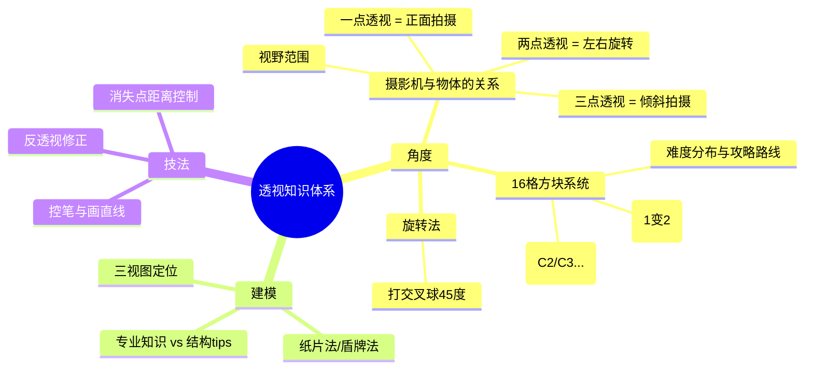

# 第01课：透视基础与角度系统

## 课程导览：如何学透视

### 树状图思维与主动学习

Krenz在课程一开始就强调了一个核心观点：**学透视不是在学技法，而是在建立一套能运作的框架（framework）**。这个框架的构建工具就是**树状图思维**——用 XMind（或其他思维导图软件）将知识点拆解、连接、结构化。

当你上课时，听到关键词（如"角度""建模""反透视""结构"），课后应当把它们写成一个个节点，然后问自己：这些概念之间是什么关系？谁是主干谁是分支？

```
┌─────────────────────────────────┐
│          透视知识树              │
├─────────────────────────────────┤
│  角度                            │
│  ├── 摄影机与物体的关系           │
│  │   ├── 视野范围                │
│  │   ├── 一点透视                │
│  │   ├── 两点透视                │
│  │   └── 三点透视                │
│  ├── 16格方块系统（99乘法表）     │
│  │   ├── C2/C3开局攻略           │
│  │   ├── 倍增法（1变2）          │
│  │   └── 角度压缩与量化          │
│  └── 旋转法                      │
│      └── 打交叉求45度            │
│  建模                            │
│  ├── 三视图定位                  │
│  ├── 纸片法/盾牌法               │
│  ├── 专业知识 vs 结构tips         │
│  └── 从盒子到复杂形状             │
│  技法                            │
│  ├── 控笔与直线                  │
│  ├── 反透视修正                  │
│  └── 消失点距离控制              │
└─────────────────────────────────┘
```



这不仅仅是用来上这节课的技能。Krenz 说了一句很值得玩味的话："如果你听我讲课可以睡着，恭喜你赚到了比学费还值钱的东西——因为未来你会有十年压力大到睡不着，到时候拿我的课出来放就好。" 这句玩笑话背后是严肃的学习观：**你不是来听故事的，你是来学总结的**。

> [!tip] 框架思维的价值
> 这个世界上讲话又臭又长没重点的人很多（包括你未来的老板），能快速整理出逻辑框架并提取重点，是你终生受用的元能力。


### 主动学习 vs 被动学习

| 被动学习 | 主动学习 |
|---------|---------|
| 老师教什么你学什么 | 自己建立知识结构 |
| 跟着学校进度走 | 带着问题去上课 |
| 听完觉得"好像懂了" | 课后能说出具体学到的内容 |
| 知识碎片化 | 知识形成树状图 |

课程中最有价值的能力不是画一条完美的直线，而是**总结能力**。试试看：你能用三句话概括你看过的上一部电影、上一本漫画吗？大多数人不行。这就是总结能力缺失的表现。

**课后练习**：每次上完课，用 XMind 整理当节课的知识树，并尝试用三句话向朋友复述这节课讲了什么。

---

## 摄影机哲学：透视的本质

### 摄影机与被拍摄物体的关系

这是整门课最重要的认知转变：**透视不是一个关于"画法"的问题，而是一个关于"摄影机如何拍摄物体"的问题。**

> [!example] 核心观念
> Krenz 使用 Sketchfab 上的 3D 方块模型来演示：你可以用鼠标拖拽旋转视角，观察方块的各个面如何随着视角改变而改变面积分配。学透视就是学这个——**在脑海中有一个摄影机，知道它在什么位置、以什么角度拍摄物体。**

想象你有一个摄影机和一个方盒子。在你的画框内，你看到的是这个方盒子的各个面。当你左右移动摄影机时，盒子的左右两个面的面积比例会变化——左边变多右边就变少。当你上下移动摄影机时，顶面和底面的可见度也会变化。

### 视野范围（镜头范围）

你的画框等同于摄影机的**视野范围**。这个范围决定了物体的变形程度。如果你的视野范围很大（广角镜头），靠近边缘的物体就会产生明显的透视变形；如果视野范围很小（长焦镜头），整个画面看起来就"比较平"。

### 一点/两点/三点透视的重新定义

传统的透视教学会告诉你：
- **一点透视**：有一个消失点
- **两点透视**：有两个消失点
- **三点透视**：有三个消失点

但 Krenz 用一种更直观的方式重新定义它们：

| 透视类型 | 摄影机的状态 | 视觉效果 |
|---------|------------|---------|
| **一点透视** | 摄影机**正面拍摄**物体 | 只有纵深方向有收缩 |
| **两点透视** | 物体相对于摄影机**左右旋转** | 左右两个方向都有收缩，垂直方向保持平行 |
| **三点透视** | 摄影机**倾斜拍摄**（俯拍/仰拍） | 三个方向都有收缩，垂直方向也不再平行 |

看3D示意图时，可以这样理解：
1. **一点透视**：摄影机直直地对着物体正面，你看到一个面正对着你，另外两个面往纵深收缩。
2. **两点透视**：把物体绕Y轴转一个角度，你同时看到两个侧面，两个侧面的边线分别向左右两个消失点收缩。
3. **三点透视**：把摄影机抬起来俯拍或低下去仰拍，你会看到顶面或底面，并且原本平行的垂直线也开始收缩。

> [!tip] 记忆关键
> 不要背"一个消失点是一点、两个是两点"——那是结果不是原因。原因是：**摄影机的位置和朝向决定了物体看起来是几点透视**。

---

## 🎯99乘法表：16格方块系统

### 方块编号与角度

将长宽高比为 1:1:1 的魔术方块放在摄影机前，从不同角度拍摄16张照片，就能得到**99乘法表的16格方块系统**。

```
         A     B     C     D     E
         1     2     3     4     5
   ┌──────┬──────┬──────┬──────┬──────┐
 1 │      │      │      │      │      │
   ├──────┼──────┼──────┼──────┼──────┤
 2 │      │      │      │      │      │
   ├──────┼──────┼──────┼──────┼──────┤
 3 │      │  B3  │  C3  │  D3  │      │
   ├──────┼──────┼──────┼──────┼──────┤
 4 │      │      │      │      │      │
   └──────┴──────┴──────┴──────┴──────┘
```

每个编号代表一个特定的摄影机-物体关系。比如 **C3** 代表45度角、略高于物体（能看到顶面）的标准视角——这是初学者最容易上手的角度。


### C2/C3开局攻略路线

不是所有的16格方块都好画。有些角度因为重叠的面太多、压缩太复杂，建议后期再攻略。

#### 难度分布

| 区域 | 难度等级 | 建议 |
|------|---------|------|
| **C2/C3 开局** | ★☆☆☆ | 首选！45度角，左右面面积相等，直觉判断即可 |
| **B2/D2/B3/D3** | ★★☆☆ | 进阶，在 C3 基础上向四周扩展 |
| **游戏式（平视排）** | ★★★☆ | 难度中等，但实际应用中较少用到 |
| **C1/D1（俯仰角排）** | ★★★★ | 上排很少用，投少量点数即可 |
| **A4/A5（极端俯仰角）** | ★★★★★ | 难度高但常用，需要手感技能解锁 |

**推荐的技能树升级路线**：
1. **第一阶段**：练熟 C2 → C3 → B2 → D2（四个核心角）
2. **第二阶段**：扩展 C3 到 B3 → D3 → C4 → B4（六个常用角）
3. **第三阶段**：补充平视角（A1~A3 排）
4. **第四阶段**：攻克俯仰角（A4/E 排）

> [!warning] 不要贪多
> 没必要把所有16格都练到同一水平。大部分应用场景只需要6-8个角度就够了。把点数投资在最常用的角度上。


### 倍增法（1变2）

有了 1:1:1 的方块之后，如何画出 1:2:1、2:2:1 等任意比例的盒子？

**核心方法——打交叉求中点**：

1. 在方块的某个面上打对角线（交叉）
2. 交叉点就是这个面的中心点
3. 过中心点拉一条与侧边平行的线，这就是中线
4. 将中线延长到原来长度的两倍，连接端点，就得到了一个 1:2 的面

同样的方法可以继续用——在 1:2 的基础上再打交叉，再延长，就能得到 1:3、1:4 等比例。

这个过程很像小学数学的九九乘法表——你只需要记住一个基础单位（1:1:1 方块），就能通过倍增法推算出任意比例的盒子。

> [!note] 数学表达
> 表面上看似复杂，实际只需要小学几何水平。打交叉求出中点的逻辑是：**矩形的对角线交点就是几何中心**。
>
> $$
> \text{面}ABCD\text{的对角线交点为}O\text{，则}AO = OC, BO = OD
> $$
>
> 过 O 且平行于 AD 的线即为中线。

---

## 从盒子到模型

### 三视图定位

三视图是工程制图的经典方法——从**正面、侧面、顶面**三个方向描绘物体。在透视中，三视图的作用是这样：

1. 先画出物体在三个视图中的比例轮廓（例如一个鞋子的正面、侧面、顶面）
2. 了解物体在三个维度上的尺寸关系（例如鞋子宽度:高度:深度 = 2:1:1.5）
3. 在透视空间中画出一个符合该比例的盒子
4. 在盒子内部，根据三视图提供的轮廓线索，逐步切出物体的形状

```
想象流程：
  正面图（宽×高） + 侧面图（深×高） + 顶面图（宽×深）
        ↓
  合并出3D比例盒子
        ↓
  在盒子中用纸片法切出形状
```


### 纸片法/盾牌法

当你需要在透视空间中画对称的曲面物体（比如鞋头、车身、人物头部）时，纸片法/盾牌法是最实用的技巧。

**步骤**：
1. 在盒子**正面的中线**上画一条曲线（纸片）
2. 在盒子**侧面**也画一条对应曲线
3. 从这两条曲线上的对应点做连线
4. 这些连线形成的包络面就是你要的曲面

> [!example] 实战案例
> 画鞋子时：先画一个盒子，在前端的中线上贴一个"纸片"（尖一点的形状），然后把纸片的左右边与盒子的侧边连接，就能得到一个前端尖翘的鞋头造型。这个纸片就是"盾牌"——它在空间中定义了你想要的形状。

核心逻辑：**先在平面的中线上确定形状，再将形状延伸到三维空间中**。

### 专业知识 vs 画家消化后的结构tips

Krenz 在课程中区分了两种知识类型：

| 类型 | 特点 | 例子 | 适合阶段 |
|------|------|-------|---------|
| **专业知识** | 解剖学式的深入背记 | 医用解剖书的每一块肌肉、骨骼 | 进阶学习者 |
| **结构tips** | 画家经验总结的简化几何 | 用"圆柱+马鞍"代替肩部肌肉 | 初/中级学习者 |

> [!tip] 关键区别
> 专业知识是"原文"，结构tips是"翻译"。初学阶段不要直接啃原文——先背结构tips，快速建立可用的模型，有余力再去研究专业知识。

这也是为什么 Krenz 的画法不是从肌肉开始，而是从**纸片、盒子、圆柱**这些基础几何体开始的。

---

## 散点透视与旋转法基础

### 散点透视：画面中不同物体可有不同消失点

这是一个非常重要的认知升级：**我们不应该问"这张图是几点透视"，而应该问"这个物体在画面中是几点透视"。**

在一张图中，不同的物体可以有不同的消失点。例如：
- 地板是正面朝向摄影机的——**一点透视**
- 画面中间有一张桌子转了45度——**两点透视**
- 上方浮着一个盒子，角度完全自由——**三点透视**

这三种物体可以同时存在于一张画面中。这就是所谓的**散点透视**。

> [!warning] 常见误解
> "一张单点透视的图里只能有一个消失点"——这个说法是错的。一个房间（一点透视）里完全可以摆一个转了45度的柜子（有它自己的消失点），这并不矛盾。你要以**个别物体**为单位来判断透视类型。


### 旋转法基础：打交叉求45度

如何在一个已经建好的透视空间中，让某个物体旋转45度？

**基本步骤（在平面内旋转）**：
1. 在原有的正方形地面上打对角线（交叉）
2. 过交叉点做水平线和垂直线，形成十字
3. 将十字的四个端点连接——这个连接线就是原正方形旋转45度后的新正方形的边
4. 将这个旋转后的正方形向上拉伸成立方体

这个方法在第三堂课会详细展开。第一堂课只需要知道：**旋转法本质上是利用几何关系在一个透视统一的空间中安放不同朝向的物体。**

---

## 控笔与反透视

### 画直线技法

透视的基础是直线。如果线画不直，你的方盒子会歪，后面的所有建模都会建立在错误的基底之上。

**画直线的技巧**：
1. **用手臂而非手腕**：手腕画短弧线，手臂画长直线。将手移到画布边缘，横向拉动前臂，轨迹会更直。
2. **使用无压感笔刷**：有压感的笔刷太灵敏，容易暴露手的微抖。透视练习阶段建议用**没有粗细变化的圆头笔刷**。
3. **钢笔工具（钢笔君）**：在不同软件中的透视辅助线工具。点了两个点后生成一条可拖拽的透明辅助线。熟练使用钢笔君 = 获得透视外挂。

> [!example] 关于钢笔君的劝学
> Krenz 的原话："上网搜寻——这是你现在的能力。拜托一下那个操作上网查一下好不好？我教你喔：上网搜寻关键字 'K大透视课 Procreate 钢笔君使用'。你已经得到等级2的搜寻技能了。"

### 反透视问题及修正

**反透视**是指线没有沿着正确的收缩方向走，导致物体看起来"歪了"。

**常见错误**：
1. **单条线方向不对**：方盒子的某一条棱没有指向正确的消失点方向。这条线在大图中看也许不明显，但当你画多排房屋时，每排都歪一点点，最终呈现"妈见打"式的急速偏差。
2. **复制粘贴不调透视**：直接把近处的面复制粘贴到远处（以为贴图大法万能），导致消失点完全对不上。

```
正面教材：每条线沿着同一个收缩方向
反面教材：中间某条线方向跑偏了 → 整体变形
```

**修正方法**：日常使用钢笔君画辅助线对齐消失点。不要"靠感觉画"，感觉通常不可靠。

### 消失点距离与视野范围控制

消失点太近会导致物体严重变形（夹角过于尖锐），这是初学者极易犯的错误。

**安全距离法则**：
- 在你画布上画出目标方块的宽度（假设为 N）
- 将消失点放在画布**左右各 3N 到 4N 的位置**
- 在这个范围内画出来的方盒子，角度比较正常，变形不会过度

> [!tip] 泄及经验
> 这不是严谨的工程制图，这是 Krenz 为了防呆设计的经验法则。不需要精确测量，只要知道"消失点不要放在方块旁边"就对了。

---

## 作业概览

### 作业一：45度房子

**目标**：绘制一栋在45度视角下的房子，包含屋顶、窗户、屋檐等结构细节。

**训练核心**：
1. 画一个符合透视的方盒子（地基）
2. 通过打交叉求中线，找到屋顶的顶点
3. 搭建屋顶（L型盒子的屋顶画法）
4. 练习小结构建模（屋顶挖洞、架横梁、贴瓦片）

这个作业被 Krenz 称为"看起来吓人实际上很和善"的作业——它看起来复杂，但每个步骤都被拆解成了傻瓜式流程。

### 作业二：转角度体验

**目标**：将同一个房屋模型画到不同角度（俯角、仰角等）。

**核心方法**：
- **初始方块取用法**：如果你不会画某个角度的方盒子，可以使用 Sketchfab 上的3D模型或魔术方块拍照作为参考基底
- 将基底的方盒子"借来"后，自己完成后面的建模步骤（求中线、画屋顶、加细节）
- 这是一种"读取未来自己的进度"——先用工具画出你还不会画的方盒，然后在它的基础上练习后面所有的建模流程

> [!question] 自我检测
> 透视的本质是什么？
>
> <details>
> <summary>查看答案</summary>
>
> 透视的本质是**摄影机与被拍摄物体的关系**。不同的透视类型（一点/两点/三点）本质上对应摄影机的不同位置和朝向。
>
> </details>
>
> 16格方块系统中的 C3 角度为什么推荐作为开局选择？
>
> <details>
> <summary>查看答案</summary>
>
> **45度角的核心优势**：左右面面积相等 → 透视压缩最小 → 可用肉眼直接判断比例 → 学习门槛最低。这就是为什么整个课程体系以45度为起点。
>
> </details>
>
> 什么是反透视？怎么修正？
>
> <details>
> <summary>查看答案</summary>
>
> 反透视是指线条没有沿着正确的收缩方向画，导致物体形变。修正方法：使用钢笔君（透视辅助线工具）对齐消失点。
>
> </details>

## 下一步

在理解了透视的摄影机本质和16格方块系统之后，接下来进入[[0002-shi-nei-kong-jian-yu-ren-wu|第02课：室内空间与人物]]——把第一课的框架应用到室内空间，学习房间构建、家具摆放和人物比例配置。