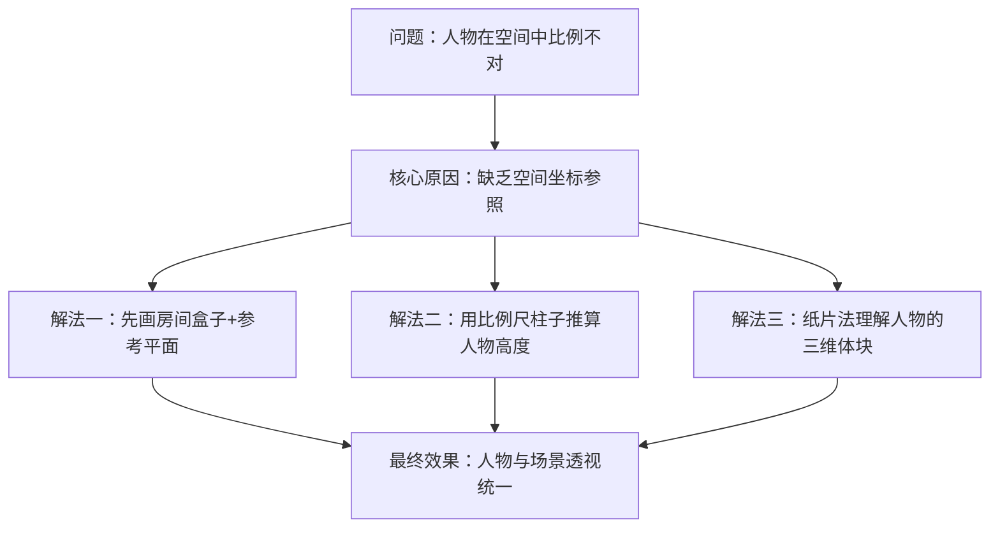
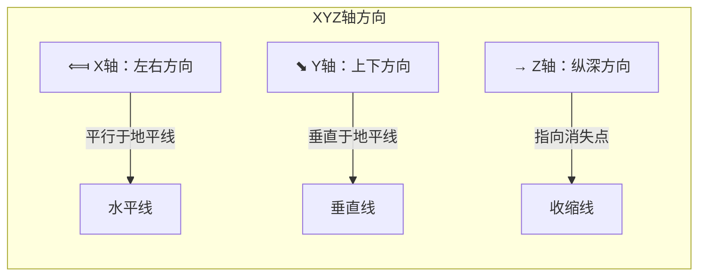
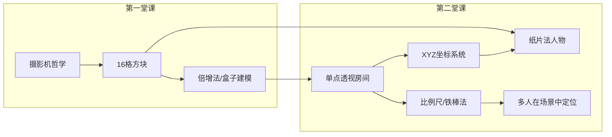

# 第02课：室内空间与人物

## 从外部到内部：进入房间盒子

第一堂课我们画了外部的小房子（45度角），第二堂课我们要走进室内。你会发现在**室内空间中，透视的约束条件比室外更多**——墙、地板、天花板的三面夹击迫使你必须清晰地定义空间坐标，任何比例错误都会变得非常扎眼。

### 带着问题来上课

在开始之前，请先思考这几个问题。它们会帮助你更专注地吸收本课内容：

- 我想画一个人站在房间里，但我总觉得自己画的人物和背景是"贴"在一起的——怎么办？
- 我想在一个画面里画两个人，如何确保他们在同一个空间里，而不是各站各的？
- 人物从画面近处走到远处时，我要怎么控制她的比例缩放？



---

## 单点透视房间的搭建

### 地平线与消失点

创建室内空间的第一步是确定**地平线（Horizon Line / HL）** 和**消失点（Vanishing Point / VP）**。

```
                      VP（消失点）
                        ●
                        |
────────────────────────┼────────────────────── 地平线（HL）
                        |
                      墙壁基线
```

在单点透视中，所有垂直于你视线方向的线（即纵深方向线）都汇聚到这个消失点，而水平方向和垂直方向的线保持平行。

### 天花板、墙壁、地板的透视处理

有了地平线和消失点之后，房间的三个面就可以搭建出来：

1. **地板**：从消失点向画面底部拉线，形成地板的纵深感。横向的线保持水平，间距随着向远处延伸而逐渐缩小（近大远小）。
2. **天花板**：与地板对称，从消失点向画面上方拉线。横向线同样保持水平。
3. **墙壁**：左右两面墙垂直于画面，不需要透视收缩——你看到的是一个矩形的平面。

> [!note] 单点透视房间的重要特性
> 在单点透视的房间中，只有**纵深方向（Z轴）** 有收缩，X（左右）和Y（上下）方向都是平行的。你可以把天花板/地板/墙壁想象成一个"从内部看过去的盒子"，摄影机正对着其中一面墙。


### 室内空间的XYZ轴



在室内空间中，任何物体的位置都可以用这三个轴来描述。将空间划分成 XYZ 坐标网格后，你就有了一个强大的定位系统：

- 沙发在 X:2, Y:0.5, Z:-3 的位置
- 茶几在 X:0, Y:0.3, Z:-2 的位置
- 落地灯在 X:-1.5, Y:1.2, Z:-4 的位置

这个坐标系统是后续人物定位、家具摆放的基础。

> [!tip] 实战技巧
> 在实际作画中，你不需要精确地标出坐标数值。你只需要在脑海里或画面上建立一个**参考平面（地面网格）**，然后凭视觉在这个网格中放置物体。参考平面越清晰，你的空间感就越强。

### L型空间建模

现实中的房间很少是完美矩形的——总会有转角、隔断、凹位。**L型空间**是最常见的变体。

**L型空间的建模步骤**：
1. 先画一个完整的单点透视房间盒子
2. 确定要"切掉"的部分（比如柜子凸出/墙壁凹入）
3. 以远处的墙壁为基准，在底面上打交叉求中线求出新墙的位置
4. 将新墙向上拉伸，形成L型的空间结构

L型空间的要点是：**两段空间的消失点是一致的**，因为它们共享同一个地平线。

---

## 家具与人物

### 比例判断——比例尺法

这是第二堂课最核心的实操技能。

**原理**：在家具中确定一个"基准高度"（比如洗手台通常高 80cm），然后以此推算空间中所有其他物体的高度。

```
实战流程：
  洗手台（高80cm, 宽60cm）
     ↓ 确立基准
  房间高度 ≈ 洗手台 × 3 = 240cm（2.4m）
  房间宽度 ≈ 洗手台宽度 × 4 = 240cm
     ↓ 推算人物
  人物身高（160cm）≈ 洗手台高度 × 2
  四叶妹妹（85cm）≈ 洗手台高度
```

具体步骤是：

1. 在空间中画一个你熟悉的参考物体（橱柜、桌子、门框），**确定它的实际尺寸**
2. 画一根"比例尺柱子"——与参考物体同高
3. 将这根柱子穿过地板移到空间中其他位置，根据透视调整柱子高度
4. 把人物和柱子做比较，推算出人物在该位置应有的高度

> [!example] 铁棒法
> 假设你的柜子高 80cm。在画面上画一根与柜子高度相同的"铁棒"，然后将这根铁棒"移动"到画面的A点、B点、C点——通过透视找到它在每个位置应有的高度。这样你就得到了空间中任意位置的80cm参照高度。然后在80cm的基础上叠加比例即可得到160cm、240cm等人物高度。

**人物比例分割**：
- 160cm 的人物，胯下在总高度的一半
- 上半身三等分：第1份是头，第2份是胸到腰，第3份是腰到胯
- 下半身二等分（从胯到脚底）：中间是膝盖

### 透视对齐

第二个核心原则：**在初学阶段，让人物的所有关节线都对齐空间透视的方向**。

具体来说：
- 人物的双眼连线 → 对齐 X 轴（水平方向）
- 人物的锁骨 → 对齐 X 轴
- 人物的脊柱中线 → 对齐 Y 轴（垂直方向）
- 人物的膝盖连线 → 对齐 X 轴
- 人物的双脚连线 → 对齐 X 轴

> [!tip] 为什么要全部对齐？
> 因为初学者的空间感还不够强。如果一开始就让人物转动角度（比如身体朝左、头朝右、腿朝不同方向），你会迷失在复杂的透视变化中。先画"完全对齐透视"的站姿，在这个基础上再做局部变动。
>
> 实际上，动画和漫画中很多看似复杂的姿势，开始也是先画"完全对齐透视"的基准状态，再将某个肢体移开一个角度。

### 摄影机移动的影响

当摄影机位置改变时，房间的透视会发生明显变化：
1. **摄影机左移**：左侧墙壁看更多，右侧墙壁看更少
2. **摄影机右移**：右侧墙壁看更多，左侧墙壁看更少
3. **摄影机上升**：地板看更多，天花板看更少
4. **摄影机下降**：天花板看更多，地板看更少
5. **摄影机靠近物体**：物体变大，视野范围变窄（进入广角状态，越靠边缘变形越明显）
6. **摄影机远离物体**：物体变小，变形减轻（长焦效果）

这些都是你控制画面构图和情绪的工具。当摄影机贴近地面时（低角度），物体会显得高大有力；当摄影机在高处俯拍时，画面显得宁静有距离感。

---

## 纸片法入门：从人体到"折叠的纸"

### 什么是纸片法

这是第二堂课在人物处理上最重要的方法论：**不要把人物当成"人体"来画，把他当成一个"折叠的纸片"来画。**

```
从侧面看：
  ──┬── 肩膀（第一折）
    │
  ──┼── 腰部（第二折）
    │
  ──┼── 臀部（第三折）
    │
  ──┼── 膝盖（第四折）
    │
  ──┴── 脚底（第五折）
```

身体在侧面看就是五个关键折点：肩膀→腰→臀→膝→脚。每一段折线代表一个体块。

### 为什么是纸片

因为"纸片在空间中折叠"这个课题的难度，远远低于"画一个完整的人体"。如果你连纸片的透视折叠都处理不好，那加上肌肉和细节只会让问题更加混乱。

**纸片法在人物上的应用步骤**：
1. 画一个房间盒子（确定空间透视）
2. 在空间中画出"纸片"的侧面轮廓（五段折线）
3. 将纸片的各个段落对应到透视的XYZ方向
4. 在纸片的基础上**加厚度**（把折线变成圆柱+方块+球体）
5. 在体块上加入细节（衣服、五官等）

> [!danger] 常见误区
> 很多同学在画人物时第一件事就是画精致五官——眼睛画半小时、头发画一小时、然后随便补个身体。**结果是脸很美，空间感为零。**
>
> 正确的顺序永远是：**空间 → 纸片 → 体块 → 五官 → 头发 → 细节**。
>
> 如果房间透视是错的，你的脸画得再漂亮，人物也"飘"在空间中。

### 大中小格局

Krenz 将人物在空间中的表现拆解为三个层级：

| 层级 | 描述 | 难度 | 作业对应 |
|------|------|------|---------|
| **大格局** | 纸片关系，五段折叠 | ★☆☆ | L2基础作业（大雄房间） |
| **中格局** | 几何体，加厚度成圆柱/方块 | ★★☆ | L2进阶作业 |
| **小格局** | 肌肉/五官等细节 | ★★★ | L3之后 |

第二堂课的目标就是**搞定大格局**（纸片关系）以及部分中格局（几何体）。

---

## N字法：对称分割技法

在室内空间中，经常需要在透视中画出对称的物体（对称的门窗、对称的花纹、对称的柜门）。**N字法**就是实现在透视中做对称分割的标准方法。

### N字法原理

```
房顶轮廓线
  A\\────\\C
    \\    \\
     \\    \\
  B──\\────\\D 地面线
    E●    F●
```

如果有一个矩形面，你已经知道了它的中线位置（通过打交叉求中点），现在你要在它上面画两个**对称**的窗户。你需要找到窗户左右边界的位置（E点和F点）。

**N字法步骤**：
1. 在矩形面的中线顶部找一个点
2. 从底部左侧的点拉一条线穿过中线上的一个点，延伸到右侧边（形成一个"N"字形）
3. 这条线与右侧边的交点，就是右侧对称点的位置
4. 同理，从右侧拉线到左侧，找到左侧对称点

> [!example] 实际应用
> 在画一个单点透视的柜子时，你需要等分柜门（中间一分为二，左右对称）。传统方法是在平面上等分再转透视（复杂），而N字法则是在透视面上直接操作，一步到位。

### N字法在人物上的变体

N字法的本质是：**透视中的对称分割**。在人物上也有应用：
- 找到人物纸片的中线
- 在透视中用N字法确定左右肩的对称位置
- 确定左右膝盖的对称位置

### 和贴图大法的对比

N字法是"传统手绘技法"——在纸面上画线找出对称点。而贴图大法（见下节）是"数位魔法"——用 Ctrl+T 自由变换直接拉伸对齐。

> [!tip] 学习的意义
> 虽然贴图大法在现代电绘中更便捷，但理解N字法的原理会让你在遇到"不能Ctrl+T"的情况（比如手绘、或者形状复杂的对称）时仍有办法。此外，N字法的空间几何直觉会强化你对透视的理解。

---

## 贴图大法：卑鄙的电绘人技巧

### 什么是贴图大法

Krenz 原话："所有这种招数都是背叛道德的——卑鄙的贴图技法。"

贴图大法是指：**将你已经画好的平面元素（花纹、纹理、复杂的几何装饰），通过自由变换工具（Ctrl+T / Cmd+T）直接对齐到透视空间中。**

### 操作步骤

1. 在平面上画好你要的图案
2. 复制这个图案
3. 切换到透视空间
4. Ctrl+T（自由变换），将图案的四个角分别对齐透视空间的四个对应点
5. 调整半透明或不透明度，确认透视对齐正确
6. 沿着图案描线或描形状

> [!warning] 贴图大法的天敌
> 贴图大法最大的天敌是**偷懒**——直接复制一个近处的面，不调透视就贴到远处。结果看起来就是"消失点对不上"。
>
> 正确的做法是：**每贴一次都要手动调整变换控件的四个角，让图案的边线与透视方向完全吻合。**
>
> 错误的做法是：复制、粘贴、直接拖拽——必出反透视。

### 和N字法的互补

| 方法 | 优点 | 缺点 |
|------|------|------|
| **N字法** | 纯手绘可操作，锻炼空间直觉 | 步骤较多，出错后较难修正 |
| **贴图大法** | 快速、灵活、可撤销 | 依赖软件工具，不适用于手绘 |

> [!example] 推荐用法
> **先用N字法理解逻辑，再用贴图大法加快速度**。当你理解了对称分割的几何原理后，使用 Ctrl+T 就不再是"作弊"，而是"高效"。

---

## 第二堂课作业

### 作业内容：大雄房间 + 人物配置

**核心流程**：
1. **画房间方盒子**：画一个单点透视的房间骨架（天花板/墙壁/地板）
2. **贴比例图**：利用正面和侧面的房间图纸（三视图），在透视盒子上对齐家具位置
3. **画家具木条**：书桌、书柜的格子需要等分——练习N字法和木条画法
4. **画人物（大雄）**：
   - 把身体当成"书包"或"橡皮擦"来画（不是人体，是几何体）
   - 确定身体在地板上的位置，延伸出人物的脚底位置
   - 从侧面推算出头的比例、肩膀的位置
   - 把人物**先完全对齐透视**来画（手、脚都平行于房间的XYZ方向）
5. **调整动作**: 在"对齐透视"的基础上，移动某只手臂或腿的位置，形成最终姿势

**训练目标**：
- 学会在空间中建立坐标参考（比例尺柱子）
- 学会将人物当作几何体而非"人体"来画
- 理解"先对齐透视再局部变动"的创作逻辑

### 作业中的技术难点

| 难点 | 解法 |
|------|------|
| 地板网格怎么画？ | 先定消失点，拉出纵深的线，再根据近大远小画横线。消失点距离安全线（3N-4N法则）同样适用 |
| 比例总是画不准？ | 先确定一个已知尺寸的参考物（通常是柜子/桌面），把所有物体的高度与它比较 |
| 人物的头画多大？ | 用比例尺柱子确定人物总高，然后切出头部比例（通常 160cm 人物 = 8头身，每头约 20cm） |
| 人物躺在地上怎么画？ | 用"圆柱+方块"的几何理解——躯干是略扁的圆柱，四肢是偏细的圆柱。先把它们对齐透视放好，再连结成一个人形 |

> [!question] 自我检测
>
> 为什么在室内空间初学阶段，要让人物"完全对齐透视"？
>
> <details>
> <summary>查看答案</summary>
>
> 因为初学者空间感还不够强，如果一开始就让身体各部分朝向不同方向，会迷失在复杂的透视变化中。先画"完全对齐透视"的基准状态，所有的关节线都平行于空间的XYZ方向，能确保人物和空间是统一的。然后再在这个基础上做局部动作调整。
> </details>
>
> 比例尺铁棒法的核心原理是什么？
>
> <details>
> <summary>查看答案</summary>
>
> 以空间中某个已知尺寸的物体（如80cm高的柜子）作为基准，画一根与之等高的"铁棒"，将铁棒移动到画面中不同位置并根据透视调整其高度，就能推算出任意位置与该尺寸相对应的参照比例。
> </details>
>
> N字法和贴图大法的本质区别是什么？
>
> <details>
> <summary>查看答案</summary>
>
> N字法是传统手绘技法，利用几何推理在透视面中做对称分割（画"N"形连线找到对称点）；贴图大法是数位工具技法，使用自由变换（Ctrl+T）直接对图案进行透视变形。建议先理解N字法的几何原理，再用贴图大法提升效率。
> </details>

---

## 与第一堂课的关系

第一堂课建立了**外部空间**的透视框架（摄影机哲学、16格方块系统、倍增法）。第二堂课将这个框架**搬进室内**——增添了更多的约束条件（墙壁/天花板包围、家具比例、人物共处一室）。

从技巧角度看，第一堂课的核心是**建模思维**（从盒子到形状），第二堂课的核心是**空间定位**（XYZ坐标+比例推算+纸片法）。



## 进入第三堂课

掌握了室内空间的搭建和人物在空间中的定位后，下一步是[[0003-chang-jing-jiao-du-qie-huan|第03课：场景角度切换]]——你将在第三堂课中学习旋转法的完整实施方法：如何让物体在一个既定的透视空间中绕Y轴旋转，以及如何让人物朝向不同的方向而不破坏空间统一性。