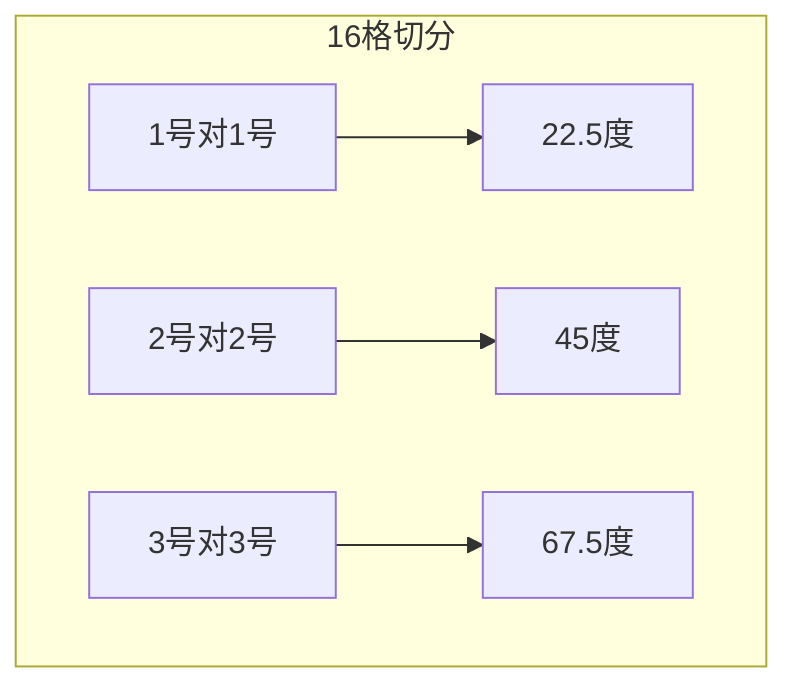
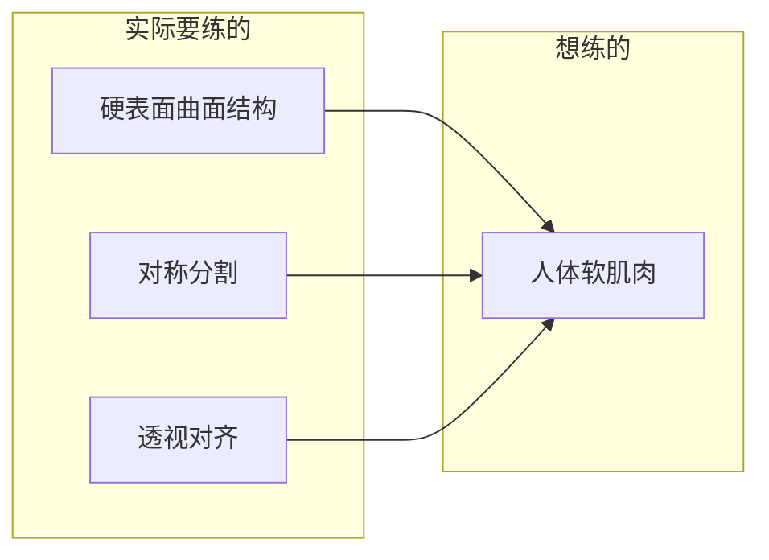

# 第03课：场景角度切换与旋转法

## 学习目标

- 掌握旋转法的核心操作流程：打交叉→求十字→连线转45度
- 理解在地面方块上旋转出新角度的方法与注意事项
- 区分"射触方块"（地面规则）与"高富帅方块"（空中自由）的透视逻辑差异
- 学会在同一个空间中摆放多个不同角度的物体
- 了解N字法在对称分割中的应用
- 建立"硬表面结构"建模思维，为后续人物与家具绘制打基础

---

## 1. 旋转法的核心逻辑

### 1.1 为什么需要旋转法

在[[0001-tou-shi-ji-chu-yu-jiao-xi-tong|第01课：透视基础与方块构建]]和[[0002-shi-nei-kong-jian-yu-ren-wu|第02课：室内空间与家具摆放]]中，我们学会了如何绘制一个45度朝向的方块。但在实际创作中，**同一个空间里通常需要摆放多个朝向不同的物体**——比如正对桌面的书本、斜放的椅子、不同角度的柜子等。

> [!warning] 书为什么总是飘起来？
> 很多同学会发现，自己画的书永远无法"停"在桌面上，看起来像是浮在空中。这是因为书的角度与桌面的透视没有对齐。旋转法就是解决这个问题的钥匙。

### 1.2 45度旋转法：三步走

旋转法的本质是在**已知透视的地面上**，通过几何作图找到**旋转后的新方向**。以45度旋转为例，操作流程如下：


**步骤详解：**

1. **打交叉**：在地面方块内画两条对角线（从四个角交叉相连）
2. **求十字中线**：过交叉点画平行于方块边的十字线，将方块四等分
3. **各点相连**：将十字线与边的交点连接起来——**对角线相连得到的四边形就是旋转45度后的新底面**
4. **向上延伸**：将新底面的四个角垂直向上拉，得到旋转45度后的盒子

> [!tip] 理解本质
> 这实际上是在用地面的对角线方向作为新的坐标轴。方块对角线方向恰好是原始方向的45度，因此通过连接对角线交点与边的中点，就可以得到45度旋转后的新方块。

### 1.3 不是45度怎么办？16格切分法

如果希望旋转22.5度或67.5度，需要更精细的切分：

- 将地面方块先打十字四等分
- 在每个小方块中再打交叉，共得到 **16个小格子**
- 根据不同的"格子对格子"连接方式，得到不同的旋转角度



具体来说：

| 连接方式 | 旋转角度 | 特点 |
|---------|---------|------|
| 1号格对1号格 | 22.5度 | 接近正面，压缩较弱 |
| 2号格对2号格 | 45度 | 标准45度，左右对称 |
| 3号格对3号格 | 67.5度 | 角度刁钻，压缩强烈 |

> [!note] 不需要更多角度
> 理论上可以切8格得到更多角度，但实际上能灵活运用这三个角度就已经足够了。贪多嚼不烂。

### 1.4 实战中的注意事项

- **选取的地面必须是近似正方形的**，否则旋转后会变成菱形
- 实战中可以先用目测大致框出一个方块，不要太夸张的长条形即可
- 旋转的目的不是保证大小不变，而是**找到新角度的消失点方向**

> [!example] 书终于可以放在桌上了
> 在桌面上切一个小方块 → 打交叉求十字 → 找到旋转后的方向 → 沿着新方向画一本书 → 书就稳稳地"贴"在桌面上了，再也不会飘起来。

---

## 2. 地面旋转 vs 空中旋转

这是个非常重要的概念。**在同一个画面中，地面上的物体和空中的物体遵循完全不同的透视规则。**

### 2.1 射触方块（地面规则）

> [!warning] 996规则
> 地面上的方块就像"996打工人"——必须严格遵守透视规则。它的消失点必须落在地平线上，旋转时必须按照旋转法操作。

**核心要点：**
- 所有放在地面上的物体共享同一条地平线
- 不同角度的物体，其消失点不同，但**全部落在地平线的不同位置上**
- 旋转后的新方块可以找到新的消失点，然后**用钢笔君沿着新消失点拉线，可以画出任意大小的物体**

```
消失点1(L) ←——地平线——→ 消失点2(R)
          ↘              ↙
           ↘   ↙↘   ↙
            [柜子A]  [柜子B]
              ↘      ↙
               [地面]
```

### 2.2 高富帅方块（空中自由）

> [!tip] 霸道总裁法则
> 空中漂浮的方块就像"霸道总裁"——它有自己的家规，不需要和地面的透视有任何关联。它自己决定自己的XYZ朝向。

**核心要点：**
- 直接在画面上画一个方块即可，**不需要找地平线**
- 只要不出现明显的反透视（如远处的线比近处的还粗），通常都能过关
- 常见错误是画成"近距离大透视"的夸张形状——这个通常只有在镜头极近时才会出现，实战中很少用


### 2.3 实际应用场景

- **地面上的家具**（桌子、椅子、柜子）→ 射触方块，必须用旋转法
- **空中跳下来的人物** → 高富帅方块，可以单独建立一个空间
- **介于之间的"高管方块"**（中产方块）→ 在垂直面上做旋转（如椅背的倾斜面）

> [!example] 空中人物的画法
> 1. 在空中画一个高富帅方块（建立独立空间）
> 2. 在这个方块内部，按照它自己的XYZ去画人物
> 3. 可以把方块的图层关掉，人物就独立存在于画面中
> 4. 这个人物与地面的透视无关，看起来就像是"浮在空中"的状态

---

## 3. 同一空间中的多角度物体

### 3.1 多个物体的消失点规律

当我们在地面上放置多个不同角度的物体时，**每个物体都有自己的消失点**，但这些消失点有一个共同的规律：

> [!important] 黄金法则
> **所有放在地面上的物体，无论旋转角度如何，其消失点都落在同一条地平线上。** 这是因为所有物体都共享同一个"地面"（无限远处）。

### 3.2 实战案例分析

以一张室内照片为例：
- A柜子：一组透视，消失点在地平线左侧
- B柜子：旋转了一定的角度，消失点在A的右侧
- C凳子：又一个角度，消失点在地平线稍远处
- D桌子：角度又不同了

虽然它们的消失点各不相同，但**全部都在同一条地平线上**。

### 3.3 如何练习

建议找一个真实的照片或场景：
1. 用钢笔君拉出每个物体的透视线
2. 找到每个物体各自的消失点
3. 观察它们是否都落在同一条地平线上
4. 通过反复练习形成肌肉记忆

> [!note] 先记得，再理解
> 这里先不要纠结"为什么"，先把规则用肌肉记住。过多追求数学原理反而会分散注意力。

---

## 4. N字法进阶

### 4.1 N字法的核心原理

N字法用于在透视中找到**对称点**。其原理是：在方块已经打交叉求十字的基础上，通过画一条"穿过中心点"的斜线，可以在透视中找到对称位置。

```
      A
     /|
    / |
   /  |  中线
  /   |
 /    |
B-----+-----B'
       \
        \
         A'
```

### 4.2 N字法的操作步骤

1. 在方块内打交叉，求十字中线
2. 在方块的一侧画一条线（从边界上的A点出发）
3. 让这条线穿过中心点
4. 线的延伸会在对面的边界上找到对称点A'
5. A和A'在透视中就是对称关系

### 4.3 实际应用场景

- **肩胛骨的位置**：在绘制人体躯干时，可以用N字法确定左右肩胛骨的对称位置
- **书包的翻盖**：设计物体上的对称结构时，N字法可以确保透视正确
- **服装褶皱**：衣服上对称的褶皱和装饰

> [!tip] N字法的本质
> N字法的核心不是画"Z"形，而是**利用中心点做对称映射**。只要你能找到一个穿过十字中心的交点，就可以确定透视中的对称位置。

---

## 5. 硬表面结构与建模思维

### 5.1 什么是硬表面结构

硬表面结构（Hard Surface Modeling）是指在透视中**严格按照XYZ轴去理解和绘制物体**的方法。当你绘制任何物体时，都要思考：

- 它的**盒子空间**是什么形状
- 它的**对称轴**在哪里
- 它的**曲面转折**如何对齐透视

### 5.2 为什么需要练硬表面

很多同学觉得"我想练的是人体，不是机械"，但有一个残酷的事实：

> [!warning] 软肌肉的真相
> 你所以为的"肌肉"，在透视中其实是对齐XYZ轴绘制的。你看到的不是"肌肉"，而是**带曲面的硬表面结构**。如果你不会画硬表面，你就永远画不对人体的透视。



### 5.3 基础练习建议

1. **画不对称的曲线**：在透视方块中画一条曲线，然后通过投影找到它在远处的位置
2. **画对称的图形**：在透视方块中画一个对称图形（如爱心、黑桃），练习左右对称的透视投影
3. **画简单的几何体变体**：上宽下窄或上窄下宽的柱体，注意透视中对齐

> [!example] 从简单开始
> 不需要一上来就画复杂物体。可以先练：
> 1. 方块+打交叉+求中线
> 2. 在方块中画对称圆弧
> 3. 在透视中画八角形螺帽
> 4. 在透视中画一个简单的曲面纸片
> 每个练习10-15分钟即可，关键是**持续积累**

---

## 6. N字法与硬表面的结合应用

当我们把N字法和硬表面建模结合起来，就可以处理复杂的曲面物体。

以绘制一个"剑鞘"为例：
1. 先画一个盒子
2. 打交叉，求十字中线
3. 在两侧用N字法确定对称关键点
4. 用圆弧连接关键点，形成曲面
5. 从侧面看，这个结构事实上就是"书包"+"纸片"+"圆角"的组合

> [!tip] 关键认知
> 人体中的很多结构（如肋骨、骨盆、肩膀）本质上就是这种**带曲面的硬表面结构**。当你学会用几何体去理解人体时，透视就变成了"排列组合"的问题。

---

## 7. 第三堂课作业

### 作业内容

绘制一张包含**椅子与人物**的室内场景图。

### 作业要求

1. **先画椅子**：必须从椅子开始画，建立空间
   - 注意椅子的左右对称
   - 注意扶手的对称透视
   - 注意椅背的倾斜角度
   - 注意前宽后窄的梯形结构

2. **再画人物**：在椅子空间的基础上画人物
   - 人物的肩膀、腰线、臀线必须对齐透视
   - 人物的膝盖、脚掌也要对齐透视
   - 用"纸片法"先确定身体的大致位置

3. **练习旋转**：在画面中加入一个**旋转过的小架子或书本**
   - 使用旋转法确保它"放在地面上"而不是"浮在空中"

### 作业建议

- 先用铅笔打稿，确认透视关系
- 使用不同颜色的笔区分不同组的透视线
- 反复检查物体的消失点是否在地平线上
- 完成后再回过头来用作业步骤验证一遍

> [!note] 重点提醒
> 不要跳步骤。画椅子时按照：方块 → 打交叉 → 求十字 → 细节 的顺序来。每个步骤都是在为下一步打基础。

---

## 总结

本课的核心是**在同一个空间中引入多种角度**：

| 概念 | 核心内容 |
|-----|---------|
| 旋转法 | 打交叉→求十字→连线，旋转出新角度 |
| 地面规则 | 射触方块，消失点在地平线上 |
| 空中规则 | 高富帅方块，独立XYZ |
| N字法 | 利用中心点做透视对称映射 |
| 建模思维 | 所有物体都是带曲面的硬表面结构 |

下一课 [[0004-ju-li-gan-yu-tou-shi-ya-suo|第04课：距离感与透视压缩]] 将探讨如何通过距离感的表现让场景更有深度。

---

## 延伸阅读

- [[0001-tou-shi-ji-chu-yu-jiao-xi-tong|第01课：透视基础与方块构建]]
- [[0002-shi-nei-kong-jian-yu-ren-wu|第02课：室内空间与家具摆放]]
- [[0004-ju-li-gan-yu-tou-shi-ya-suo|第04课：距离感与透视压缩]]