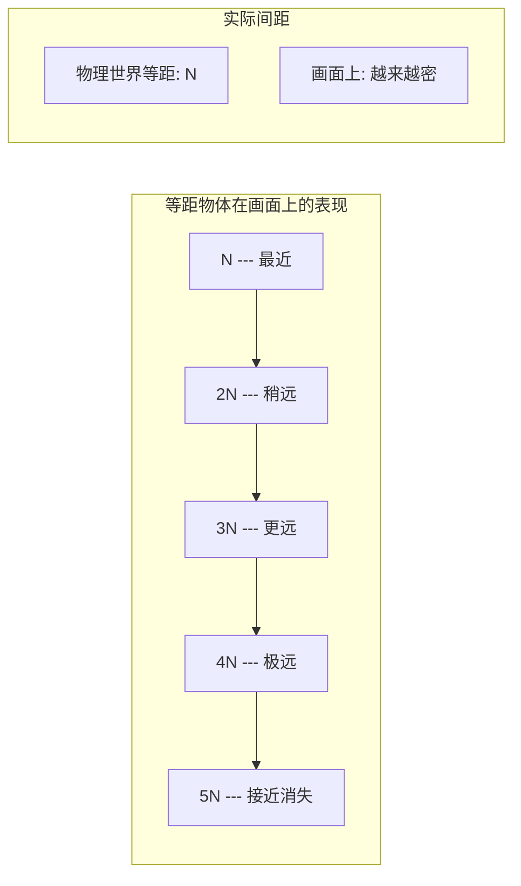
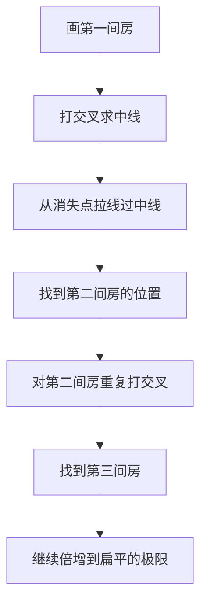
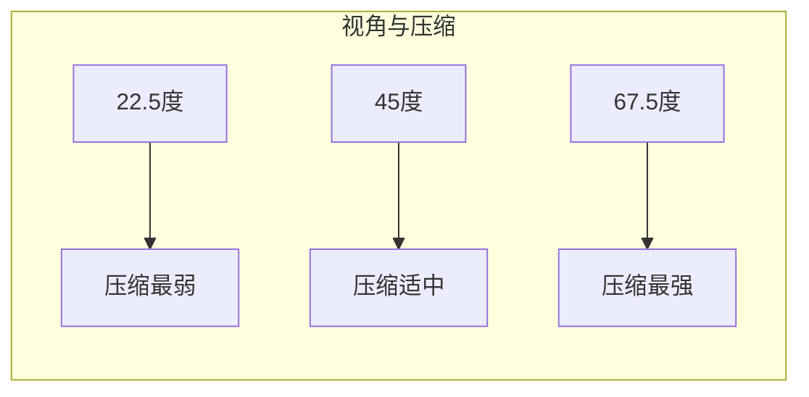
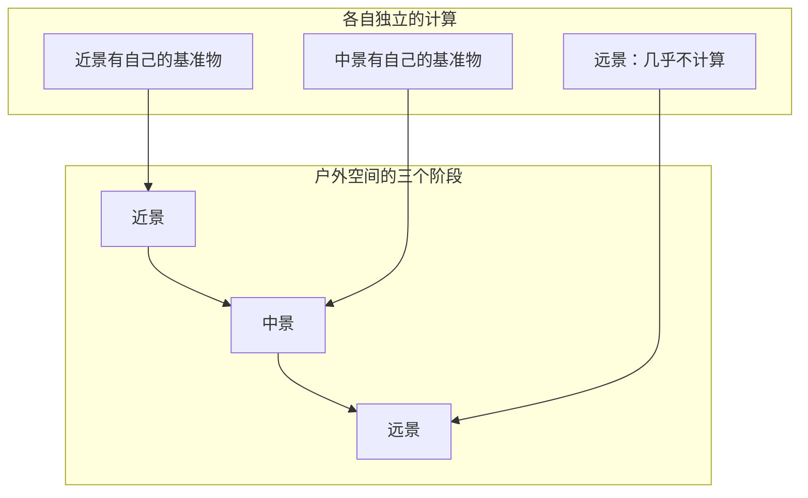

# 第04课：距离感与透视压缩

## 学习目标

- 理解透视压缩的概念与核心原理
- 掌握倍增法计算重复物体的透视压缩
- 区分22.5°/45°/67.5°三个关键角度的压缩差异
- 学会在户外空间中建立"最深"（最远点）
- 掌握近景/中景/远景的分层构建方法
- 理解"有透视但没有距离"这个常见问题的本质

---

## 1. 什么是透视压缩

### 1.1 概念与原理

透视压缩（Perspective Compression）指的是：**在透视中，等间距的物体随着距离增加，它们在画面上的间距变得越来越小，物体本身也变得越来越小**。

这是透视最核心却又最容易被忽视的规律。



> [!warning] "有透视没有距离"
> 很多同学的画作"有透视"（物体都对着透视线画），但"没有距离"（感受不到近到远的变化）。这是初学者最常见的问题之一——**物体画对了方向，但没画对压缩**。

### 1.2 45度视角的错觉

45度视角时，压缩的感觉最不明显。这就是为什么很多同学画45度场景靠感觉也能画个大概。但当视角变为接近正面（22.5度）或更刁钻的角度（67.5度）时，压缩会变得非常显著，**靠感觉就很难画对了**。

---

## 2. 倍增法：重复物体的压缩计算

### 2.1 什么是倍增法

倍增法是通过**打交叉求中线→拉透视线→找到下一个重复物体的位置**的方法，用于精确计算重复物体在透视中的距离。

> [!tip] 倍增法的本质
> 倍增法不是在算物体的大小，而是在算"下一个同样大小的物体应该缩到多小、排在哪里"。

### 2.2 基本操作步骤

1. **画初始物体**：画出第一个物体（第一间房子、第一个窗户、第一根柱子）
2. **打交叉求顶部中线**：在正面画对角线，找到竖直方向的中点
3. **拉透视线**：从消失点经过中点拉线到物体另一侧
4. **找到下一个位置**：对角线与透视线的交点就是下一个物体的位置



### 2.3 倍增法实战演示

以一个走廊为例（单点透视）：

- 第一扇窗户宽度为N
- 第二扇窗户通过倍增法算出，宽度约为0.7N
- 第三扇约为0.5N
- 第四扇约为0.3N
- 第五扇及以后几乎变成一条线

| 物体序号 | 相对宽度（近似） | 画面效果 |
|---------|----------------|---------|
| 第1个 | 1N | 最大，细节最完整 |
| 第2个 | ~0.7N | 略小，仍能看到细节 |
| 第3个 | ~0.5N | 明显缩小 |
| 第4个 | ~0.3N | 压缩强烈 |
| 第5-6个 | ~0.1N | 几乎成线 |
| 第7个+ | 接近0 | 压扁区，只剩线条 |

> [!important] 核心认知
> 每一段N在透视中不是等比例缩小的！**靠近镜头的N变化慢，远处的N变化快**。从第4间开始，物体就已经进入"压扁区"了。

---

## 3. 角度与压缩量的量化

### 3.1 三个关键角度

根据[[0003-chang-jing-jiao-du-qie-huan|第03课：场景角度切换与旋转法]]中的16格切分法，有三个关键角度需要重点掌握：



| 角度 | 左右面的面积比 | 压缩强度 | 适用场景 |
|------|--------------|---------|---------|
| 22.5度 | 约3:1 | 弱 | 接近正面的建筑、走廊 |
| 45度 | 约2:2 | 适中 | 标准场景，最常用 |
| 67.5度 | 约1:3 | 强 | 刁钻角度，一侧极扁 |

### 3.2 压缩量的核心参数

在绘制一个透视方块时，需要同时注意四个参数：

1. **左右面的面积比**（正面面 vs 侧面面的大小关系）
2. **XY的收缩斜率**（两个方向的线各有多斜）
3. **Z轴是否收缩**（从俯视/仰视时，竖直方向是否有透视）
4. **上下面的面积比**（俯视/仰视时，顶面和底面的比例）

> [!example] 俯视45度方块的参数
> - 左右面积比：2:2
> - XY收缩：两侧倾斜角度相近
> - Z轴收缩：明显（因为是从上往下看）
> - 上下面积比：上方面约1，下方面约3

### 3.3 如何记忆

**不需要精确计算，背下几个典型画法即可。**

- 22.5度：接近正面的面很平，侧面的收缩强烈
- 45度：左右基本对称，收缩适中
- 67.5度：恰好与22.5度相反，一个面极窄

> [!tip] 徒手练习建议
> 不需要每个方块都精确到毫米级。先按比例画，画完之后检查是否有反透视（远处的线比近处的还粗），有的话修正即可。

---

## 4. 单点透视的陷阱

### 4.1 为什么单点透视反而更难

很多同学觉得"单点透视最简单，只需要一个消失点"，但恰恰相反：

> [!warning] 单点透视的难点
> 单点透视横向几乎不用掌握透视，所有难度都集中在**景深（压缩）**上。你无法靠多个消失点的几何关系来辅助判断，只能靠自己对于压缩的感知。

### 4.2 典型错误：窗户没有压缩

初学者画走廊时，常犯的错误是：

- 第一扇窗户：大小对
- 第二扇窗户：稍微小一点
- 第三扇到第十扇：几乎一样大
- **没有压缩感，走廊看起来没有深度**

正确做法是：
- 用倍增法计算每一扇窗户的位置
- 到第3-4扇，压缩已经非常明显
- 到第5-6扇，几乎只剩一条线

### 4.3 实例对比

```
错误版本（有透视无距离）：
[窗1][窗2][窗3][窗4][窗5]... 每扇大小接近

正确版本（有透视有距离）：
[窗1][窗2][窗3][窗4][窗.][窗][.] 越来越密、越来越扁
```

---

## 5. 户外空间透视构建

### 5.1 近景/中景/远景的分层

户外场景与室内最大的区别是：**没有墙壁遮挡，物体延伸到无限远处**。必须将画面分成三个层次来处理。



### 5.2 三层规则

| 层次 | 距离 | 计算方法 | 精度要求 |
|------|------|---------|---------|
| **近景** | 离镜头最近 | 有自己的基准物，打交叉求下一间 | 非常严谨 |
| **中景** | 中间距离 | 与近景无关，独立设定基准物 | 有一定要求 |
| **远景** | 无限远 | 几乎不计算，画平面剪影 | 松散 |

### 5.3 关键的认知：分开计算

> [!important] 部门主管原则
> 近景、中景、远景各自有各自的"部门主管"（基准物）。中景的大小不由近景决定，而是由中景自己的第一间房子决定。

**具体做法：**
1. **近景**：画第一间房A → 打交叉求第二间B → 再求第三间C
2. **中景**：（与近景无关）画中景第一间房M → 打交叉求N → 再求O
3. **远景**：画到第4-5间时已经压扁，直接画剪影

> [!question] 为什么不能从近景一直延伸下去？
> 当物体距离很近时（如室内），可以从近景一直延伸计算。但户外场景中，中景和物体通常离得较远，如果强行用近景的基准去推算，远处的物体大小就会完全不准确。

---

## 6. 建立最深（最远点）的方法

### 6.1 推荐的镜头角度

不必每次都用单点透视来画深远场景。推荐一个"定式"（固定画法）：

- **22.5度视角**的房屋
- 一个面非常接近正面（展示细节）
- **另一个面非常窄**（用来做压缩）

```
      ┌──────────┬──┐
      │          │压│
      │ 主展示面 │缩│
      │          │面│
      │ (细节)   │(扁│
      │          │ )│
      └──────────┴──┘
```

### 6.2 为什么这个角度好用

这个角度的优势在于：
- **正面**：展示房屋的设计细节、门窗等
- **侧面**：展示压缩，一排房屋越来越扁
- 横向可以用一面墙遮挡，无需画到无限远

### 6.3 操作流程

1. 画第一间房子（以22.5度角）
2. 用倍增法向侧面延伸第二、第三、第四间
3. 注意侧面的面积越来越窄
4. 到第4-5间时侧面几乎看不到
5. 前方可设置一堵遮挡墙

> [!tip] 俯仰角互换
> 学会画俯角，就学会了画仰角。只需要把方块上下翻转。同一个定式，改变上下就可以画不同的场景。

### 6.4 实际应用场景

这个定式可以"换皮"成各种场景：

| 应用场景 | 核心物体 | 压缩元素 |
|---------|---------|---------|
| 街道 | 房屋 | 房屋侧面越来越窄 |
| 室内走廊 | 窗户/门 | 窗格越来越密 |
| 公交/列车 | 座位/窗户 | 座位间距越来越小 |
| 小巷 | 墙面/招牌 | 招牌越来越小 |
| 楼道 | 吊灯/台阶 | 吊灯间距压缩 |

---

## 7. 距离感的营造技巧

### 7.1 地板的距离暗示

地板是营造距离感最有效的工具之一：

- 近处的地砖画大一些
- 远处的地砖画小一些、密一些
- 用倍增法求出每一格的位置

### 7.2 物体的距离暗示

不仅仅是地板，**所有物体都可以用来暗示距离**：

- **石头/杂草**：近处大，远处小，按照透视排列
- **树干**：近处粗，远处细
- **行人/车辆**：近处大，远处小

> [!example] 用植物暗示距离
> 1. 在画面近处画一棵大树
> 2. 中间景画一棵小一些的树
> 3. 远处再画一棵更小的树
> 4. 远处还有几棵几乎成线的树
> 观众通过比较树的大小，就能感觉到距离

### 7.3 距离感的三个层次

```
近景 ── 细节丰富，大小变化明显
中景 ── 仍可计算，压缩已较强
远景 ── 几乎平面，剪影化处理
```

> [!warning] 明确有目的的距离暗示
> 不要随机放置物体。每个用来暗示距离的物体（行道树、石柱、路灯）都有明确的透视位置，是经过计算的。

### 7.4 遮丑技巧

远景被压成一条线时怎么办？

- 用**空气透视**（远处加雾、加烟）
- 用**遮挡物**（一道墙、一座山把远处挡住）
- 用**转折**（换一条街，改变方向）

> [!note] 不必画到无限远
> 绝大多数情况下，画到第3-4个重复物体时，就已经可以转化为"远处处理"了。不需要真的画到无限远。

---

## 8. 透视压缩在人体中的应用

虽然本课侧重场景，但透视压缩在人体中同样重要。

当绘制大透视人体时（如仰角或俯角），可以把**人体自身的比例**作为等距物体来处理：

- 肩膀 → 胸线 → 肋骨下缘 → 肚脐 → 胯下 → 膝盖 → 脚踝
- 这7-8个等距点，在透视中同样会压缩
- 知道这个规律，就可以准确画出手、脚、头等部位在透视中的大小

> [!tip] 书包堆叠法
> 人体可以理解为**4个书包（正方体）的堆叠**。在透视中，你真正在画的是4个逐渐缩小的正方体，而不是什么"肌肉"。

---

## 9. 第四堂课作业

### 作业内容

绘制一幅**户外场景图**，包含4间房屋的重复与压缩。

### 作业要求

1. **使用推荐的22.5度定式**绘制
   - 一个面接近正面（展示细节）
   - 侧面做压缩（越来越窄）

2. **用倍增法求出4间房屋的位置**
   - 第一间画精确
   - 第二间用倍增法
   - 第三、第四间继续倍增
   - 注意侧面面积的逐渐消失

3. **加入距离暗示**
   - 地板的纹理/地砖
   - 至少一种距离暗示物（树、灯柱、石头等）

4. **处理好近景/中景/远景的关系**
   - 近景可以加上遮挡物
   - 远景可以简化处理

### 作业建议

- 先不要追求"画得好看"，先追求"画得对"
- 完成后再反过来验证：每一间房子的压缩是否符合倍增法
- 如果时间允许，尝试把同一个场景转成仰角版本

> [!note] 最后提醒
> 这个作业的核心目的不是画一幅"好看的画"，而是让你**通过动手画一遍，真正理解压缩在透视中的运作方式**。不要跳步骤，每一步计算都是必要的训练。

---

## 总结

本课的核心是**从"会画透视"到"会画距离"**的跨越：

| 概念 | 核心内容 |
|-----|---------|
| 透视压缩 | 等距物体随距离增大而越来越密、越来越扁 |
| 倍增法 | 打交叉求中线 → 找到下一个等距物体的位置 |
| 三个角度 | 22.5度（弱压缩）、45度（适中）、67.5度（强压缩） |
| 户外分层 | 近景/中景/远景分开计算，各有独立基准物 |
| 距离暗示 | 地板、植物、物体大小变化都是距离的线索 |

在接下来的[[0005-ren-wu-zhua-xing-yu-xyz|第05课：人体透视与比例拆解]]中，我们将把透视压缩的原理应用到人体绘制中，学会从几何体块的角度理解人体。

---

## 延伸阅读

- [[0003-chang-jing-jiao-du-qie-huan|第03课：场景角度切换与旋转法]]
- [[0001-tou-shi-ji-chu-yu-jiao-xi-tong|第01课：透视基础与方块构建]]
- [[0002-shi-nei-kong-jian-yu-ren-wu|第02课：室内空间与家具摆放]]