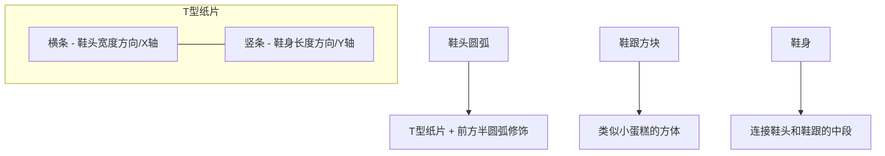
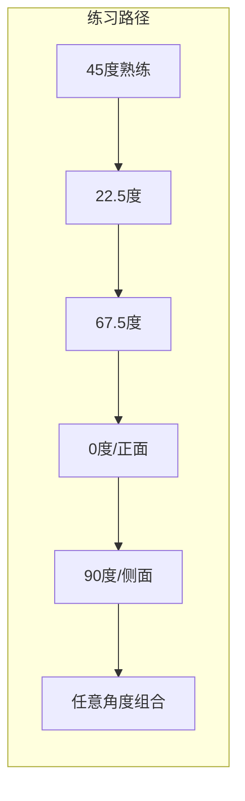
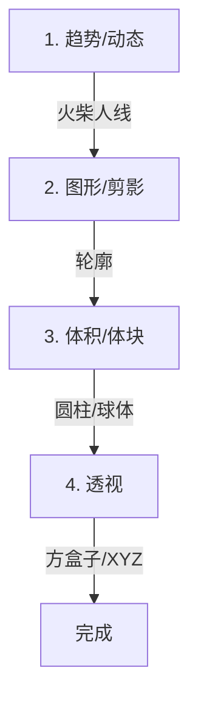
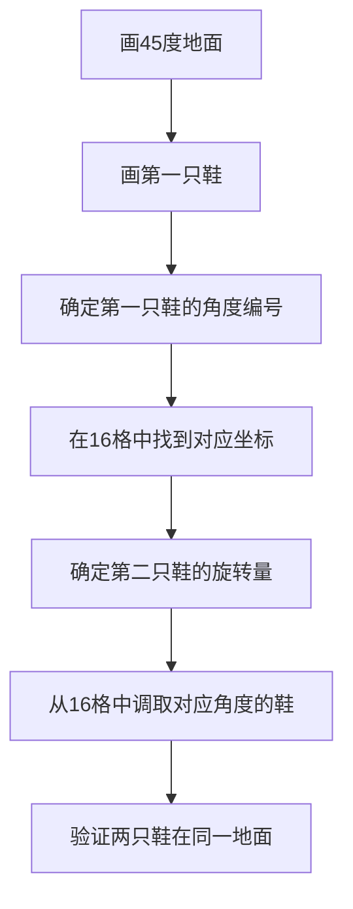

# 第05课：人物抓型与XYZ意识

> [!tip] 核心观点
> 你以为画不好脚和腿是因为不懂人体解剖？**错**。真正的原因是你缺乏**XYZ意识**——无法识别物体在三维空间中的方向。一旦你能为任意几何体标出X/Y/Z轴，脚、腿、手臂、机器人的画法将一通百通。

---

## 人物抓型方法论

### 学习的三个阶段：找资料 → 建模 → 转角度

这是贯穿整个课程的研究方法论，也是你课后自主练习的标准流程：

```mermaid
graph LR
    A[找资料] --> B[建模]
    B --> C[转角度]
    C --> D{多角度验证}
    D -->|角度不全| B
    D -->|全部攻克| E[存入"武器库"]
```

**第一阶段：找资料**
- 不要直接临摹照片——那只会训练你的"描边"能力
- 找**平头鞋**（而非尖头鞋），因为平头鞋的X/Y/Z方向更容易辨识
- 收集同一款鞋/物件在不同角度的照片

**第二阶段：建模**
- 将观察到的物体拆解为基本几何体（方盒、圆柱、T形纸片）
- 在45度视角下建立基础模型——这是最"友好"的视角
- 画出物体的**正面、侧面、顶面**三视图特征

**第三阶段：转角度**
- 利用[[0003-chang-jing-jiao-du-qie-huan|第03课的旋转方法]]将模型旋转到目标角度
- 使用16格角度系统量化角度
- 验证各角度下的透视是否合理

> [!warning] 常见误区
> 大多数同学拿到参考图后，**直接陷入抓轮廓**的陷阱。尖头鞋的轮廓是尖的，于是你只记住了"尖"这个特征，完全没有留下XYZ信息。正确的做法是：**先分析几何体，再判断角度，最后才画轮廓**。

---

## XYZ意识训练

### 什么是XYZ意识？

在三维空间中，任何一个物体都可以用三个轴向描述：

| 轴向 | 含义 | 在鞋子上 | 在身体上 |
|------|------|----------|----------|
| **X轴** | 横向（左右） | 鞋头的宽度方向 | 肩膀连线方向 |
| **Y轴** | 纵向（前后） | 鞋子的长度方向 | 胸厚方向 |
| **Z轴** | 垂直（上下） | 鞋子的高度方向 | 身体高度方向 |

### 为什么XYZ意识如此重要？

没有XYZ意识，你画的一切都是**平面的**：
- 画鞋子 = 只有轮廓，没有体积
- 画手臂 = 只有圆柱，不知道朝向
- 画身体 = 只有正面，没有侧面和顶面

> [!example] XYZ意识测试
> 画一个45度视角的方盒子。标出它的X、Y、Z方向。
> - X方向 = 盒子横向边
> - Y方向 = 盒子纵深边（有透视收缩）
> - Z方向 = 盒子垂直边
>
> 现在，在盒子内画一只鞋。鞋头的朝向应该与哪个轴对齐？鞋带的走向呢？

### 在复杂形状中寻找XYZ

初学者常见的困境：

```
尖头鞋 → 鞋头是尖的 → 找不到平的X面 → 无法定位XYZ → 只能描轮廓
                                                          ↓
                                                   永远学不会透视
```

**解决方案**：从平头鞋开始练习。

```
平头鞋 → 鞋头有明显平面 → XYZ清晰可见 → 可以建模 → 可以转角度
                                                          ↓
                                                   一通百通
```

---

## 脚与鞋子的建模

### T型纸片法

这是本课最核心的技术之一。鞋子的结构可以用一个 **T形纸片** 来理解：



**画鞋的具体步骤：**

1. **画一个45度的地面方块**
2. **在地面方块上立起T形纸片**
   - 横条 = 鞋头的宽度（X方向）
   - 竖条 = 鞋身的中线（Y方向）
3. **在T形前端绕半圆弧** → 形成鞋头
4. **在T形后端加方体** → 形成鞋跟
5. **连接中间段** → 完成鞋身

> [!tip] 进阶技巧
> T形纸片的横条不一定在正中间。将横条**往左移或往右移**，可以画出不同弯曲角度的鞋子。这就是角度微调的秘密。

### 从方盒子到鞋子的完整流程

```
方盒子 → 切成鞋底形状 → 加T形纸片 → 鞋头圆弧 → 鞋跟方块 → 修饰连接 → 完成
```

**鞋头** = 马蹄铁形状 + 中间纸片 + 前段圆弧修饰
**鞋跟** = 上窄下宽的小方体（类似椅子）
**鞋身** = 连接鞋头和鞋跟的中段

> [!note] 可共用的概括体块
> 一旦你发现 **大象溜滑梯 = 车头 = 鞋头 = 下巴** 使用同一套几何逻辑，你的学习速度将提升3-4倍。不需要每个物体都练1000次速写，**只要搞懂一个几何体的360度转法**，所有同类物体自动解锁。

---

## 圆柱到方块的思维

### 圆柱体的透视表达

画圆柱体的关键：**先画方盒子，再画圆**。

```
1. 画透视方盒子
2. 打交叉求中线（十字线）
3. 在十字线上标记4个切点
4. 沿4个切点绕出圆弧
```

**不同角度下圆的压缩比例：**

| 角度 | 圆的形态 | 说明 |
|------|----------|------|
| 0°（正面） | 正圆 | 无压缩 |
| 22.5° | 轻微椭圆 | 短轴略短 |
| 45° | 明显椭圆 | 短轴约为长轴2/3 |
| 67.5° | 很扁的椭圆 | 接近一条线 |
| 90°（侧面） | 一条线 | 完全压缩 |

### 方块化理解

为什么要将圆柱转为方块？

```
圆柱 → 只有一个方向（轴向）
方块 → 有三个方向（X/Y/Z）
```

一旦你为圆柱套上方盒子，你就获得了XYZ信息。有了XYZ，你就可以：
- 在圆柱表面添加细节（盔甲、肌肉、机械零件）
- 将圆柱旋转到任意角度
- 在圆柱上"建造"更复杂的结构

> [!example] 圆柱→方块的四种变体
> 一个圆柱至少可以拆出4种方盒子形态：
> 1. 看到顶面较多
> 2. 看到底面较多
> 3. 侧面完全压缩
> 4. 两个面均匀收缩
>
> 这4种方盒子就是你在画手臂、腿、脖子时需要用到的"武器库"。

---

## 16格角度在身体中的应用

### 身体部件的角度编号

16格系统不仅仅用于方块，也适用于身体各个部件：

```
    正面     22.5°    45°     67.5°    侧面
1号    2号     3号     4号     5号    (水平旋转)
A号    B号     C号     D号    (俯仰)
```

**典型分布：**

| 身体部件 | 常用角度范围 | 难度 |
|----------|-------------|------|
| 胸腔 | 1-3号 | ★★☆ |
| 头部 | 1-5号 × A-D号 | ★★★ |
| 脚掌 | 1-5号 | ★★★★ |
| 手臂 | 与身体配合 | ★★★★★ |

### 实战：从45度开始

大多数同学"默认"会画的是45度。问题是——**你只有45度**。

```
你想画22.5度的腿 → 因为没有练习过 → 画不出来 → 回到45度 → 失败
```

**解决方案**：攻克16格中的每一个角度。



---

## 动态→剪影→体块→透视

### 四步视觉流程

这是画人物的完整工作流，透视是**最后一步**，不是第一步：



**第一步：趋势（动态线）**
- 用火柴人快速捕捉动作方向
- 忽略细节，只关注"势"

**第二步：图形（剪影）**
- 给趋势线加上轮廓宽度
- 画出人物的剪影

**第三步：体积（法线/圆柱）**
- 将剪影转化为三维圆柱
- 确定每个圆柱的轴向

**第四步：透视（方盒子）**
- 在圆柱外套上方盒子，确定XYZ
- 只有在这一步，才引入透视收缩

> [!warning] 重要提醒
> 透视是**第四个进场的关卡**，但它影响最终结果的结构感。前三步（趋势→图形→体积）属于"构成"的范畴，需要与透视配合才能发挥威力。这就是为什么课程安排**透视在先、构成在后**的原因——听不懂透视，后面的经验值吸不到。

### 实战案例：画两只站在地面上的脚



**关键要点：**
- 第一只鞋确定后，在脑海中建立16格模型
- 第二只鞋的角度 = 第一只鞋 ± 旋转量
- 实战中不需要重新画透视网格，直接从"武器库"调用

---

## 作业

### KP-076：人物部件抓型

**目标**：运用本课的方法论，完成人物各部件的多角度建模练习。

**要求：**
1. 选择3种不同类型的鞋子（建议从平头鞋开始）
2. 每款鞋画出至少5个角度（正面、22.5°、45°、67.5°、侧面）
3. 运用T型纸片法拆解鞋头结构
4. 标注每个角度的XYZ方向
5. 尝试画两只鞋站在同一个地面上的场景

**提交格式：**
- 清晰标注角度编号
- 附带至少一个"圆柱→方块"转换的拆解分析
- 画一个简短的流程图，展示你的"找资料→建模→转角度"过程

### 练习建议

| 阶段 | 内容 | 预估时间 |
|------|------|----------|
| 基础 | 平头鞋 × 5个角度 | 3-4小时 |
| 进阶 | 圆头鞋/尖头鞋 × 5个角度 | 3-4小时 |
| 挑战 | 两只鞋不同角度在同一地面 | 2-3小时 |
| 拓展 | 将T型纸片法应用到其他物体 | 视情况 |

> [!tip] 作业节奏提醒
> 第5课的作业量比第4课小，这是有意设计的——为了让你有时间消化前面几课的内容。如果第1-4课的作业还没画完，不必焦虑，按照自己的节奏推进即可。

---

## 关键概念速查表

| 概念 | 定义 | 关联内容 |
|------|------|----------|
| XYZ意识 | 识别物体在X/Y/Z三个轴向的能力 | [[0004-ju-li-gan-yu-tou-shi-ya-suo|第04课：空间中的XYZ与辅助线]] |
| T型纸片法 | 用T形结构建模鞋头的方法 | 本课核心技法 |
| 16格角度系统 | 将水平/垂直各分成16个量化角度 | [[0003-chang-jing-jiao-du-qie-huan|第03课：物体旋转与空间思维]] |
| 圆柱转方块 | 为圆柱体套上方盒子以获得XYZ | 手臂/腿/脖子的基础 |
| 趋势→图形→体积→透视 | 画人物的四步流程 | 后续课程的基础框架 |

---

> [!note] 下集预告
> 下一课[[0006-ren-wu-san-shi-tu-yu-zhi-pian-fa|第06课：人物三视图与纸片法]]，我们将把目光从脚转移到整个身体，学习三视图构建、T-pose到透视姿态的转换，以及纸片法在人物立体化中的应用。