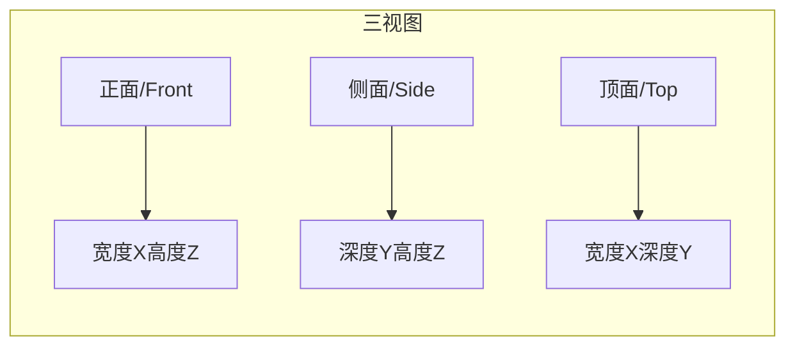
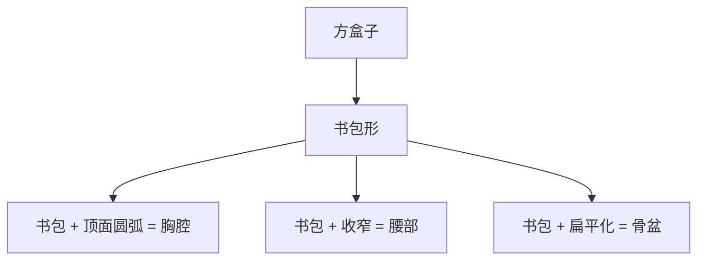
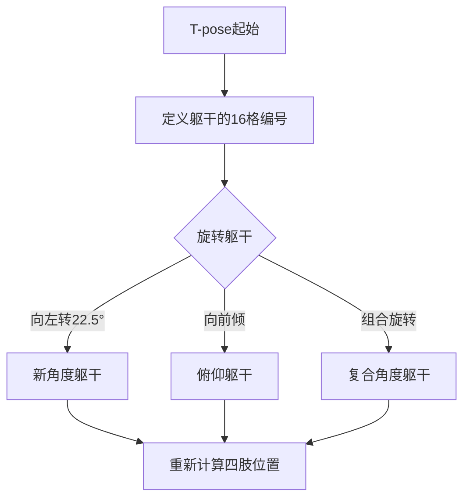
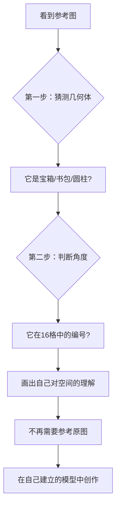

# 第06课：人物三视图与纸片法

> [!tip] 核心观点
> 你以为你画的是"人体"？不，你画的是**几何体在空间中的角度关系**。人体 = 躯干（书包形）+ 头（圆柱）+ 手臂（两段圆柱）+ 腿（两段圆柱）。一旦你建立**空间意识**，所有人体动作都变成可量化的几何体排列组合。

---

## 三视图基础

### 正面 / 侧面 / 顶面

三视图是理解任何三维物体的基础。对于人体来说：



| 视图 | 看到的信息 | 在人体上的应用 |
|------|-----------|---------------|
| **正面** | 宽度（X）× 高度（Z） | 肩宽、腰宽、手臂长度 |
| **侧面** | 深度（Y）× 高度（Z） | 胸厚、腹厚、手臂前后位置 |
| **顶面** | 宽度（X）× 深度（Y） | 肩膀的俯视轮廓、骨盆形状 |

### 将人体视为"书包"

**书包模型** = 一个带有圆弧过渡的方盒子，是理解人体躯干的核心几何体。



**书包的三个面：**
- **顶面**（绿色）—— 肩膀和锁骨的区域
- **侧面**（红色）—— 身体的厚度
- **正面**（黄色）—— 胸腹区域

> [!warning] 同学常见问题
> 大多数同学画身体时**没有顶面意识**。你以为你画了"正面"，实际上画的是一个**平面的剪影**。没有顶面和侧面，身体就没有体积感。

### 比例系统

使用LaTeX标注人体比例：

$$\text{理想人体比例} \approx 7.5\text{头身}$$

| 部位 | 比例关系 |
|------|----------|
| 躯干（肩到骨盆） | $\approx 2\text{头}$ |
| 手臂（肩到指尖） | $\approx 3\text{头}$ |
| 腿（骨盆到脚底） | $\approx 3.5\text{头}$ |
| 肩宽 | $\approx 1.5\text{头}$ |
| 胸厚（侧面） | $\approx 0.8\text{头}$ |

> [!note] 比例是参考，不是教条
> 不同的风格（写实/卡通/美型）会有不同的比例。三视图的价值在于**建立你对物体形状的判断**，而不是精确测量。

---

## 纸片法

### 纸片在空间中的定位

纸片法是T型纸片法的扩展应用。核心思想：

> 先在空间中定位一个**平面纸片**，再在纸片周围"生长"出体积。


**纸片的三种基本形态：**

| 形态 | 用途 | 示例 |
|------|------|------|
| **T形纸片** | 鞋头、下巴、车头 | 鞋子的前端建模 |
| **L形纸片** | 身体转折、关节连接 | 躯干与骨盆的衔接 |
| **U形纸片** | 领口、袖口、衣领 | 衣服开口处的结构 |

### 从纸片到体积

**以胸部为例：**

```
1. 画纸片（正面的轮廓）→ 确定X/Y
2. 给纸片厚度（Z方向）→ 获得体积
3. 用圆弧修饰过渡 → 获得"书包"形态
4. 加入细节（锁骨、胸肌等）→ 完成
```

> [!tip] 纸片法的本质
> 纸片法不是在画纸片本身，而是在**借纸片确定XYZ方向**。一旦方向确认，纸片就可以被替换为任何体积。

---

## T-pose到透视姿态

### 标准姿态的透视转换

T-pose（标准站立姿态）是最简单的起始姿态。步骤如下：

**步骤1：在45度视角下建立T-pose**

```
1. 画45度地面
2. 在地面上建立躯干"书包"
3. 标识肩膀位置（两个圆球）
4. 添加垂直手臂圆柱（上臂 + 前臂）
5. 添加垂直腿圆柱（大腿 + 小腿）
6. 添加头部圆柱
```

**步骤2：确定躯干角度**



**步骤3：通过"铁门问题"推导四肢**

**铁门问题** = 已知一个圆柱/平面的角度，推导它在旋转后的角度。

具体操作：
1. 在躯干周围建立一个 **90度轴平面**
2. 在这个平面上标记 **垂直方向** 和 **水平方向**
3. 使用铁门旋转逻辑找到 **中间角度** 的圆柱方向
4. 为每个角度画出对应的圆柱体

> [!example] 铁门问题实战
> 假设躯干是45度。手臂垂直向下是0度，水平平举是90度。
> - 要画手臂45度前举 → 利用铁门逻辑找到0°和90°的中间值
> - 要画手臂22.5度 → 取0°和45°的中间值
> - 要画手臂67.5度 → 取45°和90°的中间值
>
> 这就是**角度量化**——把连续的角度空间离散化为可控制的几个档位。

### 模块化人物构建

人体 = 多个几何体的排列组合：

```
人体 = 躯干（1个书包）+ 头（1个圆柱）+ 手臂（2段圆柱）+ 腿（2段圆柱）
```

| 部件 | 几何体 | 可动关节 | 自由度 |
|------|--------|----------|--------|
| 躯干 | 书包形 | 腰部 | 前后/左右弯曲 |
| 头 | 圆柱 | 脖子 | 水平旋转 ± 俯仰 |
| 上臂 | 圆柱 | 肩膀 | 360°旋转 |
| 前臂 | 圆柱 | 肘部 | 单轴弯曲 |
| 大腿 | 圆柱 | 髋关节 | 多方向旋转 |
| 小腿 | 圆柱 | 膝盖 | 单轴弯曲 |
| 脚掌 | T形纸片体 | 脚踝 | 多方向旋转 |

**实战中的顺序：**

```
1. 先画躯干（确定空间基准）
2. 再画头（与躯干配合角度）
3. 再画手和武器（手先画，手臂后接）
4. 最后画腿和脚（需要与地面匹配）
```

> [!warning] 顺序很重要
> 手臂的容错率比腿高，因为手臂在空中，不需要接地。所以实战中**先画拳头（自由方块）再往回接手臂**，反而更高效。

---

## 从三视图到多角度

### 推导方法



**关键认知：** 你不是在"临摹"那张图，而是在**分析摄影师/画家的镜头语言和空间设计**。

> [!tip] 两位同学的差异
> 同学A觉得这个身体像"上窄下宽的梯形箱"，同学B觉得像"标准书包"——他们对几何体的具体形状理解不同，但当放入16格系统时，对**角度的判断误差不会超过1格**。
>
> **所以：先猜几何体 → 再猜角度 → 不必纠结具体形状 → 重点在角度关系**

### 练习策略

**练习一：从T-pose出发的连续旋转**

```
固定骨盆 → 旋转胸腔 → 记录每个角度的躯干形态
→ 在每种躯干角度下画出四肢的3种可能位置
```

**练习二：圆柱到方盒子的转换**

一个圆柱体可以推导出4种方盒子形态：

| 形态 | 描述 | 应用 |
|------|------|------|
| 形态1 | 看到顶面较多 | 俯视角的手臂 |
| 形态2 | 看到底面较多 | 仰视角的手臂 |
| 形态3 | 侧面完全压缩 | 正侧面的手臂 |
| 形态4 | 两个面均匀收缩 | 45度视角的手臂 |

**练习三：铁门角度推理**

```
画一个地面 → 在地面上立垂直圆柱
→ 画水平圆柱（90°）
→ 推理22.5°、45°、67.5°的圆柱
→ 延伸到后方 F/G/H/I 圆柱
→ 观察每个角度的椭圆压缩变化
```

> [!note] 铁门练习的价值
> 铁门问题乍看很枯燥，但它提供的**通用经验值极高**。上手臂/下手臂、大腿/小腿、脚掌/小腿——**四肢全都在处理两段圆柱的旋转关系**。铁门练熟 = 四肢全解锁。

---

## 作业

### KP-085：第六堂课作业

**目标**：运用三视图和纸片法，完成人物上半身的空间分析。

**要求：**
1. 找2-3张人物上半身动作的参考图（漫画/游戏设定稿）
2. 对每张图进行"三视图分析"：
   - 用书包模型概括躯干
   - 标出躯干的16格角度编号
   - 画出躯干延伸出的空间地板
3. 分析手臂位置：
   - 用铁门逻辑推理每只手臂的角度
   - 画出上臂和前臂的圆柱体
4. 分析头部角度：
   - 用圆柱体概括头部
   - 套上方盒子获得精准角度
5. 尝试在分析完成之后**不看原图**，画出自己的版本

### 常见问题解答

**Q：怎么知道手臂的角度对不对？**
A：先把关节球（肩膀/肘部）画出来，再连接两段圆柱。如果连接后"蓝牙对接成功"（看起来流畅自然），角度就对了。

**Q：两个几何体之间的消失点不一致怎么办？**
A：头是 **"高富帅方块"** ——它的透视可以不完全跟随身体。实际上，头与身体的XYZ往往无关。只要看起来不"骨折"，容错率很高。

**Q：怎么确定手掌/拳头的大小？**
A：用肩膀作为参照：肩膀圆球前移到手的位置，缩放比例 = 拳头应该的大小。远处的手用同样方法缩小。

**Q：衣服皱褶怎么画？**
A：把布料当成**硬结构**（像高达的盔甲）。皱褶 = 套在圆柱上的"甜甜圈"堆叠。忘记"柔软的布料"这个概念，记住"你画的是模型"。

---

## 关键概念速查表

| 概念 | 定义 | 关联内容 |
|------|------|----------|
| 三视图 | 正面/侧面/顶面，定义物体的三个维度 | 几何体分析的基础 |
| 书包模型 | 理解躯干的核心几何体 | 所有人体画法的起点 |
| 纸片法 | 在空间中先定位纸片，再建立体积 | [[0005-ren-wu-zhua-xing-yu-xyz]]的扩展（T型纸片法） |
| 铁门问题 | 已知一个平面的角度，推导旋转后的角度 | 四肢角度推理的核心 |
| 空间意识 | 将人物放在空间坐标系中理解的能力 | 本课最重要概念 |
| 高富帅方块 | 透视不必与地面完全对齐的自由方块 | 头、拳头、武器的通用模型 |

---

> [!note] 下集预告
> 下一课我们将深入讲解**身体躯干的结构**（马鞍与金元宝模型）、**斜方肌与肩膀的连接**，以及更多关于"圆柱→方块"转换的实战案例。