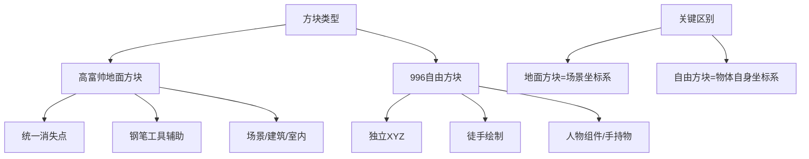
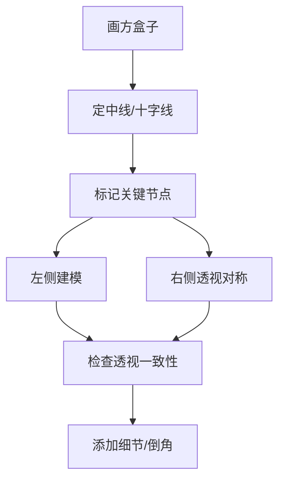
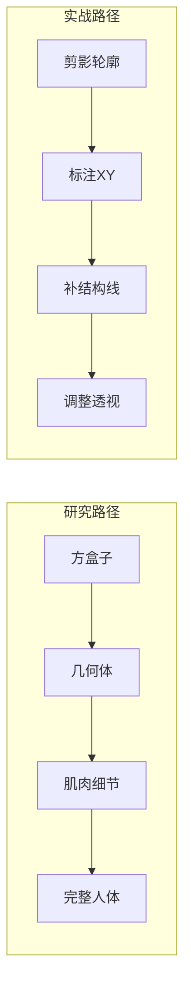

# 第07课：人物组件旋转拼接

## Learning Objectives

- 理解"人物组件独立建模"的核心逻辑：头部、躯干、四肢各自建立独立的方块体系
- 掌握996自由方块与高富帅地面方块的核心区别及应用场景
- 学会不同部件各自旋转后如何拼接以保持透视统一
- 掌握机械/硬表面建模的结构对称法

## 人物组件的独立建模

### 为什么要"独立"建模？

人物的身体不是一个单一的几何体，而是由**头部、胸腔、骨盆、四肢**等多个独立部件组合而成的复杂结构。每一个部件都有自己的朝向和旋转角度。如果你试图用一个方块去概括整个人体，你会发现——

> [!warning] 常见误区
> 很多同学画人体时，习惯将整个人体视为一个整体方块来处理。这导致一旦人物出现扭转（比如上半身朝左、下半身朝右），透视就完全崩溃。

正确的做法是：**把人物拆解为多个独立的组件方块，让每个组件有自己的旋转角度，然后在同一套透视体系中完成拼接。**

### 人体的三大核心组件

| 组件 | 比例参考 | 形状概括 | 旋转自由度 |
|------|----------|----------|------------|
| 头部 | 1个单位 | 方块切圆角/奶冻卷 | 左右转、上下仰俯、歪头 |
| 胸腔 | 宽2 × 长2 × 厚1 | 书包/马鞍/奶冻卷 | 水平旋转 + 前后倾 |
| 骨盆 | 宽2 × 长1.2 × 厚1 | 浴缸/奶冻卷/金元宝 | 水平旋转 + 前后倾 |

> [!tip] 躯干比例记忆法
> K大总结的比例系统：肩膀宽为 **2**，躯干长为 **4**，躯干厚度为 **1**。肋骨下缘在第2格位置，乳头连线在第1-2格中间，肚脐在第3格位置。这套比例适用于大多数头身比。

### A同学 vs B同学：形状解读的差异

面对同一张参考图（比如兔子拳击手），不同的人对身体形状的解读可能完全不同：

- **A同学**认为胸腔是上窄下宽的T形
- **B同学**认为胸腔是一个圆筒形

但有趣的是——

> [!important] 核心洞见
> **形状解读可以不同，但角度解读必须一致。** 无论A同学还是B同学，当他们要画出这个胸腔在空间中的朝向时，两人画出的方块角度应该是非常接近的。这意味着：**形状是主观的，角度是客观的。**

因此，人体建模分析应该分为两个阶段：

1. **形状阶段**：在三视图（正面/侧面）中理解身体部件的形状特征
2. **角度阶段**：通过16格方块确定部件在空间中的朝向

## 996自由方块 vs 高富帅地面方块

这是本课最核心的概念区分之一。理解这两种方块的区别，直接决定了你对场景透视的掌控能力。

### 高富帅地面方块（地面方块）

- **特征**：遵循统一的地面网格，所有方块消失在同一组消失点上
- **典型应用**：场景、建筑、地板、室内空间
- **技术要求**：需要钢笔工具/消失点辅助来确保所有方块透视一致
- **限制**：固定在统一的地面平面系统中

### 996自由方块（自由旋转方块）

- **特征**：不依赖统一的地面网格，每个方块有自己的XYZ坐标系
- **典型应用**：人物头部、胸腔、手臂、手持物体等独立旋转的部件
- **技术要求**：徒手控制透视收缩，不需要钢笔工具
- **优势**：可以自由旋转、倾斜、翻转，不受地面网格约束



> [!note] 命名由来
> 996代表"自由自在、不受约束"——你可以让方块朝着任何方向旋转。而"高富帅"代表"标准、规范、有规矩"——每个方块都严格遵循透视规则。

### 实战中的应用

在实际作画中，**场景使用高富帅方块**（确保空间统一），**人物使用996自由方块**（确保动作灵活）。

比如金正基老师的作品：他的场景透视严格遵循统一消失点，但人物头部和身体往往使用不同的自由方块——头的角度和身体的角度可以不一致，这让画面充满动感。

## 组件旋转与拼接

### 转体的基本原理

当我们画一个人物转体（上半身转向一侧）时，本质上是在处理**两个方块之间的相对旋转**。

基本步骤：

1. **固定骨盆方块**：作为整个身体的基准
2. **确定胸腔方块的角度**：通过16格方块找到对应的角度组别
3. **处理腰部衔接**：腰部是胸腔和骨盆之间的柔性连接


### 如何确定胸腔转了多少度？

回到16格方块体系：

```
骨盆在45度（C2位置）
胸腔旋转后→ D1或D2位置
胸腔相对骨盆旋转了约22.5度
```

> [!tip] 实践技巧
> 在练习转体时，可以先画出骨盆的盒子，再单独画出旋转后的胸腔盒子，两者在腰部位置重叠。**先不要考虑肌肉细节，只处理两个盒子的位置关系。**

### 角度极限

人体的旋转是有极限的。当你把胸腔旋转到一定角度后：

- 背部肌肉会拉伸到极限
- 腰部会出现明显的扭转纹路
- 再继续旋转就会显得不自然（像拧毛巾）

通过观察16格方块，你可以直观地感受到哪些旋转角度是合理的，哪些是过度的。

### 腰部长度的判断

初学转体时，最常犯的错误是：**腰部画得太长。**

解决方法：

1. 预先在画面上定好四个正方形的参考高度
2. 将胸腔盒子拼接到骨盆盒子上方
3. 如果腰部还是太长，使用缩放工具微调
4. 经过2-3次调整后，你会发现腰部的理想长度其实比预想的要短

## 奶冻卷 — 最强大的概括工具

在人物建模的各种方法中，K大特别推荐**奶冻卷**这个形状概括。

### 为什么是奶冻卷而不是圆柱？

| 特性 | 圆柱 | 奶冻卷 |
|------|------|--------|
| 方向性 | 无（旋转后不变） | 有（可辨认XY平面） |
| 顶底面 | 正圆，难以判断朝向 | 椭圆，透视方向明确 |
| 切分 | 对称，无参考点 | 可切四等份，有位置参考 |
| 应用范围 | 手臂、腿 | 胸腔、骨盆、手臂、腿 |

### 奶冻卷的万能用法

- **画胸腔**：先画奶冻卷 → 加上马鞍形的胸肌切线 → 添加金元宝形斜方肌
- **画骨盆**：先画奶冻卷 → 在2-3等份处加厚度 → 两侧各嵌一颗球（腿部起点）
- **画手臂**：奶冻卷XYZ明确 → 更容易确定肌肉的方向
- **画大腿**：奶冻卷切四等份 → 2-3等份处加厚度 → 形成大腿肌肉的基础

> [!example] 奶冻卷 + 书包 + 金元宝 + 盾牌
> K大理解胸腔的四个核心形状：
> 1. **奶冻卷** — 胸腔的基本体积，有明确的XY
> 2. **书包** — 加上胸肌的切线，往前盖的盖子
> 3. **金元宝** — 斜方肌的位置，连接脖子
> 4. **盾牌** — 背部的形状，带有W形的肩胛骨切线

## 硬表面建模

### 结构对称法

机械/硬表面建模的核心原则是**结构对称法**：

1. 在方盒子上定出中线
2. 中线上标记关键节点（如关节位置）
3. 向两侧做透视对称展开
4. 保持Z轴垂直，X轴和Y轴朝向对应的消失点



### 机械部件的透视表达

机械部件的难点在于：**你要同时表达出它的立体感和结构感。**

关键技巧：

1. **用方块打底**：无论多复杂的机械结构，都可以简化为方块的组合
2. **倒角处理**：在方块的边角做倒角，产生机械感
3. **切面明确**：每个部件的切面要清晰，不要含糊
4. **厚度一致**：同一部件的厚度在透视中要保持一致

### 动物头的建模 — 结构对称法的扩展

以画狗头为例：

1. 先画一个方盒子作为头的框架
2. 找到鼻子作为中轴线上的关键点
3. 向两侧做透视对称展开（眼睛、耳朵）
4. 底部类似"鞋子前端"的形状，对齐透视

> [!tip] 不挑食的研究态度
> K大特别强调：**画东西不要挑食。** 不要只局限于画人体。画狗头、鞋子、机械、车辆等不同物体，都是在练习同一套建模逻辑。你越是能把不同的物体都拆解为方块结构，你对透视的理解就越深刻。

## 研究 vs 实战：两条路径

### 由内而外（研究路径）

```
方盒子 → 逐步添加肌肉 → 完善结构
```

这是我们在课程中使用的方法，适合学习阶段。

### 由外而内（实战路径）

```
剪影轮廓 → 标注XY → 补内部结构线
```

这是职业画师在实战中使用的方法，效率更高。



> [!note] 两条路的关系
> 研究路径帮助你建立对结构的**理解**，实战路径帮助你提高**效率**。先有理解，再有效率。在实战中，你会同时使用两种方法——先用轮廓抓动态，再用XYZ校准透视。

### 角度分析练习

最接近实战的练习方式：

1. 找一张透视清晰的大佬作品（如金正基老师的图）
2. 分析其中人物头部和胸腔的方块角度
3. 用自己的方法摆出同样的角度组合
4. 这样你既练习了角度判断，又练习了建模

## 作业

### L7.1 胸腔建模研究

选择一张人体参考图，完成以下研究：

1. **三视图分析**：分析胸腔的正面和侧面形状，记录比例关系
2. **方块定位**：用16格方块确定胸腔的俯仰角度
3. **结构拆解**：使用奶冻卷→书包→金元宝→盾牌的流程搭建胸腔
4. **添加细节**：肋骨下缘、胸肌、斜方肌、锁骨

### L7.2 转体练习

1. 固定骨盆方块（45度）
2. 画出胸腔方块旋转后的角度（如转向67.5度）
3. 处理腰部衔接（注意不要过长）
4. 添加肌肉细节

### L7.3 自由方块挑战

在A4纸上，徒手（不用钢笔工具）画出：

- 5个不同角度的自由方块
- 所有方块的透视收缩方向保持一致
- 避免反透视

> [!question] 自检清单
> - [ ] 我的盒子是否出现了反透视？
> - [ ] 胸腔和骨盆的角度是否在同一套透视体系中？
> - [ ] 腰部长度是否合适？
> - [ ] 我是否理解了996自由方块与地面方块的区别？

## Next Step

完成本课作业后，进入 [[0008-tou-shi-ji-qiao-zheng-he-yu-yan-jiu-fang-fa|第08课：透视技巧整合与研究方法]]。这是整个透视课程的最后一课，将教你如何在课程结束后继续自我提升。