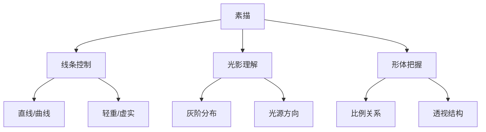
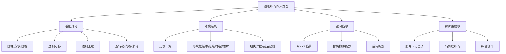
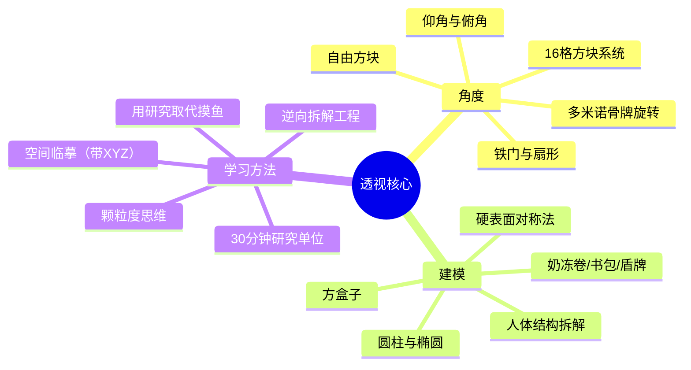

# 第08课：透视技巧整合与研究方法

## Learning Objectives

- 掌握颗粒度思维：学会将复杂问题拆解到可执行的细小单元
- 理解四大练习类型及其各自训练目标
- 掌握带透视XYZ的临摹方法（空间临摹）
- 建立以"30分钟为单位"的研究式练习体系
- 理解创作的本质：多个小练习单位的组合
- 完成代景人物综合作业

## 颗粒度思维 —— 学习的元技能

### 什么是颗粒度？

**颗粒度**是一个商业管理概念，指的是你观察和处理问题时的**精细程度**。颗粒度越细，你对事物的理解就越深入、越可控。

> [!tip] 核心观念
> **你的学习效果，取决于你能够把一件事情拆到多小的"颗粒"。**

举个例子。当你说"我素描基础不好"时——这是一个**颗粒度很粗**的说法。它无法指导你进行任何具体的练习。

但如果把你的素描问题拆解如下：



你就有了具体可执行的练习方向。

### 结构化拆解：从模糊到精确

> [!warning] 常见问题
> 很多同学问"我怎么才能知道自己画对了？"——这个问题本身就太大了，大到我无法回答。**你得先把问题拆小。**

改进后的问法应该是：
- "我在画肋骨下缘的时候，这两条弧线的透视方向总是对不上，怎么办？"
- "我在画45度转22.5度的方块时，Z轴的收缩量总是太多，怎么修正？"
- "画脖子的时候，胸锁乳突肌和斜方肌的前后遮挡关系不太清楚……"

**带着具体的问题去请教**，别人才能真正帮到你。

### 形成自己的心智模型

一个重要的能力是：**建立你自己的心智模型（Mental Model）**。

比如不同的老师对"边缘"这个概念的描述：
- A老师叫它"虚实"
- B老师叫它"松紧"
- C老师用"1/2/3/4级"来分类

如果你没有自己的心智模型，你会被每个老师带走，永远摇摆不定。但如果你建立了"边缘=从锐利到模糊的渐变程度"这个核心理念，你就能把三个老师的说法统一理解。

学习的过程，就是不断用别人的知识来丰富和修正**你自己的体系**。

## 四大练习类型

在课程结束后，你面对的第一个问题通常是："接下来我该练什么？"

K大把所有的透视练习归纳为**四大类型**。理解这四大类型，你就拥有了自己的"练习菜单"。



### 类型一：基础几何

- **训练目标**：熟练掌握方盒子、圆柱、圆锥在不同角度下的画法
- **代表练习**：16格方块默写、多米诺骨牌旋转、透视对称、透视压缩
- **时间**：30分钟～1小时
- **频率**：每次练习前热手，或作为独立练习单元

> [!note]
> 不要小看基础几何。K大自己经常练习"随便画一串方块，让它们沿着S形路径摆进去"——这看起来简单，实则是鱼眼透视的本质。基础几何练到肌肉记忆，你才能画复杂的场景。

### 类型二：建模结构

- **训练目标**：理解各种物体的立体结构（人体、机械、动物等）
- **核心内容**：三视图分析 → 比例信息 → 形状概括 → 穿插关系
- **三要素**：
  1. **比例信息**：头身比、三庭五眼、各部位尺寸关系
  2. **形状概括**：大师消化过的形状（奶冻卷、书包、盾牌、金元宝）
  3. **穿插关系**：肌肉/零件的前后遮挡和连接方式

> [!example] 研究解剖的方法
> K大建议：**先照着真实骨头画一遍**，再去找大师消化过的形状。你会发现照着骨头画太繁琐了，实战不可行——但这个过程让你获得了对结构的**第一手理解**。之后你去看大师的概括形状，才会知道他们简化了哪些、保留了哪些。

### 类型三：空间临摹（带透视XYZ的临摹）

这是本课最核心的练习方法，也是连接"练习"和"创作"的关键桥梁。

#### 传统临摹 vs 空间临摹

| 维度 | 传统临摹 | 空间临摹 |
|------|----------|----------|
| 目标 | 复制形状 | 复制空间关系 |
| 关注点 | 轮廓线 | XYZ透视线 |
| 思考方式 | 这条线在这里弯 | 这条线对应哪个方向？ |
| 结果 | 像原图但无法变通 | 掌握空间后可自由替换 |
| 创新潜力 | 低 | 高 |

#### 空间临摹的三步法

**第一步：标注XYZ**

在参考图上找到：
- **X方向**：肩膀连线、眉毛连线、桌子边缘等横向线
- **Y方向**：纵深方向的线条，如走廊的柱子、地板格线
- **Z方向**：垂直方向的线条（通常假设垂直不变）

**第二步：建立空间框架**

在画纸上先画出XYZ的辅助线，搭建出和参考图一致的空间框架。

**第三步：在空间中建模型**

不是在2D层面描轮廓，而是在3D空间中找到每个物体的位置。

比如画一个人：
1. 先确定他的脚在哪块地板上
2. 根据透视确定他的身高
3. 根据肩膀连线确定胸腔的X方向
4. 根据头部确定头的角度

> [!tip] 核心变化
> 你不再问"这条线画到哪里"而是问"这个物体在这个空间中应该在哪里"。**从"抓形"变成了"抓空间"。**

#### 替换物件能力

空间临摹的终极验证是：**你能不能用自己画过的物件替换画面中的内容？**

```
原始画面：书桌 + 台灯 + 椅子 + 人
你的画面：同一透视下的书桌，但：
  - 台灯 → 迷你汽车模型
  - 椅子 → 电竞椅
  - 人 → 你熟悉的角色
```

如果你能做到替换，说明你真正掌握了这个空间的透视逻辑。

### 类型四：照片重建模与综合练习

这是最高阶的练习类型。对着真实照片，完成以下步骤：

1. 分析照片中的空间结构
2. 用方盒子重建模型
3. 转角度（如45度转成俯视或仰视）
4. 添加自己的创作元素

## 研究式练习方法论

### 30分钟单位

整个研究式练习体系的**最小单元**是30分钟。


> [!example] 30分钟可以做什么？
> - 研究一种圆柱体在不同角度下的椭圆变化
> - 临摹一个金正基老师的头部角度分析
> - 练习5个不同方向的自由方块
> - 研究一只鞋子的结构，画出它的正面和侧面三视图
> - 研究一个机械零件的透视对称

### 用研究取代摸鱼

这里有三种"看似在画"但实际上效率完全不同的状态：

| 状态 | 表现 | 有效经验值 |
|------|------|------------|
| 摸鱼 | 一直在画自己会画的东西（如同一个角度的美少女头像） | 仅熟练度 |
| 创作 | 画一幅完整作品，同时研究其中不会的部分 | 高，但门槛高 |
| 研究 | 针对一个具体小题目做调查、分析、练习、记录 | 最高效 |

> [!warning] 不要被大佬的"摸鱼"骗了
> 很多大佬发图说"今天摸鱼了"，实际上人家是在做研究——研究一个特定的角度、结构或者技法。他们只是谦虚地称为摸鱼。你如果真的只是摸自己已经会画的东西，是不会有实质进步的。

**核心转变**：把"摸鱼"的内容，从"画自己已经会的"变成"研究自己还不太懂的"。

### 切换题目保持新鲜

研究发现，人的大脑在切换不同题目时，效率反而更高。

**建议的练习节奏**：

- 设定3～4个研究题目在同时跑
- 每个题目画2～3次（约1.5小时 = 3个30分钟的切片）
- 腻了就换下一个题目
- 循环往复

```
练习菜单示例：
周一：头部结构研究（30min × 3）
周三：空间临摹（30min × 3）
周五：鞋子建模 + 转角度（30min × 3）
周日：自由方块练习（30min × 3）
```

这样既不会腻，又能让大脑在不同题目间获得"新鲜感"——实际上这也是一种休息。

### 练习的频率

> [!tip] K大的建议
> **一周2～3次，每次1.5～2小时**。和健身很像。

不要一开始就想着每天练5小时。**持续性比强度更重要。**

- 每次练习不要超过2小时，否则容易疲劳
- 1.5小时刚好可以拆成3个30分钟的切片
- 如果实在太忙，一周1次也行，但要坚持

### 认知推进 —— 练习的真正目的

练习的目的不是"画对"，而是 **"认知推进"**。

> [!important] 
> **每一个练习让你对某个主题多理解一些，就是有效的练习。**

不要纠结于"我这幅画画对了没"。在练习的当口，你往往是不知道对错的。

你要关注的是：
- 今天我比昨天多理解了什么？
- 我对胸腔的形状有没有新的认识？
- 我对腰部的比例有没有更准确的判断？

**画对，是所有认知推进累积之后自然出现的结果。**

### 逆向拆解工程

这是K大特别推荐的一种练习方式，尤其适合在课程结束后使用。

步骤：
1. 找一张你喜欢的、透视清晰的完整作品
2. 从完成品（第3层）倒推 → 它的肌肉结构（第2层） → 它的方块建模（第1层）
3. 逆向拆解一遍后，你等于重新经历了一次作者的创作过程

> [!example] 实战案例
> K大早期练习攻壳机动队场景时，通过逆向拆解：
> 1. 先画出完整的透视空间框架
> 2. 标注消失点和XYZ方向
> 3. 不只画框内的，框外看不到的部分也画出来
> 4. 在空间中验证人物的大小关系
> 
> 通过这个过程，他深入理解了一个场景从0到1的构建逻辑。

## 创作的本质

### 创作 = 多个小练习单位的组合

创作本身并不神秘。一幅完整的插画通常包含：

```
一幅作品 = 
  空间研究（场景透视）+
  物件研究（家具/道具）+
  人物研究（姿态/角度）+
  材质研究（质感表现）+
  构成研究（构图/引导线）
```

当你感觉"创作很难"时，把它拆开来看。你其实是在同时面对5～6个不同的小问题。

> [!tip] 创作策略
> 决定创作主题 → 列出其中所有"你还没画过"的元素 → 针对这些元素逐一做资料收集和研究 → 将它们组合到一起 → 完成创作

### 研究 == 收集资料 + 拓展认知

创作时"脑袋空空"怎么办？

**方法很简单：去收集资料。**

比如你想画一幅"魔法学院客厅"：
1. **确定场地**：魔法学院客厅
2. **分解物件**：壁炉、沙发、书柜、装饰品、地毯
3. **逐个研究**：
   - 壁炉有哪些造型？独立式 vs 壁挂式？雕花风格？
   - 魔法风格的沙发和现代沙发有什么区别？
   - 书柜的透视怎么架？

每一个物件的研究，都是一个30分钟的小练习。

当你把这些小练习的成果组合起来，就构成了一幅完整的创作。

## 带景人物综合

### 什么是中距离镜头？

作业要求是画**中距离镜头的带景人物**。

| 距离 | 特征 | 适合练习 | 不建议练习 |
|------|------|----------|------------|
| **中距离（推荐）** | 2～3米外拍摄，能看到地面，变形小 | 人物+场景的协调 | — |
| 近距离 | 镜头很近，人物遮挡大部分画面 | — | 地面看不到，透视难判断 |
| 远景 | 人物很小，场景为主 | 场景构成 | 人物细节少 |

中距离镜头的好处：
- 能看到地面，空间有依据
- 人物动作相对简单（坐姿、站姿）
- 物件透视清晰，容易判断XYZ

### 中距离参考图的特点

请你去找这样的参考图：
- 有明显的地板或者地面网格
- 人物完整可见（从脚到头）
- 周围有2～3个明显物件（椅子、桌子、柱子等）
- 物件透视方向明确

### 如何推理画面前景的人物？

当你遇到"前面有人挡着大部分画面"的情况——

**不建议**一开始就挑战这种高难度构图。因为你看不到前景人物的脚和地面关系，很容易靠感觉瞎抓。一旦抓坏了，连你原本会的中距离镜头手感都会受到影响。

**建议先从"能看到完整人物+地面的构图"开始练习。**

### 作业要求

> [!example] L8 综合作业
> 主题：**中距离镜头的带景人物**
> 
> 1. 设计一个场景（室内/室外均可）
> 2. 场景中至少包含2～3个物件（家具、道具等）
> 3. 场景中有1个人物（站姿或坐姿，动作不复杂）
> 4. 人物和场景使用同一套透视体系
> 5. 人物可以是Q版、方块人、二次元风格——不限风格
> 6. 透视准确，空间感明确

绘制流程参考：
1. 先架设空间框架（地板的透视网格）
2. 在空间中摆放物件（对齐透视）
3. 放置人物（确定位置和高度）
4. 添加细节和装饰

如果你不知道从何入手，可以去 **KK魔法学院图书馆**（知乎专栏）看往期优秀学员的心得，参考他们的创作思路。

## 课程总结

### 八堂课的知识地图

回顾整个课程，所有内容都可以归纳为两个核心：



- **角度**：所有练习的核心，无论画什么都在处理"这个物体朝哪个方向"
- **建模**：把所有复杂形状解构成方盒子，再逐步增加细节

### 如何继续进步

课程结束了，但你的透视学习才刚刚开始。以下是K大的建议：

**第一步：建立练习体系**
- 设定3～4个研究题目循环
- 每个题目2～3次练习换手
- 每次1.5小时，每周2～3次

**第二步：从空间临摹过渡到创作**
- 先用空间临摹法练习XYZ清晰的参考图
- 逐步尝试替换画面中的物件
- 最后尝试完全自己设计空间

**第三步：养成良好的研究习惯**
- 用研究取代摸鱼
- 每次练习后做记录（画了什么、发现了什么）
- 不要纠结"画对了没"，关注"比上次多懂了什么"

### 最后的话

> [!tip] K大寄语
> 画画这条路，很多时候不会有明确的"对与错"。在你练习的当下，你可能是不知道对不对的。但只要你持续研究、持续拆解、持续推进认知——总有一天你回头一看，发现自己已经能画出以前完全画不出来的角度了。
>
> 认知推进有三个阶段：
> 1. **认知改变**（脑袋先懂）
> 2. **眼力跟上**（能看得出问题）
> 3. **手跟得上**（能画得出来）
>
> 这个过程不会一蹴而就，但每一次30分钟的研究，都是在推进这三个阶段。

把画画变成一种探索和研究的乐趣。它不是痛苦的训练，而是**每天比昨天多懂一点**的满足感。

祝大家在透视的道路上越走越远！

## Next Step

🎉 恭喜你完成所有课程！

前往 [[0007-ren-wu-zu-jian-xuan-zhuan-pin-jie|第07课：人物组件旋转拼接]] 回顾上一课，或开始你的L8综合作业。

如需更多练习资源，可关注：
- KK魔法学院微信公众号 / B站账号
- KK绘画社（社群活动）
- 透视DLC课程（岳安城老师主讲的角色人设进化论）