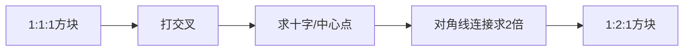

# 99乘法表：16格方块系统

## 方块编号体系

16格方块按 `[列][行]` 编号，列用字母 A-E，行用数字 1-4：

```
        平视 ←  俯视 →
      A1  B1  C1  D1  E1   ← 极俯角
      A2  B2  C2  D2  E2   ← 俯角
      A3  B3  C3  D3  E3   ← 平视
      A4  B4  C4  D4  E4   ← 仰角
      ↑                   ↑
    左侧面            右侧面
```

## 角度说明

| 编号范围 | 角度 | 特性 |
|----------|------|------|
| A排 (A1-A4) | 22.5°（左侧） | 右侧面积大，左侧面积小 |
| B排 (B1-B4) | 67.5°（左侧偏侧） | — |
| C排 (C1-C4) | 45°（中间） | 左右面积相等，**最容易画** |
| D排 (D1-D4) | 67.5°（右侧偏侧） | — |
| E排 (E1-E4) | 22.5°（右侧） | 左侧面积大，右侧面积小 |

| 行号 | 俯仰 | 特性 |
|------|------|------|
| 1 | 极俯角 | 看到大面积顶面 |
| 2 | 俯角 | 看到中小面积顶面 |
| 3 | 平视 | 看不到顶面/底面 |
| 4 | 仰角 | 看到底面 |

## 攻略路线（推荐加点顺序）

### 开局：C2 或 C3

C排45度角最容易判断比例，左右面积相等，是新手的最佳起点。

### 第一阶段（6个方块）

```
C2 → C3 → B2 → D2 → 拓展 C排上下
```

### 第二阶段（角度扩展）

```
C排熟练掌握 → 扩展到B排、D排 → 最后挑战A排、E排
```

### 难度分布

| 难度 | 区域 | 说明 |
|------|------|------|
| ★☆☆ | C2, C3 | 45度最容易，推荐开局 |
| ★★☆ | B2, D2, C1, C4 | 稍微需要经验 |
| ★★★ | B1, B4, D1, D4 | 需要手感支撑 |
| ★★★★ | A排, E排 | 平视角度难掌握 |
| ★★★★★ | 极俯/仰角 | 压缩强烈，需扎实基础 |

## 倍增法：从1到N

### 1:1:1方块 → 1:2:1 方块



**步骤：**
1. 在正方形面上打交叉（连接对角）
2. 交叉点即为中心点
3. 从中心点连一条线到对边中点，延长出去
4. 通过延长线确定2倍距离

> [!tip] 倍增可以连续使用
> 1倍→2倍→4倍，每次倍增都用同样的交叉法

## 方块选择建议

| 用途 | 推荐方块 | 理由 |
|------|----------|------|
| 画房子 | C2/C3 | 45度角左右对称，屋顶好处理 |
| 画人物 | C2/B2 | 人物最自然的角度 |
| 画机械 | D排 | 正面细节多时用D排 |
| 画场景 | 多种角度组合 | 根据镜头需要选择 |

## 练习方法

1. **默写16格**：每天默写一套16格方块，直到条件反射
2. **徒手挑战**：不用钢笔工具，徒手画16格，检查反透视
3. **角度转换**：从一个已知方块，用倍增法推导另一个角度
4. **实物参照**：用魔术方块或3D网站（sketchfab）作为参照