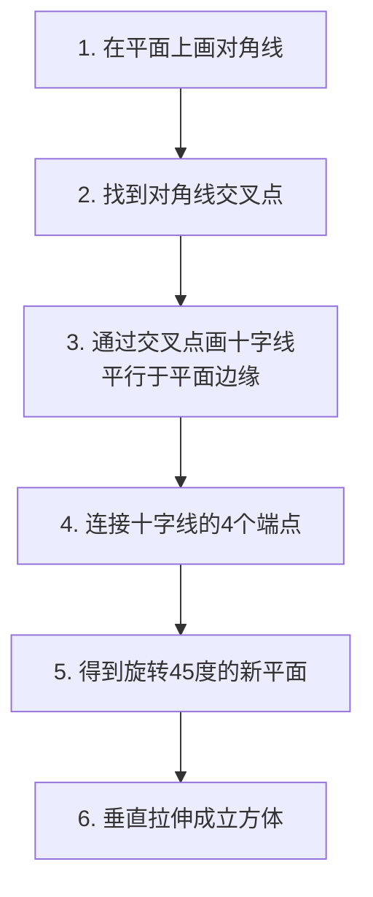

# 旋转法与N字法

## 旋转法：在透视中旋转45度

### 原理

在一个已知透视的平面上，通过对角线交叉和连线，求出一个旋转45度的新平面。

### 步骤



### 详细操作

1. **打交叉**：在方形的顶面/底面画两条对角线，连接对角顶点
2. **求十字**：在对角线交叉点处，画一条平行于画面边缘的线（横向十字线），再画一条纵向十字线
3. **连线**：连接十字线与4条边的交点，得到旋转45度的内接正方形
4. **垂直延伸**：将这个旋转后的面向上/向下拉伸，得到旋转后的立方体

> [!tip] 旋转法的关键
> - 地面方块必须遵循地面透视
> - 旋转后的新方块与原空间共享同一组透视规则
> - 旋转中心是原方块的中心点（对角线交叉点）

### 应用场景

- 在单点透视房间中摆放45度角的家具
- 画不同朝向的人物（人物朝向与空间关系）
- 场景中的装饰物体
- 地面花纹、地砖的旋转

## N字法：透视中的对称分割

### 原理

N字法用于在透视空间中，将一个宽度准确地平分或在特定比例处做对称分割。

### 步骤

1. 在透视平面上找到中心点（打交叉）
2. 从中心点向一侧边缘连一条线
3. 从这条线的外侧端点向另一侧边缘连一条对角线
4. 对角线穿过中心线的交点即为对称分割点
5. 重复操作可继续细分

```
透视图示（俯视抽象）：

原平面：  ┌──────────────┐
          │              │
          │    ·中心      │
          │              │
          └──────────────┘

N字分割:  ┌──────┬───────┐
          │      │       │
          │  甲  │  乙   │  ← 甲 = 乙
          │      │       │
          └──────┴───────┘
```

### 应用场景

- 屋顶左右对称（门/窗居中）
- 墙面花纹的对称排列
- 人物面部的五官定位
- 建筑立面的窗户分割

> [!warning] 数位时代的N字法
> 在数位绘画中，可以通过图层变换（Ctrl+T）直接完成对称，但理解N字法的原理有助于在没有变换工具时（手绘、速写）也能画出精准的对称。

## 旋转法 vs N字法

| 技法 | 目的 | 操作核心 | 适用场景 |
|------|------|----------|----------|
| 旋转法 | 在透视中旋转物体 | 打交叉→求十字→连线 | 家具、人物、场景物体 |
| N字法 | 在透视中分割对称 | 找中心→N形辅助线 | 建筑细节、花纹、五官 |

## 综合练习

1. 画一个单点透视房间，用地板方块旋转出45度的桌子和椅子
2. 在旋转后的桌面上用N字法确定左右对称的花纹
3. 在室内墙壁上用N字法确定窗户的对称位置
4. 将旋转法应用于人物——让人物在空间中转身