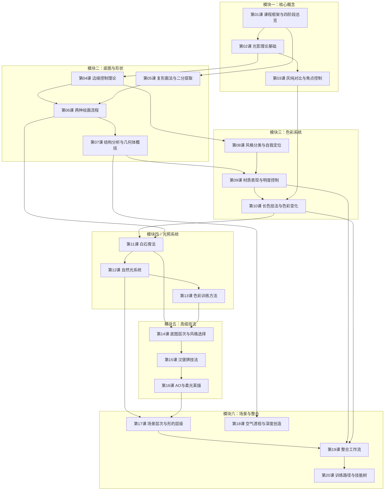

# 课程地图

## 模块说明

### 模块一：核心概念与工具
> 建立整个课程的**概念框架**和**量化工具**。理解四阶段工作流、HSB色彩坐标系统和灰纯对比理论。

- **前置依赖**：无（课程起点）
- **核心技能**：HSB坐标判断、灰纯对比应用

### 模块二：底图与形状
> 学习如何将复杂结构简化为几何体，掌握边缘控制分级，理解压暗打光与底色画暗面两种工作流。

- **前置依赖**：模块一（需要HSB和光色概念）
- **核心技能**：复形画法、边缘控制、结构简化

### 模块三：色彩系统
> 定位自身风格，学习材质表现和明度控制，掌握长色技法为画面注入色彩变化。

- **前置依赖**：模块二（需要边缘控制和形状提取能力）
- **核心技能**：风格定位、长色技法、套索上色

### 模块四：光照系统
> 学习白石膏法，理解自然光逻辑（暖阳冷阴/上冷下暖），建立系统性色彩训练方法。

- **前置依赖**：模块三（需要长色基础）
- **核心技能**：白石膏法、自然光系统、色票积累

### 模块五：高级技法
> 深化底图层次，学习汉堡牌分层控制法，理解AO环境光遮蔽与柔光素描。

- **前置依赖**：模块四（需要光照基础）
- **核心技能**：汉堡牌法、AO画法、死角分析

### 模块六：场景与整合
> 将所学整合为完整工作流，学习场景概括和空气透视，建立个人技能树和训练路径。

- **前置依赖**：模块五（需要所有前置技法）
- **核心技能**：场景概括、整合工作流、训练规划

## 参考文档

- **HSB色彩量化系统**：配合第01课、第04课、第10课使用
- **Photoshop技法速查**：全课程通用参考
- **卡牌系统速查**：配合第02课、第03课使用
- **技能树全景**：配合第20课使用