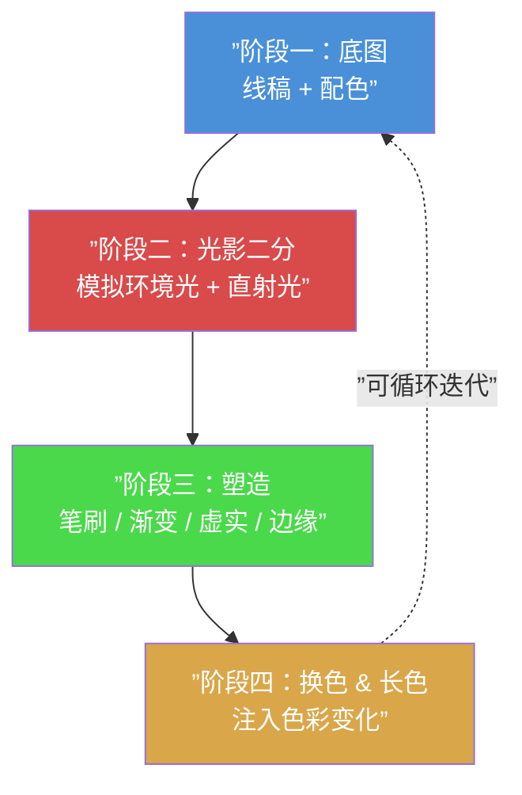
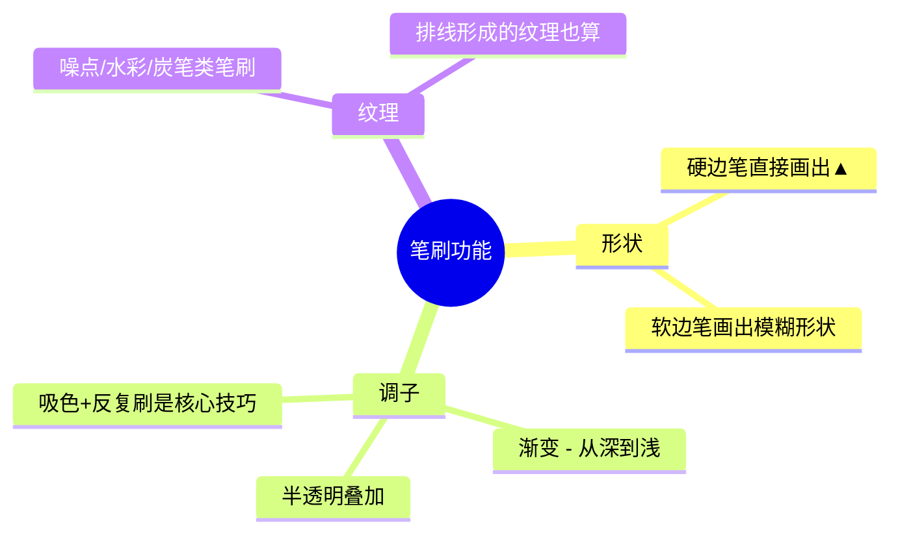

# 第01课：课程框架与四阶段总览

## 色彩课的核心目标

本课程不局限于特定画风（二次元、写实、厚涂等），而是覆盖所有画风**共同需要的通用知识**。你将学会一套**可量化的思考系统**，而不是零散的绘画技巧。

> [!TIP] 学习建议
> 建议听课第一遍记零散笔记，之后用手写方式整理成**思维导图**，重复输出三次左右，才能转化为长期记忆。课程框架本身已经迭代了8-9个版本，每一次整理都会加深理解。

---

## 四阶段作画流程

Krenz 将完整的数码绘画流程拆分为四个阶段，每个阶段有明确的任务目标：

### 阶段一：底图（线稿 + 配色）

底图阶段包含两个核心要素：

- **线稿**：决定造型的品质。不需要完美的封闭线条，画约三分之二的轮廓线，读者的视觉会自动补完剩余部分。
- **配色**：决定画面的基调。配色不是碰运气，而是可以通过**量化系统**来控制的。

> [!WARNING] 常见误区
> 很多同学在底图阶段追求一次性配出完美颜色。请记住：底图只需要一个**保守又安全**的版本，后续阶段才是增加色彩趣味的时候。

### 阶段二：光影二分

光影二分的核心任务是：

1. **模拟环境光**：把底图放进一个「环境」中，调整暗部整体的明度与色彩倾向
2. **模拟直射光**：在环境基础上，加入一盏或多盏光源，决定亮部的明度、色相与饱和度

使用的图层技巧：

| 图层模式 | 用途 | 比喻 |
|---------|------|------|
| 正片叠底（Multiply） | 压暗环境，处理暗部 | 暗属性魔法 |
| 加亮颜色（Color Dodge / Screen） | 画直射光，提亮亮部 | 光属性魔法 |
| 柔光（Soft Light） | 透光效果，如皮肤透光 | 辅助魔法 |

你看到的颜色 = **固有色 + 环境光色 + 直射光色**。学会分别控制这三个参数，就能在任何光照环境下画出一致的效果。

### 阶段三：塑造

塑造阶段解决「如何画得立体」的问题，包含三个子项：

| 子项 | 说明 | 工具 |
|------|------|------|
| 笔刷 | 形状、调子（明度渐变）、纹理三大功能 | 三位一体笔刷、硬笔+软橡皮 |
| 渐变/过渡 | 从硬边到柔边的平滑转化 | 吸色+反复刷、排线、软橡皮擦 |
| 边缘控制 | 虚实程度分级 | 1-4级边缘（锐利→消失） |

### 阶段四：换色 & 长色

在已经完成光影和塑造的画面上，**主动注入额外的色彩变化**，让颜色不再单调：

| 类型 | 说明 | 例子 |
|------|------|------|
| 换色 | 较大范围地改变某一区域的色相 | 把头发线条从黑色换成紫色 |
| 长色 | 局部轻微地增加色彩波动 | 鼻头加一点红、脸颊加一点紫 |

长色通常做得非常隐晦（低饱和度、小面积），但能极大丰富画面的色彩层次。

---

## HSB 色彩模型

HSB 是 Photoshop 和多数绘画软件中通用的色彩参数系统：

| 参数 | 全称 | 说明 | 取值范围 |
|------|------|------|---------|
| **H** | Hue（色相） | 红橙黄绿青蓝紫的色彩种类 | 0° - 360° |
| **S** | Saturation（饱和度） | 色彩的鲜艳程度，越高越纯 | 0% - 100% |
| **B** | Brightness（明度） | 色彩的明暗程度 | 0% - 100% |

> [!EXAMPLE] 色彩坐标系：5 x 5 = 25 格选色法
> 
> 将饱和度和明度各切分为 5 个等级，得到一个 5x5 的 25 格坐标网格：
> 
> | | B=20% | B=40% | B=60% | B=80% | B=100% |
> |---|---|---|---|---|---|
> | **S=20%** | 暗灰 | 低明灰 | 中灰 | 高明灰 | 亮灰 |
> | **S=40%** | 暗浊 | 低明浊 | 中浊 | 高明浊 | 亮浊 |
> | **S=60%** | 暗色 | 低明色 | 中色 | 高明色 | 亮色 |
> | **S=80%** | 暗艳 | 低明艳 | 中艳 | 高明艳 | 亮艳 |
> | **S=100%** | 暗纯 | 低明纯 | 中纯 | 高明纯 | 亮纯 |
> 
> 左下区域（低 S 低 B）为**安全区**，右上区域（高 S 高 B）为**焦点区**。配色的本质就是在这 25 格中有策略地分布颜色。

---

## 底图阶段的重要技法

### 无压感笔刷三分粗细描线法

抛弃需要精细控制压感的笔刷，改用**无压感硬边笔刷**，用三种固定粗细画完所有线条：

| 粗细 | 用途 |
|------|------|
| 5-6px | 外轮廓主线 |
| 4px | 内部主要结构线 |
| 3px | 五官、头发丝等细节线 |

不需要追求每根线条的完美收尖。缩小到实际尺寸后，轻微的抖动根本看不出。

### HSB 网格选线色法

线稿的颜色不要用纯黑。锁定线稿图层后，根据旁边的固有色区域，往**右下方向移动一定距离**选取颜色：

- 起始色在坐标 (H,S,B)，往右下移动约 **1-1.5 格**的位置
- 这样可以保证线色比底色暗，同时带有固有色倾向

### 硬笔 + 软橡皮擦制作渐变技法

先用硬边笔画出色块，然后：

1. 用 **0% 硬度**的软橡皮擦轻轻刷过边缘，产生柔和渐变
2. 用 **25-50% 硬度**的橡皮擦修整局部虚实
3. 反复利用硬笔 + 软橡皮的组合，可以做出非常丰富的边缘变化

---

## 光影二分与结构的关系

**二分形状的判定 = 你对结构的理解。**

同一个物体，不同理解程度会画出三种不同的光影复杂度：

| 等级 | 光影复杂度 | 结构理解 |
|------|-----------|---------|
| **A 级** | 大块、简单、利落 | 理解为简单几何体（如 Q 版） |
| **B 级** | 有一些小的凹凸起伏 | 理解中等复杂的结构（有衣褶等） |
| **C 级** | 大量小块碎面，细节丰富 | 理解精细结构（多层次转折） |

如果你在二分阶段卡住，多半不是因为上色技术，而是因为**结构理解不到位**。解决方法：把复杂形体拆解为圆柱、球体、甜甜圈等基本几何体，分别画光照，再组合回去。

---

## 笔刷三大功能

一支笔刷可以完成三件事情：

> [!TIP] 三位一体笔刷
> 同时具备形状、调子、纹理三种能力的笔刷。最常见的就是**源头笔（硬边压力不透明度笔刷）** + 配合 Alt 键取色，可以实现：画形状 → 做渐变 → 保留笔触纹理。

---

## 自我练习

> [!QUESTION] 阶段一自测
> 
> 1. 四阶段作画流程是哪四个阶段？请按顺序写出。
> 2. HSB 分别代表什么？其中哪个参数控制色彩的鲜艳程度？
> 3. 在 5x5 选色网格中，往右下移动一格，饱和度和明度分别会发生什么变化？
> 4. 底图阶段的线稿描线，推荐使用哪种类型的笔刷和哪几种粗细？
> 5. 正片叠图层用于什么场景？加亮颜色图层用于什么场景？

参考答案

1. 底图（线稿+配色）→ 光影二分（亮暗分离）→ 塑造（笔刷/渐变/虚实/边缘）→ 换色&长色（色彩变化注入）
2. H = 色相（Hue），S = 饱和度（Saturation），B = 明度（Brightness）。S 控制鲜艳程度。
3. 饱和度降低半级，明度降低半级（即更灰更暗），适合用来选取线稿颜色。
4. 使用**无压感硬边笔刷**，三种粗细：5-6px（外轮廓）、4px（内部结构）、3px（细节）。
5. 正片叠底用于**压暗环境 / 画暗部**；加亮颜色用于**画直射光 / 提亮亮部**。

---

## 下一步

完成了这堂课的框架理解后，你已经对色彩课的整体结构有了清晰的认知。接下来请进入 [[0002-light-theory-basics]]，深入学习**光影理论的基础**——固有色与光色的叠加关系、硬光源与软光源的区别，以及环境光的三参数控制。