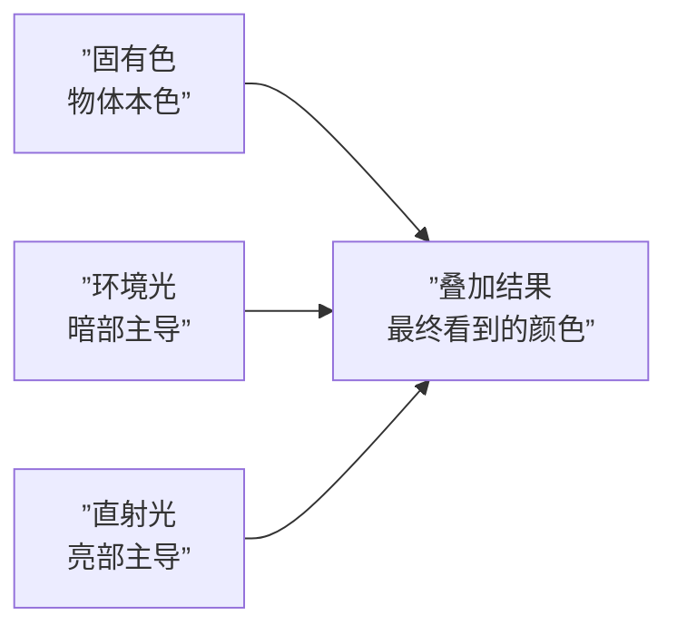
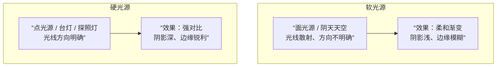
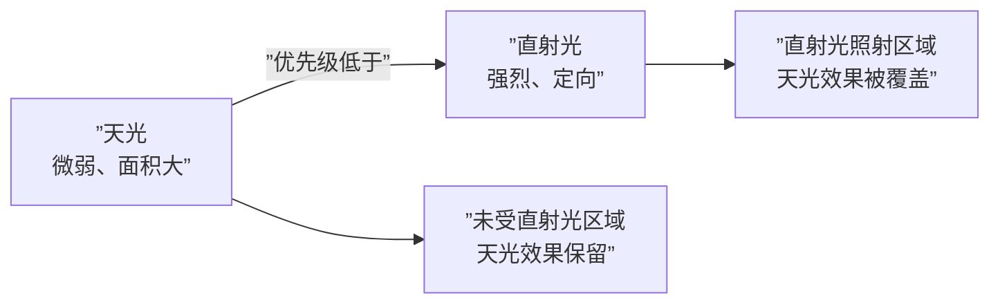

# 第02课：光影理论基础

## 固有色与光色的叠加关系

**固有色**是物体在完美白光下呈现的本色。但在现实中，几乎不存在绝对的白光环境——我们看到的物体颜色始终是**固有色 + 环境光 + 直射光**三者的叠加结果。

> [!EXAMPLE] 实操验证
> 1. 将人物放在「白光摄影棚」（四面柔光）中 → 看到**固有色**
> 2. 调暗摄影棚灯光 → 人物整体变暗，但色相不变
> 3. 将环境光调为蓝色 → 人物暗部跟着偏蓝
> 4. 在右侧打开一盏橘色聚光灯 → 亮部变成橘色，暗部仍保留蓝色环境光

> [!TIP] 核心公式
> **看到的颜色 = 固有色 + 环境光色彩 + 直射光色彩**
> 
> - **亮部** = 固有色 × 直射光色（被直射光强烈影响）
> - **暗部** = 固有色 × 环境光色（被环境光主导）
> - **曝光过度区域** = 直射光过强，固有色信息几乎消失

---

## 硬光源 vs 软光源（漫反射）

光源的"软硬"决定了光影边缘的锐利程度和阴影的深浅。

| 特性 | 硬光源 | 软光源（漫反射） |
|------|--------|-----------------|
| 光源类型 | 点光源、聚光灯 | 面光源、散射光 |
| 边缘 | 锐利、清晰 | 模糊、柔和 |
| 阴影深度 | 深、对比强 | 浅、对比弱 |
| 例子 | 正午太阳、台灯 | 阴天、摄影棚柔光箱 |
| 光影二分难度 | 较容易（形状清晰） | 较困难（需画柔和过渡） |

> [!WARNING] 新手避坑
> **软光环境（如阴天）下想画出立体感**属于中高难度操作。因为四面八方都有光照，只有下巴、头发夹缝等少数区域会有「闭色阴影」（光照射不到的角落）。这类画法对结构理解要求极高，前期学习阶段请尽量**选择硬光环境**来练习二分。

---

## 环境光的三参数控制

当你把角色放入某个环境时，需要调整三个核心参数：

| 参数 | 控制对象 | 操作方式 |
|------|---------|---------|
| **明度（多暗）** | 环境整体的亮暗程度 | Ctrl+U 调整明度滑块 |
| **色相（偏什么色系）** | 环境的色彩倾向 | Ctrl+B 色彩平衡调整 |
| **饱和度（多纯）** | 环境色的鲜艳程度 | Ctrl+U 调整饱和度滑块 |

> [!TIP] 推荐的图层操作流程
> 
> 1. 底图层上方开**新图层 → 设为「正片叠底」**
> 2. 用灰色或浅色填充此图层，压暗整张图
> 3. 按 **Ctrl+B**（色彩平衡）调整环境色相
> 4. 按 **Ctrl+U**（色相/饱和度）调整明度与饱和度
> 
> 这样做的本质是：**用一个暗属性图层模拟整个环境的色彩氛围**，角色自然融入了环境。

---

## 天光 vs 直射光优先级

环境中有两个主要光源在竞争：**环境光（天光）** 和 **直射光（主光源）**。

**天光就像青梅竹马**——陪伴角色、影响角色的暗部，但很微弱。**直射光就像转学生**——一旦出现，就会强势覆盖亮部的所有其他色彩影响。

这带来的实际绘画策略：

1. 先在所有**朝上的面（头顶、肩膀顶面、鼻子顶部）** 铺一层冷色天光
2. 再开新图层用**加亮颜色模式**画直射光
3. 直射光照射到的区域，天光效果自动消失

> [!WARNING] 天光弊端
> 考虑太多天光细节（例如分析了地面反射到肩膀、墙壁反射到头发等）会导致你的「显卡烧掉」——意思是复杂度太高，你根本画不完。初学阶段请**只控制环境参数和直射光参数**，忽略次级反光。

---

## 压暗打光 vs 传统底色画暗面

这是两种不同的处理暗部的思路：

| 方法 | 操作 | 优点 | 缺点 |
|------|------|------|------|
| **压暗打光** | 底图是固有色 → 正片叠底压暗 → 加亮画光 | 流程清晰、可逆、可调整 | 需要理解图层模式 |
| **传统底色画暗面** | 直接用深色画暗部，留白区域为亮部 | 直觉、画师常用 | 不可逆、不易整体调整 |

本课程采用**压暗打光法**，因为它在学习阶段更容易控制全局效果。

---

## 边缘控制四级别（简介）

边缘的虚实是后续塑造阶段的重要内容，这里先做概念铺垫：

| 级别 | 名称 | 特征 | 用法示例 |
|------|------|------|---------|
| **1 级边** | 锐利边（Sharp） | 完全不透明，边界清晰 | 硬光投影、结构转折强烈处 |
| **2 级边** | 软边（Soft） | 有一定过渡带 | 柔光环境、表面平缓转折 |
| **3 级边** | 模糊边（Blurred） | 较大范围的渐变 | 反光、背光面 |
| **4 级边** | 消失边（Lost Edge） | 边界完全融入背景 | 暗部融入环境、距离感表现 |

> [!TIP] 边缘控制的核心
> 边缘控制必须**结合结构理解**去使用。先判断物体的转折角度：大转折用 1-2 级边，微妙表面起伏用 3-4 级边。

---

## 自我练习

> [!QUESTION] 光影理论自测
> 
> 1. 请写出最终看到的颜色由哪三个成分叠加而成？
> 2. 硬光源和软光源（漫反射）的主要区别是什么？分别举一个现实中的例子。
> 3. 环境光需要控制哪三个参数？用什么快捷键来调整？
> 4. 天光（环境光）和直射光同时存在时，哪个优先级更高？为什么？
> 5. 边缘控制四个级别从锐利到消失分别是哪些？哪一种边适合硬光投影？

参考答案

1. 固有色 + 环境光色 + 直射光色
2. 硬光源：方向明确，边缘锐利，阴影深（如正午太阳、台灯）。软光源：散射光，边缘模糊，阴影浅（如阴天、摄影棚柔光箱）。
3. 明度（多暗）— Ctrl+U、色相（偏什么色系）— Ctrl+B、饱和度（多纯）— Ctrl+U
4. **直射光优先级更高**。直射光一旦出现，亮部区域的天光效果会被覆盖。天光只影响未受直射光照射的区域。
5. 1级锐利边 → 2级软边 → 3级模糊边 → 4级消失边。1级锐利边最适合画硬光投影。

---

## 下一步

你已经掌握了光影理论的核心概念——固有色与光色的叠加、软硬光源的区别、环境光参数控制。接下来请进入 [[0003-gray-purity-contrast]]，学习如何通过**灰纯对比**来控制画面焦点，让你的配色从保守走向高级。