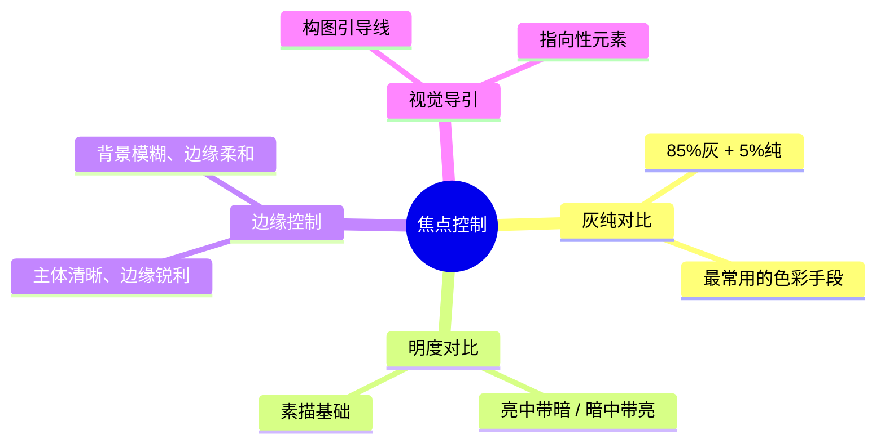
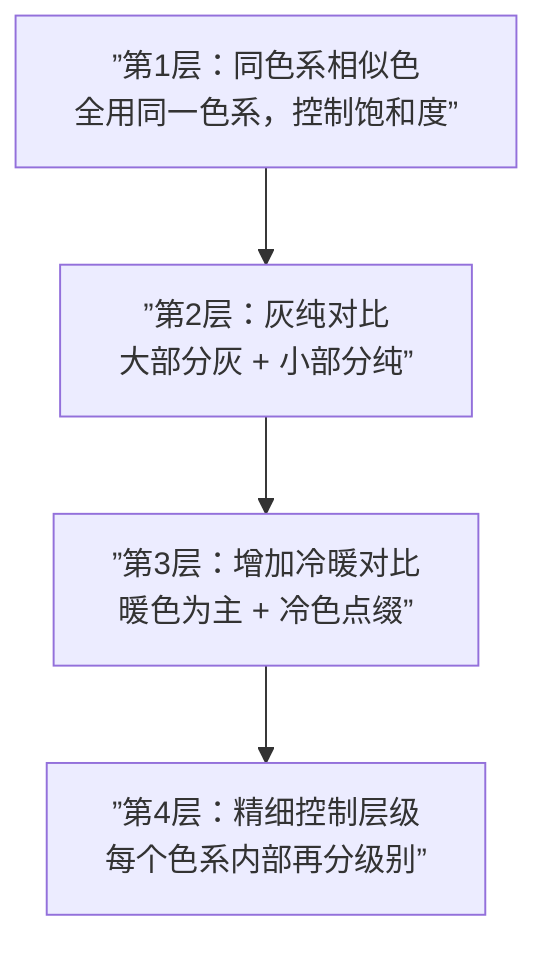

# 第03课：灰纯对比与焦点控制

## 配色的核心问题

大多数同学在配色上卡住，不是因为不知道配色原理，而是因为**没有建立色彩的层级关系**。

> [!WARNING] 色彩学的常见盲区
> 传统的色彩学教材通常会讲色相环、相似色配色法、互补色配色法，但很少涉及**饱和度（纯度）的控制**。而饱和度恰恰是决定画面「高级感」与「焦点」的最关键维度。

---

## 灰纯对比理论（85-10-5 法则）

灰纯对比的核心思路是：**让大部分画面保持低饱和度（灰），用少量高饱和度（纯）的区域来制造焦点**。


| 区域 | 占比 | 饱和度范围 | 作用 |
|------|------|-----------|------|
| **灰色区** | ~85% | S=0~20 | 提供底色和体积感，不争夺注意力 |
| **中间区** | ~10% | S=20~50 | 丰富色彩层次，适度引导视线 |
| **纯色区** | ~5% | S=50~100 | 制造焦点，吸引视线停留 |

> [!EXAMPLE] 具体感受
> 用吸管工具在优秀作品上取色，你会看到大部分区域的 **S 值几乎不动**（在低位徘徊），只有少数关键区域（眼睛、饰品、嘴唇）的 S 值会突然跳高。这就是灰纯对比在发挥作用。

---

## 四种焦点控制手段

要让读者的视线停留在你希望的地方，有四种主要手段：



| 手段 | 色彩相关？ | 难度 | 效果强度 |
|------|-----------|------|---------|
| 灰纯对比 | 是 | 低 | 强 |
| 明度对比 | 否（素描） | 中 | 强 |
| 边缘控制 | 否（塑造） | 中 | 中 |
| 视觉导引 | 否（构图） | 高 | 强（需配合其他手段） |

在色彩课的底图阶段，**灰纯对比**是最重要、最常用、最好上手的手段。

---

## 配色层级递进法

这是一个**从保守到有趣**的递进流程，适合任何不会配色的同学。



### 第1层：同色系相似色（安全区）

**只用同一个色系**（例如全部用红橙黄），且把饱和度控制在坐标格的前两区。

```
HSB 坐标格（饱和度 × 明度）
         B低 ←→  B高
S低  ┌─────────────────┐
     │   Zone 1    Zone 2  │  安全区：用于~85%的画面
     │  (灰暗)     (灰亮)   │
S中  │   Zone 3    Zone 4  │  过渡区：用于~10%的画面
     │  (中纯度)   (中纯亮) │
S高  │   Zone 5    Zone 5  │  焦点区：用于~5%的画面
     └─────────────────┘
```

> [!TIP] 配色安全区
> 底图阶段建议把所有颜色控制在 **Zone 1 ~ Zone 2**（即饱和度低于 40、明度适中）。这可以保证画面和谐、不脏不乱。后续通过光影和长色阶段再引入更丰富的色彩。

### 第2层：灰纯对比

在保守的同色系基础上，开放 **Zone 3 ~ Zone 4**，将 10-15% 的区域涂上饱和度较高的颜色。此时画面开始出现**层级差异**：

- 85% 区域：饱和度低（灰）→ 不抢夺注意力
- 10% 区域：饱和度中等 → 作为过渡
- 5% 区域：饱和度高（纯）→ 成为焦点

### 第3层：增加冷暖对比

在暖色主调中加入少量**冷色**（甚至是饱和度不高的冷色），画面会立刻「高级」起来。

| 操作 | 效果 |
|------|------|
| 纯暖色（全部红橙黄） | 和谐但单调 |
| 暖色主调 + 少量冷色点缀 | 有对比、有层次、更高级 |

冷色通常加在哪里？教科书级的答案：**瞳孔、小面积饰品、衣领花纹**。

### 第4层：精细化控制

在每个色系内部再分级别。例如冷色也可以有 Grade 1 的冷（灰冷）和 Grade 3 的冷（较纯的冷）。**确保最强的纯色出现在你最想让读者看的地方**。

---

## 青梅竹马 vs 转学生 模型

这是一个帮助你理解**注意力权重**的比喻：

| 角色 | 对应 | 特征 | 结果 |
|------|------|------|------|
| **青梅竹马（天光/大面积灰）** | 背景环境、暗部色彩 | 长期陪伴、稳定、微弱 | 作为基础，影响广泛但不突出 |
| **转学生（直射光/纯色焦点）** | 亮部色彩、高饱和区域 | 新鲜、强烈、吸引注意 | 一旦出现就胜出，读者第一眼看到 |

如果你在画面中放了一个超高饱和的「转学生」（比如饱和度 100% 的红色），即使它面积很小，也能胜过大面积、纯度仅 30% 的「青梅竹马红色」。

> [!WARNING] 转学生不能太多
> 如果画面中有多个高饱和区域互相竞争，读者的视线就会失去焦点，画面变得琐碎。如果你喜欢多色系，确保只有**一个区域拥有最高饱和度**，其他区域的饱和度都要低至少一个级别。

---

## 高饱和作品的灰纯思路

即使是高饱和战士（如 Mica Picasso 风格），也可以用同样的逻辑来理解：

1. **先全部用相似色**（全部暖色/全部冷色），得到一张高饱和但协调的底图
2. **降级处理**：将大部分区域饱和度降低一些，保留少数区域的高饱和
3. 在降级的空间中加入**冷暖对比**，让颜色更有层次

即使最后结果是高饱和的，作画过程中的思路依然是：**先保守 → 再分级 → 最后拉出对比**。

---

## 自我练习

> [!QUESTION] 灰纯对比自测
> 
> 1. 85-10-5 灰纯法则中，三个百分比分别代表什么？
> 2. 四种焦点控制手段分别是什么？其中哪一种跟色彩最直接相关？
> 3. 配色层级递进法的四层分别是什么？
> 4. 「青梅竹马 vs 转学生」模型中，转学生对应画面中的什么元素？
> 5. 如果你想让读者的视线落在角色的眼睛上，你应该在眼睛区域使用什么级别的饱和度，在其他区域使用什么级别的饱和度？

<details>
<summary>参考答案</summary>

1. 85% 灰色区域（饱和度 0-20）、10% 中间区域（饱和度 20-50）、5% 纯色焦点（饱和度 50-100）
2. 灰纯对比、明度对比、边缘控制、视觉导引。灰纯对比与色彩最直接相关。
3. 第1层：同色系相似色（保守安全）→ 第2层：灰纯对比 → 第3层：增加冷暖对比 → 第4层：精细化控制
4. 转学生对应**直射光**（覆盖亮部）或**高饱和纯色焦点**（跳脱出灰背景），它们都具备「强烈、新鲜、吸引注意力」的特征。
5. 眼睛区域使用**高饱和度**（Zone 4-5），其他区域使用**低饱和度**（Zone 1-2）。这样眼睛就是画面中「最纯的转学生」，读者第一眼就会被吸引过去。

</details>

---

## 实践任务

找一张你觉得「配色很高级」的插画，用吸管工具（Alt 键）在图中取 10 个不同位置，记录它们的 HSB 数值。回答以下问题：

1. 大部分区域的 S 值在哪个范围？
2. S 值最高的区域是哪一处？它占画面面积的百分比大约是多少？
3. 画面中是否有冷暖对比？冷色和暖色的饱和度分别是多少？
4. 如果让你把这张图的饱和度全部降低 50%，再在关键区域手动补回原本的高饱和，你会选择哪些区域？

---

## 下一步

你已经掌握了灰纯对比理论和配色层级递进法，这是色彩控制中最核心的量化工具。如果想再回顾四阶段流程中的其他部分，可以回到 [[0001-course-overview]] 重新浏览整体框架；或者准备好后，进入实际练习阶段，开始用 HSB 坐标格来规划你的第一个配色方案。