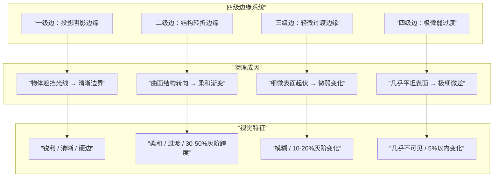

# 第04课：边缘控制理论

## Learning Objectives

- 理解并区分四级边缘系统（投影边、结构转折边、极柔和微过渡）
- 掌握转折边与投影边的核心判断原则
- 理解边缘等级组合如何决定艺术风格
- 学会硬笔量化边缘等级的训练方法

## Core Idea

边缘控制是绘画从"画对"走向"画好"的关键进阶。同样一笔颜色，边缘的处理方式不同，传递的体积感、质感甚至风格都截然不同。Krenz将边缘分为**四个等级**，每一级对应特定的物理成因和视觉特征。

### 四级边缘详细说明

| 等级 | 名称 | 物理成因 | 视觉特征 | 典型例子 | 常用画法 |
|------|------|----------|----------|----------|----------|
| **一级边** | 投影阴影边缘 | 物体完全遮挡光线 | 锐利清晰，边界分明 | 鼻底投影、下颌投影、物体在地面的影子 | 硬笔直接画，或硬边笔刷 |
| **二级边** | 结构转折边缘 | 曲面结构转向（如圆柱/球体） | 柔和过渡，有灰阶变化 | 手臂圆柱转向暗面、苹果的明暗交界线、火腿片过渡 | 硬笔塑形后喷枪柔化 |
| **三级边** | 轻微过渡边缘 | 细微表面起伏 | 模糊渐变，变化小 | 脸颊微凸、布料褶皱微起伏 | 喷枪大范围柔化 |
| **四级边** | 极微弱过渡 | 几乎平坦的表面 | 极细微差，几乎不可分辨 | 额头大面积过渡、静物台平面 | 软喷枪轻扫 |

### 转折边 vs 投影边：核心判断原则

这是边缘控制中最容易混淆的判断。以下是关键区分表：

| 比较维度 | 转折边（二级边） | 投影边（一级边） |
|----------|----------------|----------------|
| **物理成因** | 物体表面方向转向光源 | 物体A遮挡光线落在物体B上 |
| **边缘硬度** | 柔和（软边） | 锐利（硬边） |
| **位置特征** | 沿结构走向，随结构变化 | 被投影物体的表面，可跨越不同结构 |
| **修改原则** | **必须柔化**，否则像纸片/几何体 | **保持清晰**，否则像光晕/不真实 |
| **常见误区** | 把转折画成硬边（结构变生硬） | 把投影边喷模糊（影子变漂浮） |

> [!WARNING] 核心原则
> **投影边 = 一级边 = 锐利清晰；转折边 = 二级边 = 柔和过渡。** 这不是风格选择，而是物理规律。即使二次元风格也只是简化边缘等级数量，不会颠倒这个逻辑。

### 边缘等级与艺术风格

边缘等级的组合直接决定画面风格：

| 风格 | 使用的边缘等级 | 典型特征 |
|------|--------------|----------|
| **超写实** | 一级 + 二级 + 三级 + 四级全使用 | 丰富细腻，每个边缘都精准匹配物理 |
| **半厚涂** | 一级 + 二级 为主，少量三级 | 有体积感但不追求极致细腻 |
| **二次元** | 一级（亮暗形状）+ 二级边 + 喷枪灰面 | 清晰形状分界 + 柔和过渡 |
| **平面风格** | 全部用一级边（无过渡） | 色块分明，无体积感 |

> [!TIP] Key Insight
> 写实的秘密不在于画得细，而在于**同时使用多个等级的边缘**。同一张画中，受光面的一级边、暗部的柔和过渡、远处的模糊边缘——混合使用才产生"真实感"。

## Worked Example

### 硬笔量化边缘等级训练法

这是一个重要的基础训练：用夹N层的方式表达N级边。

1. **一级边训练**：取一张照片，用硬笔直接画出投影形状——**一笔下定**，不修改、不柔化。
2. **二级边训练**：在圆柱体练习中，先用硬笔画出亮暗二分，再用喷枪在明暗交界处做柔和过渡。注意过渡的宽度要控制——过渡太窄像硬边，太宽像光晕。
3. **三级/四级边训练**：在平滑表面上用软喷枪（流量10-20%）轻扫出微弱起伏。关键不是画多清楚，而是画多"模糊"。
4. **组合训练**：同一张画中刻意使用不同等级边缘，训练眼睛对不同边缘的敏感度。

### 硬笔塑形后喷枪柔化

标准工作流：**硬笔切割形状 → 喷枪柔化过渡**

1. 先用硬边笔刷确定形状边界（一级边/二级边的起始位置）
2. 锁定形状选区
3. 用喷枪在边界处做柔化处理
4. 检查：投影边是否保持了清晰？转折边是否柔化到位？

> [!WARNING] 柔光照片的初学者陷阱
> 初学者常犯的错误：**用柔光照片练习边缘分析**。柔光照片的边缘本来就模糊，无法区分一级边和二级边——你看到的模糊究竟是投影还是转折？正确做法：**先练习直射光照片**（硬光源），边缘清晰可辨，分析后再转移到柔光训练。

### 卡牌组合系统简介

边缘控制对应多张技法卡牌：

- **卡牌"捏陶土"**：用大块面+软硬边缘交替塑造体积，像捏陶土一样从粗到细
- **卡牌"火腿片"**：二级边的标准画法——在亮暗之间夹一层中间调过渡（详见 [汉堡牌技法](lessons/0015-hamburger-method)）
- **卡牌"AO柔光"**：三级/四级边的主要应用场景（详见 [AO与柔光素描](lessons/0016-ao-ambient-occlusion)）

> [!EXAMPLE]
> 卡牌系统的核心隐喻：**每种技法是一张卡牌，画风是一套卡组**。Realism风格用了全部边缘等级卡牌；二次元风格只用了一级+二级+少量三级。这不是谁好谁坏的问题，而是卡组配置策略的选择。详见 [卡牌系统速查](reference/card-system)。

## Practice

完成以下练习：

1. **找一张直射光照片**（户外晴天人像最佳），用1小时分析并标注所有边的等级
2. **圆柱体练习**：画一个圆柱，用硬笔量化法表现一级边（投影）和二级边（转折）
3. **风格分析**：找一张二次元作品和一张写实油画，分析它们分别使用了哪些等级的边缘

> [!QUESTION] Self-check
> 以下情况应使用几级边？
> 1. 鼻子下方的投影
> 2. 手臂从亮面转到暗面的交界
> 3. 额头的平滑过渡
> 4. 人物在地面的阴影

查看答案

1. **一级边**——鼻底投影是物体遮挡光线，边缘应锐利
2. **二级边**——圆柱形结构转向，需要柔和过渡
3. **三级/四级边**——额头是大面积平滑表面，过渡极微弱
4. **一级边**——地面投影是物体遮挡光线，边缘必须清晰

注意：如果鼻底投影不见得是最暗的（因为反光可能使它变亮），但**边缘的锐利程度不变**——这是判断一级边的关键。

## Next Step

完成以上练习后，进入 [第05课：复形画法与二分提取](lessons/0005-binary-extraction)，学习如何用阈值工具将复杂图像提炼为清晰的二分形状——二分做好了，边缘控制才有发挥的舞台。