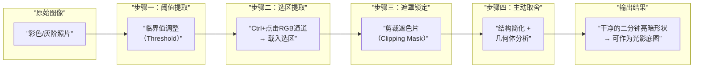
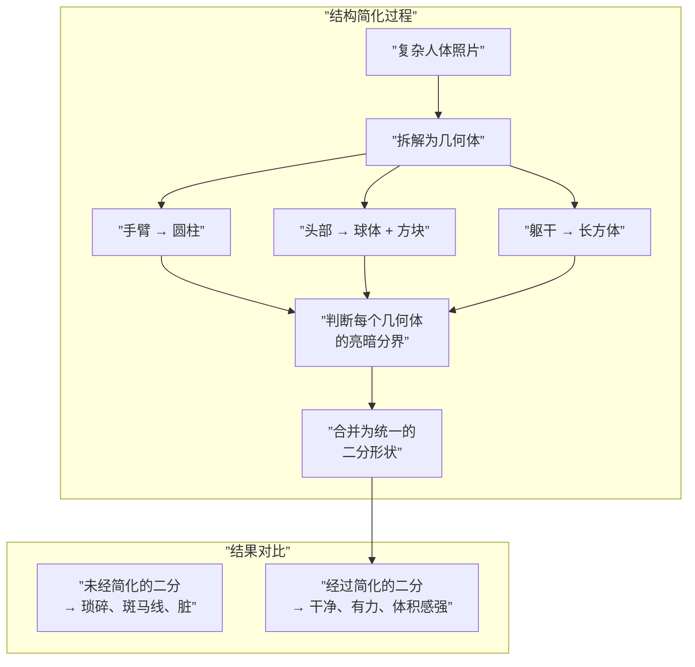

# 第05课：复形画法与二分提取

## Learning Objectives

- 理解复形画法的核心概念（阈值工具提炼黑白二分）
- 掌握临界值(Threshold)提取二分的工作流
- 学会色版通道去背提取选区（Ctrl+点击RGB通道）
- 理解剪裁遮色片(Clipping Mask)锁定形状的原理
- 认识结构简化对二分形状质量的决定性作用
- 避免"斑马线画法"的常见错误

## Core Idea

**复形画法**（Binary Shape Extraction）是将复杂图像提炼为最简的亮暗二分状态，以此训练对光影结构的认知。二分（亮面/暗面）做对了，一张画就已经完成了60%。剩下的40%是过渡、细节和色彩变化。

### 一、临界值(Threshold)提取二分

Photoshop的**Threshold**调整图层是最直接的二分工具：

1. 打开照片 → 创建Threshold调整图层
2. 拖动滑块，观察画面变为纯黑+纯白
3. 调整到能清晰分辨物体的亮暗结构为止
4. 此时得到的黑白图像就是"复形"——物体最本质的光影形状

> [!TIP] Key Insight
> Threshold的妙处在于：它去掉了所有中间调的干扰，强迫你只关注**形状本身**。很多初学者画不好光影是因为注意过渡去了，而形状本身是错的——Threshold直接暴露问题。

### 二、色版通道去背提取选区

> [!TIP] PS操作技巧
> 在Photoshop中，点开"通道"(Channels)面板，Ctrl+点击RGB复合通道的缩略图，即可载入**亮度选区**（选中亮部）。反选后就是暗部选区。这个操作比用魔棒工具准确得多，因为它基于像素的真实亮度值而非颜色容差。

操作步骤：
1. 通道面板 → Ctrl+点击RGB通道 → 载入亮部选区
2. Ctrl+Shift+I → 反选得到暗部选区
3. 新建图层 → 用黑色填充暗部选区
4. 这样就得到了独立的暗部形状图层

更详细的PS操作请参考 [PS技法速查](reference/photoshop-techniques)。

### 三、剪裁遮色片(Clipping Mask)锁定形状

提取出二分形状后，需要用**剪裁遮色片**将其锁定，确保后续绘制不会越界：

1. 在暗部形状层上方新建图层
2. 右键 → 创建剪裁遮色片（或 Ctrl+Alt+G）
3. 在此图层上绘制，内容会被限制在暗部形状内
4. 这是后续添加调子变化、反光、透光的基础

> [!EXAMPLE] 遮罩工作流
> 1. 底层：底色（固有色）
> 2. 第二层：暗部形状（Threshold提取 + Clipping Mask锁定）
> 3. 在第二层内部：添加暗部的反光、环境光变化
> 4. 第三层（暗部之上）：亮部高光等细节

### 四、结构简化决定二分形状的干净度

二分形状的**干净度**不取决于描边是否精细，而取决于**对结构的理解深度**。

**基础几何体分析**是结构简化的核心工具：

| 几何体 | 适用部位 | 亮暗分界规律 | 注意点 |
|--------|----------|-------------|--------|
| **圆柱** | 手臂、腿、手指、脖子 | 明暗交界线沿圆柱长轴走 | 两端有弧度转折 |
| **球体** | 头部、关节、胸廓 | 明暗交界线为弧形 | 高光在朝向光源的3/4处 |
| **圆锥** | 脚踝过渡、颈部 | 明暗交界线从窄到宽 | 尖端亮、基部暗 |
| **苹果切片** | 脸颊、肩头过渡 | 弧形转折，类似半球 | 边缘有轻微反光 |

### 五、"斑马线画法"的问题

"斑马线画法"指在二分时将暗部画成一条条平行的斑马纹——这是初学者最常见的错误。

> [!WARNING] 斑马线画法的三大问题
> 1. **形状琐碎**：把暗部分割成小条，破坏了大的体积感
> 2. **结构失真**：平行条纹不代表真实的光照逻辑
> 3. **无法进步**：用小笔触反复描是"画"而不是"想"

**避免方法**：先用Threshold看二分整体形状，再用大笔刷（对应形状大小的70%）快速切割，最后再调整边缘。

## Worked Example

### 标准复形画法工作流

以一张人像照片为例：

| 步骤 | 操作 | 结果 | 时长建议 |
|------|------|------|----------|
| 1 | 打开照片 → Threshold调整图层 → 拖动滑块 | 得到黑白二分参考 | 2分钟 |
| 2 | 通道面板 → Ctrl+点击RGB → 反选 → 新建图层填充黑色 | 暗部选区独立图层 | 1分钟 |
| 3 | 给暗部层创建Clipping Mask → 锁定形状 | 暗部形状被锁定 | 30秒 |
| 4 | 分析几何体 → 判断每个几何体的亮暗分界 | 理解结构逻辑 | 10分钟 |
| 5 | 在暗部层基础上主动取舍——简化琐碎细节 | 二分形状干净化 | 15分钟 |
| 6 | 在暗部层内部添加反光/环境光变化 | 暗部有内容但不破坏形状 | 20分钟 |

> [!QUESTION] Self-check
> 1. 为什么要用Threshold而不用魔棒工具提取二分？
> 2. 剪裁遮色片(Clipping Mask)的作用是什么？
> 3. "斑马线画法"有什么危害？
> 4. 圆柱体的明暗交界线是什么形状？

查看答案

1. **Threshold基于全局亮度阈值**，产生的形状边界是物理上正确的亮暗分界；魔棒工具基于颜色容差和相邻像素，容易产生锯齿状边界和选区漏洞。
2. **将绘制内容限制在下层图层的形状范围内**。锁定二分形状后，在遮色片内添加调子变化时不会破坏边缘的清晰度。
3. 斑马线画法造成形状琐碎、结构失真、无法进步的恶性循环。它是"画"而不是"想"的表现。
4. 圆柱体的明暗交界线是**沿着圆柱长轴的两条平行线**，而不是弧形。这是区分圆柱和球体的关键。

### 照片临摹中的主动取舍训练

> [!TIP] Key Insight
> 临摹不是为了复制照片，而是为了**理解照片背后的光照逻辑**。Threshold提取的是照片告诉你的，但主动取舍是你理解后的产物。

训练方法：
1. 先用Threshold提取二分（被动观察）
2. 关掉Threshold图层，凭理解手动重构二分（主动分析）
3. 打开Threshold对照检查差异
4. 重复直到手动二分与Threshold接近

## Next Step

完成复形画法练习后，进入 [第06课：两种绘画流程](lessons/0006-two-workflows)，学习传统底色画暗面和压暗打光两种工作流的区别——有了干净的二分形状，下一步就是选择正确的流程将其转化为完整的画面。