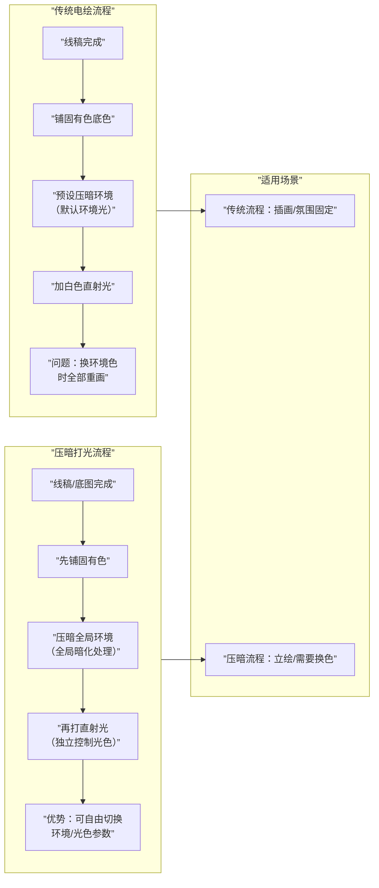

# 第06课：两种绘画流程

## Learning Objectives

- 理解传统电绘流程与压暗打光流程的核心区别
- 掌握暗部反光控制原则（反光必须弱）
- 理解"明暗交界线并非最暗"的原理
- 区分暗多亮少与亮多暗少的策略差异
- 对比线稿流与厚涂流的适用场景

## Core Idea

完成二分形状提取后，下一步是将二分转化为有体积感、有光照逻辑的完整画面。这里存在**两种根本不同的工作流**，它们的核心差异在于：什么时候处理环境光，什么时候处理直射光。

### 一、传统电绘流程

传统工作流从传统美术训练迁移而来：

1. **线稿** → 确定形状边界
2. **底色** → 铺固有色（人物肤色、衣服等）
3. **画暗面** → 在底色上叠加暗部，通常用正片叠底(Multiply)
4. **加亮面** → 用加亮颜色(Color Dodge)或直接提亮

> [!WARNING] 传统流程的预设条件
> 传统流程看似直觉，但隐藏了一个**重要假设**：环境光是预设好的——通常是中性偏冷的环境。这意味着：
> - 如果你画的是暖色环境光，所有暗部都要重新调整
> - 如果你改变主光源颜色，亮部也要跟着变
> - **这个流程的"光色"和"环境色"是绑定的**，无法独立调整

### 二、压暗打光流程

压暗打光流程的逻辑更接近**3D渲染**：

1. **底图** → 铺固有色（与流程一相同）
2. **压暗全局** → 用曲线或色阶将整个画面压暗（模拟环境光很弱的状态）
3. **打直射光** → 用加亮颜色(Color Dodge)或强光(High Light)图层在受光面打出光线
4. **独立调整** → 环境色和光色分别用不同图层控制，可以随时切换

| 比较维度 | 传统流程 | 压暗打光流程 |
|----------|---------|-------------|
| **光源控制** | 光色与环境绑定 | 光色独立，可任意切换 |
| **环境调整** | 需重画暗面 | 改环境图层即可 |
| **适合场景** | 氛围固定的插画 | 立绘/角色设计/换色 |
| **初学者友好度** | 中等（预设条件多） | 较高（3D渲染逻辑直觉） |
| **3D参考适配** | 低 | 高（与3D软件逻辑一致） |

> [!TIP] Key Insight
> 压暗打光的本质是**先让画面处于"无光"状态，再决定光从哪里来**。这更接近真实世界的物理逻辑——先有物体，再有光照。传统流程是先决定光照，再画物体，顺序反了就会受限。

### 三、暗部反光原则及控制

反光是暗部保有"透明感"和"体积感"的关键。

> [!WARNING] 反光的铁则
> **反光必须弱，必须比亮面暗。** 如果反光亮度超过亮面，质感会像金属——因为只有金属的镜面反射才能产生强反光。

| 材质 | 反光强度 | 反光颜色 | 控制方法 |
|------|---------|----------|----------|
| **粗糙材质（布料/皮肤）** | 弱，5-10%亮度 | 环境色 | 低流量喷枪轻扫 |
| **光滑材质（陶瓷/塑料）** | 中，10-20%亮度 | 环境色+微带光源色 | 限定在暗部边缘 |
| **金属** | 强，30-50%+亮度 | 直接反射环境 | 需要单独处理 |

### 四、明暗交界线并非最暗

这是一个常见的理论误区。

> [!TIP] Key Insight
> 明暗交界线的**位置**是划分亮暗的最重要标记，但它在明度上**不是最暗的**。最暗的区域通常是：
> 1. **闭塞阴影(Occlusion)**：结构夹角/夹缝处，光线完全无法进入
> 2. **投影(Primary Shadow)**：物体直接遮挡光线产生
>
> 明暗交界线在暗部的亮度排行榜中只排第三——它上面有反光（稍亮），下面有闭塞（更暗）。

### 五、暗多亮少 vs 亮多暗少的策略

| 策略 | 亮暗比例 | 氛围感 | 适用题材 | 注意点 |
|------|---------|--------|----------|--------|
| **暗多亮少** | 暗70%+ / 亮30%- | 压抑、神秘、厚重 | 夜景、恐怖、戏剧化 | 亮部纯度要高，否则画面脏 |
| **亮多暗少** | 亮70%+ / 暗30%- | 明亮、通透、清爽 | 日系、小清新、商业 | 暗部要有内容，否则画面空 |

策略选择主要取决于**画面想要传达的氛围**，而非技术能力。两种策略都可以画出好作品，关键是**一致执行**——不要在一张画里同时用两种策略。

### 六、线稿流 vs 厚涂流对比

> [!TIP]
> 两种流程也有其对应的"流派"倾向，详见 [卡牌系统速查](reference/card-system)。

| 维度 | 线稿流 | 厚涂流 |
|------|--------|--------|
| **起点** | 精致线稿确定形状 | 大块面铺色确定形状 |
| **形状定义** | 线稿边界 | 色块边界 |
| **分层策略** | 多图层，每层独立 | 少图层甚至单图层 |
| **修改方式** | 擦掉重画 | 覆盖重画 |
| **边缘控制** | 线稿提供清晰一级边 | 笔刷边缘自然产生各级边 |
| **典型风格** | 二次元/日系 | 写实/半厚涂 |
| **学习曲线** | 线稿难度高，上色相对简单 | 块面掌控难，但光影统一 |

> [!QUESTION] Self-check
> 1. 传统电绘流程隐藏的预设条件是什么？
> 2. 压暗打光流程的逻辑更接近什么？
> 3. 为什么反光不能太亮？
> 4. 明暗交界线最暗吗？真正最暗的是哪里？
> 5. 暗多亮少策略中亮部要注意什么？

查看答案

1. 传统流程预设了**环境光为中性偏冷**——换环境色时暗部和亮部都要重画，因为光色和环境色是绑定的。
2. **3D渲染逻辑**——先有物体（固有色），再决定环境光（压暗），最后加入直射光。
3. 因为只有**金属的镜面反射**才能产生强反光。非金属材质的反光如果太亮，质感会像金属，破坏材质真实性。
4. 明暗交界线**不是最暗的**。真正最暗的是**闭塞阴影（夹缝处）** 和**投影（物体直接遮挡处）**。明暗交界线上方的反光比它亮，下方的闭塞比它暗。
5. 暗多亮少策略中，**亮部的纯度（Saturation）要高**，否则画面会显得脏和灰。

## Practice

1. **对比练习**：用同一张线稿分别走传统流程和压暗打光流程，观察差异
2. **反光控制练习**：画一个圆柱体暗部，尝试加入不同强度的反光，找到"刚好有体积感但不像金属"的阈值
3. **策略感知**：找3张喜欢的作品，判断它们用的是暗多亮少还是亮多暗少策略

## Next Step

完成两种流程的对比练习后，进入 [第07课：结构分析与几何体概括](lessons/0007-structure-analysis)，学习结构简化与块面分析——无论选择哪种流程，结构理解都是决定光影质量的根本。