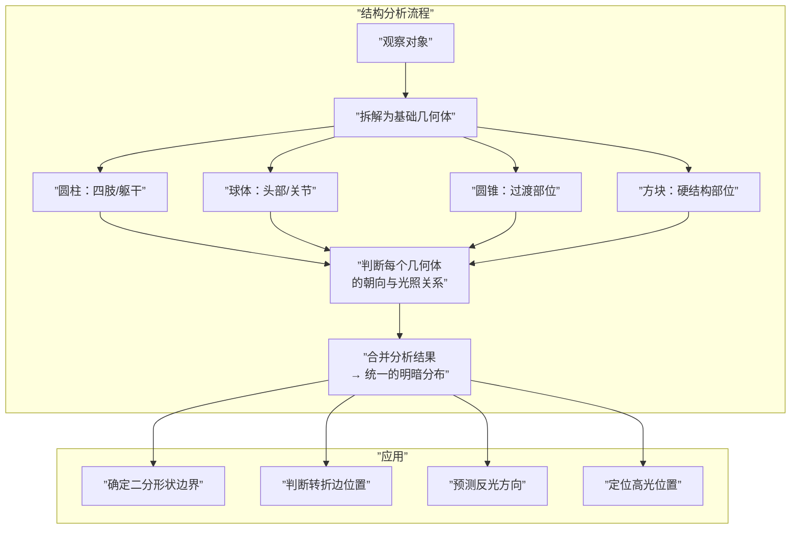
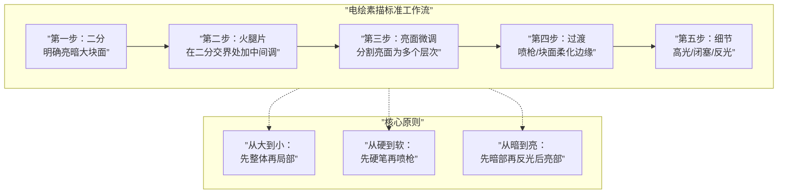

# 第07课：结构分析与几何体概括

## Learning Objectives

- 掌握基础几何体分析法（圆柱/球体/圆锥在人体中的应用）
- 区分素描两大流派：铅笔排线流 vs 油画块面流
- 理解灰面的两种表现手法：厚涂块面 vs 二次元喷枪
- 掌握电绘素描"从大到小"的块面工作流
- 理解结构与透视的统一性
- 认识石膏训练到实战的转移方法

## Core Idea

结构分析是一切光影和色彩的基础。没有结构理解，二分形状不可能干净，边缘控制不可能准确，色彩更不可能有逻辑。**结构的上限决定画面的上限。**

### 基础几何体分析法

将复杂人体/物体拆解为**基础几何体**是结构分析的第一步。这不仅是"简化"，更是理解光照如何在不同表面上分布的唯一方法。

| 几何体 | 对应人体部位 | 明暗分布规律 | 常见错误 |
|--------|-------------|-------------|----------|
| **圆柱** | 手臂、腿、手指、脖子、躯干（简化） | 明暗交界线沿长轴平行，亮面在圆柱最高处 | 把圆柱画成棱柱（转折太硬） |
| **球体** | 头部、关节（肩/膝）、乳房、腹部 | 弧形明暗交界线，高光在光源方向3/4处 | 高光位置不对（球体高光不是正中心） |
| **圆锥** | 脚踝过渡、指尖、下巴 | 明暗交界线从窄到宽渐变 | 忽略圆锥的对称性 |
| **长方体** | 手指关节、建筑、机械 | 平面转折，明暗分界清晰锐利 | 转角缺少中间调过渡 |

### 素描技法两大流派

| 流派 | 起源 | 核心技法 | 特点 | 适合画风 |
|------|------|---------|------|---------|
| **铅笔排线流** | 学院派素描 | 用排线（Hatching/Cross-hatching）表现调子 | 精细可控，适合长时间打磨 | Type 4 光滑渲染 |
| **油画块面流** | 印象派/直接画法 | 用块面笔触直接铺色，一刀定调子 | 概括力强，适合快速捕捉 | Type 3 半厚涂 |

> [!TIP] Key Insight
> 两种流派没有优劣之分，只是**概括策略不同**。排线流适合需要长时间打磨的精细素描，块面流适合需要快速捕捉光影的速写/厚涂。**电绘的优势是可以混合两者**——用块面快速确定结构，用喷枪做细腻过渡。

### 灰面的两种主流表现手法

灰面（中间调/过渡区域）是画面体积感的关键。两种主流手法：

| 手法 | 方法 | 视觉效果 | 学习难度 | 代表风格 |
|------|------|---------|---------|---------|
| **厚涂块面** | 用硬笔一刀一刀切割灰面，每个面片代表一个方向转折 | 棱角分明，有"雕刻感" | 高（需要空间想象力） | Type 3 半厚涂 |
| **二次元喷枪** | 先用硬笔确定亮暗二分，喷枪在边界做柔和过渡 | 光滑细腻，过渡自然 | 中（需要控制笔压） | Type 2 二次元 |

> [!WARNING]
> 初学者常见问题：**跳过二分直接做灰面过渡**。灰面必须在二分准确的前提下进行——二分错了，灰面再细腻也救不了。

### 电绘素描工作流：从大到小的块面

逐步说明：

1. **二分**：先用大笔刷（对应物体大小的70%）切割亮暗两大块
2. **火腿片**：在明暗交界处添加中间调层——这是产生体积感的核心步骤。详见 [汉堡牌技法](lessons/0015-hamburger-method)。
3. **亮面微调**：亮面内部分为多个明度层次（亮中亮、高光等）
4. **过渡**：用喷枪或揉擦工具柔化硬边（注意：只柔化该柔化的边）
5. **细节收尾**：加入高光、闭塞阴影、反光

> [!TIP] Key Insight
> 电绘的关键优势是**无破坏的层叠**（Non-destructive Layering）。传统素描画错了要擦掉重来，电绘可以在上方新建图层调整。这意味着你可以更大胆地试用不同方案——先用块面放胆画，再精细化。

### 结构与透视的统一

> [!QUOTE]
> **结构素描 = 透视。** Geometry（几何结构）和 Perspective（透视）不是两件事——透视就是结构在空间中的正确表达。

关键认知：
- 圆柱的两端是椭圆（透视缩短）
- 球体没有透视变形，但明暗交界线的弧度受光源位置影响
- 人体的每个几何体都有各自的透视，合并时必须在同一空间坐标系中
- **画结构就是在画透视**——不理解透视的结构是"平"的

### 石膏训练到实战的转移

石膏训练是连接结构分析和实战绘画的桥梁。

> [!EXAMPLE] 转移三步法
> 1. **石膏阶段**：画几何石膏体（纯白，单一光源，无色彩干扰）
> 2. **静物阶段**：画日常物品（保留几何体意识但增加细节和材质）
> 3. **人体阶段**：将几何体分析应用到人体（把手臂当圆柱，头当球体）

每次转移的关键：**保留几何体分析的习惯**。即使画到人体也要在心中做圆柱/球体拆解。

详见 [第11课：白石膏法](lessons/0011-white-plaster-method) 了解更多关于石膏训练的内容，以及 [HSB色彩量化系统](reference/hsb-color-system) 了解如何将结构分析与色彩结合。

> [!QUESTION] Self-check
> 1. 圆柱体的明暗交界线是什么形状？球体的呢？
> 2. 素描的两大流派分别是什么？
> 3. 灰面的两种表现手法及其代表风格？
> 4. 电绘素描工作流的五个步骤是什么？
> 5. 为什么说"结构素描=透视"？

查看答案

1. **圆柱体的明暗交界线**是沿长轴的两条平行线；**球体的明暗交界线**是弧形曲线，包围着高光区域。
2. **铅笔排线流**（学院派，精细可控）和**油画块面流**（印象派/直接画法，概括力强）。
3. **厚涂块面**（硬笔切割，对应Type 3半厚涂）和**二次元喷枪**（硬笔加喷枪过渡，对应Type 2二次元）。
4. 二分 → 火腿片 → 亮面微调 → 过渡 → 细节收尾。核心原则：从大到小、从硬到软、从暗到亮。
5. 因为**透视就是结构在空间中的正确表达**。不理解透视就无法确定几何体在空间中的朝向和形状，也就无法画出准确的结构。

## Practice

1. **几何体组合练习**：找一张人体照片，用几何体简化法将人体拆解为圆柱+球体+圆锥的组合
2. **流派对比**：用同一张石膏像，分别用排线法和块面法各画一张，观察差异
3. **灰面练习**：在二分的基础上，分别用厚涂块面和喷枪过渡两种方式表达灰面，比较效果
4. **透视检查**：画一组透视圆柱（手臂+躯干），检查所有椭圆端面是否在同一透视体系中

## Next Step

完成几何体分析练习后，进入 [第08课：风格分类与自我定位](lessons/0008-style-classification)，学习T1-T4风格体系——结构是你"能画什么"的基础，风格是你"想画什么"的选择。