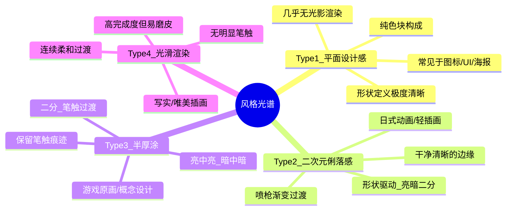

# 第08课：风格分类与自我定位

## Learning Objectives

- 理解 T1-T4 四种风格类型的核心特征与渲染逻辑
- 掌握"形状与调子反比关系"，能够分析一张图在风格光谱中的位置
- 建立"风格滤网"思维：针对不同风格分配不同的技能权重
- 能够通过自我觉察，定位当前自身在风格光谱中的位置

## 认知升级：看到风格，而不是"好"或"不好"

初学者看画时，最容易掉入的陷阱是**用好不好看评价一切**。进阶的第一步是**用风格分类来取代审美评价**——不是"这张画得真好"，而是"这张使用的是 Type 3 半厚涂，重点在笔触叠加和暗中暗"。

一旦你建立了风格滤网，就会惊觉以前忽略的大量模式：

- 为什么有些图明明调子很少却很好看？**因为 Type 1 的强项在形状设计**
- 为什么有些图"磨皮感"很重？**因为 Type 4 的连续过渡牺牲了形状锐度**
- 为什么自己怎么画都"灰"？**可能你是 Type 2 底子用了 Type 4 的过渡方式**

> [!TIP] Key Insight
> 风格没有优劣。高手不是"画得更好"，而是**知道自己正在使用哪种风格**，并且能按需要切换。

## 风格光谱：T1 到 T4



### T1 — 平面设计感（Flat Design）

特征：几乎没有光影渲染，靠纯色块的形状和配色来传递信息。

| 属性 | 说明 |
|---|---|
| 调子数量 | 1-2 级（固有色 + 偶尔暗面） |
| 形状定义 | 极强：边缘完全由形状边界决定 |
| 常见领域 | 图标、UI、海报、扁平插画 |
| 技能侧重 | 形状设计、配色构成 |

### T2 — 二次元俐落感（Anime Clean）

特征：形状驱动，亮暗二分清晰，喷枪做柔和渐变，边缘干净利落。

| 属性 | 说明 |
|---|---|
| 调子数量 | 3-5 级（亮/暗/若干过渡） |
| 形状定义 | 强：二分形状清晰可辨 |
| 过渡方式 | 喷枪柔边、渐变 |
| 技能侧重 | 二分提取、形状设计、边缘控制 |

### T3 — 半厚涂（Semi-Impasto）

特征：保留二分结构，但用笔触叠加做过渡。亮中亮、暗中暗层次丰富。

| 属性 | 说明 |
|---|---|
| 调子数量 | 5-8 级 |
| 形状定义 | 中等：笔触会模糊形状边界 |
| 过渡方式 | 笔触叠加、涂抹混合 |
| 技能侧重 | 笔触控制、明度五阶、结构理解 |

### T4 — 光滑渲染（Smooth Rendering）

特征：连续柔和过渡，无明显笔触，追求"照片级"完整度。

| 属性 | 说明 |
|---|---|
| 调子数量 | 8+ 级（连续渐变） |
| 形状定义 | 弱：过渡区域模糊了形状边界 |
| 过渡方式 | 喷枪/模糊工具、取色过渡 |
| 技能侧重 | 色彩感觉、连续调子控制 |

> **注意**：T4 的"磨皮"风险在于——当连续过渡失去了形状结构的支撑，画面就会显得"滑而无骨"。

## 核心原理：形状与调子的反比关系

**一张图中，调子（Tone）的数量越多，形状（Shape）的定义强度就越弱。**

这二者之间存在此消彼长的零和关系：

```
调子多 ──────────── 调子少
  │                    │
  形状弱              形状强
  │                    │
  T4 ── T3 ── T2 ── T1
```

- Type 1：调子极少，每个色块都是清晰有力的形状
- Type 2：亮暗二分形状明确，过渡区有限
- Type 3：笔触叠加增加了调子，削弱了形状锐度
- Type 4：连续调子最多，但形状边界最模糊

> [!important]
> 这解释了为什么**不要拿 T4 的标准去要求 T2**，反之亦然。每一种风格都是一组**技术参数的取舍**，而不是"更高/更低级的阶段"。

## 风格滤网与技能加点

不同风格对技能参数的权重完全不同。可以把技能当作一个**加点系统**：

| 技能 | T1 权重 | T2 权重 | T3 权重 | T4 权重 |
|---|---|---|---|---|
| 形状设计 | ⭐⭐⭐⭐⭐ | ⭐⭐⭐⭐ | ⭐⭐⭐ | ⭐⭐ |
| 二分提取 | ⭐ | ⭐⭐⭐⭐⭐ | ⭐⭐⭐⭐ | ⭐⭐⭐ |
| 边缘控制 | ⭐⭐⭐⭐ | ⭐⭐⭐⭐⭐ | ⭐⭐⭐ | ⭐⭐ |
| 明度五阶 | ⭐ | ⭐⭐⭐ | ⭐⭐⭐⭐⭐ | ⭐⭐⭐⭐ |
| 笔触控制 | ⭐ | ⭐⭐ | ⭐⭐⭐⭐⭐ | ⭐⭐⭐ |
| 色彩变化 | ⭐⭐ | ⭐⭐⭐ | ⭐⭐⭐⭐ | ⭐⭐⭐⭐⭐ |

> 如果你想做 T2 + T3 混合（这是很多游戏原画的标配），那就需要同时点高"二分提取"和"明度五阶"——在清晰形状的基础上叠加丰富的笔触层次。

## 卡牌游戏隐喻：每个技法是一张卡牌

整个课程中，我们将每一个技法视为一张**可组合的卡牌**：

- 🃏 **二分提取卡**：快速建立光影结构
- 🃏 **喷枪渐变卡**：柔化过渡，增加细腻感
- 🃏 **笔触叠加卡**：制造材质感和厚涂幻觉
- 🃏 **连续过渡卡**：极致细腻的光滑渲染
- 🃏 **长色藏色卡**：在保持素描关系的同时增加色彩信息

高手不是"所有卡牌都满级"，而是**知道在什么风格中，打出什么卡牌组合**。

> 更多卡牌信息参见 [卡牌系统速查](reference/card-system)

## 自我定位练习

### 练习1：风格识别

找三张你喜欢的插画，按以下格式分析：

1. 这张图的调子大致有几个层级？（1-2 / 3-5 / 5-8 / 8+）
2. 形状边界是清晰、部分模糊、还是几乎全部模糊？
3. 过渡方式是喷枪渐变、笔触叠加、还是连续取色过渡？
4. 根据以上信息，归入 T1-T4 中的哪一类型？

### 练习2：自评

> [!QUESTION] Self-check：你的当前风格
> 回答以下问题，找到你自己在光谱中的位置：
>
> 1. 你画图时最舒服的调子层级是几个？
> 2. 你是否依赖喷枪来做过渡？
> 3. 你更在意"形状好看"还是"颜色丰富"？
> 4. 你害怕画面"太灰"吗？如果是，可能你倾向 T2/T3 而非 T4。
>
> <details>
> <summary>风格倾向指引</summary>
>
> - **选 T1**：适合做插图构成/UI/平面视觉，建议加强形状设计与配色
> - **选 T2**：适合日式插画/漫画/动画风，建议精进二分提取与边缘控制
> - **选 T3**：适合游戏原画/概念设计，建议强化笔触与明度五阶控制
> - **选 T4**：适合写实/唯美插画，需要特别注意不要牺牲结构基础
> - **T2+T3 混合**：这是很多职业画师的日常状态，建议先稳固 T2 的二分基础，再加入 T3 的笔触层次
> </details>

## 下一步

当你明确了自己的风格定位，就可以有针对性地进入 [[0009-material-rendering|下一课：材质表现与明度控制]]，学习不同材质的光影表现技法，这将帮助你在当前风格基础上增加材质的真实感。