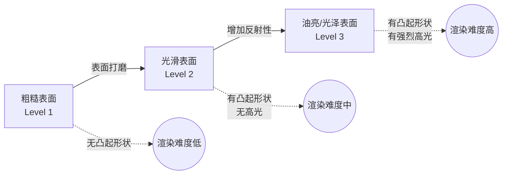
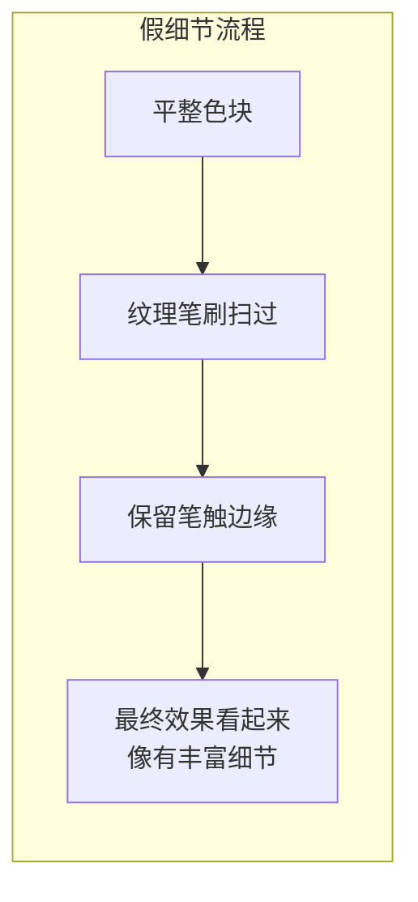

# 第09课：材质表现与明度控制

## Learning Objectives

- 区分凸起（Protrusion）与高光（Highlight）在渲染中的不同角色
- 掌握材质表现的三层次递进体系
- 理解明度五阶控制并将 HSB 坐标量化用于明度判断
- 学会用"假细节"技法制造厚涂幻觉

## 凸起 vs 高光：两个容易被混淆的概念

在材质渲染中，最常见的混淆是把**凸起（Protrusion）** 和**高光（Highlight）** 当成一回事。但它们在光学逻辑上是完全不同的：

| 概念 | 机制 | 位置 | 依赖条件 |
|---|---|---|---|
| **凸起（Protrusion）** | 表面凹凸结构形成的遮挡/受光差异 | 跟随形状结构，在突起上部受光、下部阴影 | 只要有方向光源就有，不限材质 |
| **高光（Highlight）** | 光线在光滑表面上的镜面反射 | 光源在表面上的反射角位置，通常为亮斑 | 表面必须足够光滑才有 |

简单记忆：

- **凸起是"形状问题"**——即使是粗糙砖墙，凸出的砖角也会亮一些
- **高光是"材质问题"**——只有光滑/油亮表面才会出现高光

> 一把刷了清漆的木椅，椅腿的圆柱凸起面有明亮的**高光**；而一把没上漆的原木椅，椅腿的凸起处只有柔和的**亮度提升**，没有高光。

## 材质表现三层次

### Level 1：粗糙表面

特征：无突起形状可见，无高光。

| 属性 | 说明 |
|---|---|
| 表面 | 漫反射为主，光线向各个方向均匀散射 |
| 凸起形状 | 不显现（被粗糙表面打散） |
| 高光 | 无 |
| 典型材质 | 粗布、未打磨石材、哑光纸、粗陶 |
| 渲染方式 | 固有色+二分即可，不需要额外高光层 |

### Level 2：光滑表面

特征：有突起形状可见，但无强烈高光。

| 属性 | 说明 |
|---|---|
| 表面 | 有一定反射性，能看到表面起伏 |
| 凸起形状 | 显现——突起面亮、凹陷面暗 |
| 高光 | 无或极弱（表面不够镜面） |
| 典型材质 | 磨砂塑料、亚光漆面、皮肤（轻微油光除外）、布料 |
| 渲染方式 | 二分+凸起面的亮度过渡，即可表现光滑感 |

### Level 3：油亮/光泽表面

特征：突起形状可见 + 强烈高光。

| 属性 | 说明 |
|---|---|
| 表面 | 镜面反射成分高 |
| 凸起形状 | 明显显现 |
| 高光 | 明显——在反射角位置出现白色/亮色光斑 |
| 典型材质 | 陶瓷、金属、玻璃、湿润表面、皮质、清漆木器 |
| 渲染方式 | 二分 + 凸起过渡 + 高光点/高光区域 |



> [!TIP] Key Insight
> 画面丰富度不一定来自"高光"。很多好看的图只用了 Level 1 或 Level 2 的材质——真正重要的是**材质的一致性**：在一张图中不要混用材质逻辑。

## 明度五阶控制

要精确控制材质表现，首先需要能**精确控制明度**。将灰度/明度划分为五个等级：

```
白 ──── 浅灰 ──── 中灰 ──── 深灰 ──── 黑
 0%      25%      50%      75%      100%
```

| 阶 | 名称 | 灰度值 | HSB-B（明度） | 用途 |
|---|---|---|---|---|
| 1 | 白 | 0% 黑 | 90-100% | 高光、最亮面、发光区域 |
| 2 | 浅灰 | 25% 黑 | 65-85% | 亮面、受光面固有色 |
| 3 | 中灰 | 50% 黑 | 40-60% | 中间调、过渡区、固有色 |
| 4 | 深灰 | 75% 黑 | 20-35% | 暗面、阴影区域 |
| 5 | 黑 | 100% 黑 | 0-15% | 闭塞阴影、最深阴影 |

### 明度坐标量化法（HSB 坐标估测）

引入 [HSB色彩量化系统](reference/hsb-color-system) 的思维——不要凭感觉判断明度，而是用 HSB 坐标来量化：

1. 打开你的取色器（或 PS 的 Color Picker）
2. 将 H（色相）和 S（饱和度）暂时设为 0
3. 只看 B（明度）值：B=100 是纯白，B=0 是纯黑
4. 训练自己：看到一张图，能预估出每个区域的 B 值范围

**练习方法**：在完成一张图的二分后，用取色器检查暗面和亮面的 B 值，确保它们落在正确的五阶区间内。

> 更完整的 HSB 坐标训练方法参见 [HSB色彩量化系统](reference/hsb-color-system)

## 假细节/纹理：用笔触制造"厚涂"幻觉

对于 T2 风格或初学者，"假细节"是一个高效提升画面完成度的技巧。

### 什么是假细节

不是真正画出每一条材质纹理，而是**通过笔触的纹理（Brush Texture）和变化来暗示细节**。

### 方法

1. **使用带纹理的笔刷**：在亮面和暗面的过渡区，用带噪点/颗粒感的笔刷扫过
2. **制造"笔触边缘"**：不把过渡抹平，保留笔触痕迹，看起来就像有丰富的表面细节
3. **叠加噪点层**：在画面上方叠一个噪点/颗粒图层（模式用叠加或柔光），可瞬间增加材质感
4. **高光不一定是纯白**：Level 3 的高光可以是浅灰到白的渐变，过于纯白的高光反而不真实



## 白石膏画法简介

白石膏画法是 [[0011-white-plaster-method|第11课]] 的完整内容，这里先提核心逻辑：

> 把被画对象设想成**白色石膏**——暂时忽略固有色和色彩，只解决**明度关系**和**形状结构**。

这种做法有两个好处：

- 排除色彩干扰，专注训练明度五阶控制
- 白石膏材质是 Level 2 的典型代表（有凸起形状、无高光），是做材质练习的理想起点

## 实践练习

> [!QUESTION] 材质辨别练习
>
> 找出 3 张参考图，分别对应 Level 1 / Level 2 / Level 3 材质，分析它们的：
>
> 1. **明度五阶分布**：画面上最亮到最暗分别落在哪一阶？
> 2. **凸起表现**：哪里有凸起面的亮度变化？
> 3. **高光有无**：是否有明显的高光点/区域？

<details>
<summary>参考答案指引</summary>

- Level 1 示例：牛仔裤、粗毛衣、哑光墙面——只有二分，无明显亮度凸起结构
- Level 2 示例：人像面部（非油性皮肤）、磨砂手机壳——有颧骨/鼻梁的凸起过渡，但无镜面高光
- Level 3 示例：陶瓷杯子、金属勺子、湿润嘴唇——有明显的白色/亮色高光斑块
</details>

### 实操任务

1. 画一个球体，分别用 Level 1 / Level 2 / Level 3 的材质表现渲染
2. 用 HSB 取色验证每个版本的明度五阶分布
3. 打开 [HSB色彩量化系统](reference/hsb-color-system) 参考文档，做一次 5×5 坐标取色训练

## 下一步

完成材质练习后，进入 [[0010-color-variation|第10课：长色技法与色彩变化]]，学习如何在保持素描关系不变的前提下，为你的画面注入丰富的色彩信息。