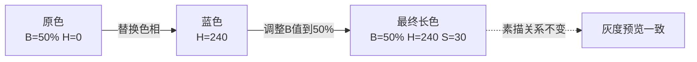
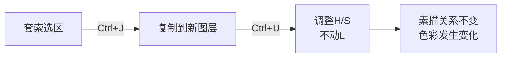

# 第10课：长色技法与色彩变化

## Learning Objectives

- 理解长色（Color Variation）的核心定义：素描关系不变的色彩替换
- 掌握"高级灰即长色技法"的认知
- 学会两条保持素描关系的路径
- 掌握暴力套索+色彩平衡工作流

## 长色/混色：最被低估的色彩技法

"长色"这个词可能让你陌生，但几乎所有高手都在用。它的定义极其简单：

> **长色 = 在保持素描关系（灰度值）的前提下，替换色相或调整饱和度，增加色彩信息量。**

换一种说法：**让一个色块不再只有一种颜色，但它的亮暗关系看起来完全没变。**

### 长色的目的

| 目的 | 说明 |
|---|---|
| 增加色彩信息量 | 一块灰色皮肤 + 微妙的黄/紫/红变化 → 更"耐看" |
| 打破单调 | 避免大面积平涂色块的"塑料感" |
| 制造高级灰 | 高级灰不是"灰蒙蒙"，而是灰度稳定下的丰富色相变化 |
| 提升完成度 | 长色做得好，画面会自然显得"画完了" |

> **高级灰 = 长色技法。** 所谓"高级灰"不是把颜色调灰，而是**在一个稳定的灰度区间内，做丰富的色相变化**。

## HSB 坐标判断：长色的前置技能

做长色之前，你必须能判断"两种颜色的素描关系是否相同"。

这就是 [HSB色彩量化系统](reference/hsb-color-system) 中最重要的技能：**只看 B（明度/Brightness）值，忽略 H（色相）和 S（饱和度）。**

### 同等级色相先天明度差异

不同色相即使"看起来差不多亮"，在灰度模式下的 B 值可能差异巨大：

```
黄色    → B 值天生高（很亮）
橙色    → B 值中高
红色    → B 值中等
蓝色    → B 值天生低（很暗）
紫色    → B 值中低
```

> 这意味：如果你在暗面直接用蓝色替换灰色，暗面会变得更暗，素描关系就崩了。**需要先提高蓝色的 B 值，让它和被替换区域的灰度一致。**

## 混色时素描关系保持的两条路径

做长色时，有两种方式保证素描关系不变：

### 路径 A：等灰度替换

1. 取原区域的灰度值（例如 B=50%）
2. 选择目标色相（例如蓝色）
3. 调整目标色的 B 值到 50%，同时调整 S 到合适的饱和度
4. 替换 → 素描关系不变



### 路径 B：色相后再调整 B

1. 直接画入目标色相（不管 B 值）
2. 用色相/饱和度或曲线工具，单独调整该区域的 B 值到目标范围
3. 确认前后灰度一致

两种路径效果相同，取决于你更习惯哪种操作。

## 长色位置：在哪里做长色？

不是所有地方都需要长色。以下是最佳"藏色"位置：

| 位置 | 说明 | 示例 |
|---|---|---|
| 明暗交界线 | 亮暗转换的区域，色彩最容易做文章 | 在交界线加入紫/蓝色冷调 |
| 突起边缘 | 物体形状边缘 + 突起处 | 鼻翼边缘藏一点红/紫色 |
| 高光边缘 | 高光与亮面的交界 | 高光周围藏冷色或互补色 |
| 平坦色块表面 | 大面积同色区域，避免单调 | 在皮肤大面积亮面加不同冷暖的色块 |
| 轮廓边缘 | 物体与背景交界处 | 用环境色影响轮廓 |

> [!TIP] Key Insight
> Krenz 有一个著名的比喻：**长色就像往画面上扔"葡萄糖鼻屎"**——小小的、不破坏形状的色彩斑块，但正是这些斑块让画面"有营养"。

## 暴力套索 + 色彩平衡长色法（详细步骤）

这是最直接、最容易控制的长色技法。

### 步骤

1. **建立选区**：用套索工具（Lasso Tool / L）圈出你想要做长色的区域（例如整个暗面）
2. **羽化边缘**：Shift + F6，羽化 3-10 像素（取决于画布大小），让边界过渡自然
3. **打开色彩平衡**：Ctrl + B（Mac: Cmd + B）
4. **调整色调**：
   - 阴影（Shadows）：加蓝/紫 → 冷化暗部
   - 中间调（Midtones）：加黄/红 → 暖化亮部
   - 高光（Highlights）：加青/冷色 → 丰富高光色彩
5. **根据需要重复**：圈选不同区域，做不同的色彩偏移，形成冷暖对比

### 优点

- 精准控制——只在选区内做变化，不影响形状
- 可反复调整——色彩平衡的调整是弹性的
- 快速出效果——几秒内就能看到"灰度不变但色彩丰富"的效果

## 套索 + Ctrl J + Ctrl U 局部化妆法

另一种更精细的长色方式，适合局部调整：

1. 用套索圈选目标区域（例如脸颊的一小块）
2. **Ctrl + J**（Cmd + J）：将选区复制到新图层
3. **Ctrl + U**（Cmd + U）：打开色相/饱和度
4. 只调整 **H（色相）** 和 **S（饱和度）**，不动 **L（明度）**
5. 这时素描关系自动保持（因为明度没变），你只是在"给局部化妆"



## 单色素描后置安全长色法

这是最安全的做法——**先做完完整的灰度素描，再做长色**：

1. 用单一灰色完成整张画的素描（二分、过渡、细节全用灰度）
2. 确认素描关系完美
3. 在灰度图层上方新建图层，模式设为**颜色（Color）**
4. 在这个图层上涂色 → 下方的灰度值完全不受影响
5. 尽情做色相变化，素描关系纹丝不动

> 这个方法虽然安全，但需要你对"如何在灰度上叠加颜色"有经验，否则容易色彩发闷。建议和 [[0011-white-plaster-method|白石膏法]] 配合使用。

## 长色卡牌

以下技法卡牌可以在不同场景下组合使用：

| 卡牌名 | 使用场景 | 操作方式 |
|---|---|---|
| **明暗交界线藏色** | 暗面转亮面的交界区 | 套索圈选 → 色彩平衡加冷/暖 |
| **突起边缘藏色** | 形状结构凸起的边缘 | 小笔刷直接画入 + 混合模式 |
| **高光边缘藏色** | 高光与亮面的交界 | 在高光边缘画互补色薄层 |
| **套索化妆** | 任何需要局部变色处 | 套索+Ctrl+J+Ctrl+U |
| **颜色图层叠加** | 整张画的后期色彩调整 | 新建颜色模式图层 + 涂色 |

> 更多卡牌组合策略见 [卡牌系统速查](reference/card-system)

## 实践练习

> [!QUESTION] 长色演练
>
> 1. **HSB 判断训练**：找一张图，用取色器采样 10 个颜色，写出每个颜色的 H/S/B 值。然后仅看 B 值排序，判断它们在灰度下的深浅关系是否正确。
>
> 2. **套索长色实操**：
>    - 打开一张你已完成二分的图
>    - 用套索圈选暗面
>    - Ctrl+B 色彩平衡在暗面加入冷色调
>    - 用蒙版擦掉不想要的区域
>
> 3. **对比验证**：将做长色前后的图转为灰度模式，确认两张图的灰度值完全一致。

<details>
<summary>完成标准</summary>

- 能够熟练使用取色器品读任何颜色的 B 值
- 能在一张已完成二分的图上快速做长色
- 灰度预览下看不出长色痕迹——这意味着素描关系保持完美
</details>

## 下一步

完成长色练习后，正式进入光照系统模块，学习 [[0011-white-plaster-method|第11课：白石膏法]]——把被画对象假想为白色石膏，先解决素描关系，再在此基础上叠加色彩。这是长色技法的终极应用模式。