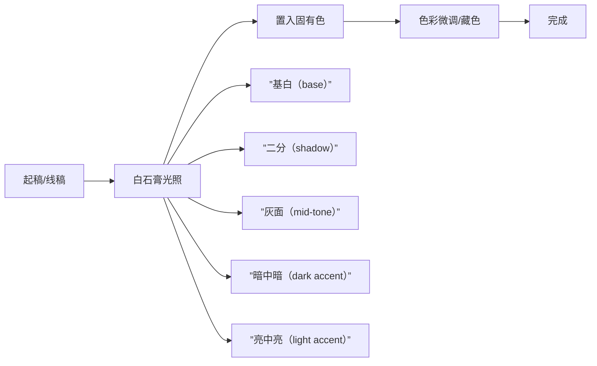
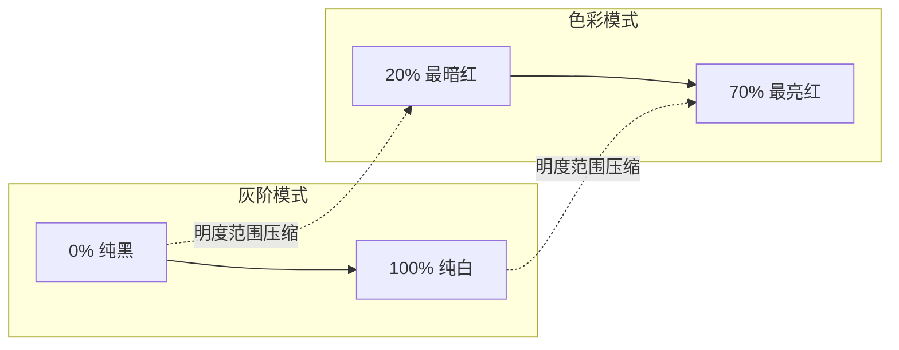

# 第11课：白石膏法

## 概述

白石膏法是本课程最核心的绘制方法论之一。它的本质是**将光照技能与色彩设计技能彻底分离**——先不管固有色是什么，把对象当作白色石膏来画光照，然后再置入固有色信息。

这一思路脱胎于传统学院派的素描训练：如果你能用碳笔把石膏像画好，就等于掌握了光影逻辑的底层能力。把颜色加上去，只是一个叠加步骤而已。

## 白石膏法核心流程

## 五层汉堡系统

在白石膏阶段，我们用五层灰度来概括所有光照信息。这五层对应[[0015-hamburger-method|汉堡牌画法]]中的"面包与肉饼"——每一层独立控制，互不干扰。

| 层级 | 名称 | 功能 | 明度参考 |
|------|------|------|----------|
| Layer 1 | 基白（Base） | 物体的基本固有色（石膏白） | ~80% |
| Layer 2 | 二分（Shadow） | 主光源产生的阴影区域 | ~40% |
| Layer 3 | 灰面（Mid-tone） | 介于亮暗之间的过渡区域 | ~60% |
| Layer 4 | 暗中暗（Dark Accent） | 闭塞阴影/环境光遮蔽 | ~20% |
| Layer 5 | 亮中亮（Light Accent） | 高光/直接反射 | ~95% |

> [!TIP] 五层不一定是五层
> 4-5个调子就可以做出非常有体感的石膏。**石膏速写训练的目标就是用最少的调子概括最丰富的光照信息**。这是碳笔素描精神的数字化延续。

## 由大到小的绘制流程

白石膏法必须遵循**由大到小**的顺序：

1. **先大后小**：先铺大的亮暗二分，再收小形状
2. **先软后硬**：先大笔触铺色，再用小笔收形
3. **先光后色**：先解决光照结构，再考虑固有色变化

> [!WARNING] 常见错误
> 很多人在白石膏阶段就开始想"这个物体是什么颜色"，结果光照还没建立就陷入色彩细节。**只要分心去照顾固有色，光照质量必然下降。**

## 二分形状升级策略

白石膏法的重要技巧：**强化明暗交界线（core shadow），代替内部细节塑造**。

传统的二分做法是画完亮暗后，在亮面内部刻画细节。但白石膏法的思路不同——与其在亮面里做文章，不如把精力花在**让明暗交界线的形状更精准、更具表现力**上。

具体策略：
- 用硬边笔刷强化交界线的形状变化
- 交界线的宽窄变化可以暗示材质的软硬
- 交界线的节奏变化可以增强画面的生动性

## 固有色置入策略

白石膏法有两种置入固有色的策略：

### 策略A：光照前置入（先画固有色，后做光照）

适用于**固有色强烈**的场景（如红色披风、蓝色铠甲）。先用平涂铺固有色，然后在固有色上压暗提亮。

### 策略B：光照后置入（先画石膏，后改变色相）

适用于**光照复杂**的场景（如多光源、强氛围光）。先画好白石膏的光照结构，然后用「色相/饱和度」调整层或「渐变映射」来置入固有色。

> [!EXAMPLE] 实战建议
> 大多数情况下推荐**策略B**。它让你在光照阶段完全不被颜色干扰。当你把白石膏画到满意后，再用[HSB色彩量化系统](reference/hsb-color-system)分析石膏的明度分布，精确地转换色相。

## 灰阶转色彩的陷阱

这是白石膏法最常见的翻车点：**明度范围压缩**。

当你在灰阶模式下画石膏时，使用的是0%-100%的全明度范围。但一旦叠加固有色，颜色的明度范围会被压缩——比如饱和的红色最亮也只能到约70%明度。

**解决方法**：在白石膏阶段就刻意把亮暗对比压缩到目标颜色的明度区间内。比如目标色彩是低明度的深色物体，白石膏的亮部也只画到60%，而不是拉到100%。

## 抽乐透画法

抽乐透画法是白石膏法的进阶版本——用系统化的算法计算配色，而不是靠感觉选色。

具体做法：
1. 在白石膏上确定光照后，列出所有可能的色彩方案
2. 用[HSB色彩量化系统](reference/hsb-color-system)为每个色块指定精确的H/S/B坐标
3. "抽"出一组方案进行上色测试
4. 不满意则换一组参数重新"抽"

这种方法的优势在于**可复现性**——你不需要等待灵感，而是用算法穷举可能性。

## 九宫格矩阵作业

本课的课后训练是九宫格矩阵作业，一个 $3 \times 3$ 的交叉训练表：

| 光色\环境色 | 暖色环境 | 冷色环境 | 中性环境 |
|-------------|----------|----------|----------|
| **暖光** | 暖+暖（临近色方案） | 暖+冷（互补方案） | 暖+中（主导方案） |
| **冷光** | 冷+暖（互补方案） | 冷+冷（临近色方案） | 冷+中（主导方案） |
| **中性光** | 中+暖（主导方案） | 中+冷（主导方案） | 中+中（参考方案） |

每个格子画一个小色稿（thumbnail），用白石膏法流程，4-5个调子完成。完成后对比九个格子的差异，你会直观地理解光色与环境色如何共同决定最终画面色调。

## 石膏速写训练要点

- **工具**：炭笔或PS硬边笔刷
- **时间**：每张10-15分钟
- **调子数**：4-5个（严格限制）
- **训练目标**：概括能力，不是细节刻画能力
- **参考**：找石膏像照片或3D模型渲染图

> [!QUESTION] 自检清单
> 1. 你的白石膏阶段是否真的"完全没有考虑固有色"？
> 2. 你的五层调子是否能清晰区分？
> 3. 你的明暗交界线是否比上一次练习更精准了？
> 4. 固有色置入后，光照感是否被破坏？

## 下一步

完成九宫格矩阵作业后，进入[[0012-natural-light-system|第12课：自然光系统]]，学习如何为白石膏添加真实的自然光参数。