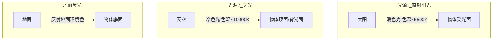

# 第12课：自然光系统

## 概述

自然光是最常见也最微妙的光源系统。与人工光源不同，自然光涉及**直射阳光、天光散射、地面反光**三重光源的叠加。理解自然光的逻辑，是户外场景和室内自然光场景的基础。

自然光的核心规律可以概括为一句话：**暖阳冷阴，上冷下暖**。

## 自然光双光源模型

自然光可以简化为两个主光源：

### 暖阳冷阴公式

| 部位 | 光源 | 色温倾向 | HSB近似值 |
|------|------|----------|----------|
| 直射面（阳面） | 太阳 | 暖黄/暖橙 | H30-50, S20-40 |
| 背光面（阴面） | 天光 | 冷蓝/冷紫 | H200-240, S15-30 |
| 底部反光 | 地面反射 | 取决于地面颜色 | 视环境定 |

> [!TIP] 关键记忆
> **暖阳冷阴**是自然光的核心口诀。即使场景中有其他颜色倾向，这个基本的冷暖对立关系是不变的。

## 上冷下暖反光公式

自然光下，物体表面的冷暖分布遵循**上冷下暖**的规律：

- **上半部分（受天光影响更多）**：偏冷
- **下半部分（受地面反光影响更多）**：偏暖（如果地面是暖色）或偏环境色

这个规律在人物面部尤其明显：
- 额头、鼻梁顶部：接收天光，偏冷
- 下巴、脖子下方：接收地面反光，偏暖

> [!WARNING] 天光影响的限制条件
> **当直射光强烈时，天光会被"覆盖"**。在正午烈日下，直射光极强，天光对受光面的影响几乎可以忽略不计。天光主要在**阴影区域和过渡区域**发挥作用。
>
> 换句话说：**直射光决定主色调，天光决定阴影色调**。不要在任何地方都加天光蓝色。

## 室内自然光场景

室内自然光比室外复杂，因为引入了**窗户作为光源面**：

| 室内位置 | 光色特点 | 色温倾向 |
|----------|----------|----------|
| 靠窗受光面 | 直射阳光（若有）+ 天光 | 暖或中性 |
| 远离窗的背光面 | 室内散射光为主 | 偏冷/偏暗 |
| 墙面/地面反光区 | 室内墙壁颜色的反射 | 取决于室内墙壁颜色 |

室内场景的处理技巧：
- 窗户是"面光源"，阴影边缘比室外更柔和
- 离窗越远，光线越冷越暗
- 室内墙面的颜色会渲染整个空间的环境色

## 光色参考法

这是自然光系统最重要的实操技巧：**通过画面中的白色物体或肤色来推断光照参数**。

### 用白色推断光色

白色物体是光线的最敏感探测器。如果你在画面中画一个白色物体：

- 如果它偏暖黄 → 光源偏暖
- 如果它偏冷蓝 → 光源偏冷
- 如果它偏灰 → 光源较弱或被环境色影响

> [!EXAMPLE] 实操方法
> 在画面中放置一个白色小球（或白布、白墙），通过它的颜色直接反推光源参数。这就是为什么很多概念设计师会在场景中刻意安排白色物体——它让光色有"锚点"。

### 用肤色推断光色

肤色的变化同样可以反映光色。自然光下的肤色规律：

| 光照条件 | 肤色倾向 | 参考HSB |
|----------|----------|---------|
| 暖阳直射 | 橙红调，饱和度升高 | H20-30, S40-60 |
| 天光阴影 | 蓝紫调，饱和度降低 | H240-270, S10-20 |
| 地面反光 | 绿色调（草地）/ 暖调（土地） | 视环境色而定 |

肤色是判断光色的绝佳参考，因为我们对肤色变化极其敏感——肤色颜色稍有不对，一眼就能看出来。

## 二分参考法：用3D模型辅助光照判断

如果你有3D基础（或使用3D辅助软件），可以在3D模型中快速验证自然光方案：

1. 在3D软件中建立简化模型（或导入现有模型）
2. 设置双光源：暖方向光（主光）+ 冷环境光（天光）
3. 调整光源角度和强度，观察二分的形状变化
4. 截图后导入PS，在上面叠色绘制

这种方法能帮你**预判光照形状**，避免在铺色阶段反复修改二分区域。

> [!TIP] 即使不用3D
> 没有3D软件也可以用手绘草图来模拟。关键是要在正式铺色之前，先画拇指大小的光照小稿（lighting thumbnail），确认二分布局。

## 本课小结

自然光系统的核心要点：

1. **暖阳冷阴**：直射阳光暖、阴影天光冷
2. **上冷下暖**：顶部受天光影响偏冷，底部受地面反光偏暖
3. **直射光覆盖天光**：非阴影区域不要加天光
4. **白色与肤色**是判断光色的最佳参考物
5. **二分参考法**：用3D模型或光照小稿预判明暗布局

## 实践任务

> [!QUESTION] 光色分析练习
> 找三张户外自然光下的人物照片，分别分析：
> 1. 受光面的色温倾向（在[HSB色彩量化系统](reference/hsb-color-system)中估算H值）
> 2. 阴影面的色温倾向
> 3. 底部反光的颜色倾向
> 4. 直射光与天光的强度比例
>
> 然后在PS中用白石膏法画一个头部的自然光色稿。

## 下一步

掌握自然光系统后，进入[[0013-color-training|第13课：色彩训练方法]]，学习如何系统化地提升色彩感知力和配色能力。