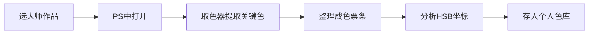
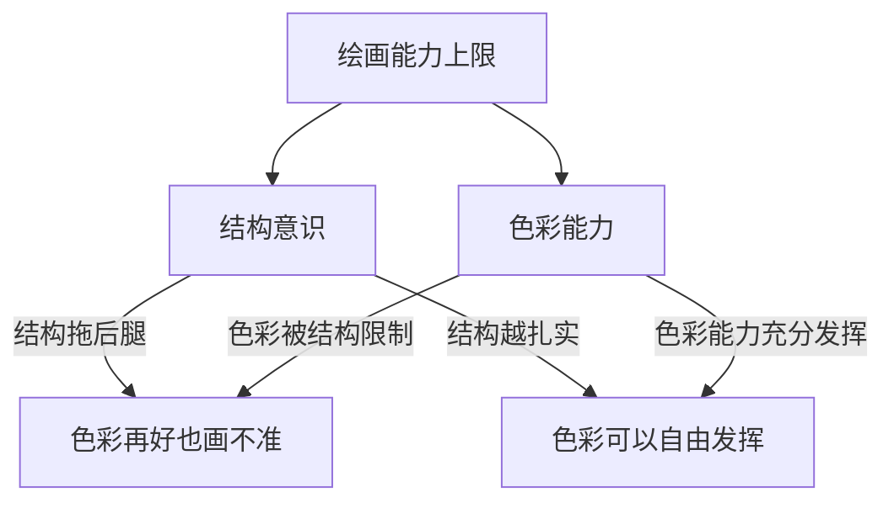

# 第13课：色彩训练方法

## 概述

色彩感觉是可以训练的，但前提是方法要对。本课不讲玄学，讲的是**可量化、可重复、可检验**的训练方法。这些方法从传统油画训练体系中来，经过数字绘画的改造，成为高效提升色感的手段。

色彩训练的两条腿：**输入的准度**和**输出的速度**。前者决定你能看出什么颜色，后者决定你能画出什么颜色。

## 色票积累：从油画中提取颜色组合

大师油画是色彩学习的最高范本。每张大师作品的配色都经过千锤百炼。

### 色票提取流程

具体操作：
1. 在PS中打开大师油画（建议：Sargent、Sorolla、Leyendecker、Zorn）
2. 用取色器从画面中提取5-15个关键色
3. 按从亮到暗排列成色票条
4. 用[HSB色彩量化系统](reference/hsb-color-system)记录每个颜色的H/S/B坐标
5. 分类存入个人色库（如"暖色调皮肤""冷色调夜景""金色氛围"等）

> [!TIP] 色票不是抄颜色
> 色票训练的关键不是复制颜色值，而是理解**为什么大师在这个位置用了这个颜色**。每次提取色票时，问自己三个问题：
> 1. 这个颜色的色相(H)为什么偏向这个方向？
> 2. 饱和度和明度(S/B)在这个场景中起什么作用？
> 3. 相邻两个色票之间的色彩关系是什么？

## 临摹油画Skin Tone的智能模糊法

这是临摹油画肤色最有效的方法：

### 操作步骤

1. 打开需要临摹的大师油画局部（最好是人像或肤色区域）
2. 在参考图上应用 **智能模糊（Smart Blur）** 或 **高斯模糊**
3. 模糊程度以能看到主要色块但看不到笔触细节为准
4. 用硬边笔刷在模糊图上"填色块"，还原色彩层次

### 为什么有效

智能模糊法淘汰了笔触噪音，让你**直接看到色彩的底层结构**。你看到的不是"某一块笔触是什么颜色"，而是"这个区域的色彩整体倾向是什么"。

> [!WARNING] 智能模糊的陷阱
> 模糊过度会丢失信息，模糊不够又会被笔触干扰。推荐的模糊参数：
> - 智能模糊：Radius 5-15, Threshold 30-60
> - 高斯模糊：Radius 10-30（按图片分辨率调整）
>
> 基本原则：模糊到能看清色块分区即可，不要模糊到看不出形状边界。

## 二分遮罩临摹降险法

这是临摹训练中的风险控制工具。具体做法：

1. 先对参考图做**二分提取**（见[[0005-binary-extraction|第05课：复形画法与二分提取]]）
2. 将二分提取作为**遮罩层**，固定明暗形状
3. 在遮罩的保护下，专注于色彩匹配
4. 将临摹结果与参考图叠在一起**反复对比修正**

这种方法把临摹的风险拆分成两个独立变量：
- **形状风险**（二分是否准确）→ 由遮罩控制
- **色彩风险**（颜色是否匹配）→ 由色彩匹配控制

一次只解决一个问题，效率远高于全凭感觉的临摹。

## 色彩选择的准度与速度："咒文咏唱"训练

"咒文咏唱"是一种针对色彩选择速度的训练，方法如下：

1. 打开一张参考图（照片或大师作品）
2. 用取色器随机在图上取一个颜色
3. **在脑海中先说出这个颜色的HSB坐标**（咒文咏唱）
4. 然后打开拾色器验证你的判断
5. 反复练习，直到你能在0.5秒内准确说出任意颜色的H值（误差±10以内）

| 阶段 | 训练目标 | 接受误差 | 练习量 |
|------|----------|----------|--------|
| 初期 | H值（色相）判断 | ±20 | 每天50次 |
| 中期 | H值+S值判断 | H±10, S±10 | 每天50次 |
| 后期 | H+S+B完整判断 | H±10, S±10, B±5 | 每天30次 |

## 从大师作品学色彩，从照片学灰阶

这是一个重要的学习原则：

| 学习目标 | 最佳素材 | 原因 |
|----------|----------|------|
| 色彩搭配 | 大师油画 | 大师对色彩进行了艺术化组织和提炼 |
| 明度/灰阶 | 照片 | 照片的明度分布真实且没有色彩干扰 |
| 光照逻辑 | 3D渲染/实景 | 物理正确的光照关系 |
| 笔触/质感 | 大师作品 | 笔触是艺术处理的精华 |

> [!TIP] 不要用照片学色彩
> 数码照片的色彩（尤其是手机照片）经过了白平衡和色彩压缩，色相信息并不准确。**用照片学色彩就像用转述来学原文**。照片的价值在于灰阶结构，而不是颜色。

## 结构意识是色彩训练的天花板

这是本课最重要的概念：**你的色彩水平受限于你的结构意识**。

为什么很多人临摹时候色感很好，一到原创就完全失控？因为临摹时结构已经被参考图解决了，你只需要处理颜色。但原创时，你需要同时处理结构和颜色——而你的大脑处理能力是有限的。

**明度控制与结构意识是两种不同的能力：**
- **明度控制**：在不同颜色中保持正确的亮度关系（如红色要比蓝色亮）
- **结构意识**：理解形体的转折和体积关系

两者缺一不可。如果你的色彩训练遇到了瓶颈，不妨回头检查一下结构基础。

## 两到三次颜色捕捉法

这是速涂（speed painting）中的色彩技巧：

**第一次捕捉**：铺大色，只抓每个区域的平均色。不在乎细节，只在乎整体色调的准确性。

**第二次捕捉**：在第一层的基础上，加入冷暖变化和色彩倾向。注意环境色和反光的影响。

**第三次捕捉（可选）**：对焦点区域进行色彩微调，加入"藏色"（见[[0010-color-variation|第10课：长色技法与色彩变化]]）。

> [!EXAMPLE] 实操
> 设定一个15分钟的速涂练习：
> - 前5分钟：第一次捕捉（铺大色）
> - 中间5分钟：第二次捕捉（加冷暖变化）
> - 最后5分钟：第三次捕捉（细节调整）
>
> 不准延长时间。每张严格控制在15分钟内。每天3-5张。

## 训练计划建议

| 周次 | 训练内容 | 每日时长 | 素材 |
|------|----------|----------|------|
| 第1周 | 色票积累 + HSB咏唱 | 30分钟 | 大师作品 |
| 第2周 | 智能模糊临摹 | 45分钟 | Sargent/Sorolla人像 |
| 第3周 | 二分遮罩临摹 | 45分钟 | Leyendecker/Mucha |
| 第4周 | 三次捕捉速涂 | 30分钟 | 照片→转化为色彩练习 |

> [!QUESTION] 训练日志自检
> 每次训练后记录：
> 1. 今天练习了哪个方法？
> 2. 色相判断准确率提高了多少？
> 3. 临摹时哪个颜色最难匹配？为什么？
> 4. 明天要在哪个方面做针对性训练？

## 下一步

系统训练色彩感知后，进入[[0014-foundation-drawing|第14课：基底绘法]]，学习在复杂画面中建立统一的色彩基底和氛围。