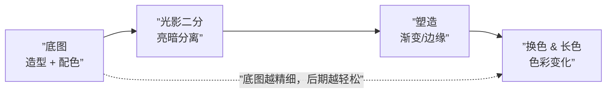
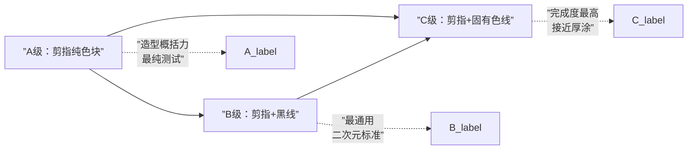
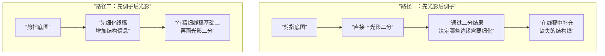
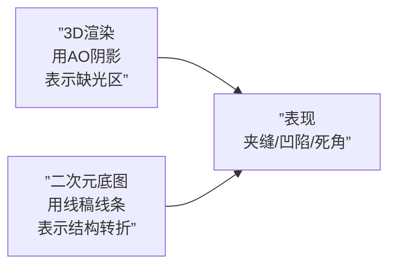

# 第14课：底图层次与风格选择

## 底图（Foundation Drawing）概念与重要性

**底图**是作画的第一步——它决定了画面的造型基础与配色骨架。很多同学以为底图只需要画出轮廓就够了，但实际上，底图的**信息密度**直接决定了最终画面的风格走向和完成度天花板。

> [!WARNING] 常见误区
> 不要把底图阶段当成「随便勾个线就完事」。底图的品质决定了后面所有阶段的上限——底图信息不足，后期再怎么调整光色也很难救回来。

---

## 剪指风格：最简底图

**剪指（Silhouette/Flat Color）风格**是最简单也最考验造型概括能力的底图形式：

| 要素 | 说明 |
|------|------|
| 线稿 | 无 |
| 上色 | 纯色块平涂，无明暗变化 |
| 边缘 | 完全依赖外轮廓识别造型 |
| 适合 | 练习造型概括力、初期配色测试 |

> [!TIP] 剪指底图的意义
> 去掉线稿后，画面必须靠色块之间的**形状对比**来区分不同物体。如果色块形状模糊，说明你对结构的理解还不够清晰。剪指训练是检验结构理解的最佳手段。

---

## 底图升级三步

从最简到精细，底图可以分为三个明确的升级等级：

### A 级：剪指纯色块（无任何线条）

- 只有色块，没有线稿
- 完全依赖色块边缘区分形体
- **耗时最短，信息量最少**

### B 级：剪指 + 黑线

- 在 A 级基础上添加黑色线稿
- 线稿帮助区分色块之间的边界
- **通用性最强，适合多数二次元风格**

### C 级：剪指 + 固有色线

- 在 A 级基础上添加**彩色线稿**
- 线色根据相邻固有色调整，更柔和自然
- **完成度最高，接近半厚涂效果**

> [!EXAMPLE] 风格与底图等级的对应关系
>
> | 画面风格 | 推荐底图等级 | 线稿类型 |
> |---------|-------------|---------|
> | Q版/萌系 | A级 或 B级 | 可无线，或细黑线 |
> | 标准二次元 | B级 | 黑色线稿，外轮廓略粗 |
> | 轻小说插画 | B级 或 C级 | 黑线为主，局部彩线 |
> | 半厚涂/韩系 | C级 | 固有色线为主 |
> | 纯厚涂 | 无明确线稿 | 以色块边缘取代线稿 |

---

## 线稿颜色选择法

如果你选择 B 级或 C 级底图，线稿的颜色不能随意。

**核心法则：线色 = 固有色往右下移 1 格**

在 [[0001-course-overview|HSB 5x5 网格]] 中：

| 固有色位置 | 线色位置 | 效果 |
|-----------|---------|------|
| (H, S50, B80) | (H, S40, B60) | 比底色暗，带有固有色倾向 |
| (H, S30, B90) | (H, S20, B70) | 柔和浅色线，适合高亮区域 |
| (H, S80, B40) | (H, S60, B20) | 深色线，适合暗色区域 |

- 饱和度降低约 **1 格（约 20%）**
- 明度降低约 **1 格（约 20%）**
- 色相 **保持不变**（或微偏环境色方向）

> [!WARNING] 线色禁忌
> 除非画面有特殊的风格需求，**不要直接用纯黑（H0, S0, B0）** 画线稿。纯黑线稿会让色彩显得脏、生硬，尤其是配合亮色区域时对比过于刺眼。

---

## 底图等级提升策略：线稿密度与风格

线稿的**密度**（线条覆盖范围与粗细）是调节风格的关键变量：

| 线稿密度 | 效果 | 适合风格 |
|---------|------|---------|
| 稀疏（只勾勒外轮廓） | 开放、透气、轻快 | 萌系、扁平风 |
| 中等（外轮廓+主要结构线） | 清晰、完整、标准 | 二次元插画 |
| 密集（轮廓+结构+细节纹理） | 精细、丰富、厚重 | 半厚涂、韩系 |

> [!TIP] 密度控制技巧
> 缩小画面到实际输出尺寸（例如 50%），检查线稿是否过密或过疏。**以「缩小后仍然能清晰识别形体」为最低标准。**

---

## 亮暗面积配比

底图阶段还需要规划后续光影二分的**亮暗面积比例**。不同配比会带来完全不同的视觉感受：

| 亮:暗 | 视觉感受 | 适合场景 |
|-------|---------|---------|
| **3 : 7** | 稳重、深沉 | 夜景、暗色调氛围 |
| **6 : 4** | 自然、平衡 | 日系插画、室内自然光 |
| **9 : 1** | 明亮、轻盈 | 高调、逆光控制 |
| **4 : 6** | 略有压迫感 | 阴天、黄昏氛围 |

> [!EXAMPLE] 配比实例
> 在画剪指底图时，提前用**套索工具**选中亮部区域，观察选区面积比例。如果目标是 6:4 配比，但你的亮部选区只有 20%，说明底图的「受光面」需要扩大。

---

## 底图升级的两种路径

当你决定升级底图时，有两种路径可以选择：

| 路径 | 核心理念 | 优点 | 缺点 |
|------|---------|------|------|
| **先光影后调子** | 用二分结果反推需要细化的边缘 | 快速出效果，避免过度刻画 | 二分形状稳定性差，需不断修正 |
| **先调子后光影** | 线稿细化到足够程度再分光影 | 二分结果稳定，一次成型 | 前期投入大，可能过度刻画无用的细节 |

> [!TIP] 选择建议
> - 如果你**造型能力强**但**配色信心不足** → 选路径一（先光影后调子）
> - 如果你**线稿能力强**但**光影判断不够果断** → 选路径二（先调子后光影）
> - 两张路径不是互斥的，可以在不同画面阶段灵活切换

---

## 彩色线稿提升完成度的底层逻辑

C 级底图（固有色线）之所以比 B 级（黑线）完成度更高，是因为：

1. **信息更丰富**：彩色线比黑线多带了一个色相维度
2. **过渡更自然**：线稿到色块的跳跃感降低，视觉上更「融」
3. **更接近真实视觉**：现实世界中物体的轮廓线不是黑色的，而是略微偏暗的固有色

> [!NOTE] 三色线法定则
> 实战中，不需要每根线都是独立的彩色。将线稿分为三组即可：
> 1. **外轮廓深色线**（最深）：与底色对比最强
> 2. **结构中等线**（中间调）：与底色对比中等
> 3. **细节浅色线**（最浅）：接近底色，用于头发丝等轻盈线条

---

## 二次元对 AO 的简化（底图视角）

这是一个重要的跨课概念——虽然 [[0016-ao-ambient-occlusion|AO]] 是第 16 课的正式内容，但在底图阶段你需要知道一个关键原则：

**二次元风格的底图，用线条取代了大部分 AO 的作用。**

换句话说，二次元线稿中的**封闭结构线**（例如下巴线、耳后线、腋下线）本质上就是在替代 3D 渲染中的闭塞阴影。如果你的底图线稿画得足够到位，后续 AO 阶段的工作量就会大幅降低。

---

## 自我练习

> [!QUESTION] 底图层次自测
>
> 1. 底图三个升级等级（A/B/C）分别是什么？每级的主要特征是什么？
> 2. 线稿颜色的选取应遵循什么法则？为什么不能直接用纯黑？
> 3. 亮暗面积的四种配比（3:7 / 6:4 / 9:1 / 4:6）分别适合什么场景？
> 4. 底图升级的两种路径（先光影后调子 / 先调子后光影）各自的核心思路是什么？
> 5. 二次元风格中，线稿是如何替代 AO 的作用的？

参考答案

1. **A级**：剪指纯色块，没有线稿，完全靠色块边缘区分形体。**B级**：剪指+黑线，最通用的二次元底图形式。**C级**：剪指+固有色线，完成度最高，接近半厚涂。
2. 线色 = 固有色往右下移 1 格（S降低约 20%，B降低约 20%）。纯黑线稿会让色彩显得脏、生硬，尤其是配合亮色区域时对比过于刺眼。
3. **3:7** 适合夜景、暗色调氛围。**6:4** 适合日系插画、室内自然光。**9:1** 适合高调、逆光控制。**4:6** 适合阴天、黄昏氛围。
4. **先光影后调子**：先用二分结果反推需要细化的边缘，快速出效果。**先调子后光影**：线稿细化到足够程度再分光影，二分结果稳定但前期投入大。
5. 二次元线稿中的封闭结构线（下巴线、耳后线、腋下线等）替代了 3D 渲染中的闭塞阴影，用线条表示结构转折处的缺光区域。

---

## 实践任务

选择一张你自己的线稿插画，按以下步骤实践：

1. 判断当前底图属于 A/B/C 哪个等级
2. 尝试将底图升级一级（A → B 或 B → C）
3. 用 HSB 网格检查所有线稿颜色是否符合「固有色右下一格」法则
4. 计算亮暗面积比，判断是否与你想要的效果匹配
5. 将作业结果与升级前的版本对比，观察完成度的变化

如果对底图等级选择还有疑问，请回到 [[0001-course-overview|第01课]] 复习四阶段工作流，或继续学习 [[0015-hamburger-method|第15课：汉堡牌技法]]。