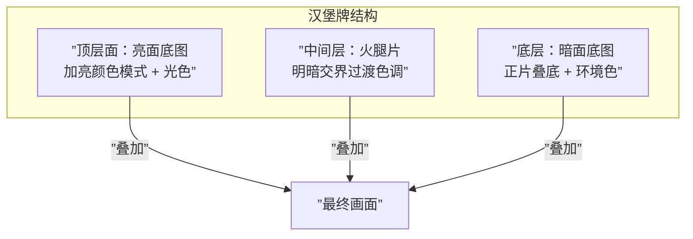
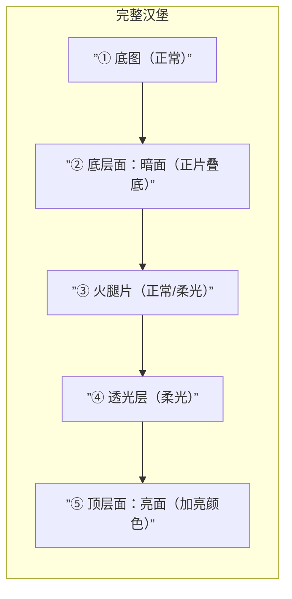
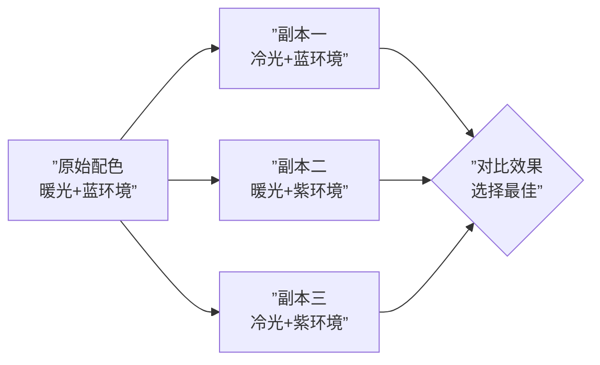
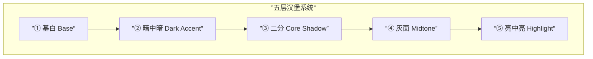

# 第15课：汉堡牌技法

## 汉堡牌技法的核心原理

**汉堡牌技法**（Hamburger Method）是 Krenz 色彩课中最重要的图层控制体系。它的核心思想是：**将画面的亮面层、暗面层、中间层分离到不同的图层组中，各自独立控制，互不干扰。**

| 层位 | 图层模式 | 作用 | 控制参数 |
|------|---------|------|---------|
| **顶层**（面包顶） | 加亮颜色（Color Dodge / Screen） | 直射光、高光 | 光色色相、光强（明度） |
| **中间层**（火腿片） | 正常（Normal）或 柔光（Soft Light） | 明暗交界线的过渡 | 过渡范围、灰度调子 |
| **底层**（面包底） | 正片叠底（Multiply） | 暗部环境光 | 环境色色相、暗度（明度） |

> [!TIP] 为什么叫「汉堡牌」？
> 完整的汉堡有三层结构：上下两片面包夹着中间的肉片。同样，汉堡牌也用多层图层夹出一个完整的画面——亮面是顶层面包，暗面是底层面包，明暗交界处的过渡就是中间的火腿片。

---

## 为什么要分层

很多同学在画光影时遇到一个致命问题：调亮亮部的时候，发现暗部也跟着变亮了。这是因为亮部和暗部画在同一个图层上，调整无法独立。

汉堡牌通过**分层隔离**解决了这个问题：

| 不用汉堡牌 | 用汉堡牌 |
|-----------|---------|
| 亮部和暗部在同一图层 | 亮部和暗部分属不同图层 |
| 调亮部色相→暗部跟着变 | 调亮部色相→暗部完全不受影响 |
| 修改成本高，每次重画一片 | 修改成本低，只需调整对应图层 |
| 无法批量测试不同配色方案 | 光色/环境色可以独立替换测试 |

> [!WARNING] 分层误区
> 分层不是越细越好。初学者建议先掌握三层结构（底层面+中间层+顶层面），熟练后再增加可选层。层数过多反而会增加后期合并的复杂度。

---

## 汉堡牌分层结构详解

### 底层：暗面底图

**图层模式**：正片叠底（Multiply）

**作用**：模拟环境光对暗部的影响。

**操作步骤**：
1. 在底图上方新建图层，设为「正片叠底」
2. 用套索工具或遮罩选中暗部区域
3. 用环境色填充暗部（例如蓝色调的环境就填蓝灰色）
4. 按 `Ctrl+B`（色彩平衡）调整环境色相
5. 按 `Ctrl+U`（色相/饱和度）调整明度与饱和度

### 顶层面：亮面底图

**图层模式**：加亮颜色（Color Dodge）或 滤色（Screen）

**作用**：模拟直射光对亮部的影响。

**操作步骤**：
1. 在最上方新建图层，设为「加亮颜色」
2. 用套索工具选中亮部区域
3. 用光色填充（例如暖色光源就填黄橙色）
4. 调整图层透明度控制光强

### 中间层：火腿片

**图层模式**：正常（Normal）或 柔光（Soft Light）

**作用**：处理明暗交界线处的过渡——这是画得「立体」还是「平」的关键。

**操作步骤**：
1. 在暗面层和亮面层之间新建图层
2. 用介于亮暗之间的中间调画过渡
3. 使用软边笔刷或 [[0004-edge-control|软橡皮]] 制作渐变

### 可选层：透光层

**图层模式**：柔光（Soft Light）

**作用**：处理皮肤、耳朵、薄布料等位置的透光效果。

> [!TIP] 透光层的实用价值
> 在耳朵、手指边缘、薄纱衣服等位置，光会从背面穿过材质。用柔光图层在这些区域画上光色，可以产生非常自然的透光效果，大幅提升画面的通透感。

---

## 图层遮罩控制亮暗面积

汉堡牌技法配合**图层遮罩（Layer Mask）** 使用效果最佳。

核心原则：
- **白色** = 显示该图层效果
- **黑色** = 隐藏该图层效果
- **灰色** = 半透明过渡

| 操作 | 效果 |
|------|------|
| 暗面层遮罩：用白色笔刷涂暗部区域 | 该区域被环境光压暗 |
| 亮面层遮罩：用白色笔刷涂亮部区域 | 该区域被直射光照亮 |
| 用灰色或渐变刷过渡带 | 产生柔和的边缘过渡 |

> [!WARNING] 遮罩误操作
> 很多人直接按 `Delete` 删除选区内的内容，但这样会破坏图层像素。正确的做法是：**按着 Alt 点击「添加图层蒙版」按钮**，用遮罩隐藏选区内容。遮罩可以用 `Ctrl+I` 反向，或者用黑色/白色笔刷随时修改，完全无损。

---

## 汉堡牌测试组合法（「抽卡」探索配色）

这是汉堡牌技法最强大的功能之一——**低成本的颜色方案测试**。

由于亮面层和暗面层是独立的，你可以：

1. **复制**一组汉堡牌图层组
2. **替换**顶层面的光色（比如从暖黄色换成冷紫色）
3. **替换**底层面的环境色（比如从蓝色换成红色）
4. **观察**效果，不满意就丢弃这个副本

> [!TIP] 抽卡策略
> 准备 3-5 种光色和 3-5 种环境色，随机组合测试。就像抽卡一样，每次搭配都会产生不一样的效果。你可能会发现一些「意料之外但很好看」的配色。这种低成本试错方式，比直接在一张图上反复修改要高效得多。

---

## 五层汉堡系统

在掌握三层基础结构后，可以升级到五层系统，获得更精细的控制：

| 层号 | 名称 | 功能 |
|------|------|------|
| ⑤ | **亮中亮** | 高光、反光最强区域（加亮颜色） |
| ④ | **灰面** | 亮部到暗部的过渡区域（正常/柔光） |
| ③ | **二分** | 基础的明暗二分界限（正常） |
| ② | **暗中暗** | 闭塞阴影、最暗区域（正片叠底） |
| ① | **基白** | 底图、固有色（正常） |

> [!WARNING] 五层系统的使用前提
> 五层系统适合**已经能稳定控制三层汉堡**的同学。如果直接跳到五层，容易被图层管理分散注意力，反而画不好光影。**先精通三层，再升级不迟。**

---

## 抽乐透画法

**抽乐透画法**是汉堡牌技法的一个变体应用——你不再「精确控制」每个区域，而是用随机或半随机的方式大量生成「草图配色」，然后从中筛选最佳方案。

具体做法：
1. 准备 3-5 组不同的汉堡牌图层组（每组包含底层+顶层）
2. 每组使用完全不同的光色和环境色组合
3. 快速刷出二分形状，不追求精确
4. 缩小预览，观察整体色块效果
5. 选出观感最好的 1-2 组，精细化发展

> [!TIP] 抽乐透的核心价值
> 你不需要在第一步就想出「完美配色」。抽乐透让你用最低成本探索多种可能性，让你的视觉直觉替你选择。这比花 30 分钟纠结一个颜色要高效得多。

---

## 光色调整图层模式组合

以下是实战中常用的图层模式搭配组合组合：

| 组合名称 | 底层模式 | 顶层模式 | 透光层 | 适合场景 |
|---------|---------|---------|-------|---------|
| **标准组合** | 正片叠底 | 加亮颜色 | 柔光 | 日系插画标准光 |
| **柔和组合** | 正片叠底（低透明度） | 滤色 | 柔光 | 阴天、柔光环境 |
| **强对比组合** | 正片叠底（高饱和） | 加亮颜色（高饱和） | 无 | 戏剧光、舞台光 |
| **自然光组合** | 色彩平衡（阴影偏冷） | 加亮颜色（暖色） | 柔光 | 晴天自然光 |

---

## 自我练习

> [!QUESTION] 汉堡牌技法自测
>
> 1. 汉堡牌三层（底层/中间层/顶层）分别对应的图层模式和功能是什么？
> 2. 为什么需要将亮部和暗部分层控制？
> 3. 图层遮罩中，白色、黑色、灰色分别代表什么效果？
> 4. 「抽卡测试组合法」的核心操作步骤是什么？
> 5. 五层汉堡系统在基础三层系统上增加了哪两层？

参考答案

1. **底层**：正片叠底模式，模拟暗部环境光。**中间层**（火腿片）：正常或柔光模式，处理明暗交界过渡。**顶层**：加亮颜色或滤色模式，模拟直射光。
2. 避免调整亮部时影响暗部，反之亦然。分层后可以独立调整光色相、环境色相，降低修改成本，支持批量测试配色方案。
3. **白色**：显示该图层效果。**黑色**：隐藏该图层效果。**灰色**：半透明过渡。
4. 复制汉堡牌图层组 → 替换顶层光色 → 替换底层环境色 → 观察效果 → 保留最佳方案。
5. 增加了 **灰面（④ Midtone）** 和 **亮中亮（⑤ Highlight）** 两层，从三层（基白/二分/暗中暗）扩展为完整的五层系统。

---

## 实践任务

准备一张已有的底图（或使用 [[0014-foundation-drawing|第14课]] 中完成的底图），按以下步骤实践汉堡牌技法：

1. 创建三层汉堡结构：底层面（正片叠底+环境色）+ 火腿片（过渡调）+ 顶层面（加亮颜色+光色）
2. 使用图层遮罩控制亮暗面积，确保亮暗区域边界清晰
3. 准备 3 组不同的光色环境色组合，用「抽卡法」对比效果
4. 选择最佳组合继续细化，尝试增加透光层（柔光模式）
5. 将不同配色组合的截图对比保存，建立自己的配色参考库

完成后进入 [[0016-ao-ambient-occlusion|第16课：AO与柔光素描]]，学习如何用环境光遮蔽进一步提升画面的立体感。