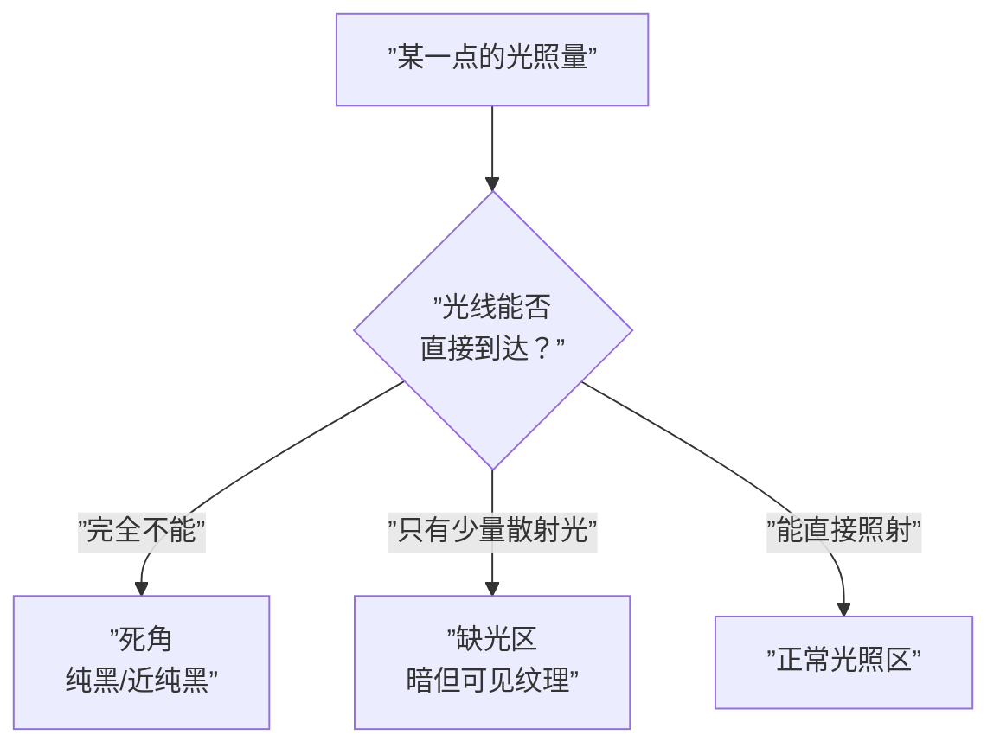
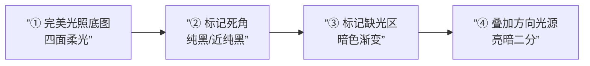

# 第16课：AO与柔光素描

## AO（环境光遮蔽）的核心概念

**AO（Ambient Occlusion，环境光遮蔽）** 是 3D 渲染和数码绘画中用来模拟**物体之间光线被阻挡而产生的阴影**的技术。

简单来说：两个物体靠得越近，它们之间的缝隙就越难被光线照到，因而越暗。这种「夹缝中的暗色」就是 AO。


> [!TIP] 核心理解
> AO 的本质是 **「光线可达性」** 的量化——某个点被光线照到的难度越高，AO 就越深。它不是影子，而是一种「环境光被阻挡」的累积效果。

---

## 完美柔光白光环境（摄影棚光照）

要理解 AO，先要想象一个**完美的基准环境**：

- 一个**白色柔光摄影棚**，四面都是柔光箱
- 光线从**所有方向**均匀照射
- 没有任何方向性的主光源
- 所有表面都被均匀照亮

在这个环境下，物体受到的光照量只取决于一个因素：**该点的「可见天空」比例**。

> [!NOTE] 「可见天空」概念
> 想象物体表面的每个点都有一个「小天窗」。天窗越大，进入的光线越多，该点越亮。天窗越小（被周围物体挡住了），进入的光线越少，该点越暗。AO 阴影就是那些「天窗很小」的区域。

---

## 死角（Dead Corners）与缺光区（Light Deficiency Areas）

在 AO 理论中，有两种不同类型的暗区：

| 类型 | 英文 | 定义 | 光照状况 | 暗度 |
|------|------|------|---------|------|
| **死角** | Dead Corners | 完全照不到光的区域 | 0% 光照 | 最暗（纯黑） |
| **缺光区** | Light Deficiency Areas | 只能照到微弱光的区域 | <20% 光照 | 较暗（接近黑但可见纹理） |

### 死角的特征
- 光线的**路径被完全阻断**
- 是画面中**明度最低**的区域
- 通常呈现为硬边、细条状
- 在二次元中通常**直接用纯黑或接近纯黑**

### 缺光区的特征
- 光线通过**二次反射或散射**进入
- 明度介于死角与正常暗面之间
- 边缘比死角更柔和
- 在画面中呈现为**较暗的渐变区域**



> [!WARNING] 常见错误
> 初学者经常把整个暗面都涂成 AO 的深度。记住：**暗面 ≠ AO**。暗面是有环境光照到的，只是比亮面暗而已。AO 是暗面中**最暗的那一部分**——只有夹缝、凹陷、朝下面等特殊位置才有 AO。

---

## 死角位置公式

死角在人体和物体上的分布有固定的模式，Krenz 将其总结为一套**公式**：

```
死角 = 夹缝 / 朝下面 / 洞口 / 耳后 / 腋下
```

| 位置 | 说明 | 典型例子 |
|------|------|---------|
| **夹缝** | 两个物体紧密接触的缝隙 | 手指并拢的指缝、手臂与身体的接触线 |
| **朝下面** | 完全面向地面的表面 | 下巴下方、胸肌下缘、裙摆下方 |
| **洞口** | 向内凹陷的开口 | 鼻孔内部、耳洞、嘴巴微张时的口腔内部 |
| **耳后** | 耳朵与头部之间的转角 | 耳廓后方、耳垂与脸颊的接缝 |
| **腋下** | 肢体与躯干的夹角 | 腋窝、肘窝、腹股沟、膝盖后方 |

> [!TIP] 死角的规律性
> 这些位置在不同的人体上几乎完全相同。记住公式后，你可以在画任何角色时**按图索骥**地加上 AO，不需要每次都重新分析光线路径。

---

## AO 画法的 3D 渲染逻辑

AO 画法的核心逻辑是**逆向工作**：

```
先画完美柔光白光环境 → 再分区域压暗打光
```

这与传统的光影画法（先想好光源方向再画阴影）正好相反：

| 步骤 | 传统画法 | AO 画法 |
|------|---------|---------|
| 第一步 | 确定光源方向 | 画完美光照（无方向性） |
| 第二步 | 分析受光面/背光面 | 标出死角位置 |
| 第三步 | 画暗面 + 投影 | 标出缺光区 |
| 第四步 | 画闭塞阴影（AO） | 再叠加方向性主光源 |



> [!WARNING] 实操建议
> 不建议在数码绘画中严格按 3D 的 AO 流程操作（第三步之前就加纯黑），因为纯黑区域后期很难再提亮。更推荐的做法是：**先用灰色标记 AO 区域，等所有图层合并后再加深到合适的明度。**

---

## 二次元对 AO 的简化

二次元风格不需要 3D 渲染那样精确的 AO 计算。Krenz 总结了二次元对 AO 的三种简化方式：

| 简化方式 | 做法 | 效果 |
|---------|------|------|
| **线条替代** | 用线稿线条表示结构转折处的 AO | 最简，在 [[0014-foundation-drawing|底图阶段]] 就完成 |
| **一层暗色** | 统一用一个深色图层画所有 AO 区域 | 中等，适合整洁风格 |
| **分层 AO** | 死角用纯黑，缺光区用深灰渐变 | 最精细，适合高完成度 |

> [!EXAMPLE] 二次元 AO 的典型案例
> - 下巴下方的阴影 → AO（朝下面）
> - 脖子和身体之间的暗色调 → AO（夹缝）
> - 头发之间的缝隙 → AO（夹缝）
> - 裙子褶皱深处 → AO（洞口/夹缝）
>
> 很多二次元画师在没有系统学习 AO 之前就已经在画这些位置了——他们靠的是观察经验。而 AO 理论让你从「凭感觉画」升级为「按公式画」。

---

## 场景速写的死角背公式法

将人体死角公式扩展应用到场景速写中：

| 场景要素 | 死角位置 | 公式对应 |
|---------|---------|---------|
| 建筑物 | 墙角、屋檐下、窗户边框内侧 | 夹缝 / 朝下面 |
| 自然景物 | 树根与地面的接触处、岩石缝隙 | 夹缝 / 洞口 |
| 静物 | 物体与桌面的接触线、把手内侧 | 夹缝 / 朝下面 |
| 衣服 | 衣褶的折叠深处、领口内侧 | 夹缝 / 洞口 |

> [!TIP] 场景的 AO 思维
> 画场景速写时，**先不要管光源方向**。先用公式找出所有死角位置，用深灰色标记出来。这个习惯一旦养成，你的场景会比之前「立体一倍」。

---

## 柔光素描训练

柔光素描是练习 AO 的最高效手段。柔光环境下，光线方向不明确，画面的立体感几乎完全靠 AO 来支撑。

### 为什么要训练柔光素描

1. **强制依赖 AO**：没有方向性光源，你无法靠「亮面/暗面」来表现立体感
2. **强化死角意识**：必须敏锐识别所有死角位置
3. **提升结构理解**：AO 画得好不好，取决于你对结构的理解是否到位

> [!TIP] 柔光素描练习建议
> 找阴天拍摄的人物照片作为参考（阴天的自然光是最完美的柔光环境）。先用单色（灰度）临摹，**只画死角区域**，不画亮暗二分。等你能仅靠 AO 就画出立体感，再叠加光源。

---

## 阴天场景的死角与闭塞阴影识别

阴天是理解 AO 的最佳现实场景：

| 观察位置 | 阴天效果 | AO 原理 |
|---------|---------|---------|
| 屋檐下方 | 明显的暗色条带 | 朝下面的死角 |
| 窗框与墙壁夹角 | 深色的线状暗色 | 夹缝死角 |
| 树叶重叠处 | 深色网纹状暗色 | 多层夹缝叠加 |
| 人的下巴下方 | 柔和但明显的阴影 | 朝下面的缺光区 |
| 衣领内侧 | 渐变的深色区域 | 洞口 + 夹缝 |

---

## 暧昧闭塞表现法

在某些风格中，AO 不需要画得非常锐利和明确。**暧昧闭塞**是一种用**柔和的、不完全填充**的方式来表现 AO 的技巧：

| 方式 | 做法 | 效果 |
|------|------|------|
| **模糊闭塞** | 用软边笔刷画 AO，边缘模糊 | 朦胧、温和的感觉 |
| **半透闭塞** | 降低 AO 图层透明度 | 保留部分环境光信息 |
| **渐变闭塞** | AO 从深到浅渐变过渡到正常暗面 | 自然、有层次的立体感 |

> [!WARNING] 何时用暧昧闭塞
> - **硬光风格**（舞台光、正午阳光）：用锐利闭塞，界限分明
> - **软光风格**（阴天、柔光箱）：用暧昧闭塞，过渡自然
> - **高完成度插画**：混合使用——近处锐利、远处暧昧

---

## 自我练习

> [!QUESTION] AO 自测
>
> 1. AO（环境光遮蔽）的核心概念是什么？请用一句话解释。
> 2. 死角（Dead Corners）和缺光区（Light Deficiency Areas）的区别是什么？
> 3. 请写出五个常见死角位置的公式。
> 4. AO 画法的 3D 渲染逻辑与传统的画法有什么不同？
> 5. 二次元风格对 AO 做了哪三种简化？

<details>
<summary>参考答案</summary>

1. AO 是模拟物体之间光线被阻挡而产生的阴影效果，本质是「光线可达性」的量化。
2. **死角**：完全照不到光的区域（0% 光照），纯黑或接近纯黑。**缺光区**：只能照到微弱光线的区域（<20% 光照），暗但可见纹理。
3. 死角位置公式：**夹缝 / 朝下面 / 洞口 / 耳后 / 腋下**。具体包括：手指并拢的指缝、下巴下方、鼻孔内部、耳廓后方、腋窝等。
4. **传统画法**：先定光源方向 → 画亮暗面 → 画闭塞阴影。**AO 画法**：先画完美柔光白光环境 → 再标出死角/缺光区 → 最后叠加方向性主光源。
5. 三种简化：**线条替代**（用线稿线条表示 AO）、**一层暗色**（统一用深色图层画所有 AO 区域）、**分层 AO**（死角用纯黑，缺光区用深灰渐变）。

</details>

---

## 实践任务

选择一张在阴天户外拍摄的人物照片作为参考：

1. **练习一**：在灰度模式下，用单色临摹照片，**只画死角区域**（完全不画亮暗二分）
2. **练习二**：在练习一的基础上，标出缺光区，观察死角到缺光区的过渡
3. **练习三**：将照片转为黑白，对比你的 AO 分析与实际照片中的暗部是否一致
4. **练习四**：回想之前画的任何一张角色插画，用死角公式检查：哪些位置有死角但你没画？哪些位置画了但不是死角？

如果你在柔光素描训练中感受到 AO 对画面立体感的巨大提升，说明你已经掌握了它的核心价值。接下来请进入 [[0017-scene-hierarchy|第17课：场景层次与形的层级]]，将 AO 思维应用到场景作画中。