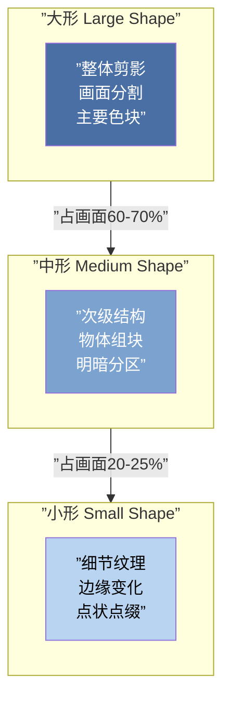
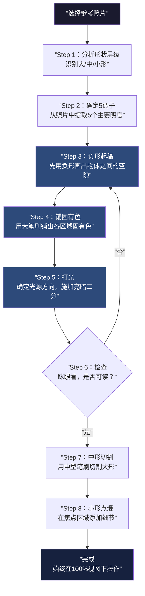

# 第17课：场景层次与形的层级

## Learning Objectives

- 理解形的层级（Shape Hierarchy）：大/中/小三级形状的控制逻辑
- 掌握5调子限制（5-Tone System）的全图明度管理
- 学会点线面笔触系统在场景概括中的运用
- 理解"复制信息密度而非形状准确度"的核心原则
- 掌握照片速写的标准工作流与三种练习场景类型
- 学会负形+固有色+打光三层工作流

## Core Idea

场景绘画与单体绘画的最大区别在于：**单体画的是"形状准确度"，场景画的是"信息密度分布"**。当你面对一片森林、一座城市、一片花海时，不可能也不应该去画每一片叶子、每一扇窗户。场景绘画的本质是"概括"——用最少的形状传递最多的信息。

### 一、形的层级：大/中/小三级系统

**Shape Hierarchy（形的层级）**是所有场景概括的第一性原理。任何复杂场景都可以拆解为三级形状：



| 层级 | 占比 | 作用 | 常见错误 |
|------|------|------|----------|
| **大形** | 60-70% | 决定构图平衡、视觉冲击力 | 大形琐碎，整体感弱 |
| **中形** | 20-25% | 提供可读的结构信息 | 中形过多，细节堆砌 |
| **小形** | 10-15% | 点睛的细节纹理 | 小形喧宾夺主，画面花哨 |

> [!TIP] Key Insight
> 检查画面是否"花"或"碎"的方法很简单：**眯眼看**。眯眼时只能看到大形和中形，如果画面仍然觉得乱，说明大形层级出了问题。合格的场景概括，眯眼时看到的是几个干净的大色块，睁开眼睛才看到中形和小形的丰富度。

### 二、剪影信息密度通过形状层级控制

场景的剪影信息密度 = 大形边界上的中形数量 + 中形内部的小形分布。控制信息密度的关键：

1. **大形剪影轮廓必须清晰**：即使在远处，剪影轮廓也不能模糊——这是"可读性"的底线
2. **中形集中在重点区域**：不要把中形均匀分布在整个画面，而是集中在视觉焦点附近
3. **小形作为"骗术"**：小形不需要准确，只需要在正确的位置制造"有细节"的错觉

### 三、形状驱动 vs 细化驱动——减法思维

**形状驱动**（Shape-Driven）和**细化驱动**（Detail-Driven）是两种完全不同的思维方式：

| 维度 | 形状驱动（推荐） | 细化驱动（陷阱） |
|------|-----------------|-----------------|
| 起点 | 从大形状开始，逐步切割 | 从局部开始，逐步扩大 |
| 过程 | 先砍后加 | 一直加 |
| 结果 | 整体感强、信息密度可控 | 局部丰富但整体松散 |
| 修图代价 | 低（大形不对直接改） | 高（细节白画） |

> [!WARNING]
> 绝大多数初学者采用的是"细化驱动"——从眼睛开始画，然后画鼻子、嘴巴，逐步扩大到整张脸。这在画单体人像时勉强可行，但在场景绘画中**必死无疑**。场景必须用**减法思维**：先铺最大的色块，再逐步切割出中型色块，最后在关键位置点缀细节。

### 四、5调子限制（5-Tone System）

全图限用5个明度值——这是场景概括最有力的限制工具：

```
明度阶：
1（最亮）──── 2（亮灰）──── 3（中灰）──── 4（暗灰）──── 5（最暗）
 高光/光源    亮面固有色    中间调/过渡  暗面固有色    闭塞阴影/AO
```

> [!TIP] Key Insight
> 5调子限制的核心逻辑：**用限制逼出创造力**。当你只能用5个明度时，你会被迫思考哪些调子可以合并、哪些可以省略——这才是真正的概括能力。如果允许用20个明度，你根本不需要思考，直接照着照片画就行——但那不是绘画，是描图。

**5调子的实战分配技巧**：
- 5个调子不一定全部使用——有时4个就够了
- 亮面通常用2-3个调子（高光 + 亮面固有色 + 亮面过渡）
- 暗面通常用2-3个调子（暗面固有色 + 反光 + 闭塞）
- 亮面和暗面的调子不要均匀分布——让亮面比暗面多一个调子通常效果更好

### 五、笔刷大小量化对应形状层级

笔刷大小应该与形状层级严格对应：

| 形状层级 | 笔刷大小（相对画布） | 笔触类型 |
|----------|---------------------|----------|
| **大形** | 画布短边的 1/4 - 1/2 | 面（Plane） |
| **中形** | 画布短边的 1/8 - 1/4 | 线（Line） |
| **小形** | 画布短边的 1/16 以下 | 点（Point） |

### 六、点线面笔触系统

**Point-Line-Plane（点线面）**是控制信息密度的笔触系统：

- **面（Plane）**：铺大形、定调子——用最大的笔刷，一笔就是一个大形状
- **线（Line）**：切割形状、定义边缘——用中型笔刷或笔刷边缘来塑造中形
- **点（Point）**：点缀细节、制造纹理——用小笔刷或纹理笔刷在关键位置添加

```mermaid
flowchart LR
    subgraph Plane[”面 Plane”]
        P1[”大笔刷铺色”]
        P2[”占画布60-70%”]
        P3[”定明度基调”]
    end
    subgraph Line[”线 Line”]
        L1[”切割形状”]
        L2[”定义边缘”]
        L3[”结构的骨架”]
    end
    subgraph Point[”点 Point”]
        Pt1[”细节点缀”]
        Pt2[”纹理制造”]
        Pt3[”画龙点睛”]
    end

    Plane -->|”先铺”| Line -->|”后切”| Point -->|”最后点”|
```

> [!TIP] Key Insight
> 很多新手的笔触停留在"线"和"点"的层面，不敢用"面"。结果画面永远是琐碎的——因为没有大的色块来支撑。**一个合格场景的大形应该是用"面"画出来的，而不是用"线"填出来的。**

### 七、复制信息密度而非形状准确度

这是场景绘画中最重要的认知转变：

> **不是复制形状，而是复制信息密度。**

举例来说，画一片树叶：
- **错误**：画出一片和照片角度完全一样的叶子（复制形状）
- **正确**：在"应该有叶子的位置"画几笔绿色，信息密度和周围一致即可（复制信息密度）

这意味着：
- 你不必画每一根树枝——只需要在树枝区域画出均匀的"树枝信息密度"
- 你不必画每一扇窗户——只需要在城市区域画出均匀的"窗户信息密度"
- 3条鱼可以代表一群鱼，3朵花可以代表一片花海

### 八、场景概括时永不放大

> [!WARNING] 黄金法则
> **场景概括时永远保持 Full View（100%视图），永不放大！**

为什么？因为：
1. 放大后会陷入局部细节，失去整体控制
2. 100%视图下你只能看到大形和中形——这正是你需要的
3. 细节不靠"放大画"，而靠"缩小看效果"——在缩小时判断信息密度是否足够

### 九、照片速写练习工作流

标准的场景照片速写工作流如下：



### 十、三种练习场景类型

针对不同训练目标，推荐三类场景练习：

| 类型 | 难度 | 训练重点 | 推荐时长 | 示例 |
|------|------|----------|----------|------|
| **几何场景** | 低 | 透视、大形分割 | 30分钟 | 建筑群、街道 |
| **自然场景** | 中 | 信息密度控制、纹理概括 | 45分钟 | 森林、花海、山景 |
| **混合场景** | 高 | 综合能力 | 60分钟 | 城市天际线、街景 |

> [!TIP] 练习顺序
> 建议先练几何场景（建筑），再练自然场景（树木/山/水），最后混合场景。建筑有清晰的几何结构，更容易理解形状层级；自然场景形状模糊，概括难度更高。

### 十一、先练灰阶再练色彩

场景练习的顺序：**灰阶 → 色彩**

- **灰阶阶段**：只用黑白灰，专注5调子控制和形状层级
- **色彩阶段**：在灰阶基础上加入色彩，注意色彩明度不能破坏已建立的调子结构

> [!TIP] Key Insight
> 色彩是"装饰"而非"结构"。一张色彩正确的场景画，转成黑白后应该仍然立得住。如果你的色彩作品转成黑白后成了一团浆糊——说明你的色彩是在掩盖调子结构的不足。

### 十二、负形+固有色+打光三层工作流

这是场景绘画最标准的三层工作流：

**第一层：负形（Negative Shape）**
- 先画出物体之间的空隙（天空、缝隙、背景）
- 负形帮助确定大形轮廓

**第二层：固有色（Local Color）**
- 在负形围成的区域内填充固有色
- 此时画面是"平涂"状态——所有固有色都是平的，没有光影

**第三层：打光（Lighting）**
- 在固有色基础上施加光源
- 亮面加亮色，暗面加暗色/冷色
- 至此画面完成"从平面到立体"的转变

### 十三、花海信息层级处理法

花海是场景概括的最佳训练主题——它极端考验信息密度控制能力：

**花海的三级形状分解**：

| 层级 | 看到的 | 画法 |
|------|--------|------|
| **大形** | 花海的整体色块（粉红色块/黄色色块） | 用大笔刷铺出花海区域的整体色块 |
| **中形** | 花海的起伏和明暗变化 | 用中型笔刷在整体色块内部切割出明暗变化 |
| **小形** | 单朵花的轮廓（不需要具体） | 在近景区域用点状笔触提示"有花" |

**花海公式**：
1. 铺底色（花海整体色块，占80%面积）
2. 切割起伏（在底色上切出亮面和暗面）
3. 近景点花（只在画面底部的近景区域用点状笔触画几朵花）
4. 远景用"点簇"（3-5个点一组，代替单朵花）

> [!TIP] Key Insight
> 画一片花海，真正需要画的"单朵花"不超过20朵——但观者会认为"这片花海有成千上万朵花"。这就是**信息密度控制**的魔力：在正确的位置放正确密度的信息，大脑会自动补齐其余部分。

## Worked Example

### 场景速写：城市天际线

以城市天际线为例演示完整工作流：

| 步骤 | 操作 | 形状层级 | 耗时 |
|------|------|----------|------|
| 1 | 分析照片：识别天空/建筑群/地面三大色块 | 大形 | 2分钟 |
| 2 | 画负形：先涂天空区域（负形确定建筑轮廓） | 大形 | 5分钟 |
| 3 | 铺固有色：建筑群用深灰、天空用浅灰、地面用中灰 | 大形 | 5分钟 |
| 4 | 打光：确定光源方向，亮面加亮、暗面压暗 | 大形→中形 | 10分钟 |
| 5 | 切割：用中型笔刷切割出主要建筑的明暗转折 | 中形 | 15分钟 |
| 6 | 点缀：在焦点建筑上添加窗户细节（小点） | 小形 | 5分钟 |
| 7 | 检查：眯眼看，调整5调子的一致性 | 全层级 | 3分钟 |

> [!QUESTION] Self-check
> 1. 形的三级层级是什么？各自占画面比例是多少？
> 2. 为什么场景概括时必须保持100%视图？
> 3. 5调子限制的核心目的是什么？
> 4. "复制信息密度而非形状准确度"是什么意思？举例说明。
> 5. 负形+固有色+打光三层工作流中，每一层的核心任务是什么？

<details>
<summary>查看答案</summary>

1. **大形**（60-70%）决定构图平衡；**中形**（20-25%）提供结构信息；**小形**（10-15%）点缀细节纹理。
2. 放大后会陷入局部细节，失去整体控制。100%视图下只能看到大形和中形——这正是场景概括需要的视角。细节不靠"放大画"，靠"缩小看效果"。
3. 用限制逼出创造力——迫使你思考哪些调子可以合并、哪些需要省略，锻炼真正的概括能力。
4. 不是复制照片中的具体形状，而是复制该区域的信息密度。例如画一片树叶林，不需要画出每一片叶子，只需要在"应该有叶子的位置"用叶子纹理填充，信息密度和周围一致即可。
5. **负形**：先画物体之间的空隙来确定大形轮廓；**固有色**：在负形围成的区域内填充平涂的固有色；**打光**：在固有色基础上施加光影，完成从平面到立体的转化。
</details>

## 花海信息层级专项练习

找一张花海照片（建议用俯拍视角或远景视角），按以下步骤练习：

1. 限时5分钟：只用大笔刷铺3-4个色块，眯眼检查是否可读
2. 加5分钟：用中型笔刷切割/起伏
3. 加5分钟：在近景区域用点状笔触添加"花的信息"
4. 全程不放大，保持100%视图

练习3-5张不同的花海照片，你会发现从第3张开始对"信息密度"有了直觉。

## Next Step

完成场景层次练习后，进入 [第18课：空气透视与深度创造](lessons/0018-air-perspective)，学习如何用空气透视原理创造场景的深度感和空间层次。