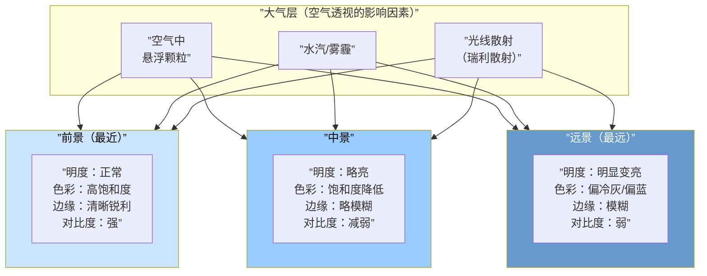
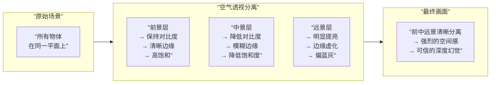

# 第18课：空气透视与深度创造

## Learning Objectives

- 理解空气透视（Air Perspective）作为分层剪影的核心原理
- 掌握空气透视对明度和色彩的影响规律
- 学会用空气透视分离前、中、远景
- 掌握在前景与背景重叠处插入"空气层"的技法
- 理解暧昧表现技法的应用场景

## Core Idea

空气透视（Air Perspective），又称大气透视，是场景绘画中创造深度感最有力的工具。它的本质是：**把场景理解为多层半透明剪影的叠合**——每一层都因为与观察者之间的距离不同，受到不同厚度的大气影响。

### 一、空气透视作为分层剪影

**空气透视的基本规律**：

| 属性 | 前景（近） | 中景 | 远景（远） |
|------|-----------|------|-----------|
| **明度** | 正常明度范围 | 亮面略微变亮，暗面略微变亮 | 整体明显变亮，接近天空明度 |
| **饱和度** | 高 | 中等 | 低（偏灰） |
| **色相** | 固有色清晰 | 略微偏冷 | 明显偏蓝/偏灰 |
| **边缘清晰度** | 锐利 | 中等 | 模糊/虚化 |
| **对比度** | 强 | 中等 | 弱 |

> [!TIP] Key Insight
> 空气透视最核心的规律可以概括为一句口诀：**近实远虚，近暖远冷，近纯远灰，近暗远亮**。记住这16个字，就掌握了空气透视的全部核心规律。

### 二、远处物体受多层大气影响

为什么远处的物体会变亮、变灰、偏蓝？因为光线在到达你的眼睛之前，经过了多层大气的散射：

1. **瑞利散射**：蓝光波长短，容易被大气散射——所以远处的暗部区域会混入蓝色
2. **米氏散射**：水汽和雾霾颗粒使所有波长的光都散射——降低整体对比度
3. **累计效应**：距离越远，中间的大气层越厚，影响越明显

**量化参考**：

| 距离 | 明度变化 | 色彩变化 | 对比度变化 |
|------|----------|----------|-----------|
| 0-100m | 无变化 | 无变化 | 100% |
| 100-500m | 亮面+5%，暗面+10% | 饱和度下降10% | 85% |
| 500m-2km | 亮面+15%，暗面+30% | 饱和度下降30%，偏蓝 | 60% |
| 2km以上 | 亮面+30%，暗面+50% | 饱和度下降60%，明显偏蓝 | 30% |

> [!NOTE]
> 上面的数值是参考值，实际效果受天气、湿度、空气质量影响很大。大雾天10m外就明显变色，晴空万里时5km外变化仍不明显。关键在于理解规律，而不是背诵数值。

### 三、空气透视分离前中远景

在实践中，空气透视可以帮助我们**主动分离**画面的空间层次：

**前中景分离的核心操作**：

1. 确定前、中、远景的边界（哪一层到哪一层）
2. 从前景到远景依次：降低对比度、降低饱和度、明度向天空明度靠近
3. 远景物体的暗面不要比前景物体的暗面暗——如果你发现远景还有很暗的色块，说明空气透视没做对
4. 检查方式：画完三层后眯眼看，应该能清楚地分辨出三层深度

### 四、在前景与背景重叠处插入"空气层"

当前景和背景物体在画面中重叠时，最容易产生"贴在一起"的感觉。解决方法是：**在重叠处插入一层"空气"**。

**操作手法**：
1. 在前景物体的轮廓边缘，用喷枪（Airbrush）轻轻喷涂一层中间色
2. 这层"空气"的颜色=前景固有色+背景固有色+天空色的混合
3. 透明度控制在20-40%之间，不要完全遮盖
4. 效果：前景和背景之间产生了"空间感"

> [!TIP] Key Insight
> 这个技巧的原理是：人眼判断物体距离的一个关键线索是**边缘与背景的对比度**。如果边缘对比度很高，物体看起来近；如果边缘对比度低（有薄薄的一层"空气"隔开），物体就自然地退远了。利用这个心理暗示，你可以在重叠处人为制造深度。

### 五、场景中表现深度的综合技巧

空气透视不是创造深度的唯一工具。以下是完整的深度创造工具箱：

| 技巧 | 原理 | 应用场景 |
|------|------|----------|
| **重叠（Overlap）** | 前面的物体遮挡后面的物体 | 任何场景的基础 |
| **空气透视** | 大气影响使远处模糊变色 | 大场景、远景 |
| **线性透视** | 平行线汇聚于灭点 | 建筑、街道、室内 |
| **大小缩放** | 近大远小 | 任何有规律排列的物体 |
| **纹理梯度** | 近处纹理密，远处纹理疏 | 地面、墙面、花海 |
| **色彩温度** | 近暖远冷（空气透视补充） | 风景、大场景 |
| **明度分层** | 每层独立控制明度范围 | 复杂场景 |

**深度创造的"四件套"组合技**：

1. 前景物体边缘锐利 + 暖色 + 高对比
2. 中景物体边缘中等 + 中性色 + 中等对比
3. 远景物体边缘模糊 + 冷色偏蓝 + 低对比
4. 在每层之间留出"空气带"（用喷枪过渡）

> [!WARNING]
> 很多初学者在使用空气透视时过度"规整"，导致画面像三个互不相干的图层拼贴。记住：空气透视应该是**渐变**的，而不是**阶梯**式的。在不同的层之间要有过渡区域，让空间深度看起来是连续的。

### 六、暧昧表现技法

**暧昧表现**（Ambiguous Representation）是指：在画面中保留某种"可以被多角度解读"的模糊区域。这不是缺点，而是一种高级的表现手法。

**暧昧表现的应用场景**：

1. **不必要的细节区域**：在非焦点区域，形状不必画清楚——模糊反而更有"空气感"
2. **过渡区域**：在明暗交接处，保留模糊的过渡比硬切更显自然
3. **远景处理**：远景中的物体不需要被"定义"——一团模糊但色彩正确的色块可能比清晰的形状更有说服力
4. **光影交界处**：在光影分界处保留一些暧昧的过渡，可以让光照看起来更自然

> [!TIP] Key Insight
> 暧昧表现的核心在于"取舍"：**不是所有模糊都是好的，也不是所有清晰都是好的**。清晰的应该是焦点、主体、结构骨架；模糊的应该是环境、背景、非关键细节。两者形成"一清一糊"的对比，画面才有呼吸感。

**暧昧表现的操作要点**：

| 场景元素 | 清晰处理 | 暧昧处理 | 效果 |
|----------|----------|----------|------|
| 主体人物 | 是 | 否 | 吸引视线 |
| 前景地面 | 局部清晰 | 整体暧昧 | 有引导性但不抢戏 |
| 中景建筑 | 结构清晰 | 细节暧昧 | 可读但不琐碎 |
| 远景山体 | 否 | 是 | 创造深度 |

## Worked Example

### 空气透视实战：山景

以山景为例演示空气透视的完整应用：

**原始素材分析**：一张山区照片，前景有树木，中景有山坡，远景有山脉。

| 步骤 | 操作 | 原理 |
|------|------|------|
| 1 | 将画面分为前/中/远三层 | 确定深度的三个层次 |
| 2 | 前景树木：保持原有的暗色和高对比度 | 前景属性 |
| 3 | 中景山坡：将暗面提亮15%，边缘略模糊 | 中景属性 |
| 4 | 远景山脉：整体提亮30%，降低饱和度50%，偏蓝 | 远景属性 |
| 5 | 在前景树木边缘用喷枪喷一层薄雾 | 插入"空气层" |
| 6 | 在山顶（前景与天空交汇处）做暧昧处理 | 暧昧表现 |
| 7 | 检查：眯眼看是否能清楚分辨三层 | 质量控制 |
| 8 | 调整：如果远景仍然太暗，继续提亮 | 修正 |

> [!QUESTION] Self-check
> 1. 空气透视的16字口诀是什么？
> 2. 为什么远景物体会偏蓝？
> 3. "在前景与背景重叠处插入空气层"的操作方法是什么？
> 4. 暧昧表现的核心取舍原则是什么？
> 5. 深度创造的综合工具箱中，列出至少5种技巧。

查看答案

1. **近实远虚，近暖远冷，近纯远灰，近暗远亮**。
2. 因为瑞利散射——蓝光波长短，容易被大气中的微粒散射。当光线穿过厚厚的大气层到达远景物体时，蓝光被散射混入，使远景暗部呈现蓝色调。
3. 在前景物体的轮廓边缘，用喷枪轻轻喷涂一层中间色（前景固有色+背景固有色+天空色的混合），透明度20-40%。这模仿了"空气中存在的一层薄雾"。
4. 清晰的应该是焦点和主体，模糊的应该是环境和背景。"一清一糊"形成对比，画面才有呼吸感。
5. 重叠（Overlap）、空气透视、线性透视、大小缩放、纹理梯度、色彩温度、明度分层。

## 场景深度分析练习

找一张有大纵深的风光照片（建议包含明显的前/中/远景），不画，只做**分析练习**：

1. 将画面划分为前、中、远景三层（用箭头或文字标注）
2. 分析每一层的明度范围、饱和度水平、色彩倾向
3. 找出重叠处——判断前景和背景之间是否有"空气层"需要插入
4. 找出哪些区域适合做"暧昧表现"——为什么？
5. 将分析结果写成笔记

这个分析练习做5-10张后，再开始实际的空气透视绘画练习，效率会大幅提升。

## Next Step

完成空气透视学习后，进入 [第19课：整合工作流](lessons/0019-integration-workflow)，学习如何将前18课的所有知识整合为一个完整的绘画工作流。