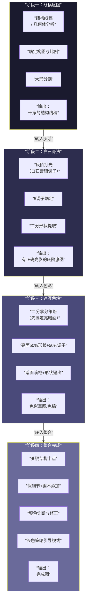

# 第19课：整合工作流

## Learning Objectives

- 掌握四阶段整合工作流（线稿→白石膏→速写色块→整合）
- 学会喷枪铺调子+形状提取的桥梁技法
- 理解"颜色脏"的三重诊断体系与解决方案
- 掌握假细节与骗术策略
- 理解碳笔思维迁移（先调子后形状）
- 掌握亮面调子的光色情报逻辑

## Core Idea

整合工作流是前18课所有知识的**总装线**。从线稿到完成图，中间经过4个阶段，每个阶段都有明确的输入、输出和检查点。如果你在绘画过程中"不知道怎么继续了"——答案是回到工作流的某个阶段重新检查。

### 一、四阶段整合工作流

### 二、白石膏法核心逻辑回顾

详细内容见 [第11课：白石膏法](lessons/0011-white-plaster-method)，此处只回顾核心要点：

- **白石膏的本质**：先忽略固有色，把画面中的所有物体当作白色石膏
- **目的**：在不受固有色干扰的情况下，先建立正确的光影结构
- **输出物**：一张灰阶底图——已经具备完整的体积感和光照关系

> [!WARNING]
> 很多人在从白石膏过渡到色彩时犯的错误：直接把色彩叠上去，破坏了白石膏建立的明度关系。正确的做法是：**色彩叠上去后，转成灰阶检查，明度关系必须和原白石膏一致。**

### 三、喷枪铺调子+形状提取技术（关键桥梁技法）

这是从"白石膏底图"过渡到"色彩草图"最关键的桥梁技法：

**喷枪铺调子**：
1. 在白石膏底图上，用喷枪（Airbrush）薄薄地铺一层色彩
2. 喷枪的压力和流量调低（20-30%不透明度）
3. 从暗面开始铺——暗面的色彩选择偏冷、偏灰的颜色
4. 亮面留到最后——亮面的色彩选择偏暖、偏纯的颜色

**形状提取**：
1. 用套索工具（Lasso）或硬边笔刷提取大形
2. 形状不需要精确——提取的是信息密度，不是具体轮廓
3. 提取完成后，检查每个形状的明度是否在白石膏的5调子范围内

> [!TIP] Key Insight
> 喷枪+形状提取是"先调子后形状"的具体实现。先用喷枪感受颜色和调子，再用形状锁定结果。这和碳笔素描的"先铺再擦"逻辑完全一致——详见下方碳笔思维迁移。

### 四、速写色块精神：二分拿分策略

速写色块的核心理念是**二分拿分**：先搞定亮暗两分的最大效果，再看中间调。

**二分拿分策略**：

- 把全力放在亮面和暗面的二分上（占画面70%效果）
- 中间调是"可选升级"——做得好是加分，做不好也不影响画面基本盘
- 时间分配：亮暗二分占70%，中间调占20%，细节占10%

### 五、亮面塑造：50%形状+50%调子

亮面不是"一块白色"，而是**形状和调子的结合**：

- **50%形状**：亮面的形状边界——高光的轮廓、亮面和暗面的分界
- **50%调子**：亮面内部的明度变化——高光的衰减、亮面到中间调的过渡

> [!NOTE]
> 亮面的形状决定了"物体是什么"，亮面的调子决定了"光从哪里来"。两者缺一不可。

### 六、暗面讯息补充：喷枪+形状逼出

暗面是初学者最容易处理"空"的地方。解决方案是"喷枪+形状逼出"：

1. **喷枪打底**：用喷枪在暗面铺设色彩变化（反光色、环境光色）
2. **形状逼出**：在暗面中提取次级形状（暗面中的亮区、暗面中的色块变化）
3. **注意边界**：暗面中的形状不能破坏暗面的整体性——保持暗面作为一个整体剪影

### 七、假细节与骗术策略（70%准度即可）

> [!TIP] Key Insight
> 细节不需要100%准确，70%就够了。观众看到的不是"这个细节是不是和照片一模一样"，而是"这个区域有细节"——只要有信息密度的"提示"，大脑会自动脑补出精确的内容。

**假细节操作手册**：

| 骗术类型 | 操作方法 | 效果 |
|----------|----------|------|
| **纹理暗示** | 在需要"有细节"的区域用纹理笔刷扫一遍 | 看起来像有丰富细节 |
| **形状暗示** | 在边界处添加3-5个不规则小形状 | 看起来像有复杂结构 |
| **色彩变化** | 在区域内部添加不易察觉的色彩渐变 | 看起来像有材质变化 |
| **边缘变化** | 在边缘处做锯齿/断续处理 | 看起来像有轮廓细节 |

### 八、关键结构卡点策略

卡点（Checkpoint）是指在工作流中设置的**质量控制节点**。在每个卡点检查通过后，才能进入下一阶段：

**线稿阶段卡点**：
- 比例是否正确？→ 检查方法：翻转画布看
- 大形分割是否合理？→ 检查方法：眯眼看

**白石膏阶段卡点**：
- 5调子是否清晰？→ 检查方法：转黑白模式看
- 体积感是否成立？→ 检查方法：眯眼看，是否有物体"浮"出来

**速写色块阶段卡点**：
- 颜色是否"脏"？→ 检查方法：三重诊断
- 亮面是否有光色情报？→ 检查方法：亮面色是否偏暖/偏纯

**整合阶段卡点**：
- 焦点是否明确？→ 检查方法：画面是否有"一眼看到的主次"
- 假细节是否足够？→ 检查方法：在缩小时看，信息密度是否均匀

### 九、亮面调子必须带光色情报

亮面的颜色不只是"固有色+白色"。亮面调子必须包含**光色情报**：

1. **光源色**：暖光源（太阳）→ 亮面偏暖黄；冷光源（阴天）→ 亮面偏冷蓝
2. **环境色**：周围物体的反光影响亮面的色彩倾向
3. **材质信息**：光滑物体亮面带高光，粗糙物体亮面散射

> [!WARNING]
> 亮面如果用纯白色（255,255,255）或纯固有色+白色，画面会显得"假"——因为真实世界中，亮面永远受光源色和环境色的影响。**一张画如果看起来"像塑料"，问题90%出在亮面调子缺少光色情报。**

### 十、颜色脏的三重诊断

"颜色脏"是数字绘画中最常见的评价。三重诊断体系可以帮助你准确定位问题：

| 诊断层级 | 问题 | 判断方法 | 解决方案 |
|----------|------|----------|----------|
| **一重：缺光色** | 颜色缺少光源色和环境色 | 亮面是否带光源色倾向？暗面是否有环境色？ | 亮面加入光源色，暗面加入环境色 |
| **二重：不在体系** | 颜色不在当前画面的色彩体系内 | HSB坐标是否偏离画面整体色域？ | 用色相偏移调整到画面体系内 |
| **三重：对比过强** | 相邻颜色的明度或纯度对比不协调 | 检查相邻色的明度差（△L<30为安全） | 降低对比，或通过中间色过渡 |

> [!TIP] Key Insight
> 颜色脏的三重诊断中，**最常见的是"二重：不在体系"**。单独看某个颜色可能很漂亮，但放在画面里就脏了——因为它和周围的颜色没有"血缘关系"。解决方案是：用[第10课：长色技法](lessons/0010-color-variation)中的色相偏移逻辑，让每个颜色都带有画面整体色域的影子。

### 十一、长色/藏色策略引导视线

在一张完整的画面中，长色（Color Variation）和藏色不是随意添加的——它们有引导视线的作用：

1. **焦点区域**：长色变化最丰富（色相偏移多、纯度高）
2. **非焦点区域**：长色变化最少（色相偏移少、纯度低）
3. **视线引导**：从焦点向外，长色丰富度逐渐衰减
4. **定向藏色**：在指向焦点的方向上，保留色相偏移的"线索"

| 策略 | 操作 | 效果 |
|------|------|------|
| **焦点集中** | 焦点区用最多的色相偏移 | 视线被"丰富"吸引 |
| **边缘衰减** | 画面四角降低色相变化 | 视线被"框"在画面内 |
| **引导线** | 在构图上设置色相渐变的路径 | 视线沿着色彩路径移动 |

### 十二、碳笔思维迁移：先调子后形状

> [!TIP] Key Insight
> 碳笔素描的核心流程是：先铺一层的调子（用碳粉大面积涂抹），再擦出形状（用橡皮擦）。数字绘画中的"喷枪+形状提取"就是这个迁移——**先调子后形状**。

| 传统碳笔 | 数字绘画对应 | 效果 |
|----------|-------------|------|
| 大面积铺碳粉 | 喷枪铺大色调 | 建立整体氛围 |
| 用橡皮擦出形状 | 用套索/硬笔提取形状 | 从混沌中取出结构 |
| 用手指揉擦过渡 | 用喷枪/模糊工具过渡 | 柔和衔接 |
| 最后加炭笔线 | 最后加硬边笔触 | 点睛的清晰边缘 |

### 十三、直射光 vs 弱光素描差异

在整合工作流中，需要根据光照类型选择不同的策略：

| 维度 | 直射光 | 弱光（漫射光） |
|------|--------|---------------|
| 明暗对比 | 强（亮暗面积接近3:7~5:5） | 弱（亮暗面积接近7:3~8:2） |
| 边缘 | 锐利的明暗交界线 | 柔和的过渡 |
| 暗面内容 | 暗面丰富（反光、环境光） | 暗面简单 |
| 策略 | 二分拿分 + 暗面丰富 | 亮面塑造 + 弱对比 |
| 适合 | 场景、建筑、强光环境 | 人像、室内、阴天 |

### 十四、曝光值概念与画面调性

曝光值（Exposure Value / EV）不仅适用于摄影，也适用于绘画：

- **高调（High Key）**：整体偏亮，暗面很少（EV+1~+2）
- **中间调**：亮暗均衡（EV 0）
- **低调（Low Key）**：整体偏暗，亮面很少（EV-1~-2）

**整合工作流中的曝光控制**：

1. 在阶段二（白石膏法）确定整体曝光值
2. 在阶段三（速写色块）保持曝光值一致性
3. 在阶段四（整合）检查是否偏离了初始的曝光设定

> [!NOTE]
> "曝光值"在绘画中是一个比喻——它不是真正的EV值，而是帮助你控制画面整体明度调性的概念工具。和[第03课：灰纯对比](lessons/0003-gray-purity-contrast)中的"灰阶分布"配合使用效果更好。

## Worked Example

### 整合工作流演示：从线稿到完成

以一个静物场景为例，展示完整的四阶段流程：

| 阶段 | 核心操作 | 检查点 | 预计耗时 |
|------|----------|--------|----------|
| 一：线稿 | 几何体分析 + 大形分割 | 比例正确 | 30分钟 |
| 二：白石膏 | 5调子打光 | 转黑白检查明度结构 | 45分钟 |
| 三：速写色块 | 二分拿分 + 色彩叠层 | 颜色是否脏（三重诊断） | 60分钟 |
| 四：整合 | 假细节 + 长色引导 + 卡点修正 | 整体效果 | 45分钟 |

> [!QUESTION] Self-check
> 1. 四阶段整合工作流是哪四个阶段？各阶段的输出是什么？
> 2. 颜色脏的三重诊断是哪三重？最常见的错误是哪一重？
> 3. "假细节"的核心理念是什么？
> 4. 亮面调子为什么必须带光色情报？
> 5. "碳笔思维迁移"的数字绘画对应操作是什么？

查看答案

1. **阶段一：线稿底图**——输出"结构线稿"；**阶段二：白石膏法**——输出"灰阶底图"；**阶段三：速写色块**——输出"色彩草图"；**阶段四：整合完成**——输出"完成图"。
2. 一重缺光色、二重不在体系、三重对比过强。最常见的是"二重不在体系"——颜色本身好看但不属于画面的色彩体系。
3. 细节不需要100%准确，70%就够了。观众看到的不是"这个细节和照片一模一样"，而是"这个区域有细节"。
4. 真实世界中亮面永远受光源色和环境色的影响。用纯白或纯固有色会让画面看起来"像塑料"。
5. 大面积铺调子（碳笔铺碳粉）→ 喷枪铺色；擦出形状（碳笔用橡皮擦）→ 用套索/硬笔提取形状；揉擦过渡（手指）→ 喷枪/模糊工具过渡。

## 颜色诊断练习

从自己的练习作品中选一张"觉得颜色脏"的画，按三重诊断逐条检查：

1. **一重诊断**：亮面是否有光源色倾向？暗面是否有环境色？
2. **二重诊断**：每个颜色的HSB坐标是否在画面的整体色域内？
3. **三重诊断**：相邻颜色的明度差是否超过30？

记录诊断结果和修正方案。做3次诊断练习后，你对"颜色脏"的判断能力会有明显提升。

## Next Step

完成整合工作流学习后，进入 [第20课：训练路径与技能树](lessons/0020-practice-path)，了解如何规划自己的长期训练路径——从课程学习到独立创作的完整路线图。