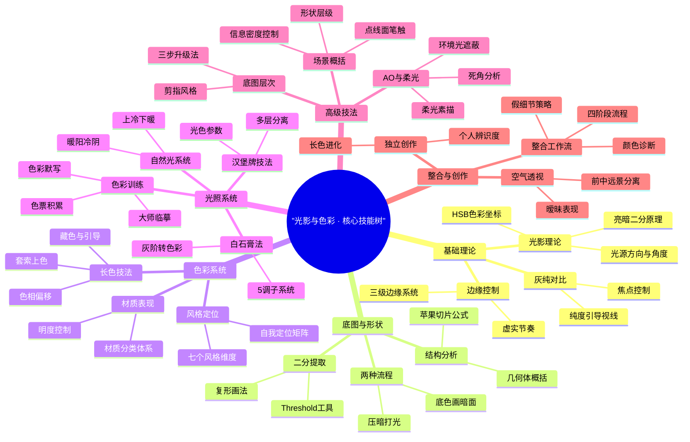

# 第20课：训练路径与技能树

## Learning Objectives

- 了解色彩课核心技能树全貌
- 理解色彩速写和精细素描两条并行训练路径
- 掌握精细素描的三层结构（结构素描→直射光→弱调子）
- 学会规划个人的训练路径
- 理解各模块之间的关联和递进关系
- 了解从"有逻辑长色"到"个人辨识度长色"的进化路径

## Core Idea

这是课程的最后一次课，但也是你**独立创作的起点**。技能树全景图展示了整个课程覆盖的所有核心能力——以及它们之间的依赖关系。理解这个地图，你就能根据自己的薄弱环节找到对应的训练方向。

### 一、整体技能树全景

**技能树的结构逻辑**：

- **从左到右**：从基础到高级的递进关系
- **从下到上**：从理论到实践的进化路径
- **颜色分组**：同色模块之间相互依赖、相互支持

### 二、色彩速写训练路径

色彩速写（Color Sketch）的训练路径重点在于**快速捕捉色彩印象**：

| 阶段 | 训练内容 | 目标 | 时间建议 |
|------|----------|------|----------|
| **入门** | 二分提取 + 3-5调子速写 | 建立"先亮暗后色彩"的思维 | 每天30分钟 × 2周 |
| **进阶** | 长色速写 + 套索上色 | 掌握色相偏移和藏色 | 每天45分钟 × 3周 |
| **高阶** | 大师色彩临摹 + 色票还原 | 理解大师的色彩逻辑 | 每天60分钟 × 4周 |
| **创作** | 自由创作色彩速写 | 形成个人色彩语言 | 持续练习 |

> [!TIP] Key Insight
> 色彩速写和精细素描是两个并行的训练轨道，**不能互相替代**。速写练的是"捕捉"——快速抓住色彩的整体印象；精细素描练的是"控制"——对光影和结构有精密的控制力。两者缺一不可。

### 三、精细素描三层训练结构

精细素描（Fine Drawing）的三层结构是通往高水平写实能力的关键路径：

```mermaid
flowchart LR
    subgraph Level1[”第一层：结构素描”]
        L1_A[”几何体分析”]
        L1_B[”比例与透视”]
        L1_C[”大形分割”]
        L1_Output[”能力：<br/>看得懂结构”]
    end

    subgraph Level2[”第二层：直射光素描”]
        L2_A[”强光源 → 强对比”]
        L2_B[”5调子系统”]
        L2_C[”清晰明暗交界线”]
        L2_Output[”能力：<br/>画得出光影”]
    end

    subgraph Level3[”第三层：弱调子素描”]
        L3_A[”漫射光 → 弱对比”]
        L3_B[”大面积中间调”]
        L3_C[”柔和过渡”]
        L3_Output[”能力：<br/>控得住微妙”]
    end

    Level1 -->|”打好结构基础”| Level2 -->|”建立光影能力”| Level3

    style Level1 fill:#4a6fa5,color:#fff
    style Level2 fill:#6a8fc5,color:#fff
    style Level3 fill:#8aafe5,color:#fff
```

| 层级 | 训练重点 | 参考课程 | 训练时长 |
|------|----------|----------|----------|
| **结构素描** | 几何体概括、比例分析 | [第07课](lessons/0007-structure-analysis) | 4-6周 |
| **直射光素描** | 5调子、清晰二分 | [第11课](lessons/0011-white-plaster-method) | 6-8周 |
| **弱调子素描** | 微妙过渡、大面积中间调 | [第16课](lessons/0016-ao-ambient-occlusion) | 8-12周 |

### 四、训练路径规划建议

根据不同的起点和目标，推荐以下训练路径：

**路径A：基础夯实型（推荐大部分学员）**

| 阶段 | 内容 | 每周投入 | 周期 |
|------|------|----------|------|
| 1 | 二分提取练习 + 结构分析 | 10小时 | 4周 |
| 2 | 白石膏法 + 5调子速写 | 10小时 | 6周 |
| 3 | 自然光系统 + 长色技法 | 12小时 | 6周 |
| 4 | 汉堡牌技法 + AO练习 | 12小时 | 4周 |
| 5 | 场景概括 + 整合工作流 | 15小时 | 4周 |

**路径B：技法突破型（已有一定基础）**

| 阶段 | 内容 | 每周投入 | 周期 |
|------|------|----------|------|
| 1 | 白石膏法 + 二分快速检查 | 8小时 | 2周 |
| 2 | 长色技法 + 大师临摹 | 10小时 | 4周 |
| 3 | 汉堡牌 + 自然光系统 | 10小时 | 4周 |
| 4 | 色彩创作 + 整合工作流 | 12小时 | 4周 |

**路径C：场景专攻型（目标是大场景创作）**

| 阶段 | 内容 | 每周投入 | 周期 |
|------|------|----------|------|
| 1 | 结构分析 + 直射光素描 | 10小时 | 4周 |
| 2 | 场景概括 + 形状层级 | 12小时 | 4周 |
| 3 | 空气透视 + 深度创造 | 10小时 | 3周 |
| 4 | 整合工作流 + 假细节策略 | 12小时 | 3周 |

> [!WARNING]
> 无论选择哪种路径，**不要同时进行超过2种训练**。每天1小时结构素描 + 1小时色彩速写已经足够。训练过多会导致注意力分散，反而进步缓慢。

### 五、从有逻辑长色到个人辨识度长色

长色技法（[第10课](lessons/0010-color-variation)）有两个发展阶段：

**阶段一：有逻辑的长色**
- 基于物理原理（光源色、环境色、材质特性）做色相偏移
- 特点是"有道理"——每个色彩变化都有物理依据
- 这是所有长色的基础，也是必须掌握的阶段

**阶段二：个人辨识度的长色**
- 在逻辑基础上加入个人审美偏好
- 特点是"有辨识度"——一看就知道是谁画的
- 这是高手的标志：长色不只有逻辑，还有个性

| 维度 | 有逻辑的长色 | 有辨识度的长色 |
|------|-------------|---------------|
| 基础 | 物理原理 | 物理原理 + 个人审美 |
| 色彩选择 | 可预测（基于光源/环境） | 有惊喜（但不出格） |
| 学习方式 | 通过分析大师作品学习 | 通过大量创作实践形成 |
| 标志 | "画得对" | "画得好，而且一看就是你的" |

### 六、四分法向二分法迁移

在色彩课的学习过程中，你经历了从**四分法到二分法**的思维迁移：

- **四分法**（初学阶段）：线稿 → 底色 → 二分 → 细化
- **二分法**（熟练阶段）：亮面 → 暗面 → 在此基础上添加变化

二分法的优势：

1. **决策更快**：只需要判断"亮还是暗"，而不是"这个调子在第几级"
2. **画面更整**：二分法天然产生大色块，避免琐碎
3. **适应性更强**：二分法适用于几乎所有光照条件

> [!TIP] Key Insight
> 四分法是"教学用"的训练轮，二分法是"实战用"的终极模式。从四分法到二分法的迁移是否完成，是判断你是否真正掌握光影的重要标志。

### 七、各模块之间的关联和递进关系

以下表格展示了课程各个重要模块之间的依赖关系和递进逻辑：

| 前置技能 | 后续技能 | 关联说明 |
|----------|----------|----------|
| 二分提取（第05课） | 白石膏法（第11课） | 白石膏法用二分提取技术做灰阶打光 |
| 结构分析（第07课） | 空气透视（第18课） | 结构分析是场景三层分离的基础 |
| 长色技法（第10课） | 汉堡牌技法（第15课） | 汉堡牌的光色分离需要长色意识 |
| 白石膏法（第11课） | 整合工作流（第19课） | 整合工作流含白石膏法作为第二阶段 |
| 自然光系统（第12课） | 场景概括（第17课） | 自然光理解是大场景概括的前提 |
| 边缘控制（第04课） | 整合工作流（第19课） | 假细节策略需要边缘控制能力 |

> [!TIP] Key Insight
> 课程虽然分20课、6个模块，但所有知识实际上是**一张网**——任何两个看似无关的技能之间都存在连接。每次练习时，问问自己："这个练习训练的是哪个技能？它的前置技能是什么？它又通向哪个更高级的技能？"——当你能够回答这些问题时，说明你已经真正理解了知识体系。

## Worked Example

### 制定个人训练计划

以一位完成全部课程学习的学员为例，制定一个12周的进阶训练计划：

| 周次 | 训练内容 | 时长/天 | 练习材料 |
|------|----------|---------|----------|
| 1-2 | 二分速写（每天3-5张） | 30分钟 | 照片/TV速写 |
| 3-4 | 长色速写（每天2-3张） | 45分钟 | 大师作品 / 照片 |
| 5-6 | 直射光素描（每周3张） | 60分钟 | 石膏像 / 人体照片 |
| 7-8 | 弱调子素描（每周2张） | 60分钟 | 室内场景 / 阴天人像 |
| 9-10 | 大师色彩临摹（每周1张） | 90分钟 | 大师作品 |
| 11-12 | 自由创作（每周1张完整稿） | 120分钟 | 自主创意 |

> [!QUESTION] Self-check
> 1. 整体的课程技能树分为哪几个大模块？
> 2. 色彩速写和精细素描有什么区别？为什么两者缺一不可？
> 3. 精细素描三层训练结构是哪三层？各自的训练重点是什么？
> 4. 从"有逻辑的长色"到"有辨识度的长色"需要经历什么变化？
> 5. 为什么最终要从四分法迁移到二分法？

查看答案

1. 六大模块：基础理论、底图与形状、色彩系统、光照系统、高级技法、整合与创作。
2. **色彩速写**练的是"捕捉"——快速抓住色彩的整体印象；**精细素描**练的是"控制"——对光影和结构有精密的控制力。速写让你敢于用色，精素描让你能用对色。两者结合才能既有速度又有精度。
3. 第一层**结构素描**（看得懂结构）、第二层**直射光素描**（画得出光影）、第三层**弱调子素描**（控得住微妙）。逐层递进，不可跳跃。
4. 从"基于物理原理做色彩偏移"到"在物理原理的基础上加入个人审美偏好"。前者是可以学习的，后者是通过大量创作实践逐渐形成的。
5. 四分法是教学用的训练工具，二分法是实战用的工作模式。二分法决策更快、画面更整、适应性更强。当你能用二分法思考时，你就不再需要四分法的训练轮了。

## 制定你的个人训练计划

课程到此结束，但你的训练才刚刚开始。请完成以下工作：

1. **回看技能树**：标记你在每个技能上的自评等级（1-5分）
2. **找出薄弱环节**：找出得分最低的3个技能
3. **查阅对应课程**：回到对应的课程章节重新学习
4. **制定12周计划**：参考上面的模板，制定你自己的12周训练计划
5. **设置里程碑**：每4周设置一个检查点，评估进步

完成以上5步后，你对课程的吸收和转化率会大幅提升。

## Next Step

恭喜你完成了色彩课全部20课的学习。这是一个重要的里程碑，但也是独立创作的起点。建议你：

1. 重新阅读 [[00-course-map|课程地图]]，回顾完整的知识框架
2. 回到簿弱章节重点复习（注意看每课的 Learning Objectives）
3. 开始建立自己的**作品集**——每周至少完成1张完整的色彩作品

祝你画出越来越好的作品。这只是一个开始。

---

*"学习绘画不是学会画某一样东西，而是学会看到每一束光。"*