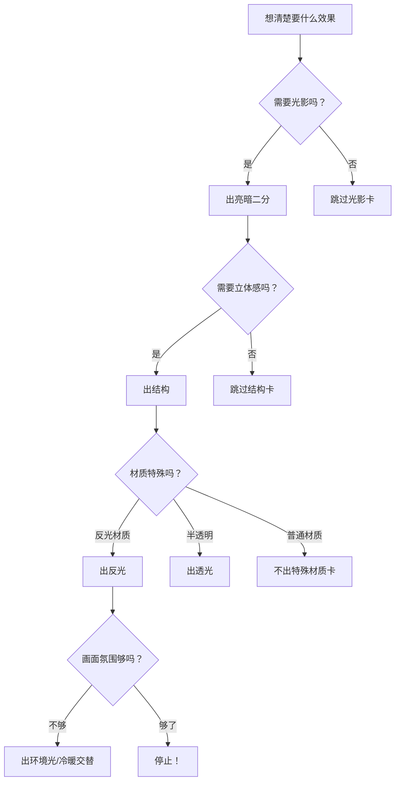

# 卡牌系统速查

## 核心理念

每个绘画技法相当于一张 **"卡牌"** 。画一张画时，不是每个技法都用上，而是**根据想要的效果，选择合适的卡牌组合**。

> [!tip] 就像一个卡牌游戏——你有全部卡牌，但每回合只出需要的几张。**不要为了出牌而出牌**，画面需要什么就出什么。

## 通用卡牌列表

| 卡牌 | 技法 | 描述 | 使用时机 |
|------|------|------|----------|
| 🃏1 | **亮暗二分** | 忽略中间调，只分亮面和暗面两大块 | 起稿阶段、快速素描、风格概括 |
| 🃏2 | **结构** | 刻画物体的体积感和转折面 | 需要表现立体感时 |
| 🃏3 | **反光** | 暗面收到环境光反射产生的亮区 | 光滑材质、金属、有环境光场景 |
| 🃏4 | **透光** | 光线穿过半透明材质（皮肤、树叶、耳廓） | 背光/逆光场景、半透明材质 |
| 🃏5 | **二级边** | 明暗交界线附近的次级边缘光 | 逆光、边缘光效果、增强体积感 |
| 🃏6 | **灰面** | 中间调的过渡区域，连接亮部和暗部 | 需要细腻过渡时、写实风格 |
| 🃏7 | **长色** | 颜色超出物体边界，互相渗透融合 | 色彩丰富的氛围、印象派风格 |

> [!warning] 卡牌之间是**可叠加**的。例如出"亮暗二分"+"反光"+"灰面"，既保留清晰的大关系，又有细节过渡。

## 特化卡牌列表

| 卡牌 | 技法 | 描述 | 使用时机 |
|------|------|------|----------|
| 🃏A | **色彩统一** | 用同一色系的颜色贯穿画面 | 需要和谐色调、单一光照环境 |
| 🃏B | **补色对比** | 在画面中加入互补色（红-绿、蓝-橙、黄-紫） | 需要强烈色彩张力时 |
| 🃏C | **环境光** | 根据环境光照调节色温 | 表现不同时间段/天气的光照 |
| 🃏D | **边界处理** | 控制边缘的虚实、软硬 | 区分主次、制造空间感 |
| 🃏E | **冷暖交替** | 亮部暖色/冷色 + 暗部冷色/暖色交替 | 增强色彩丰富度和空间感 |
| 🃏F | **空气透视** | 远处物体饱和度降低、明度提高、色相偏冷 | 表现景深和空间距离 |
| 🃏G | **视觉引导** | 通过色彩和明度的对比引导观者视线 | 构图需要、突出主体 |

## 风格卡牌组合示例

### Type 1：干净平涂风

| 出的牌 | 效果 |
|--------|------|
| 🃏1 亮暗二分 | 清晰的光影分区 |
| 🃏6 灰面（少量） | 少许过渡 |
| 🃏A 色彩统一 | 整体色调和谐 |

**特点**：卡牌用得少，画面干净利落，适合插图/角色设计

### Type 2：细腻写实风

| 出的牌 | 效果 |
|--------|------|
| 🃏1 亮暗二分 | 基础光影结构 |
| 🃏2 结构 | 体块转折 |
| 🃏3 反光 | 环境反射 |
| 🃏6 灰面 | 细腻过渡 |
| 🃏D 边界处理 | 虚实变化 |

**特点**：多张卡牌叠加，追求逼真感和立体感

### Type 3：氛围印象风

| 出的牌 | 效果 |
|--------|------|
| 🃏4 透光 | 半透明质感 |
| 🃏5 二级边 | 边缘发光 |
| 🃏7 长色 | 色彩渗透 |
| 🃏E 冷暖交替 | 丰富色感 |
| 🃏C 环境光 | 统一光源氛围 |

**特点**：强调色彩和氛围，适合场景、风景、情绪插图

### Type 4：极简风格

| 出的牌 | 效果 |
|--------|------|
| 🃏1 亮暗二分 | 仅光影两大面 |
| 🃏2 结构（略画） | 轻微体积提示 |

**特点**：仅用最少牌，抽象概括，适合速写练习或概念草图

## 卡牌组合策略

### "伤害够了就不要再丢牌"

> 核心原则：**画面效果达到目标后，不要再多加技法。**

```
画面太简单 ? → 加一张牌
效果够了  ? → 停！不要再加
画面太花  ? → 你加太多了
```

**常见问题**：
- 明明亮暗关系已经很清晰，非要再加反光和二级边 → 画面花掉
- 颜色已经丰富，非要再补色对比 → 色彩混乱
- 主体已经突出，非要再处理边界虚实 → 用力过度

> [!warning] "高手"和"新手"的区别之一：高手知道什么时候**停**。不把所有卡牌塞进一张画里——只出必要的牌。

### 选牌决策流程



## "葡萄与鼻屎"色彩理论

这个比喻帮助理解画面中颜色的"合适度"：

| 概念 | 解释 | 举例 |
|------|------|------|
| **葡萄** | 看起来舒服、自然的色彩 | 皮肤上自然的粉红、天空的蓝 |
| **鼻屎** | 换个位置看就成了脏色或丑色 | 灰色单独看很脏，但放在画面里就是完美的环境色 |

> [!tip] **没有真正"脏"的颜色，只有放错位置的颜色**。一个颜色被判断为脏，通常是因为：
> 1. **明度不对**——该亮的地方暗了，该暗的地方亮了
> 2. **色相不对**——与环境色不协调
> 3. **饱和度不对**——饱和度过高或过低

### 从"鼻屎"到"葡萄"

| 问题 | 修正方法 |
|------|----------|
| 颜色太脏（灰） | 增加饱和度或调整色相 |
| 颜色太跳（突兀） | 降低饱和度或向环境色偏移 |
| 颜色太闷（暗） | 提高明度，增加冷暖倾向 |
| 颜色太生（纯） | 降低明度或增加环境色倾向 |

> [!tip] 把"脏色"理解为"未完成色"。很多时候一个颜色看起来脏，只是因为**它旁边的颜色还没画上去**——把所有颜色都铺完再判断。