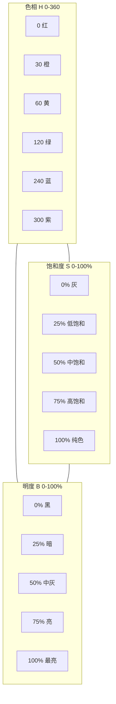

# HSB色彩量化系统

## HSB三参数定义

| 参数 | 全称 | 范围 | 含义 |
|------|------|------|------|
| **H** | Hue（色相） | 0°-360° | 色彩的相貌，如红、橙、黄、绿 |
| **S** | Saturation（饱和度） | 0%-100% | 色彩的鲜艳程度/纯度 |
| **B** | Brightness（明度） | 0%-100% | 色彩的明亮程度 |

> [!tip] 在Photoshop拾色器中，HSB是比RGB更直观的选色方式。调整颜色时优先动HSB滑块而非RGB滑块。

## HSB色彩模型示意



## 5×5 = 25格坐标选色系统

将**明度(B)** 与**饱和度(S)** 各分为5区，形成5×5网格。每个坐标 `(B区, S区)` 对应一种色彩倾向。

### 明度5区

| 区 | 范围 | 描述 |
|----|------|------|
| B1 | 0-20% | 深暗区——近乎黑色 |
| B2 | 20-40% | 暗部区——阴影用色 |
| B3 | 40-60% | 中间调区——物体固有色范围 |
| B4 | 60-80% | 亮部区——受光面 |
| B5 | 80-100% | 高光区——最亮处 |

### 饱和度5区

| 区 | 范围 | 描述 |
|----|------|------|
| S1 | 0-20% | 低饱和——接近灰色 |
| S2 | 20-40% | 中低饱和——柔和色 |
| S3 | 40-60% | 中饱和——自然色彩 |
| S4 | 60-80% | 中高饱和——鲜艳色 |
| S5 | 80-100% | 高饱和——纯色 |

### 5×5 坐标网格

|  | **S1 (0-20%)** | **S2 (20-40%)** | **S3 (40-60%)** | **S4 (60-80%)** | **S5 (80-100%)** |
|--|---------------|----------------|----------------|----------------|-----------------|
| **B5 (80-100%)** | (5,1) 浅灰白 | (5,2) 浅粉彩 | (5,3) 亮色 | (5,4) 明亮 | (5,5) 纯亮色 |
| **B4 (60-80%)** | (4,1) 灰亮 | (4,2) 柔和亮 | (4,3) 自然亮 | (4,4) 鲜艳亮 | (4,5) 纯色亮 |
| **B3 (40-60%)** | (3,1) 中灰 | (3,2) 柔和 | (3,3) 自然色 | (3,4) 鲜艳 | (3,5) 纯色 |
| **B2 (20-40%)** | (2,1) 灰暗 | (2,2) 柔和暗 | (2,3) 自然暗 | (2,4) 鲜艳暗 | (2,5) 纯暗 |
| **B1 (0-20%)** | (1,1) 近黑 | (1,2) 深灰 | (1,3) 深色 | (1,4) 深艳 | (1,5) 深纯 |

> [!tip] 记法：`(B区, S区)`，先说亮度再说饱和度。如 `(4,3)` 表示"亮部中饱和"。

## 色相分区

| 色相 | H范围 | 代表色 | 先天明度 | 特点 |
|------|-------|--------|---------|------|
| 红 | 0/360±15 | 赤 | **暗** | 波长长，视觉上偏重 |
| 橙 | 30±15 | 橙 | 较亮 | 暖色，明度中等偏高 |
| 黄 | 60±15 | 黄 | **最亮** | 先天明度最高的色相 |
| 绿 | 120±30 | 绿 | 中等 | 视觉上最舒适 |
| 青 | 180±15 | 青 | 较亮 | 冷色，明度适中 |
| 蓝 | 240±30 | 蓝 | **暗** | 先天明度低，接近暗部色 |
| 紫 | 300±15 | 紫 | 暗 | 最暗色相之一 |

> [!warning] 同等级HSB坐标下，不同色相的"视觉明度"不同。例如黄色(5,3)会比蓝色(5,3)看起来亮得多——这是**先天明度差异**，选色时必须补偿。

## 坐标判断训练方法

### 训练1：数值→视觉

看一个HSB坐标，在脑中想象它的颜色，然后实际调色对比。

**练习**：闭眼想象以下坐标的颜色，再在PS中验证：

- (3,3) 中明度中饱和 → 一个自然的颜色
- (5,1) 高明度低饱和 → 浅白色
- (2,5) 低明度高饱和 → 深纯色（如深红）
- (1,2) 低明度低饱和 → 深灰色

### 训练2：视觉→数值

看一张参考图或照片，判断其中某个色块的HSB坐标。

**步骤**：
1. 先用吸管工具取色，看HSB值
2. 遮盖数值，目测判断坐标
3. 反复对比，校准眼睛

### 训练3：色彩波动辨识

画一条色带，观察色相变化时S和B的波动。注意同色线（等H）上的S/B变化。

## HSB坐标容错优先级

选色不要求100%精确，关键是要"在正确的方向上"：

| 优先级 | 参数 | 说明 |
|--------|------|------|
| 🥇 **最高** | **明度 (B)** | 明度错了，画面会"花掉"或"糊掉"，黑白关系崩坏 |
| 🥈 **次之** | **饱和度 (S)** | 饱和度错一点问题不大，只要大致在正确的范围内 |
| 🥉 **最低** | **色相 (H)** | 色相小偏差（±5-10°）不影响整体效果 |

> [!tip] 选色顺序：**先定明度，再定饱和度，最后微调色相**。明度决定画面结构，饱和度决定色彩感，色相决定色味。

## 两到三次颜色捕捉法

目标是**用最少次数找到目标颜色**，而非慢慢拖动滑块瞎碰。

### 两次捕捉法

| 步骤 | 操作 | 说明 |
|------|------|------|
| 1 | 目测目标颜色的明度B | 判断它在B1-B5哪个区 |
| 2 | 一次跳跃到正确的(B, S)区域 | 先忽略色相微差 |
| 3 | 微调色相H | 最后修正色味 |

### 三次捕捉法

| 步骤 | 操作 | 目标 |
|------|------|------|
| 1 | 定明度B | 调到目标明度区 |
| 2 | 定饱和度S | 调到目标饱和度区 |
| 3 | 调色相H | 微调到目标色相 |

> [!tip] 优秀画师的选色看起来精准，不是因为天赋，而是因为**判断路径清晰**。每次调色都带着明确的意图（"我要把明度从3调到4"），而不是乱拖滑块。

## 同等级色相先天明度差异

即使HSB坐标中的B值相同，不同色相在视觉上明度也不同：

```mermaid
%%{init: {”flowchart”: {”htmlLabels”: true}} }%%
graph LR
    Yellow[”黄 (B5) 最亮”] --> Green[”绿 (B4)”]
    Green --> Cyan[”青 (B4)”]
    Cyan --> Orange[”橙 (B3)”]
    Orange --> Red[”红 (B2) 暗”]
    Red --> Blue[”蓝 (B1) 最暗”]
    Blue --> Purple[”紫 (B1) 最暗”]
```

**补偿方法**：
- 画黄色物体时，即使暗部也需要保持较高的明度
- 画蓝色物体时，亮部实际B值需要比看起来更高才能显得"亮"
- 在5×5网格中，蓝色物体需要选高1-2格的B值才能与其他色相视觉平衡

## HSB网格选线色法（线稿用色）

给线稿上色时，固有色和线色的关系：

| 步骤 | 操作 | 说明 |
|------|------|------|
| 1 | 确定固有色的HSB坐标 | 如 (3,3) 中明度中饱和 |
| 2 | 线色 = 固有色 **右下移1-1.5格** | 即明度降低1格 + 饱和度提升0-1格 |
| 3 | 示例 | 固有色(3,3) → 线色大约(2,3)到(2,4) |

> [!tip] 线色比固有色更暗更饱和一些，能让线条在颜色之上仍然清晰可见。这个规律来自**色彩透叠**（线色透过固有色显现）的效果。

## 色彩波动辨识训练

**目标**：训练眼睛观察色块在色相切换时出现的S/B"跳动"。

**训练方法**：
1. 在画布上绘制一条水平的色相渐变带（H从0→360）
2. 保持S和B固定不变（如S=80, B=80）
3. 观察黄色区域看起来"亮一截"，蓝紫色区域看起来"暗一截"
4. 尝试手动补偿——在黄色区域降低B值，在蓝色区域提高B值，使色带视觉上亮度一致

**意义**：理解先天明度差异后，在为不同色相物体设计光影时，能准确判断各部分的明度关系，避免"全图画完才发现明度关系不对"。

> [!tip] 日常训练：看到任何颜色，在脑中快速判断其HSB坐标。养成这个习惯后，选色速度会质的提升。