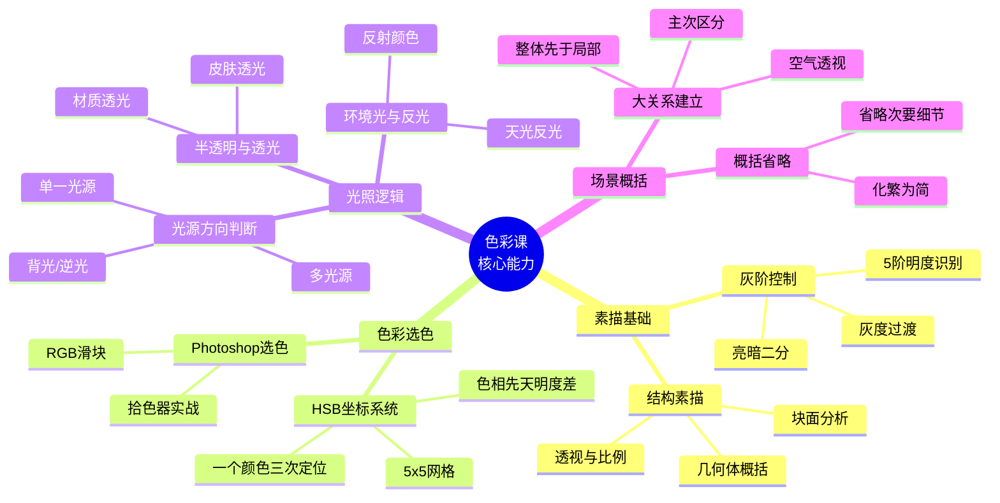
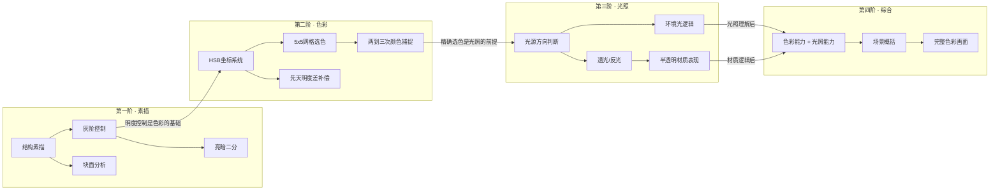
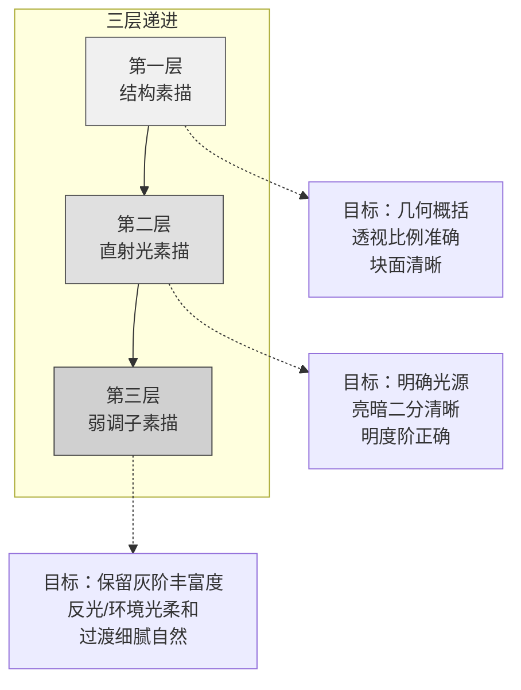

# 技能树全景

## 色彩课核心能力图谱



## 技能依赖关系



> [!warning] 技能树有**强依赖关系**。不要跳阶——素描基础没打好就学色彩，会同时遇到明度问题和色彩问题，事倍功半。

## 各技能详解

### 第一阶：素描基础

| 技能 | 核心要求 | 训练方法 |
|------|----------|----------|
| **结构素描** | 用几何体概括复杂形状，理解透视与比例 | 临摹几何体组合、分析参考图的结构 |
| **灰阶控制** | 能分辨并画出5个以上明度层次 | 5×5网格填色练习、临界值检查 |
| **亮暗二分** | 忽略中间调，仅用亮面和暗面表现体积 | 快速起稿练习、限时速写 |
| **块面分析** | 将曲面分解为平面块面 | 石膏像/静物的块面化绘制 |

### 第二阶：色彩基础

| 技能 | 核心要求 | 训练方法 |
|------|----------|----------|
| **HSB坐标系统** | 理解H/S/B三参数，能用坐标描述颜色 | 坐标目测训练、视觉→数值转换 |
| **5×5网格选色** | 快速判断颜色的(B, S)区域 | 参照物选色、三次捕捉法训练 |
| **先天明度差补偿** | 知道不同色相的视觉明度差异并补偿 | 色相渐变带绘制、等B值对比训练 |
| **饱和度控制** | 能控制颜色的灰度和鲜艳程度 | 调色盘练习、饱和度渐变练习 |

### 第三阶：光照逻辑

| 技能 | 核心要求 | 训练方法 |
|------|----------|----------|
| **光源方向判断** | 根据阴影和受光面判断光源 | 单光源素描、多光源场景分析 |
| **透光感** | 表现背光下半透明材质的光线穿透 | 手指/耳朵透光观察、临摹照片 |
| **反光与环境光** | 暗部的环境反射光处理 | 金属材质练习、环境色影响分析 |
| **二级边** | 明暗交界线附近的边缘发光效果 | 逆光参考临摹、边缘光强化练习 |

### 第四阶：综合概括

| 技能 | 核心要求 | 训练方法 |
|------|----------|----------|
| **色彩场景概括** | 用最少色块表达丰富色彩关系 | 小色稿练习、5分钟限时色彩速写 |
| **空气透视** | 通过饱和度/明度/色温表现空间 | 风景照片分析、远中近景色彩对比 |
| **主次控制** | 明确画面视觉中心并强化 | 对比度分配练习、视点引导设计 |

## 训练路径建议

### 推荐学习顺序

```
Month 1-2:  结构素描 + 灰阶控制
                ↓
Month 3-4:  HSB色彩系统 + 5×5网格选色
                ↓
Month 5-6:  光源逻辑 + 透光/反光练习
                ↓
Month 7+:   综合概括 + 完整色彩画面
```

### 色彩速写训练路径

色彩速写是提升效率的最佳训练方式：

| 阶段 | 内容 | 时间限制 | 频率 |
|------|------|----------|------|
| 1 | **灰阶速写**——只画黑白明度，不涉及色彩 | 15分钟/张 | 每天2张 |
| 2 | **单色速写**——用一种色相的各种明度/饱和度画 | 20分钟/张 | 每天1张 |
| 3 | **两色速写**——两种色相（如暖色亮部+冷色暗部） | 20分钟/张 | 每天1张 |
| 4 | **限色速写**——限定4-6种颜色完成全图 | 30分钟/张 | 每天1张 |
| 5 | **全色彩速写**——不限制颜色，追求快速捕捉色彩氛围 | 30-45分钟/张 | 每天1张 |

> [!tip] 色彩速写的关键在于**时间限制**。限时压迫你必须快速做决定——这恰恰是训练"HSB坐标判断"和"两到三次颜色捕捉"的最佳场景。

### 精细素描三层结构

精细素描训练分为三个层次，逐层叠加：



| 层次 | 重点 | 用时参考 | 常见错误 |
|------|------|----------|----------|
| **结构素描** | 准不准、比例对不对、透视舒不舒服 | 60%的时间 | 一上来就抠细节，忽略整体比例 |
| **直射光素描** | 光源在哪、亮暗分界线在哪里、二分够不够干脆 | 25%的时间 | 亮暗面分不开，中间调过早介入 |
| **弱调子素描** | 灰面过渡是否自然、反光是否合适 | 15%的时间 | 弱调子盖过了直射光，画面变模糊 |

> [!warning] 三层结构是**先后顺序**而非"最后合并"。每一层完成并验证后才进入下一层。常见陷阱是在第一层（结构）还没解决时就跳到第三层（弱调子），导致结构问题被灰面掩盖。