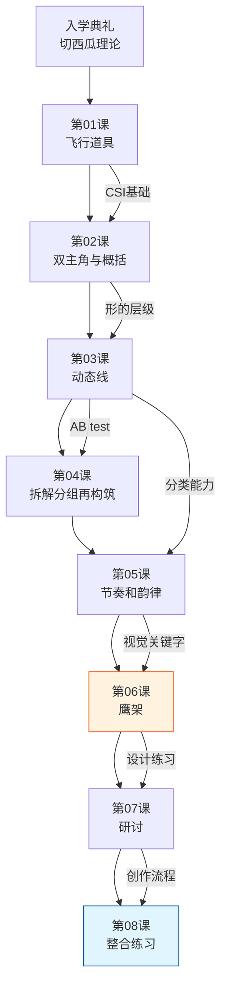

# 课程地图

## 知识依赖关系

## 三大知识模块

### 模块一：框架与工具（L1-L2）
| 概念 | 对应课程 | 掌握程度 |
|------|----------|----------|
| 人物+舞台+飞行道具+亮点 | L1 | 记忆+应用 |
| 三的定理（大中小+错落+重叠） | L1 | 记忆+应用 |
| 趋势（Flow）概念 | L1 | 理解+分析 |
| CSI用笔 | L1-L2 | 应用 |
| 形的层级（一/二/三级形） | L2 | 理解+分析 |
| 双主角/点景 | L2 | 理解 |
| 死角 | L2 | 应用 |

### 模块二：动态与构成核心（L3-L5）
| 概念 | 对应课程 | 掌握程度 |
|------|----------|----------|
| 趋势→图形→结构 | L3 | 理解+应用 |
| AB test | L3 | 记忆+应用 |
| D字型/知字型/风字型 | L4 | 应用 |
| 直曲对比 | L4 | 理解+应用 |
| 拉伸与挤压 | L4 | 应用 |
| 枕头模型 | L4 | 理解 |
| 布料/发片/特效研究 | L4 | 应用 |
| 重复/不重复图形 | L5 | 应用 |
| 基本形 | L5 | 理解 |
| 视觉关键字 | L5 | 应用 |

### 模块三：整合与创作（L6-L8）
| 概念 | 对应课程 | 掌握程度 |
|------|----------|----------|
| 鹰架（丰富的穿插） | L6 | 理解+应用 |
| 视觉导引 | L6 | 应用 |
| 八字回游（木下） | L6 | 理解+应用 |
| 设计练习流程 | L6 | 应用 |
| 系列作规划 | L7 | 理解 |
| 视觉关键字与选品 | L7 | 应用 |
| 摸鱼vs习作vs创作 | L8 | 理解 |
| 图形vs结构思维 | L8 | 理解+应用 |
| 复合咏唱 | L8 | 应用 |

## 学习建议

1. **循序渐进**：按课次顺序学习，每课内容建立在前一课基础上
2. **重练习**：每课作业是内化知识的关键，不要只看不画
3. **AB test**：养成做对比实验的习惯，验证理解
4. **建立分类能力**：有意识地分析优秀作品，归纳类型
5. **组合咏唱**：后期尝试将多种技巧同时运用

## 相关笔记

- [[index|课程首页]]
- [[reference/glossary|术语表]]
- [[reference/krenz-framework|Krenz构成框架总览]]