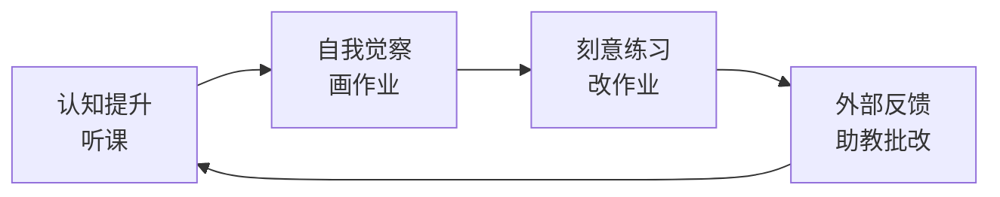
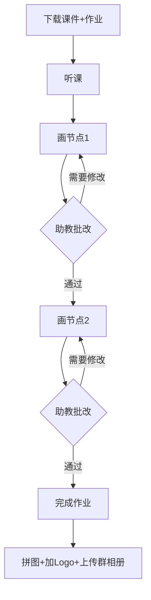

# 第00课：入学典礼（切西瓜理论）

## 课程概览

本课是Krenz动态与构成第14期的入学典礼，由主持人奈奈和教务负责人瑞宁主讲，后半段由猫猫虫老师分享助教交互的正确方式。课程核心是**建立学习认知框架**，而非具体的绘画技法。

> [!tip] 核心隐喻：切西瓜理论
> 学画画就像切西瓜——**从大到小、层层深入**，而不是一上来就雕花。

---

## 一、切西瓜理论（知识四分类）

猫猫虫老师提出的"切西瓜理论"是整个课程学习方法论的基石。她把学习知识分为四个层次：

| 知识类型 | 切西瓜比喻 | 对应画画的环节 | 关键动作 |
|---------|-----------|--------------|---------|
| **事实知识** | 西瓜熟了有什么特征 | K大讲课 | 听课接收信息 |
| **概念知识** | 切西瓜的图文教程 | 课件/作业攻略 | 理解步骤原理 |
| **程序知识** | 自己动手切西瓜 | **画作业** 💪 | 亲手实践 |
| **后设认知** | 复盘西瓜甜不甜、切得好不好 | **助教反馈** | 自我评估+外部反馈 |

> [!warning] 最重要的环节
> 四个环节中，**程序知识（画作业）** 是最容易被忽视但最关键的。听课100遍不如动手画1遍。很多学员"听懂了但画不出来"，问题就出在跳过或压缩了实操环节。

### 完整学习循环

这个循环每转一圈，你的水平就进步一点点。进步往往是**不易察觉**的——就像头发每天都在长，但只有隔一段时间没见的朋友才会发现"你头发长长了"。[^1]

[^1]: 猫猫虫老师的原话：不要在意昨天和今天进步了多少，把时间拉长到两个月去看，你一定在进步。

---

## 二、课程结构与重要节点

### 时间线总览

| 项目 | 时间 | 说明 |
|-----|------|------|
| 正课 | 4/25 - 6/13 | 每周五晚8点，Krenz主讲，共8节 |
| TA小灶课 | 第二周起每周三晚8点 | 西哥特老师 & 越安陈老师主讲，共9节 |
| 改图服务 | 截止 6/27 | 最后一堂课结束后延长两周 |
| 回放有效期 | 截止 12/13/2025 | 半年内可随时观看 |

### 授课团队分工

- **Krenz（KK子）**：正课主讲，负责传授事实知识
- **助教老师**：批改作业，提供后设认知反馈
- **万事屋（教务）**：解决课程服务问题（联系方式：KK团子800开头号码）
- **绿卡志愿者**：协助维护班级群秩序，帮忙撤回错发消息

---

## 三、参考图的正确使用方式

> [!note] 临摹 vs 抄袭
> - **临摹**：以学习为目的，分析拆解原作的结构、趋势、图形逻辑，用自己的理解重新组织
> - **抄袭**：直接复制粘贴，未经消化就当作自己的成果

学习过程中需要使用参考图时，建议遵循以下原则：
1. **先理解再动笔**：分析参考图的大趋势、大图形、大中小关系
2. **不要照单全收**：主观筛选你需要的元素，省略不必要的细节
3. **加入自己的处理**：同样的参考图，不同人的理解应该画出不同的结果

---

## 四、好宝宝制度与DLC

### 好宝宝成就

**达成条件**：在6/27前通过并提交全部8节课作业 + 1篇学习心得

- 一门课达成 = 一宝
- 两门课达成 = 二宝
- 三门课（透视+色彩+构成）= **KK三宝** 🏆

三宝奖励包含所有课程的好宝宝礼物，Zero yen带回家。

> [!tip] 好宝宝的本质
> 好宝宝制度是为了鼓励**持续练习和思考**，不是为了礼物才做作业。最大的奖励是你收获的知识本身。

### DLC（生命不息改图不止）

DLC是正课结束后延长课程服务的选项，适合：
- **滑产同学**：没能在正课期间完成作业
- **深造同学**：想要更高难度的补充练习 + 助教分享

DLC的作业要求：正课8份作业 + DLC 8份作业 + 1篇心得。

---

## 五、作业提交规范

### 核心原则

1. **不跳节点**：作业分步骤提交（节点1→节点2→节点3），助教确认通过再进入下一步
2. **图片和留言一起发**：方便助教了解你的问题
3. **不@助教**（除非漏改）：直接用群内提交功能
4. **避免敏感题材**：不色色、不血腥、不暴力，保护群环境

### 作业流程

---

## 六、与助教的高效沟通

猫猫虫老师的建议：

- **提问时带图**：一张图胜过千言万语
- **问题编号**：整理成1/2/3点，助教更容易作答
- **鼓励使用群昵称前缀**：
  - `求严格`——希望被高标准要求
  - `求宽松`——时间有限，希望重点关注主要问题
- **不要提矛盾要求**：不能同时"求严格"又"求宽松"

> [!example] 有效提问示范
> ❌ "助教老师，我这里画不好怎么办？"
> ✅ "助教，我这张作业的节点1（附截图），我觉得人物的动态趋势不够流畅，特别是肩膀到腰的Flow，请问应该怎么调整？"

---

## 课后练习

点击展开

### 练习1：整理学习环境

1. 下载并安装/更新直播云客户端
2. 确认你能进入两个教室（直播教室 + 录播教室）
3. 找到班级群内的群文件和课件下载入口

### 练习2：设定学习目标

写下你对这门课的三个期待（具体且可量化）：

1. 例：我希望学会如何设计人物周围的装饰元素
2. _________________
3. _________________

### 练习3：建立笔记系统

Krenz推荐使用 **Xmind思维导图** 来整理课堂笔记：
- 第一步：手写笔记（记忆效果优于打字）
- 第二步：整理成思维导图（建立概念之间的层级关系）
- 第三步：隔一段时间再整理成电子版（加深记忆）

