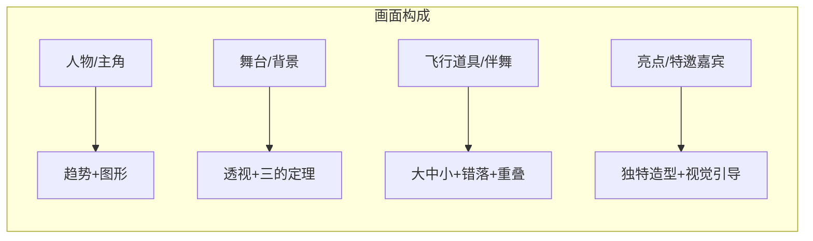
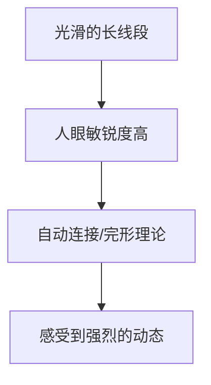
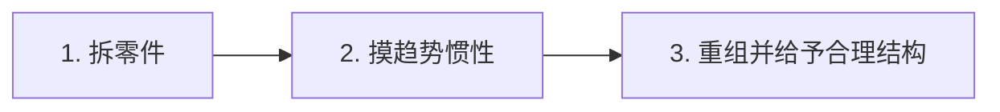
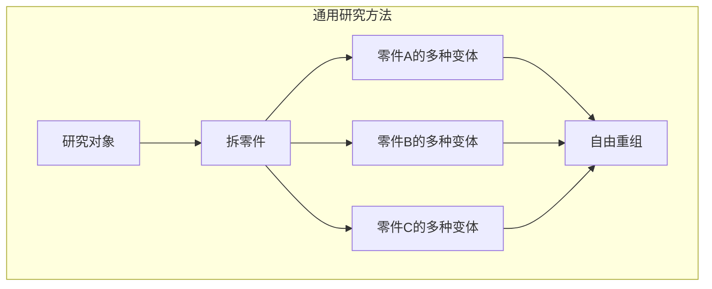

# 第01课：飞行道具

> [!note] 本课定位
> 第一堂课的核心目标是**铺开整张地图**——Krenz把动态与构成的全部关键概念一次性展示给你，让你对整个课程的结构有一个全局认知。后面的课程逐一深入每个知识点。

---

## 一、核心框架：演唱会比喻

Krenz用**演唱会**来解释一张插画的四个组成要素：

| 要素 | 画面角色 | 比喻 | 优先级 |
|------|---------|------|--------|
| **人物（主角）** | 画面主体角色 | 主唱歌手 | 核心，必须先画好 |
| **舞台（背景）** | 占据60-70%面积的大块背景 | 演唱会舞台 | 营造氛围 |
| **飞行道具（伴舞）** | 重复出现的小物件（鸽子/金鱼） | 伴舞舞群 | 增加信息量 |
| **亮点（特邀嘉宾）** | 造型独特、只出现一次的物件 | 特别来宾 | 吸引目光 |



> [!tip] 哥布林比喻
> 飞行道具就像游戏里的**普通哥布林**（重复出现，不特别重要），亮点则是**精英哥布林**（稀有怪，画面吸睛点）。这个区分帮助你决定**在哪个物件上投入更多精力**。

---

## 二、三的定理

当重复出现的体块一起出现时，有三个原则让排列不无聊：

### 原则1：大中小（Size Variation）

同样的三个方块，"一样大小" vs "大中小排列" vs "中大小排列"——后者自然产生高低起伏，比前者更有节奏感。

### 原则2：错落（Stagger）

把顶部和底部错开，让上方趋势和下方趋势都有变化，画面更有动态。

### 原则3：重叠（Overlap）

把物体叠在一起，让外轮廓产生变化，同时自动获得**前后遮挡关系**：

```
练习场景：画对话框圆圈
❌ 新手常见：三个一样大的圆圈，不敢遮住角色，分散排列
✅ 进阶做法：大中小圆圈，部分重叠，敢遮住角色的一小部分
```

> [!example] Krenz示范
> 课堂上Krenz在白背景上画了一个角色，然后在角色周围摆对话框圆圈：
> 1. 先排大中小 → 有高低起伏
> 2. 再做错落 → 上下趋势都有变化
> 3. 加重叠 → 圆圈轮廓变有趣，还免费得到了前后遮挡
>
> 当把圆圈换成鸽子、换成金鱼，同一个排布逻辑可以直接复用——这就是**填坑**（填空）技巧。

---

## 三、趋势（Flow）

### 什么是趋势

趋势（Flow / Line of Action）是画面中引导视线流动的**隐性线条**。Krenz特别强调：**趋势不只存在于人物身上，整张图都有趋势**。

### 趋势的层级

| 层级 | 例子 | 说明 |
|-----|------|------|
| **大趋势** | 头→肩膀→身体→腰的连线 | 决定整个动作的大方向 |
| **中趋势** | 袖子的轮廓、手臂的骨头方向 | 在大趋势内的局部流动 |
| **小趋势** | 衣服皱褶的长短疏密 | 细节层面的节奏控制 |

### 速写的正确顺序

```
趋势 + 形状 → 结构 → 细节
  优先         次之    最后
```

Krenz特别指出：很多学员画不好动态，是因为**把顺序搞反了**——还没抓准大趋势就开始刻画肌肉结构，结果动作僵硬不流畅。

> [!warning] 常见误区
> 画人物时先画很多结构（肌肉、骨骼），导致**大动态没出来**。应该优先捕捉趋势，再用结构去填充。顺序错了，动作就会"不够顺畅"。

### 长线段与完形理论

人眼对**光滑流畅的长线段**非常敏感。优秀的插画家会在画面中"藏"这些光滑的线，利用**完形理论**（即使线段中断，人眼也会自动连接），让观者感受到强烈的动态感。



---

## 四、CSI用笔与直曲对比

### CSI三种线型

| 类型 | 名称 | 感受 | 应用 |
|-----|------|-----|------|
| **C** | Curve（弧线） | 柔和、自然 | 头发、布料、鱼尾巴 |
| **S** | S-curve（S形线） | 优雅、流动 | 动态线、飞行轨迹 |
| **I** | Straight line（直线） | 坚毅、强调 | 铠甲、机械、需要突出的部分 |

### 直曲对比

在一张以曲线为主的画面中加入直线（或以直线为主中加入曲线），那条异类会**特别显眼**——这就是"直曲对比"的原理。

> [!example] 老虎改造案例
> Krenz的朋友老丁画了一只老虎，轮廓基本上是C曲线占90%。Krenz建议把轮廓的直线（I）比例提升到60%以上，老虎给人的感觉立刻从"柔和可爱"变成了"坚毅强悍"。同一个轮廓，**调整C/I比例就能改变气质**。

### 动态线的设计

最简单的动态线设计公式：
1. 一条主要趋势（偏直）
2. 搭配一条C形线
3. 再搭配一条S形线穿插

这样就形成了**旗杆+旗帜**的效果——竿子是直的，布料是曲的。

---

## 五、线稿层级

> [!note] 核心洞见
> 线稿好看的关键不是"一笔出细"的控笔技巧，而是**线稿的层次感**。

### 三级形

| 层级 | 笔刷粗细 | 绘制内容 | 示范 |
|-----|---------|---------|------|
| **一级形**（外轮廓） | 最粗（如7px） | 人物/物体的外框 | 先用粗线画出整体剪影 |
| **二级形**（内切割） | 中等（如5px） | 衣服分割、领带形状、头发分片 | 在外轮廓内部做分区 |
| **三级形**（小结构） | 最细（如2-3px） | 皱褶、排线、五官细节、死角 | 最后补细节，提点即可 |

### 实操方法

```
1. 把底图调淡
2. 关闭笔刷感压（全画等粗线）
3. 先用一级笔（最粗）画出外轮廓
4. 换二级笔（中等）做内切割
5. 换三级笔（最细）刻画细节
```

> [!tip] 为什么要关感压？
> 初学者太早追求"中间粗两边细"的完美线条是**次要目标**。先学会用三种不同的**固定粗细**笔刷建立层次，画面品质就会有质的飞跃。粗细变化可以后期用橡皮擦调整。

### 风格实验

Krenz展示了同一副轮廓使用两种不同内部线条模式的效果：

| 风格 | 特点 | 代表作者 |
|-----|------|---------|
| **Jump系（少年漫画）** | 内部多短线条、倒钩线、点状线 | 电锯人（藤本树） |
| **少女漫画系** | 内部多长线条、更纤细 | 白滨鸥、大友克洋 |

同样的轮廓，内部的**短线/长线比例**不同，就形成了完全不同的风格。

---

## 六、金鱼研究案例（完整方法论）

这是第一堂课作业的核心——用**研究方法**研究金鱼，增加你的"元素库"。

### 研究三步骤



### 第一步：拆零件

观察金鱼，把它拆成三个基本零件：

```
金鱼 = 身体（纺锤形/鲷鱼烧形）
     + 鱼鳍（五边形）
     + 尾巴（S形/C形交汇的破片）
```

### 第二步：摸趋势惯性

研究鱼尾巴时，发现尾巴画来画去可以用**三种基本造型**概括：

| 类型 | 尾巴特征 | 相似物 |
|-----|---------|--------|
| A型 | 偏直的扇形 | 普通金鱼 |
| B型 | 扭转较严重的S形 | 飘飞的头发 |
| C型 | 扇得很开的C形 | 裙摆/翅膀 |

> [!note] 触类旁通
> 鱼尾巴的造型规律和**头发、翅膀、裙摆**高度相通。研究透了一个，就能举一反三。

### 第三步：重组

实战时，从你的"元素库"中分别提取：
- 身体的某种造型（立体感的鱼身）
- 鱼鳍的某款五边形
- 尾巴的某款（A/B/C型）

自由组合，就能画出**多种不同造型的金鱼**。

### 这个研究方法不仅限于金鱼

Krenz展示了韦叶老师研究**灯**的案例：灯也可以拆成灯罩 + 灯身 + 底座，自由重组。



---

## 七、飞行道具实操：S型线填坑

### 作业目标

给定：一个横向构图的美少女角色 + 一条预设的S型曲线

任务：用**飞行道具**填满这条S线，使画面有隐性的流动趋势

### 可行方案（从简单到进阶）

| 方案 | 具体做法 | 难度 |
|-----|---------|------|
| **丝带** | 画一条飘舞的丝带顺着S线 | ⭐ |
| **布料** | 晒衣绳上的布料/旗帜/布幔 | ⭐⭐ |
| **相同物件排列** | 用大小变化的**鸽子/金鱼**排成S形轨迹 | ⭐⭐ |
| **物件+轨迹线** | 鸽子群 + 羽毛碎屑点缀 | ⭐⭐⭐ |
| **烟雾/法术** | 利用烟雾的流动性填补空隙 | ⭐⭐⭐ |
| **综合运用** | 不同元素组合，注意大中小+错落+重叠 | ⭐⭐⭐⭐ |

### 操作流程

```
1. 先画好人物（注意趋势和图形）
2. 预设S型线（这是你要达成的隐线）
3. 用三的定理摆放飞行道具（大中小+错落+重叠）
4. 填空：在圆圈位置填入鸽子/金鱼
5. 检查：关闭S型线，看看趋势是否自然流动
```

---

## 课后练习

<details>
<summary>点击展开</summary>

### 练习1：S型线填坑

1. 准备一个简单的人物角色（比例不重要，重点是趋势感和轮廓清晰）
2. 在角色旁边画一条S型曲线
3. 尝试用三种不同的方式填满这条S线：
   - 方式A：用大小变化的圆圈排列
   - 方式B：用鸽子（或任意飞鸟）替换圆圈
   - 方式C：综合运用不同元素（鸟+羽毛+丝带）
4. 比较三种方式的效果差异

### 练习2：金鱼研究

参照课堂示范的三步法：

1. **拆零件**：找3-5张不同金鱼的参考图，把它们拆成身体/鱼鳍/尾巴
2. **摸趋势惯性**：画出鱼尾巴的3种不同形变方案（A/B/C型）
3. **重组**：从你的元素库中自由组合出3条造型各异的金鱼

### 练习3：线稿层级实验

选一张你之前画过的图（人物为主）：

1. 版本A：使用"一级形7px + 二级形5px + 三级形2px"的三级线稿规则重画
2. 版本B：尝试换成"一级形5px + 二级形3px + 三级形1px"的细线方案
3. 对比两个版本，观察外轮廓与内部细节的层次差异

### 练习4：三的定理观察

在生活中找出三个重复出现的物体（可以是书架上的书、桌上的水杯、窗外的建筑），用三的定理分析它们：

- 它们满足「大中小」了吗？
- 它们有「错落」吗？
- 你能否通过调整它们的位置制造「重叠」？

</details>

---

## 关联笔记

- [[0000-orientation]] — 入学典礼中的研究方法论与切西瓜理论
- （后续课程待补充）

---

> [!warning] 第一堂课核心金句
> "构成教会你的不是画法，而是一套**分析的方法**和**思考的层级**——让你知道自己在画什么、为什么这么画，而不是凭感觉乱画。"
> ——Krenz