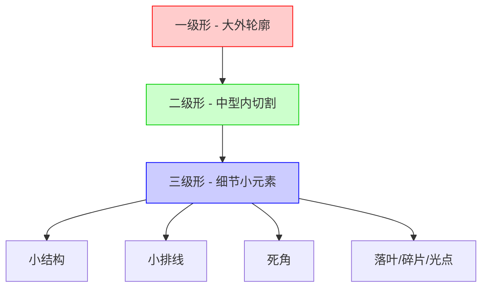
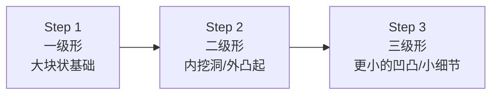
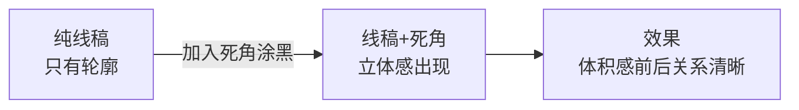

# 第02课：双主角与浅谈概括

> 专业人士看一张图，同时看到两样东西：**表象的具体内容**和**抽象的几何构成**。第二堂课就是帮你打开第二只眼。

---

## 课前提醒：先做单点练习，不要急着综合

在进入正题前，Krenz老师先打了一剂**预防针**：很多同学学完第一课后会焦虑"我用不出来怎么办"。

> [!warning] 学习节奏提醒
> 你现在处在**背单词和简单文法的阶段**，不要急着上街和日本人对话。把色彩和黑白灰的参数暂时排除，先专注在线条本身——这就是"**做研究**"。

每做一次分析，经验值+1。等到等级提升后，你自然会感受到进步。这不是一蹴而就的事。

---

## 一、形的层级（Levels of Shapes）

### 1.1 什么是形的层级

一张图里的所有视觉元素，可以按面积大小分为三个层级：

| 层级 | 面积 | 功能 | 范例 |
|------|------|------|------|
| **一级形** | 最大 | 画面的主要块状/剪影 | 人物整体、太空船主体 |
| **二级形** | 中等 | 内部切割、结构区分 | 衣服皱折、翅膀分片、树根的分叉 |
| **三级形** | 最小 | 细节、精致感的来源 | 眼睛睫毛、小排线、死角黑块、飘落的花瓣 |

### 1.2 三级形的四种具体形式

Krenz老师特别强调三级形的概念。**人们在看一张图时，会下意识寻找画面中最小的色块，并将它当作细节的衡量标准。**

三级形在画面中通常表现为以下四种形式：

1. **小结构**（Small Structures）：真实存在的细小零件，如蝴蝶结、小金属片、复杂的饰品
2. **小排线**（Hatching）：以短线排线增加信息量，即使不完全符合真实结构，也能"骗过"观众眼睛
3. **死角**（Dead Angles）：后面会详细讲
4. **落叶/碎片**（Debris）：飘落的花瓣、羽毛、小光点、气泡等飞行道具的延伸

> [!tip] 细节的秘密
> 要让画面精致，关键是**最小的单位要画得足够小**。如果你画头发的色块总是很大块，就很难精致。擅长细节的人会用很小的小笔，在关键处放上三级小色块。

### 1.3 轮廓绘制的一-二-三级顺序

Krenz老师在课堂上示范了羽毛的绘制过程：

以鞋子为例：
- **一级**：鞋子的大块基础形状
- **二级**：鞋面挖洞、鞋底凸起、鞋舌结构
- **三级**：极小的凹凸（暗示鞋子材质的纹理细节）

> [!note] 轮廓与内部是两套系统
> 外轮廓的处理（一级→二级→三级凹凸）与内部切割（结构线/光影块）是平行存在的两套系统。高手两者同时运用。

---

## 二、死角（Dead Angles）

### 2.1 死角的定义

**死角**是指光难以进入的狭窄区域，通常表现为剪影内部的**小三角形/小型空白区域**。

典型死角位置：
- 腋下
- 衣服与皮肤的夹缝
- 腰带与裤子的衔接处
- 前后重叠产生的交叠处
- 皱折密集交汇处
- 头发上下层之间

### 2.2 死角的实战应用

即使是纯线稿，在死角处涂黑也能立即产生立体感。

Krenz老师以自己画的线稿为例：在衣服与皮肤接触处、布料重叠处涂上小黑块后，"有些地方的厚度立体感就出来了"。

> [!warning] 死角与光影方向无关
> 无论光线从哪个方向来，鼻孔内部、腋下、布料重叠处等位置——光就是进不去。死角不是随光影变化的，而是由结构本身决定的。

### 2.3 死角与三级形的关系

死角本质上是一种**三级形**——它是画面中最小级别的黑色色块。在漫画/线稿中运用死角＝在用三级形的逻辑提升画面信息量。

---

## 三、双主角（点景）概念

### 3.1 从单主角到双主角

第一课我们学了"人物+飞行道具+背景"的框架。第二课在此基础上加入**双主角**概念。

**点景**（Points of Interest）是画面中吸引读者目光的区域。单主角时人物是唯一的景点；双主角时，画面上有两个重要景点。

> [!example] Krenz老师的改图示范
> 一张原本只有人物+乌鸦的图，信息量太少。Krenz老师做了以下改造：
> 1. **左上方**：加项链+红色珠子 → 形成小三角看点
> 2. **肩膀**：加恶魔脸或花纹配件 → 信息密度提升
> 3. **下方**：去掉多余的饰品（做减法）
> 4. **右侧**：加一个小笼子+色彩丰富的鸟类 → 与左侧形成对比
>
> 这样就构成了**左右呼应**的双主角布局。

### 3.2 双主角在不同尺度的应用

| 尺度 | 主角A | 主角B | 作用 |
|------|-------|-------|------|
| 整张插图 | 人物主体 | 另一个人物/建筑/特殊道具 | 丰富画面信息量 |
| 单个人物 | 脸部 | 肩膀配件/手持道具/特殊服装 | 增加人物看点 |

**"大结构里有小结构"**——整张图的人物是A景点，旁边加B景点；单看一个人物时，脸部是A景点，肩膀饰品是B景点，手持道具是C景点。这就是**小三角结构**的嵌套应用。

### 3.3 点景的操作建议

- 点景是**单独的一个体**，不要和周围的杂鱼混在一起
- 点景的位置要特别（如女主角旁边）
- 点景的造型要比较豪华/特殊（"转学生的剪影相对豪华"）
- 左右要平衡：左边密集时，右边也要有一两个点景呼应

---

## 四、CSI用笔进阶

### 4.1 CSI回顾

- **C**：C字形曲线
- **S**：两段C反向连接
- **I**：直线

### 4.2 进阶：三层用笔

在速写和线稿中，CSI用笔可以分三个层次：

| 层次 | 用途 | 线条粗细 | 对应层级 |
|------|------|---------|---------|
| **构图线** | 大的趋势/剪影 | 最粗 | 一级形 |
| **主线** | 主要结构/内切割 | 中等 | 二级形 |
| **副线** | 细节/排线/装饰 | 最细 | 三级形 |

### 4.3 CSI在速写中的应用

Krenz老师示范了速写时的核心方法：

1. **找坐标**：在对象上找到关键转折点（坐标位置）
2. **三选一**：决定用C/S/I中的哪一种线条去连接两个坐标点

> 外行看整个头的形状→用模糊的曲线试探
> 内行找几个关键节点→用清晰的C或I线直接连接

关键：**C字线约占7成，I字线约占3成**。S线可以看作一次性画两条反向C。

---

## 五、概括能力训练

### 5.1 看到抽象几何构成

Krenz老师反复强调一个核心观念：

> 专业人士看一张图，同时看到**两样东西**：
> 1. **具象内容**：画的是什么人物、灯、桌子
> 2. **抽象几何构成**：底层可以用圆圈/方框概括的图形组合

训练方法：拿出一张图，尝试**仅用圆圈或方块**去概括它的所有构成元素。你会发现大量立绘的底层构成其实"长得差不多"。

### 5.2 重新排列 + 重新填空

当你看到抽象构成后，可以做两件事：

1. **重新排列**：改变各个几何块的位置（遵循三的定理）
2. **重新填空**：在同样的几何布局中填入不同的内容

> [!tip] 避免抄袭的关键
> 只做"重新填空"（换内容但不换布局）容易被说抄袭。真正的原创是**既重新排列又重新填空**——你掌握了底层逻辑，自由组合出属于自己的构图。

### 5.3 排列的两种美学

| 类型 | 特征 | 适用场景 | 出现频率 |
|------|------|---------|---------|
| **错落** | 大小不同、高低错开、有遮挡 | 大多数构图 | 约80% |
| **秩序（数列）** | 等比/等差放大、间距逐步变化 | 特殊角色设计（如召唤多把武器） | 约20% |

**数列**的排列方式：
- 物体本身逐渐变大/变宽
- 间距逐渐变宽
- 角度逐渐转向（如画鹦鹉螺的螺旋感）

---

## 六、三的定理实践深化

### 6.1 线条的错落

第一课学了圆圈要有大中小、错落、重叠。第二课延伸到**线条本身也要有错落**。

如果多条垂直线并排（如悬吊娃娃的线），会显得呆板。改进方法：

1. **遮挡**：用帽子、树枝等遮住部分线条，产生长短变化
2. **光影**：用打光重新设计线条的被照亮区域，形成视觉错落
3. **粗细变化**：但单独使用效果不如遮挡好

### 6.2 拼贴思维

Krenz老师介绍了专业插画师的实用方法：**不要直接画，先拼贴**。

工作流程：
1. 在旁边准备3-5个不同剪影的素材库
2. 在画面上拼贴排列这些剪影
3. 找到满意的组合后再正式画

> 很会构图的人，会用3-4个重复的剪影摆出丰富到让人看不出来的效果。关键是你**会不会摆**，而不是你会不会画。

---

## 课后练习

<strong>练习一：形的层级分析</strong>

找一张你喜欢的插画，用不同颜色标注出：
- 红色：一级形（最大外轮廓）
- 蓝色：二级形（中型内切割）
- 绿色：三级形（细节小元素，包括小结构/小排线/死角/落叶）

分析这三级的比例关系，思考哪些三级形是"骗眼睛"的装饰线。

<strong>练习二：死角涂黑</strong>

拿出你的一张线稿（或找人体的线稿照片），用黑色在以下位置涂黑：
1. 腋下
2. 衣服与皮肤接触处
3. 前后重叠处
4. 褶皱密集处

对比涂黑前后的立体感和信息量差异。

<strong>练习三：抽象构成提取</strong>

找3张不同角色的立绘，**仅用圆圈和方块**概括它们的底层构成。观察：
- 它们的几何布局是否相似？
- 如果你是专业人士，你会怎样重新排列+重新填空来创造新构图？

<strong>练习四：线条错落设计</strong>

画一个场景：人物+上方悬吊的3-5个物体。尝试两种排列方式：
- **版本A**：线条并排无遮挡
- **版本B**：用帽子/树枝等进行遮挡，制造线条长短错落

对比两者的生动程度。

<strong>练习五：双主角点景设计</strong>

画一个人物，然后为TA设计：
- 在人物身上加2-3个点景（项链、肩饰、手持道具）
- 在画面另一侧加1个点景（动物/特殊物件/第二人物）

确保左右平衡，形成视觉上的呼应。

---

## 本课关键词速查

| 术语 | 含义 |
|------|------|
| 一级形 | 画面中面积最大的外轮廓块状 |
| 二级形 | 中型的内切割/结构分区 |
| 三级形 | 最小的细节元素（小结构/小排线/死角/落叶） |
| 死角 | 光进不去的狭窄三角区域 |
| 点景 | 画面中吸引视线的景点/看点 |
| 双主角 | 画面中有两个重点主角的构成方式 |
| 数列 | 等比/等差放大的秩序性排列 |
| 抽象几何构成 | 底层可以用圆圈/方框概括的图形组合 |

---

## 相关笔记

- [[0001-flying-props|第01课：飞行道具]] — 三的定理与CSI基础
- [[0003-dynamic-lines|第03课：动态线]] — 趋势→图形→结构与AB test
- [[reference/glossary|术语表]]