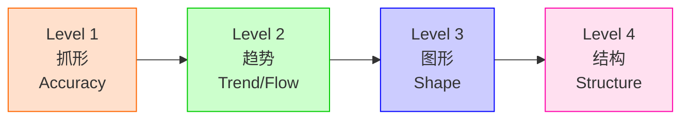
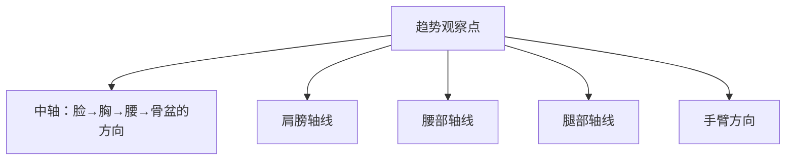
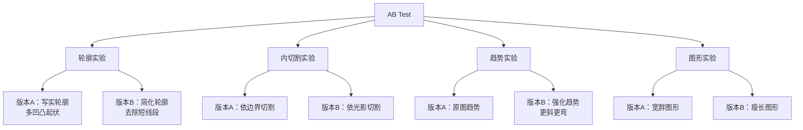
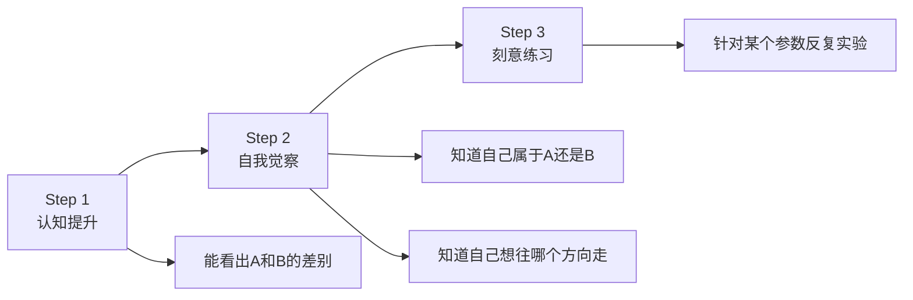

# 第03课：动态线

> 构成不是对错问题，而是**选择问题**。当你从"我画得对不对"的牢笼中解脱，真正的创作才刚刚开始。

---

## 一、趋势→图形→结构：绘画的核心流程

### 1.1 四层级模型

Krenz老师在本课系统化地提出了绘画流程的**四个层级**：



| 层级 | 核心任务 | 对错属性 | 耗时比例（高手） |
|------|---------|---------|----------------|
| **Level 1 抓形** | 用九宫格/测量法把形状抓准，达到80%准度 | **对错问题** | 入门阶段为主 |
| **Level 2 趋势** | 找到中轴、肩线、腰线、腿的方向等关键动线 | **选择问题为主** | 30% |
| **Level 3 图形** | 将趋势转化为具体的几何形状（五边形/圆/方） | **选择问题** | 40% |
| **Level 4 结构** | 赋予立体感、透视、肌肉结构 | **对错+选择混合** | 30% |

> [!warning] 关键认知
> 抓形是Level 1，是基础但不能永远停留在"我画得准不准"上。一旦基础打牢，就要上升到趋势和图形的**选择问题**——这才是构成课的核心。

### 1.2 趋势（Trend/Flow）的捕捉

观察人体趋势时，Krenz老师关注以下关键轴线：



> [!example] 课堂示范
> 画速写时：
> 1. 先用浅色/低透明度笔刷扫出大方向（肩斜度、身体弯曲方向）
> 2. 确定坐标点（关键转折处）
> 3. 用CSI三选一连线——一笔到位，不试探

**趋势可修改**：同样的角色，把肩线更斜、身体更弯、腿更开，动作就会从"普通站姿"变成"玖玖风格"的强烈动态。这是选择，不是对错。

### 1.3 图形的拆分与拼贴

人体的图形可以拆解为多个**五边形**：

| 部位 | 图形概括 | 说明 |
|------|---------|------|
| 头部 | 五边形 / 六边形 | 根据角度变化 |
| 躯干 | 枕头形 / T形 | 弯曲后拆分上下两段 |
| 大腿 | 五边形（短边上/下） | 女角色短边在上，肌肉男短边在下 |
| 小腿 | 五边形 | 与大腿连接处有转折 |
| 脚掌 | 五边形 / 钻石形 | 正面/侧面角度不同 |
| 手臂 | 五边形+五边形 | 上臂+前臂 |

Krenz老师的名言：**"人体真的超多五边形。"**

### 1.4 结构：立体的赋予

图形完成后再赋予立体感。方式包括：
- 圆柱体建模思维（透视课基础）
- 四选一的圆弧（正圆、微弧、扁弧、全平）
- 结构线（如Lajj画法：V字形+8字形定位腹肌/胸肌）

---

## 二、AB Test / 科学实验方法论

### 2.1 什么是AB Test

**AB Test**是Krenz老师在这一课反复强调的核心研究方法。它的本质是：

> 固定其他参数不变，只改变一个参数，观察效果差异。

### 2.2 AB Test的应用场景



> [!example] 课堂示范一：轮廓简化
> 定义"短线段"为某长度以下的凹凸，在练习中**刻意忽略这些短线段**，将轮廓整理为更长的线段。结果：形状变简单了，风格从写实往美式方向靠拢。

> [!example] 课堂示范二：全部用直线
> 找一张全是曲线的图，**强制自己全部用直线去画**。你会发现图形感完全变了——I字型线最难画，所以这种练习是"抽卡"（I字是4星卡片）。

> [!example] 课堂示范三：同一趋势不同图形
> 同样一个腿部趋势，改变长宽比：
> - 1.5倍宽 → 普通腿
> - 2倍宽 → 春丽型肉腿
> - 1.3倍宽 → 初音型细腿
> - 极宽+I字型 → 肌肉男腿

### 2.3 AB Test的练习心态

Krenz老师特别强调：**不要把练习当作"测试我会不会"**，而是当作**探索实验**。

> 你累积了5组简化实验后，就会理解"啰嗦"是什么意思。你再做5组全部用I字线的实验，就会知道不同组合的效果差异。所有"会了"的感觉，是这些小认知提升累积而成的总和。

---

## 三、分类能力 = 审美提高的第一步

### 3.1 分类的力量

Krenz老师指出：传统教学中"多临摹就会了"的说法是不够的。关键在于**分类的颗粒度**。

```
临摹（最低脑力） → 看照片整理（最高难度） → 动脑分类（核心能力）
```

> [!note] 翅膀分类案例
> Krenz老师以翅膀画法为例，教大家做分类：
> - **类型A**：外轮廓简化，内部写实
> - **类型B**：外轮廓复杂，内部简化
> - **类型C**：外轮廓+内部都复杂
>
> 每个作者都可以有自己的组合（如A外+C内）。能分出来，就能看懂不同画师的偏好，就能有意识地去练习参数。

### 3.2 认知提升的三步过程



### 3.3 衣服皱折的AB分类

Krenz老师以衣服皱折为例，展示了如何做拆解研究：

| 研究维度 | 做法A | 做法B |
|---------|-------|-------|
| 内切割依据 | 依物体边界 | 依光影明暗 |
| 外轮廓 | 写实（多凹凸） | 概括（少凹凸） |
| 排线方式 | 长线段 | 短线段（三的定理排列） |

你要先**有意识**地做A练习，再做B练习，感受差异——然后才能在实战中**混合使用**。

---

## 四、风格光谱：日系 / 美系 / 写实 / Q版

### 4.1 光谱全景

Krenz老师给出了一个**风格光谱**：

```
日系(二次元) ←→ 美系(卡通) ←→ 写实 ←→ Q版
```

| 风格 | 驱动方式 | 核心特征 | 对错属性 |
|------|---------|---------|---------|
| **日系二次元** | **写实驱动** | 比例严格，结构准确，人体基于模特儿身材 | **对错问题为主** |
| **美系卡通** | **图形驱动** | 比例夸张，自由变形，长宽比可随意调整 | **选择问题为主** |
| **写实** | 渲染驱动 | 追求质感、光影、笔触 | 造型易被忽略 |
| **Q版** | 图形驱动 | 大胆简化，特征放大 | 选择问题为主 |

### 4.2 日系二次元的"严格规范"

> 日系的脸有超严格的规范——眼睛高度、鼻子位置、嘴巴形状都有讲究。身体比例也基于写实模特儿身材，腰宽、臀宽、腿的粗细变化都被精确控制。

反过来说：日系竞争极其激烈，因为标准非常一致，大家都是"考试高手竞争的场所"。

### 4.3 美系卡通的"自由定义"

> 美系叫你观察这个角色——你觉得他的脸特别长，就把头形整个拉长；你觉得鼻子有特色，就画得更夸张。不一定要考虑"写实的结构"，可能80%从图形出发，写实只占20%。

适合美系思维的训练：
- 画大叔时，感受他像什么形状
- 画胖子时，先掌握大五边形，忽略细节凹凸
- 允许自己"画得不对"，更专注"我想表现什么形状"

### 4.4 反复横跳练习法

Krenz老师提出了一个重要的练习策略——**不要在一种体系里待太久**。

```
只练日系 → 容易陷入对错焦虑，没有参考图不敢画
只练美系/Q版 → 赛道变窄，遇到透视和结构就卡住
```

最好的方式是**反复横跳**：

> 你手上同时推进三款"游戏"：一款是偏准度/对错的（日系写实基础），一款是偏选择/图形的（美式风格探索），一款是偏结构的（透视练习）。三款交叉推进，每一款打到一定程度就换下一款。

这样既能保持基本功扎实，又能培养**自己定义形状的勇气**。

---

## 五、美式极端整理案例

### 5.1 "椎间盘突出小哥"的夸张变形

Krenz老师展示了美式风格中典型的夸张手法：

| 变形维度 | 效果 | 说明 |
|---------|------|------|
| 长宽比 | 3:1甚至更极端 | 腿长拉到夸张比例 |
| 腰部 | 极度收窄 | 酒杯形身材 |
| 腿部肌肉 | 下移转折 | 男角色股四头肌发达，五边形倒置 |
| 手脚 | 夸张的粗细差 | 手臂可做到极细→极粗的对比 |

### 5.2 美的五种边形思维

Krenz老师总结了一个实用规律：**基本图形+等比调整**。

- 同样的趋势基础上，调整**长宽比** = 不同风格
- 外轮廓用I字多（偏直线）= 硬朗风格
- 外轮廓用C字多（偏曲线）= 柔软风格
- 通过控制这些参数，你在风格的光谱上自由移动

---

## 六、复习与进阶：CSI速写实践

### 6.1 两种速写起手方法

Krenz老师对比了两种速写方法，并说"你**两种都要练**"：

| 方法 | 工具 | 优势 | 劣势 |
|------|------|------|------|
| **纯线条CSI切法** | 无压感笔 | 训练定义形状的能力 | 对抓形要求高 |
| **色块起手法** | 有压感笔/低透明度 | 容易抓大趋势和轮廓 | 容易忽略形状定义 |

### 6.2 笔数越少越好

速写的核心不是"快"，而是**下笔准**：

> 你画了300笔的速写，效率不如我画了30笔。每一下笔之前，先看准、想清楚起点和终点在哪里，再用CSI三选一去连。追求的不是速度，是每一笔都在定义形状。

### 6.3 从缝合到设计

Krenz老师区分了"缝合怪"和"真正设计"：

| | 缝合怪 | 真正设计 |
|--|--------|---------|
| **做法** | 直接描照片/拼接 | 提取趋势+图形+重组 |
| **依赖** | 离不开参考图 | 脑海中能调用零件 |
| **结果** | 永远跟着别人走 | 形成自己的图形语言 |

关键：**经过CSI转化**——你看到参考图→提取趋势和图形→存入脑内数据库→需要时调用→组合出新的图形。

---

## 课后练习

<details>
<summary><strong>练习一：AB Test — 轮廓简化实验</strong></summary>

找一张人体照片或已画好的人体：
1. **版本A**：原样照画，保留所有凹凸起伏
2. **版本B**：忽略短线段（小于某长度的凹凸全部删除），只保留长线段
3. 对比两版给人的感觉差异，写下你的观察
</details>

<details>
<summary><strong>练习二：AB Test — 全部直线挑战</strong></summary>

找一张人体速写（曲线为主）：
1. 强制自己**用直线去切**，不允许画任何曲线
2. 完成后观察：哪些地方的I字线效果意外地好？
3. 再画一个版本，在关键位置放回C字线，看看直曲对比的效果
</details>

<details>
<summary><strong>练习三：同一趋势，不同图形</strong></summary>

画一个站姿人物，只画趋势线（中轴+肩线+腰线+腿线）：
1. 复制这个趋势3次
2. **版本A**：填入宽胖型图形（宽长比大）
3. **版本B**：填入瘦长型图形（宽长比小）
4. **版本C**：填入肌肉型图形（I字线多、转折明显）
5. 对比三者，思考"同一趋势不同图形"带来的风格差异
</details>

<details>
<summary><strong>练习四：风格光谱分析</strong></summary>

收集5张不同风格的图，放在风格光谱上（日系→美系→写实→Q版）：
1. 分析每张图的外轮廓是偏复杂还是偏简化
2. 分析每张图的内切割是依边界还是依光影
3. 找出你最喜欢的组合，思考这是否反映了你的审美偏好
</details>

<details>
<summary><strong>练习五：反复横跳</strong></summary>

同时推进三个练习主题（每天轮换）：
- **主题A**：日系人体抓形+趋势（偏准度）
- **主题B**：美式图形夸张实验（偏选择）
- **主题C**：透视结构练习（偏立体）

一周后对比三者的进展，记录你的"认知提升"时刻。
</details>

---

## 本课关键词速查

| 术语 | 含义 |
|------|------|
| 趋势（Trend） | 人物/物体主要方向的流动线（中轴、肩线、腰线等） |
| 图形（Shape） | 将趋势转化为具体的几何形状（五边形/圆/方） |
| 结构（Structure） | 赋予立体感和透视的正确性 |
| AB Test | 控制变量法：固定其他参数，只改变一个参数看效果 |
| 分类能力 | 将风格/技法拆分为可量化的参数类别的能力 |
| 反复横跳 | 在不同练习体系之间交错训练的策略 |
| I字型线 | 直线，最难掌握，需要刻意练习 |
| 认知提升 | 从"看不出差别"到"能看出差别"的进步 |

---

## 相关笔记

- [[0001-flying-props|第01课：飞行道具]] — CSI用笔和三的定理基础
- [[0002-dual-protagonists|第02课：双主角与浅谈概括]] — 形的层级和死角
- [[0004-deconstruction|第04课：拆解分组再构筑]] — D字型/知字型/风字型的进一步深入
- [[reference/glossary|术语表]]