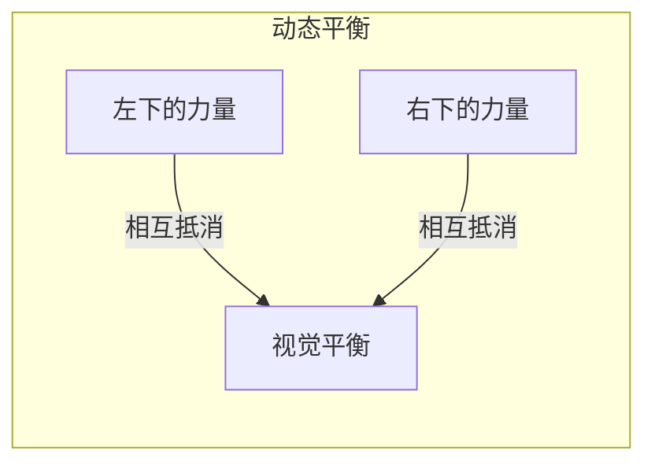
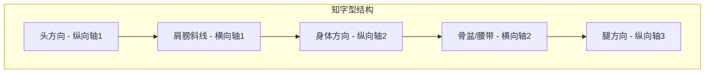
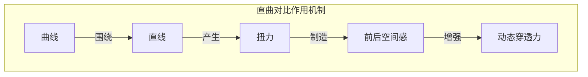
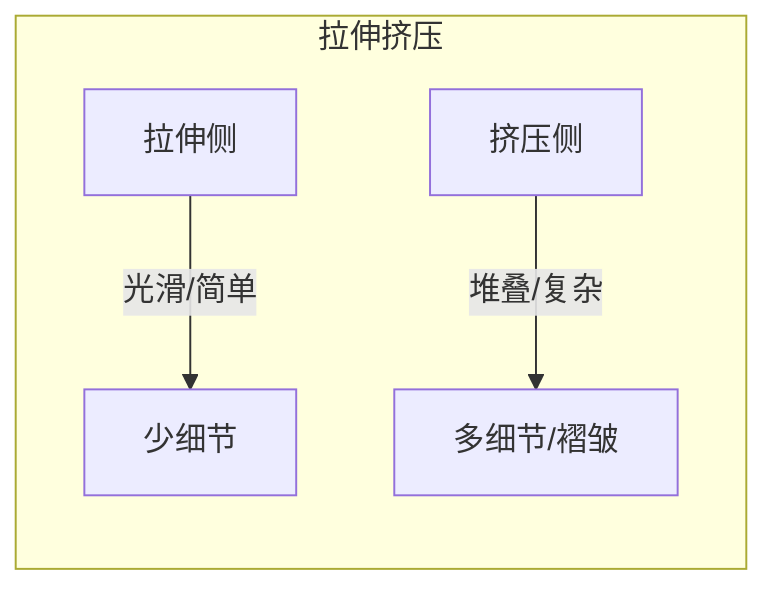
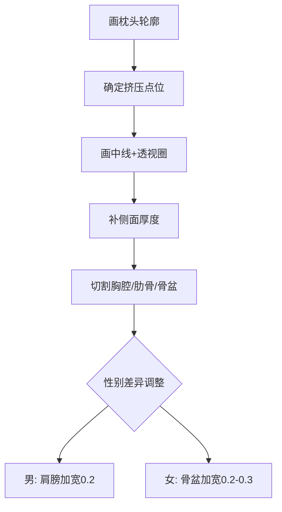
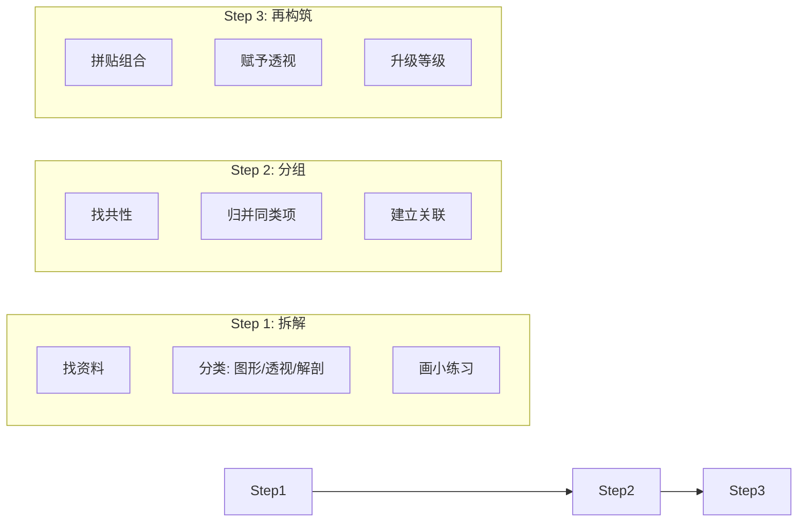

# 第04课：拆解分组再构筑

> 所有研究的核心目的：推进你对某一物体的认识。你不会画 = 你没有研究过它。

---

## 1. 人物动态的核心结构

### 1.1 动态平衡的概念

画面中人物的动态感来自**力量的相互抵消与支撑**。当一个方向有左下倾斜的力道时，另一侧需要有一个右下倾斜的力道来取得平衡。



> [!NOTE] 不是数学题
> 画家的动态平衡并非要求两边长度/强度完全对等。重心没有明显倾倒，动作看起来生动即可。

### 1.2 三大动态骨架类型

Krenz老师用汉字象形来概括人物动态的三种骨架结构：

| 类型 | 结构特征 | 适用场景 | 关键轴 |
|------|----------|----------|--------|
| **D字型** | C曲线（身体一侧轮廓）+ D直线（另一侧轮廓）→ 组成D字形剪影单元 | 站姿、侧身动作 | 一侧拉伸一侧压缩 |
| **知字型** | 头/身体/脚三部分扭转发力，笔画穿插 | 特写、半身、全身动态 | 横向轴（眼/肩/腰）+ 纵向轴（头/身/腿） |
| **风字型** | 多重扭曲的动态结构，更复杂的知字型变体 | 剧烈动态、透视动作 | 多轴交错 |

**知字型的横向轴识别（容易遗漏的点）**：
- 明显的：眼睛连线、肩膀轴线、骨盆/腰带线
- 不明显的：背后的武器、腰部的配件、飘散的头发和斗篷

**纵向轴控制**：头的方向 → 身体方向 → 骨盆方向 → 腿的方向



---

## 2. 直曲对比（Straight vs Curve）

### 2.1 基本原理

曲线与直线在同一画面中形成对比，**曲线绕着直线扭转**，制造前后关系。



### 2.2 拖把系统（Krenz老师的关键技巧）

Krenz老师反复强调的**拖把系统**——其实就是直曲对比在人体/布料中的经典应用：

- **直轴**：拖把杆子，即隐藏在画面中的直线结构
- **曲线**：拖把布条，即围绕直线旋转的曲线
- **效果**：曲线绕着直线旋转，产生向画面深处"扭"进去的空间感

> [!TIP] 绘画示范
> 画手臂时避免两侧都是曲线（会臃肿）。**一侧做直线，另一侧做曲线**，形状才会好看。
>
> 画腿时同样：大腿前侧弧度强、后侧偏直；小腿后侧弧度强、前侧偏直。

### 2.3 拉伸与挤压（Stretch & Squash）



- **拉伸侧**：轮廓光滑，信息量少，视觉阅读速度快的区域
- **挤压侧**：有堆叠褶皱，信息量多，视觉停留更久

---

## 3. 枕头模型（核心图形工具）

### 3.1 什么是枕头模型

用圆柱体组合思维来理解人体结构。身体 = 一个可以弯曲、拉伸、挤压的枕头。

**枕头的基本参数**：
- 宽度约2，高度约4（比例可调）
- 一侧拉伸（变长/变直），一侧挤压（折叠/缩短）
- 拉伸得越厉害，弯曲感越强

### 3.2 从枕头到人体的步骤



**男性 vs 女性躯干差异表**：

| 部位 | 男性 | 女性 |
|------|------|------|
| 肩膀 | 明显加宽 | 适当收窄 |
| 腰部 | 由肩膀宽显窄 | 实际收窄 |
| 骨盆 | 保持正常宽度 | 略微加宽 |
| 整体轮廓 | 倒梯形 | 西洋梨/葫芦形 |

### 3.3 腿部研究的三个层级

| 层级 | 内容 | 关键要点 |
|------|------|----------|
| Level 1 | 基本形 | 五边形+圆柱+膝盖圆圈 |
| Level 2 | 骨骼趋势 | 大腿骨内切 + 小腿S型 |
| Level 3 | 图形tips | 大腿前曲后直，小腿后曲前直 |

> [!WARNING] 常见误区
> 很多同学画腿直接把骨头当直线画（A画法），正确做法是先理解大腿骨内切+小腿S型的趋势（B画法），再贴五边形和圆圈。腿的侧边轮廓类似**马蹄**的弧度。

---

## 4. 布料研究

### 4.1 3的定理在布料中的应用

```
大褶皱（主趋势） + 中褶皱（次级） + 小褶皱（细节）
比例参考：6 : 3 : 1
```

### 4.2 布料的三大基本画法

1. **两条C字线 + 补直线**：两端画圆圈确定前后，中间用直线衔接
2. **直线 + S型环绕**：先画一条主直线（趋势轴），然后用S型曲线环绕它
3. **C-S-C组合**：先画一个C，再画反向S，再画C，制造翻面效果

### 4.3 实战示范

画裙子的正确流程：
1. 先画腰部一圈（确定起点）
2. 再画裙摆飘动的趋势（确定终点）
3. 最后衔接上下两端

> 而不是：直接画一堆弧形线拼凑。**一定要有立体意识，知道正反面在哪里。**

### 4.4 从布料延伸到头发

发片的本质 = 布料的一个分支

| 发型类型 | 对应布料结构 |
|----------|-------------|
| 偏分长发 | 单片布料+挖洞 |
| 双马尾 | 两条趋势线+均线纠结 |
| 男生短发 | 有厚度的布片（人工草皮） |
| 飘逸长发 | 鱼尾巴趋势+S型环绕 |

画头发时的三块表演区域：
1. **刘海区域**：最大的布料，决定整体方向
2. **侧发区域**：遮脸的两撮毛，次要趋势
3. **鬓角/小碎发**：最小趋势，增加丰富度

---

## 5. 特效处理

### 5.1 轮廓特征法

不同的特效通过**轮廓的收束形状**来区分：

| 特效类型 | 轮廓特征 | 画法关键 |
|----------|----------|----------|
| 水 | 圆弧形收束，边缘光滑 | 边缘修成圆角 |
| 火 | 尖锐收束，有尖角 | 边缘修成尖刺状 |
| 风 | 甩面面条状，多面体 | 类似兰州拉面的面体 |
| 雷 | 直线为主，锯齿状 | 全部用直线表现 |

### 5.2 从平面到立体的特效

1. 先画趋势线（股票均线纠结法）
2. 补正反面（立体意识）
3. 赋予轮廓特征（圆形=水/尖角=火）
4. 挖洞（大中小疏密排列）

---

## 6. 核心方法论：拆解 → 分组 → 再构筑

### 6.1 三步流程



### 6.2 分拆练习的3个方向

| 研究方向 | 做什么 | 目的 |
|----------|--------|------|
| 趋势研究 | 提取动态线、方向线 | 理解整体走势 |
| 图形研究 | 枕头轮廓、比例切割 | 理解形状构成 |
| 解剖研究 | 骨骼、肌肉块状 | 理解底层结构 |

### 6.3 研究方法系统

```
定课题（如：本周研究躯干）
   → Day 1: 画躯干图形（枕头模型）
   → Day 2: 画平面人体比例（内部切割）
   → Day 3: 研究骨盆/肋骨形状
   → Day 4: 研究肌肉覆盖关系
   → 反思总结：今天比昨天推进了多少？
```

> [!IMPORTANT] 认知推进
> 进步 = 认知的累积。不是"练了就一定会"，而是"研究→发现盲区→补盲→再研究"的循环。把"练习"改为**探索/研究**，心态就完全不同。

---

## 7. 实战流程演示

Krenz老师画阿卡莉的实战流程：

1. **趋势+图形一起画**（不是分开想）
2. 先画身体的枕头 → 赋予立体中线 → 往画面里扭转
3. **武器也是趋势的一部分**：武器画在哪、方向如何，都会影响整体平衡
4. **预置元素库**：头发、披风、特效可以事先画出模板，像拼贴一样摆位置
5. **调整阶段**：我不是在画，我是在"摆"——摆到满意再细画

---

## 8. 课后练习

### 练习一：枕头模型练习
画出10个不同挤压点位的枕头，标注拉伸侧和挤压侧，对比不同点位（偏上/正中/偏下）的效果差异。

<details>
<summary>参考答案</summary>

- 挤压点在正中：上下对称，静态感强
- 挤压点偏上：上半身短，偏俯视
- 挤压点偏下：上半身长，偏仰视
- 实际画人物时通常选**偏下一点点**，预留肋骨空间

</details>

### 练习二：直曲对比观察
找3张你喜欢的插画，用线标注出画面中的隐藏直线和曲线，分析哪些地方用了"拖把系统"。

### 练习三：分拆研究
选择一个你画得不熟的物体（如烟斗/提灯/花），按照拆解→分组→再构筑的流程做A4尺度的研究笔记。

<details>
<summary>参考答案</summary>

以烟斗为例的拆解：
1. 吸管（中间身体部分）
2. 烟斗头（有大/小/细长/圆宽等造型）
3. 底座

找5-10张参考图，画出不同造型，每张研究约15-20分钟，总时间控制在2小时以内。

</details>

### 练习四：腿的趋势练习
画A/B版本对比：A版按直腿画法，B版按"大腿骨内切+小腿S型"画法，比较差异。

---

> **关联课程**：[[0001-flying-props|第01课：基础概念]] | [[0002-dual-protagonists|第02课：构成入门]] | [[0003-dynamic-lines|第03课：趋势与夸张]] | [[0005-rhythm|第05课：节奏和韵律]]