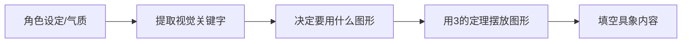
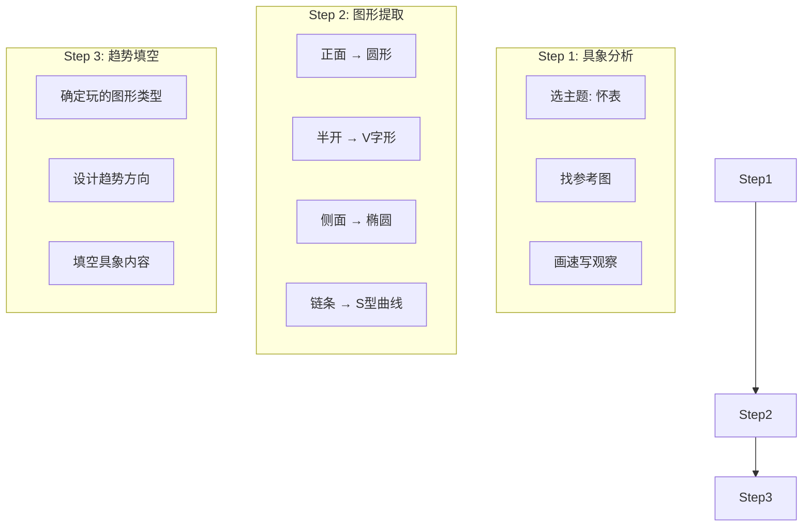
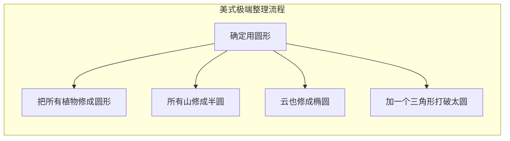

# 第05课：节奏和韵律

> 画家思考的是"我要玩什么图形"，而不是"我要画什么物体"。

---

## 1. 背景构成的两种基本类型

### 1.1 重复图形 vs 不重复图形

| 类型 | 定义 | 例子 |
|------|------|------|
| **重复图形** | 将同一个基本形重复摆放，利用3的定理做高低错落 | 一棵树重复3次、山的形状重复、图钉/美工刀形状阵列 |
| **不重复图形** | 使用不同物体组合，先用方框定位置再填空 | 沙发+柜子+窗户+人物的室内场景 |

### 1.2 什么是基本形

基本形 = 画面中最基础的形状单元。在分析一张图时，不要被具象内容迷惑，要看出它背后的**重复出现的形状**。

**分析案例**：
- 山形构图：山的形状 + 垂下的植被 + 云朵 → 三个元素高低错落
- 图钉构图：倒放的图钉 + 正放的图钉 → 重复排列 + 角度变化
- 美工刀构图：多个刀片形状 → 同一形状错落排列

> [!TIP] 训练方法
> 看一张图时，普通观众看的是"颜色"和"内容"；训练有素的画家看的是**重复出现的图形**和**隐藏的趋势**。请刻意练习后者。

---

## 2. 视觉关键字分析法

### 2.1 什么是视觉关键字

从角色设定/气质中提取出**可用于画面的可视化关键词**。



**案例示范**：
- 角色气质：文静、绿叶、智慧
- 视觉关键字：植物、安静、书卷
- 实际应用：主角 + 龟背芋盆栽 + 蜂鸟 + 植物园背景

### 2.2 填空流程

1. 先画3个圆圈（大中小错落）
2. 在圆圈里塞植物（不要让植物超出圆圈范围）
3. 塞飞行道具（蜂鸟/麻雀），制造前后遮挡
4. 把主角放上去，调整位置
5. 用3-4种元素组成背景，避免单薄

> 这不是在"画"，而是在"拼贴" + "移动"。背景和人物分开思考。

---

## 3. 图形 + 趋势分析系统

### 3.1 四种底层图形分类

| 图形类型 | 核心形状 | 代表作 | 趋势特征 |
|----------|----------|--------|----------|
| **圆形** | 圆圈、椭圆、扇形 | 伞/灯笼/手球/绣球花 | 无明确方向或两个圆连线形成弧线 |
| **斜线/知字型** | 斜线组、V字、N字 | 树枝/水母触手/彩带/雨伞支架 | 同一方向斜线 + 高低错落 |
| **直线/方形** | 横线、竖线、矩形 | 柜子/挂画/桌子/城堡 | 水平或垂直方向 + 疏密变化 |
| **三角/锥形** | 三角形、锥体、T字 | 松树/城堡尖顶/扇子 | 尖端指向 + 堆叠 |

### 3.2 图形 vs 趋势的关系

```
每张图都有知字型的趋势（底层结构）
趋势 ≠ 图形

图形是你看得见的形状（圆/方/三角）
趋势是你看得见的方向（斜线/弧线/垂直线）

图形决定表演的题材，趋势决定动态的流动
```

> [!WARNING] 关键概念区分
> 知字型不是图形，是趋势。一张图无论用什么图形（圆/方/三角），都可以有知字型的趋势。圆形带来圆弧流线，但流线本身可以组成知字型。**图形是皮，趋势是骨。**

---

## 4. 完整研究方法论：怀表研究案例

### 4.1 三步分析法



### 4.2 怀表的图形结论

经过研究后发现怀表其实只有**两种基本图形 + 一种附加元素**：

| 形态 | 图形 | 趋势 |
|------|------|------|
| 正面 | 正圆 | 无明显趋势 |
| 打开一半 | 椭圆 + V字形开口 | 斜线趋势 |
| 完全侧面 | 扁椭圆 | 水平趋势 |
| 链条（附加） | S型曲线 | 可做飞行道具的曲线 |

### 4.3 从图形到构图的选择

画家在做选择时的工作流：

```
"我要画怀表主题"
  → 研究了怀表 → 正圆/V字/椭圆/链条
  → 决定玩圆形 → 圆形构图
  → 填空：可以用伞/手球/灯笼/绣球花

OR

"我要玩知字型构图"
  → 找对应题材 → 闪/怀表/树枝/水母
  → 填空具体内容
```

> 两种思路都成立：**从具象推图形**，或**从图形推具象**。

---

## 5. 美式极端整理

### 5.1 核心思想

将物体轮廓**强行整理**成圆形/方形/三角形，不论它本来的形状如何。像园丁修剪树木一样，硬塞进行李箱。

### 5.2 三种整理级别对比

| 级别 | 方法 | 代表人物 | 特点 |
|------|------|----------|------|
| **日式概括** | 从真实出发，逐步简化 | 大部分日系画师 | 保留物体原始特征 |
| **美式极端** | 先定形状，强行整理 | 南路河雄 / 鸟山明 | 轮廓极其干净，图形感强 |
| **风格化** | 只学会一套形状 | 圆钉派作者 | 所有物体套用同一形状 |

### 5.3 实践方法

> 我只会一招：扇形 + 圆形 + 三角形。所有背景都塞进这三个形状。

- 所有植物 → 圆形
- 所有建筑 → 方形
- 所有装饰 → 三角形/锥形
- 实在太多圆形时 → 插一个长条形直线来"解毒"



---

## 6. 背景构成类型详解

### 6.1 三种主要形式对比

| 类型 | 定义 | 趋势特征 | 适用题材 |
|------|------|----------|----------|
| **框框组合** | 先用方框定位，再填空具象内容 | 水平+垂直的直线组 | 室内场景、家具组合 |
| **斜线组合** | 同一方向的斜线做高低错落穿插 | 全部往同方向倾斜 | 树枝/水母/雨伞/彩带/灯笼 |
| **直向穿插** | 类似N字/V字的双向支撑线 | 两个方向互相倾斜对抗 | 树干/城堡尖塔/建筑群 |

### 6.2 斜线组合的三种细分

| 细分类型 | 示意图 | 实例 |
|----------|--------|------|
| **同一方向型** | 所有斜线往左下 | 风吹的树枝、飘带 |
| **V/N字型** | 两条斜线互相支撑 | 树枝分叉、翅膀 |
| **穿插型** | 方向交错 + 高低错落 | 水母触手、灯笼群 |

### 6.3 直线/方形的三种细分

| 细分类型 | 说明 | 例子 |
|----------|------|------|
| **横直线型** | 纯水平方向 | 书架/桌面 |
| **M/N字型** | 互相堆叠支撑 | 屋顶/城堡尖塔 |
| **同向偏离型** | 同一方向但角度稍有偏差 | 栅栏/树林 |

---

## 7. 从趋势到具象的填空

### 7.1 道具填空示例

| 趋势类型 | 可填空的具象题材 |
|----------|-----------------|
| 圆形 | 伞、灯笼、手球、绣球花、风铃、金鱼、水母 |
| 斜线 | 树枝、水母触手、彩带、雨伞支架、丝带 |
| 方形 | 柜子、桌子、书架、建筑、窗户 |
| 三角形 | 松树、尖塔、旗帜、扇子 |

### 7.2 错落关系的普适性

> 错落 + 高低差 → 自然产生知字型（副产品）
>
> 我不是刻意设计知字型，我只是确保所有东西都有高低错落。
> 错落到位了，知字型就自己出现了。

---

## 8. 三个等级线稿

### 8.1 线稿的三层结构

| 层级 | 名称 | 笔刷大小 | 用途 |
|------|------|----------|------|
| 等级1 | 轮廓线/主趋势 | 最大 | 决定整体骨架和方向 |
| 等级2 | 主线/主分支 | 中（约大一级的50%~70%） | 主要内部结构 |
| 等级3 | 副线/细节 | 最小 | 小分支、叶片、纹理 |

### 8.2 以树枝为例的实操

1. **等级1**：画主要树枝趋势（最大笔刷）
2. **等级2**：每根树枝画Y字分叉（中笔刷，每个分叉做2-3段）
3. **等级3**：小分支和叶片（最小笔刷，稀疏安排）
4. 挖洞：用第二课的CSI挖洞技法处理树叶块
5. 叠加层次：最少做2层树叶（前景+背景）

---

## 9. 研究方法的系统化实施

### 9.1 五步流程

```
定主题 → 搜资料 → 分类 → 做假设 → AB test
```

| 步骤 | 具体操作 | 产出 |
|------|----------|------|
| **定主题** | 决定本周要研究的对象 | 如：树、花、建筑 |
| **搜资料** | 收集10-20张参考图 | 参考图库 |
| **分类** | 按图形/趋势/结构分类 | 分类笔记 |
| **做假设** | "如果我把它整理成方形会怎样？" | 假设/方案 |
| **AB test** | 画两个版本对比 | 实验记录 |

### 9.2 面对"不会画"的正确态度

> 不会画 = 没有研究过

**升级路径**：
```
研究前：等级0.5（随便画，碰运气）
  → 研究图形（进阶到等级1）
  → 研究趋势（进阶到等级2）
  → 研究内部结构（进阶到等级3）
```

---

## 10. 视觉导引的初步概念

### 10.1 吸引视线的三要素

1. **细节密集区**：有丰富装饰的部位容易吸引视线
2. **指向性线段**：手臂、武器、飘带的方向引导视线
3. **高对比度区域**：明暗或色彩对比强烈处

### 10.2 小技巧：三角定位法

在画面中用三个细节较丰富的点形成三角形，视线会在这三个点之间自然徘徊。

```
手的装饰 → 脸部 → 胸口的项链
这三个点形成一个小三角形
视线就在这个三角形区域内循环
```

> 这不是本节课的正题，第06课会深入讨论视觉导引。

---

## 11. 课后练习

### 练习一：基本形提取训练
找5张你喜欢的插画，写在每张图中重复出现了哪些基本形（用圆圈/三角形/方形标注），分析这些基本形的排列方式（高低错落 / 同向斜线 / V字穿插）。

<details>
<summary>参考答案</summary>

以课堂案例为例：
- 山形图：山 = 梯形重复3次 + 植被 = 垂直线 + 云 = 椭圆重复
- 图钉图：倒图钉 + **正图钉** = 同一形状角度变化
- 美工刀图：刀片形状阵列 + 高低错落

分析时注意：先看图形的**形状**，再看图形的**趋势**，最后才看它画的是什么物体。

</details>

### 练习二：怀表研究
按照课堂示范的方法，对一个日常物体（如闹钟/台灯/背包）做完整的三步研究：具象分析 → 图形提取 → 趋势填空。

<details>
<summary>参考答案</summary>

以"台灯"为例：
1. 找5张台灯照片
2. 图形提取：灯罩=梯形/弧形，灯柱=直线，底座=椭圆/矩形
3. 图形结论：梯形+直线+椭圆
4. 趋势设计：可以选择玩"斜线"（灯罩倾斜方向）或"直线"（灯柱垂直方向）
5. 填空构图：3个台灯高低错落 + 书本（方形）+ 文具（斜线）

</details>

### 练习三：美式极端整理
选3个不同的物体（如树/花/建筑），尝试把它们全部塞进"圆形"里画一遍，再全部塞进"方形"里画一遍。

### 练习四：背景构成拼贴
用课堂提供的城堡零件（尖塔/屋顶/树），先做直线的构错落设计，再用不同形状的屋顶替换，观察替换后效果的差异。

---

> **关联课程**：[[0001-flying-props|第01课：基础概念]] | [[0002-dual-protagonists|第02课：构成入门]] | [[0003-dynamic-lines|第03课：趋势与夸张]] | [[0004-deconstruction|第04课：拆解分组再构筑]]