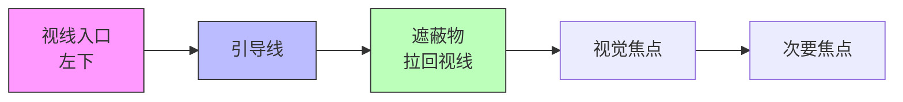
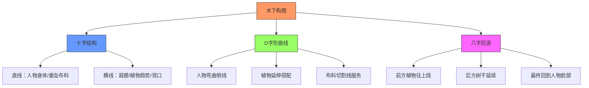
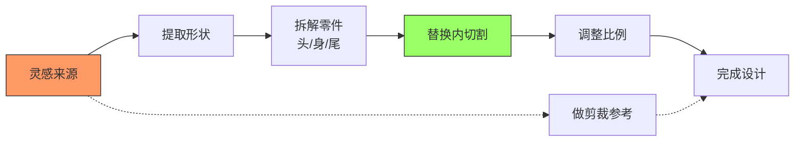
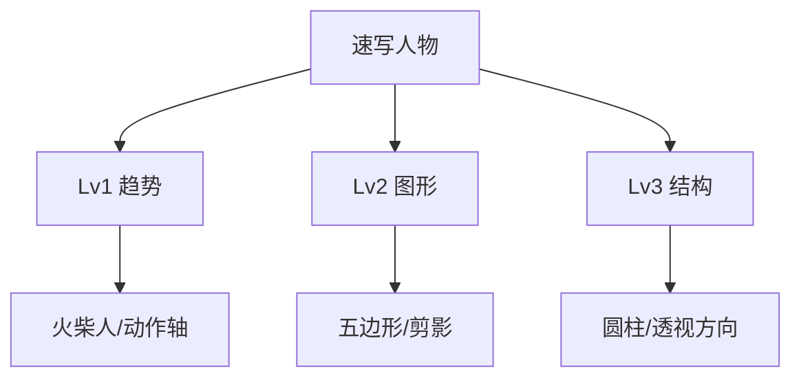

# 第06课：鹰架（脚手架）

## 一、什么是鹰架

### 1.1 基本定义

**鹰架（Scaffolding/脚手架）** 是指整张图中**所有直线、斜线、曲线、点、线、面的总构成**。它就像建筑工程外围搭建的施工架子，是支撑整张画面的"骨架结构"。

> [!quote] Krenz
> "鹰架是整张图的直线、斜线、曲线、点、线面的总构成。我们学的东西都是分开单独去练习的，鹰架就是把这些全部整合在一起看。"

### 1.2 丰富的穿插 vs 刻意知字型

这两者容易混淆，Krenz特别做了区分：

| 概念 | 特征 | 产生方式 |
|------|------|----------|
| **丰富的穿插** | 画面中自然形成的高低错落、互相交错的斜线 | **无意识**排列组合的结果，构图丰富时就自然产生 |
| **知字型** | 刻意安排的支撑性斜线结构 | **有意识**地事前规划，主动设计穿插位置 |

> [!important] 关键理解
> - 丰富的穿插 = 无意识结果（只要堆叠够多元素就会产生）
> - 知字型 = 有意识练习（刻意让线条互相支撑交错）
> - 两者可以共存：即使用L字型、T字型、X字型构图，也会有丰富穿插

---

## 二、视觉导引

### 2.1 视觉顺序的三大手段

Krenz指出视觉导引的本质是 **"安排视觉顺序"**，主要有三大类手段：

1. **位置手段**：人眼习惯从左下进场，九宫格位置的物体优先被看到
2. **构成手段**：用线条引导视线方向（如集中线、S型流向）
3. **色彩手段**：用明暗对比、纯度差异、稀有颜色引导视线焦点

### 2.2 导引线实操



> [!tip] Krenz的建议
> "视觉导引需要够多的实务经验才能控制，你先不要纠结视觉导引。初学者可以先从**设计趋势**开始，而不是直接去引导视线。"

---

## 三、木下八字回游 / 拖把画法

### 3.1 木下大师的构图框架

木下（Kinoshita）的构图层级包含三个核心要素：



### 3.2 八字回游流动示意

```
     ┌───────────────────┐
     │   八字回游循环     │
     │                    │
     │  植物往上绕        │
     │    ↙     ↗        │
     │ 树干延续           │
     │  ↙         ↗      │
     │ 布料切割           │
     │↙             ↗    │
     │ 回到人物脸/脚       │
     └───────────────────┘
```

### 3.3 拖把画法的核心逻辑

木下的拖把画法有三个特征：

1. **十字架构**：画面中有明显的直线结构（人物身体/垂直线）和横线结构（肩膀/基底）
2. **D字形曲线**：人物身体有一条弯曲的线，靠植物、布料、头发延伸
3. **藕断丝连的八字回游**：线条不全部连实，而是断断续续但视觉上仍能连接，形成多重八字循环

> [!example] Krenz的卡牌比喻
> "你现在能做个别单体，每张都是很强的牌。木下这张则是所有牌一起打出连招——他的皱折不仅为真实服务，也为趋势服务。"

### 3.4 现代作者的应用

Krenz指出木下的结构在现代作者（如小季老师、丁丁框）的图中也能看到：
- 帽子/头发隐藏延续的直线
- 脚跟处的密集线段
- 泳圈与身体弧度的S型结合
- 宠物背部和尾巴配合人物身体拉出S型

---

## 四、设计练习流程

### 4.1 从分析到填空



### 4.2 从木下的分析到自己的创作

练习步骤（从L1到L6的进化）：

| 等级 | 内容 | 难度 |
|------|------|------|
| **L1等级** | 固定趋势线 → 用飞行道具拼贴（鱼/圆圈） | 入门 |
| **L6等级** | 人物+D字型 + 知字型（头/肩/腰/腿方向+布料延伸） | 进阶 |
| **L7-L8等级** | 分析木下→提取大趋势线（曲线+直线+隐藏线）→ 填空 | 高手 |

### 4.3 实战操作

1. 先把人物画好（确保人物动作是D字型）
2. 在人物的趋势上延伸"鱼尾巴/拖把"的趋势
3. 想办法让拖把趋势跟原本的D字型结合
4. **尽可能加东西** — 东西越多越有机会连起来

> [!warning] 常见错误
> - 分析时只看曲线、忽略直线结构
> - 画面只有一层，没有重叠
> - 不敢做遮挡 → 一眼看穿
> - 线条太平行

---

## 五、服装设计方法

### 5.1 设计公式

```
服装设计 = 剪裁参考（现实服装的大外框 + 内切割）
         + 灵感来源元素（提取形状 → 替换 + 调整比例）
```

### 5.2 具体操作

1. **找剪裁参考**：从真实照片提取服装大外框和内部切割
2. **提取灵感元素**：从一个主题物（灯具/珠宝/花朵）中拆出4-5个形状
3. **替换内切割**：用提取的形状替换服装上的装饰、扣子、领结、花纹等
4. **调整比例**：缩放、旋转、变体重组

### 5.3 主题一致性原则

> [!danger] 最常见的错误
> 灵感来源太多变成大杂烩：
> - 灵感来源A游戏 + 平时穿搭花纹 + 某天看到的武器
> - 庞克风 + 运动装 + 骷髅项链 + 科幻刀

**正确做法**：初期只锁定**一个灵感来源**，提取形状语言，再变换剪裁或职业。

### 5.4 常见设计痛点解决方案

| 问题 | 解决方法 |
|------|----------|
| 只会画爱迪达三条线 | 找电竞鼠标 → 提取切割线 |
| 扣子只会画圆形 | 从提灯顶部提取形状 |
| 创作脑袋空空 | 做 **"以形补形"** 研究，拆解物体各角度形状 |
| 图形语言不一致 | 只从一个灵感来源提取全部元素 |

> [!example] Krenz示范
> 把圣诞花圈提取 → 作为裙摆一圈花纹；把番茄提取 → 做番茄裙子（红色裙摆+番茄顶部小叶子头饰）

### 5.5 灵活运用

同一套零件可以组合出不同设计：
- **A之1**：胸甲（盖子）+ 头盔（盖子挖洞）+ 裙子花纹
- **A之2**：头盔（缩短）+ 胸甲（其他部分）+ 不同花纹

---

## 六、3D参考使用

### 6.1 adorka.stock

- 有网格纹理的人体模特儿照片
- 重点：观察**圆柱走向**（约60%为B等级曲线）
- 帮助理解人体在空间中的旋转方向

### 6.2 SketchFab

- 3D模型旋转观察
- 适合练习**透视难角度**（如脚掌的俯角、仰角）
- 可用作"枕头透视"练习

> [!tip] 枕头透视练习
> 在SketchFab找"pillow" → 用CSI切法拆解枕头的面 → 套用到人体臀部、胸部等部位 — 不需要研究骨架肌肉，研究透视即可。

---

## 七、三个等级线稿的整合运用

### 7.1 速写的三层架构



### 7.2 平视角度的攻略

- 平视角度不依赖深透视 → 可以靠构成"硬撑"
- 用拼贴法修正动作：调斜率 → 剪影连线 → 加圆圈圆柱
- 70%的平视角度都可以用此方法攻略

### 7.3 非平视角度的处理

- 必须叠加透视知识
- 建议：先去透视课练习16格 → 理解立体状态 → 再回来做非平视构成

---

## 课后练习

### 练习一：木下分析练习

找一张木下的图，分析其中的：
1. 直线结构（人物身体/垂线）
2. 横线结构（肩膀/底座）
3. D字形曲线及其延伸
4. 八字回游的路径（至少找出两个循环）

### 练习二：服装设计练习

选择一个日常物品（台灯/圣诞花圈/水果/珠宝）：
1. 画出物品的正面、侧面、截面和各种角度
2. 拆出至少4-5个可用的形状零件
3. 找一个服装剪裁参考（晚礼服/铠甲/常服）
4. 将零件替换到服装的不同位置上

### 练习三：拖把趋势填空

1. 先画一个带D字型的人物（确保知字型穿插）
2. 在人物周围加上"鱼尾巴"趋势线
3. 用特效/布料/飞行道具填空，让线条能够连接起来

<details>
<summary>练习参考答案提示</summary>

**练习一**分析时可关注的要点：
- 木下的十字结构通常放在九宫格位置
- D字形曲线会被植物、布料、头发多个元素接力延伸
- 植物在某处"断掉" → 后面的树干/背景接着延续 → 形成八字循环
- 分析时不要只画曲线，要同时关注直线和横线

**练习二**设计原则检查：
- 所有零件是否来自同一灵感来源？
- 图形语言是否一致？
- 比例是否调整过（不是直接无脑贴上）？

**练习三**填空检验标准：
- 原本一眼看穿的S型是否被遮挡打断？
- 有无前中后三层关系？
- 特效/飞行道具是否和被遮挡物体的趋势匹配？
</details>