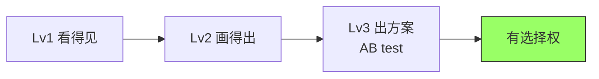
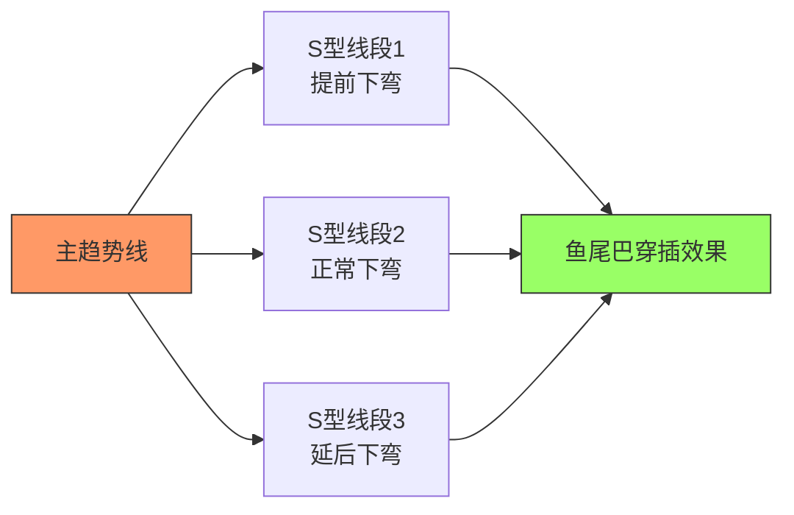
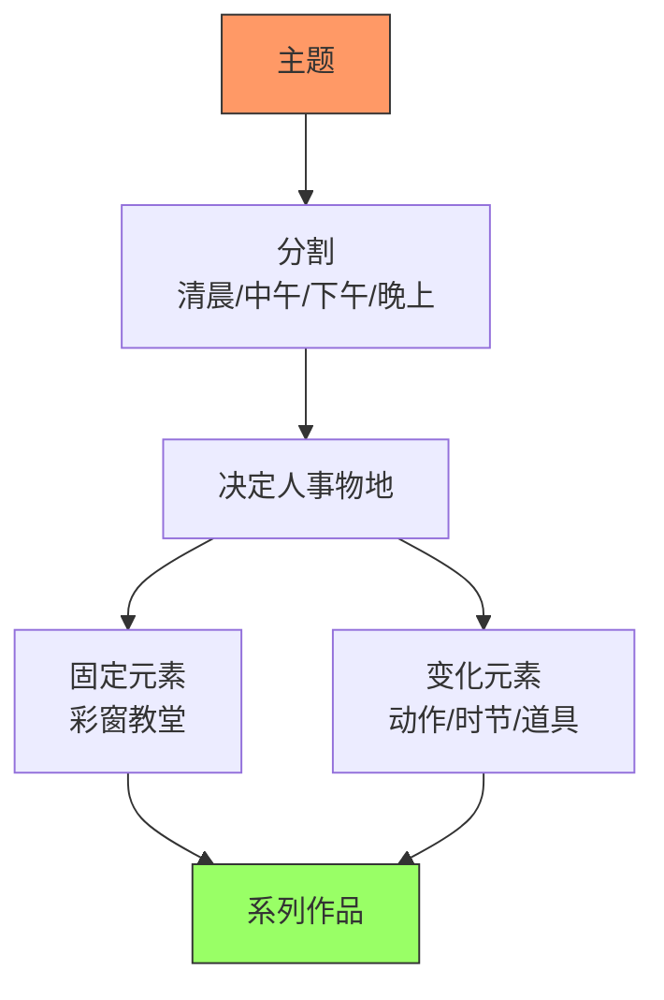
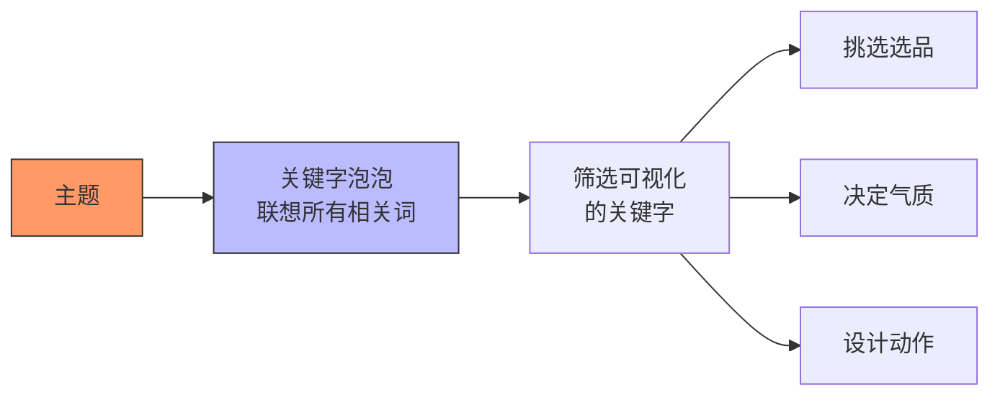
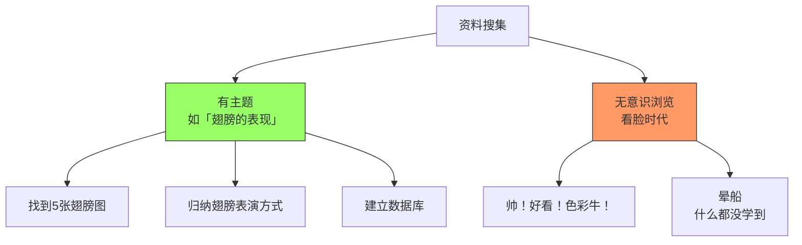
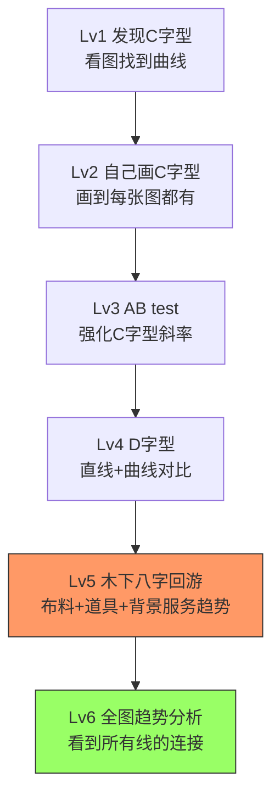

# 第07课：研讨

## 一、构成是选择问题，不是对错问题

### 1.1 核心认知

> [!quote] Krenz
> "构成课讲的一向是选择问题，不是叫你一定得这样做。以前你没有选择，因为根本看不到这些线。当你能够自己画，还能出2-3个方案时，你才有得选择——我要连线或我不连线。"

**技能的三个等级**：

### 1.2 为什么连线让动态变强

**视觉心理学原理**：视觉更容易把**长线段连接起来**，长线段会产生更强的动态感。

- 范例：学姐原本画的烟斗+人物+背景花 → 没有明显连线
- 调整后：加入从左到右的宽幅鱼尾巴扭转流线 → 动态明显增强
- 结论：动态线越长，画面动感越强

---

## 二、长线条的画法

### 2.1 主趋势+S型围绕

### 2.2 关键技巧

- 围绕主趋势的S型线段：每一条的**斜度和转折点稍微错开**
- 避免反向S（会造成M字头/DNA造型）
- 避免平行（要同一个方向，但不同时间点转折）
- **提前下弯"月线下弯"** 和 **延后翻扬"月线翻扬"** 造成穿插

---

## 三、系列作规划方法

### 3.1 系列作的完整流程

### 3.2 助教案例

**矮科助教 — 一天的时间系列**：
- 清晨 → 人：祈祷 / 场景：教堂彩窗
- 中午 → 人：插花 / 场景：教堂彩窗
- 下午 → 人：下雨（加上时节变化）/ 场景：教堂彩窗
- 晚上 → 人：写书 / 场景：教堂彩窗

**红助教 — 神话生物系列**：
- 中世纪人形生物雕像为灵感
- 分类：人鱼 / 羊人 / 天使
- 各自搭配不同的动作与元素

---

## 四、视觉关键字 + 关键字泡泡

### 4.1 从文本设定到可视化的过程

### 4.2 范例：吸血鬼的关键字泡泡

以"吸血鬼伯爵"为主题：

1. **直接联想**：獠牙 / 棺材 / 蝙蝠 / 披风 / 新月 / 大蒜 / 十字架 / 玫瑰 / 红酒
2. **进阶联想**：圣痕、贵公子气质、血族家徽
3. **选品（常出现的道具）**：拐杖、蔷薇花、贵妃椅、红酒杯、心脏

> [!warning] 区分视觉化与抽象
> "圣痕"是偏气质的视觉关键字，可以画 → 但需要转化到角色的神态和表情上
> 做关键字时优先选择**容易用画来表现**的词

---

## 五、选品（Selecting Props）方法论

### 5.1 选品流程

1. 确定主题（如吸血鬼）
2. 上网搜图：看**15-20张高手作品**
3. 捞出**常被使用的元素**（道具/装饰/服装重点）
4. 归纳同类型作品中**共同的视觉特征**
5. 选择适合你角色气质的组合

> [!example] Krenz分析吸血鬼选品
> - 服装：修身夹克+雕花+大领结+披风
> - 设计重点：领口（家徽/装饰最有设计空间）
> - 腰部通常俐落简洁（角色给人的印象偏修长）
> - 配件变量：耳环/拐杖/肩膀装饰品（不是每张图都有，可选择）

### 5.2 选品参考的常见误区

| 错误类型 | 特征 | 正确做法 |
|----------|------|----------|
| **晕船式找图** | 只根据好不好看/喜不喜欢收图 | 有意识分析高手用的元素和道具 |
| **脸好就收** | 只关注角色长相，不分析搭配 | 归纳分类，建立数据库 |
| **无主题浏览** | 看到什么收什么，没有目标 | 设主题（如"翅膀的表现"）针对性搜寻 |

---

## 六、吸血鬼研究范例

### 6.1 角色气质分类

Krenz将吸血鬼角色气质分为三类：

| 气质类型 | 特征 | 动作风格 | 选品搭配 |
|----------|------|----------|----------|
| **贵公子** | 优雅、静态、高傲 | 站姿行礼、坐姿优雅 | 拐杖、蔷薇、红酒杯 |
| **指挥家** | 狂气、激昂、忘我 | 大幅挥手、施法动作 | 披风如蝙蝠翅膀、风、魔法特效 |
| **魔术师** | 神秘、诡异、深邃 | 手势神秘、半遮脸 | 蝙蝠、烟雾、塔罗牌 |

> [!quote] Krenz
> "如果你脑中有一个演员库——火属性的演员、冰属性的演员——你就知道这个角色会有什么表情。这种刻板印象心里至少要有。"

### 6.2 方案一：简易C字型站姿（推荐初学者）

- 人物用四分之三侧面
- 靠挺胸做C字型（胸线做C）
- 知字型：头方向↔身体方向交叉
- 披风7:3分配 → 重点展示设计细节的一侧

### 6.3 方案二：进阶弯腰D字型

- 用**背部弯腰的线条**做C字型
- 帽子长边延续C字型
- 翅膀强化D字形（一边简洁，一边复杂凹凸）
- 尾巴延续C字型尾部

### 6.4 方案三：俯角圆形构图

- 圆形+俯视角度的组合
- 披风成圆圈造型
- 脚踩水面涟漪 → 水波圆形呼应
- 翅膀和尾巴往后延展

---

## 七、资料搜集方法论

### 7.1 有主题的收集 vs 无意识浏览

### 7.2 具体操作步骤

1. **设定主题**：如"翅膀的表现""鱼尾巴的构图""圆形构图"等具体可操作的题目
2. **花1小时**专门找该主题的内容（不跑题）
3. **归类归纳**：把不同作者处理同一元素的方式分类
4. **建立心理数据库**：记录"原来翅膀可以这样表演"

> [!tip] Krenz说"提高审美"的第一步
> 审美的提高 = **分类能力的提高**。你能把看到的图分类（圆形构图+俯角、鱼尾巴S型、直取对比D字型），画的时候就能叫出来。

### 7.3 实操范例

以研究"翅膀表现"为例：

- 找图：看到一堆翅膀图，不只看脸
- 发现有些人用翅膀遮住角色一部分脸 → 造成神秘感
- 发现有人画背部背影 + 大翅膀展开 → 一边图形薄、一边图形宽
- 类别：翅膀遮面式 / 背影展开式 / 俯冲式等

> [!example] 荷叶研究案例
> Krenz研究荷叶的发现：
> - 荷花的梗 → 做直线结构
> - 荷叶的边线 → 做S型曲线
> - 莲藕/金的排列 → 做穿插
> - 受光线的长短高低错落 → 做疏密

---

## 八、Krenz自己的学习路径

### 8.1 从C字型到全图整合的进化

### 8.2 使用方法

1. **观察**：看到10张图有9张都有C字型 → 推测这是"大家都知道的潜规则"
2. **提出假设**：C字型是增强动态的常见方法
3. **AB Test**：在自己的作品中试着画/不画、画强/画弱 → 验证效果
4. **变成被动技能**：画多了就不再消耗CPU

---

## 九、实战时的三个课题

### 9.1 三大块思考

实战时不需要一次想所有理论，只需关注：

| 课题 | 内容 | 注意 |
|------|------|------|
| **人物** | 知字型动态（头/身体/脚方向不一致） | 结构的硬伤暂时无解，需另外补 |
| **背景** | 第五堂课的类型（框框/斜线/直线穿插） | 学会"收纳"看到的背景类型 |
| **趋势整合** | 让背景特效和人物趋势连成一体 | 动态会明显增强 |

### 9.2 评估自己能力

> [!quote] Krenz
> "就像游戏里力量不够就拿不起魔剑。你要先评估自己当前的数值参数，决定用哪类武器。透视太难就画平视，不要硬挑战俯角。"

- 平视可靠构成硬撑（70%可以攻略）
- 非平视必须叠加透视知识
- 能力不够又硬要画 → 作画时间会变得很长

---

## 课后练习

### 练习一：关键字泡泡练习

选一个主题（如：天使/机器人/精灵/忍者）：
1. 写出至少10个联想到的关键词
2. 圈出其中可以"视觉化"的词
3. 上网找15-20张相关作品，捞出常出现的选品

### 练习二：吸血鬼气质方案

任选"贵公子/指挥家/魔术师"其中一种气质：
1. 找该气质的参考图（至少3张）
2. 设计人物基本站姿（C字型+知字型）
3. 选择搭配的选品道具
4. 说明你做了哪些"选择"（为什么选这个不选那个）

### 练习三：系列作微规划

选定一个主题，完成规划表：

| 要素 | 内容 |
|------|------|
| 主题 | ？（如"四季""魔法学院"）|
| 分割 | ？ |
| 固定元素 | ？ |
| 变化元素 | ？ |

练习参考答案提示

**练习一**参考范例（吸血鬼）：
- 直接可视觉化：獠牙 ✓ 棺材 ✓ 蝙蝠 ✓ 披风 ✓ 红酒杯 ✓ 玫瑰 ✓
- 需要转化：高贵气质 → 动作优雅/仰头/俯视眼神
- 选品常出现：大领结（设计重点位置）、拐杖、贵妃椅

**练习二**方案选择依据：
- 贵公子=静态优雅 → 选行礼站姿、无风披风
- 指挥家=狂气动态 → 选大幅挥手动作、风吹披风
- 魔术师=神秘感 → 选半遮面、蝙蝠飞行道具
- 关键在于：**气质决定了动作+选品的组合**

**练习三**系列作检查：
- 每个子作品是否都能看出是同一系列？
- 固定元素是否真的统一出现？
- 变化元素是否符合子主题？
- 参考助教作品：矮科=彩窗固定 + 动作/时节变化；红助教=神话生物 + 不同物种/动作

