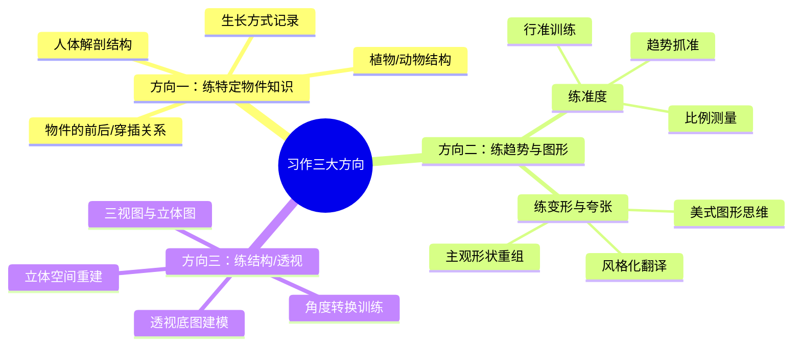
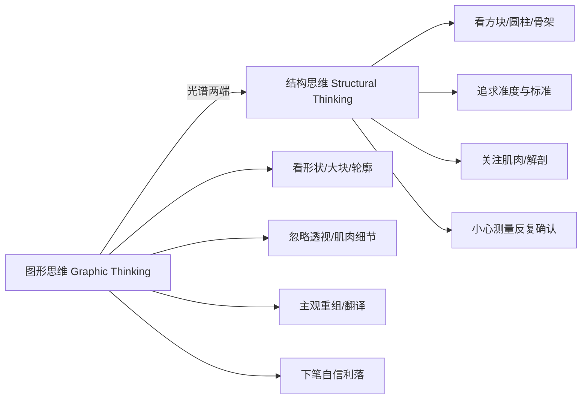
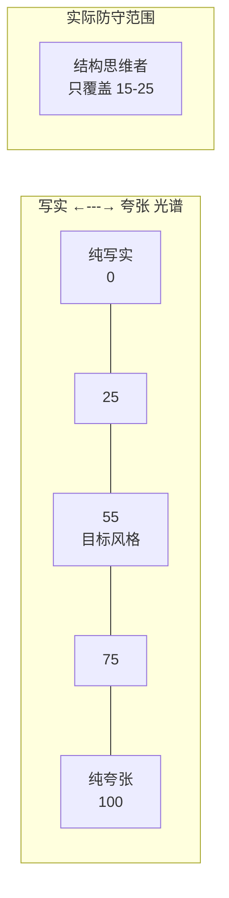
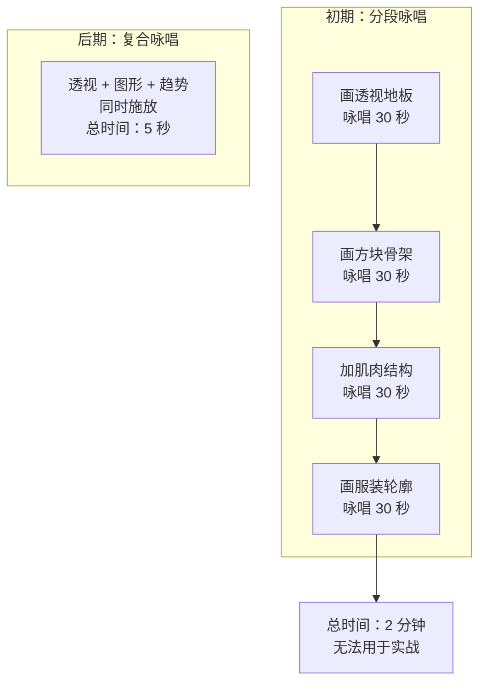
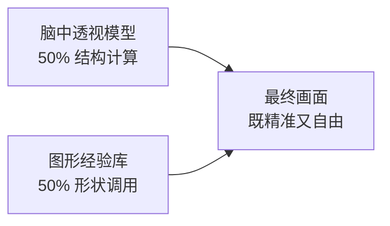
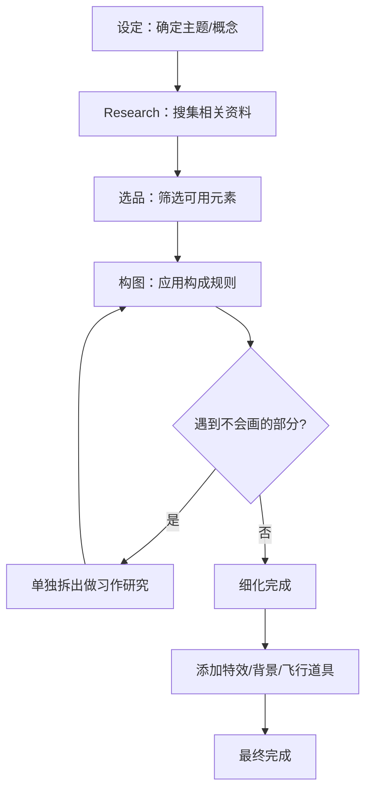

# 第08课：整合练习

> 最后一堂课，将所有技巧融合为「综合咏唱」，从「知道」迈向「做到」。

---

## 三种绘画形式：摸鱼 vs 习作 vs 创作

Krenz 在课程开头将绘画行为拆解为三种截然不同的模式，理解它们的区别是制定个人练习计划的第一步。

| 形式 | 日文/英文 | 核心特征 | 主动/被动 | 目的 |
|------|-----------|----------|-----------|------|
| **摸鱼** | Mindless Drawing | 已经转化为被动技能的熟练动作，背景程序自动运行 | 被动 | 维持手感、放松 |
| **习作** | Study | 针对特定概念做 AB test，20-40 分钟一组，一次 2-3 组 | 主动 | 刻意练习、推进认知 |
| **创作** | Creation | 设定 → 研究 → 选品 → 构图 → 细化，包含 30% 未知内容 | 主动 | 产出完整作品 |

> [!summary] 关键区分
> **摸鱼** 不会带来认知提升；**习作** 是刻意练习特定知识点；**创作** 需要面对不会画的东西并主动解决。三者在练习计划中各司其职。

### 摸鱼（被动技能池）

摸鱼是你已经内化的技能——画脸、画眼睛、画熟悉的半身像。这些动作不需要意识的参与，如同背景程序自动运转。它的价值在于维持熟练度，但不会推动认知边界的扩展。

### 习作（刻意练习）

习作的定义：
- **时长**：20-40 分钟一组，一次 2-3 组
- **总量**：约 40-120 分钟
- **频率**：每周 1-2 组即可
- **核心**：针对某个概念做 AB test 研究

> 习作就像课程作业——每份作业都有一个明确的知识点目标，迫使你刻意观察和思考。

### 创作（完整作品）

创作的特征：
- **事前准备**：设定概念、做心智图、搜集资料
- **研究环节**：遇到不会画的部分先做额外练习
- **规划执行**：按计划逐步推进

**核心公式**：一张图中 70% 是你知道的，30% 是你不太知道的。如果反过来，失败率会大幅提升。

---

## 习作的三大方向

习作可以归纳为三个大方向，每个方向训练不同的能力：

### 方向一：特定物件知识与生长方式

研究物件"如何生长"——肌肉的走向、骨骼的穿插、藤蔓的攀爬方式。这是**知识性的积累**，需要反复记忆和理解。

**练习素材举例**：
- 人体肩膀肌肉与胸肌的关系
- 膝盖骨头的形状（铁锤状）与弯曲时的运动
- 猪笼草等植物的根茎生长方式
- 动物的肌肉分布笔记

### 方向二：趋势与图形（本课重点）

趋势与图形练习分为两个子类：

#### 练准度

- 测量各部件比例（腿长、腰的位置、手的角度）
- 追求趋势线的准确位置
- 图形轮廓的准确捕捉

#### 练变形与夸张

- 风格化翻译（写实 → 美式/Q 版）
- 主观形状重组
- 大胆下笔，不纠结"标准"

> 练准度与练夸张不是二选一，而是光谱的两端。你需要**扩大自己的防守范围**。

### 方向三：结构与透视

- 在透视地板上重建模型
- 改变角度重新绘制（脑内旋转）
- 分离出单部件做结构研究（手的肌肉、腿的骨骼）

---

## 图形思维 vs 结构思维

这是本课最为核心的概念区分。

### 常见误区：尴尬的中间态

许多同学的练习陷入一个"尴尬的中间态"：

- 说准不够准
- 说图形不够图形
- 说夸张不够夸张

**典型表现**：用火柴人起稿，画了方块，但方块透视是歪的；想练趋势却一直在抠结构；想练结构却被图形思维干扰。

**卡住的原因**：长期只做结构思维练习，没有进行**图形思维的专项训练**。

### 扩大防守范围

> [!summary] 防守范围
> 如果你的目标风格在 55 的位置，但你的训练只让你覆盖 15-25 的范围，你永远碰不到目标。你需要通过图形训练（Q版、美式夸张）让防守范围扩展到 25-80，才能自由调整到目标位置。

---

## 速写的多种目的

"速写"这个词涵盖太多不同的活动，Krenz 建议你建立自己的速写目的列表：

| 目的类型 | 描述 | 时间 | 追求 |
|----------|------|------|------|
| 记录生长方式 | 记录植物/动物的结构特征 | 可变 | 信息的准确性 |
| 快速记录动作 | 用火柴人捕捉动态感觉 | 30 秒-2 分 | 动态感 |
| 抓形训练 | 追求轮廓的准确度 | 2-10 分 | 准度 |
| 图形拆解 | 将对象拆成零件/大块形状 | 10-20 分 | 图形感 |
| 透视建模 | 在透视空间中重建对象 | 20-40 分 | 空间感 |
| Q版翻译 | 将写实人物转化成 Q 版 | 20-40 分 | 主观判断 |
| 美式图形应用 | 将人物塞入方形/圆形印象 | 20-40 分 | 大胆变形 |

> 速写的核心精神是 **有明确绘画目的的现场练习或现场记录**。你的目的决定了练习的方法。

---

## 复合咏唱（Compound Chanting）

这是本节课最核心的实战概念。

### 咏唱类比

Krenz 用 RPG 游戏的"咏唱咒文"来比喻绘画技巧的应用：

**关键结论**：只有将单项技能练到反射动作（被动技能）的程度，才能在实战中同时施放多项技能。

### 透视的复合咏唱

以透视为例，从"加法计算"到"直觉轮廓"的进化：

1. **阶段一**：画地板 → 画 XYZ 线 → 检查每一条线（加法模式，很慢）
2. **阶段二**：只画必要的轮廓线，中线和 XYZ 标示
3. **阶段三**：从轮廓直接开始，CSI 用笔，同时体现透视收缩

> 当你透视"吃透"后，你画的既是图形也是透视——一条线同时满足两种属性的要求。

### 图形 + 透视同时进行

**实战示例**：
- 画人物外套时：50% 靠以前画结构时计算过的布料皱褶，50% 靠拆图形时积累的形状记忆
- 不需要画透视线，直接在脑中推算完成透视，然后用图形的方式呈现

---

## 图形思维的具体训练方法

### 方法一：拆图形（一片片画）

将对象拆解为 4-5 块零件，**先画外轮廓再补内部趋势**：

1. 找到对象的"零件分野"
2. 一次画一大块（外轮廓）
3. 在内部补充趋势线
4. 全部零件拼合

**训练目的**：让自己习惯从图形角度思考，而不是结构角度。

### 方法二：Q版翻译练习

将写实人物转化为 Q 版（2.5 头身等），在有限的标准下做出主观判断：

- 源图上找不到的东西需要自己调整
- 调整的过程就是**练习下判断**
- 这是结构思维者很少经历的环节

### 方法三：美式图形应用

将人物强行塞入特定的几何印象（方形、圆形、三角形）：

- 不求画得像，只求画出"方形印象"
- 更主观、更大胆地重组形状
- 就像皮克斯风格的角色设计

---

## 透视与构成的兼容

> 透视要"吃透"变成被动技能，才能和构成共存。

### 从轮廓起手的条件

要做到从轮廓起手且透视不丢失，需要以下基础等级：

| 技能 | 所需等级 | 说明 |
|------|----------|------|
| 趋势感知 | Lv.5 | 能一眼看出方向线 |
| 用笔等级 | Lv.3 | 能区分 CSI 用线 |
| 图形敏感度 | Lv.4 | 能感知形状的边界 |
| 透视理解 | Lv.3 | 吃透透视概念 |

因为趋势线同时也是透视线——当你观察够仔细时，轮廓本身就包含透视收缩的信息。

---

## 创作流程详解

Krenz 将第八课作业视为一次完整的**创作练习**：

**创作中贴创作做练习**：
- 当你遇到不会画的地方（手、腿、书本），不要一直在原图上死磕
- 如果 3-4 次都画不好，说明需要额外研究
- 在旁边单独拆出来做 20-30 分钟的研究练习
- 研究方式：结构研究（透视建模）或图形研究（形状拆解）

---

## 关于"正确"与 AB test

Krenz 强调，脱离助教后的自我精进依赖**AB test 精神**：

### 无限多重宇宙法

1. 当前方案在 A 位置
2. 尝试 B、C、D、E、F... 等可能性
3. 发现某些方案并没有更好 → **消除错误答案**
4. 剩下的最佳解就是"暂时的最佳解"

> 我们很难说某个东西"绝对正确"，但我们可以知道哪些路线行不通。

### 改图练习

- 主动去改别人的图（在讨论区等）
- 用自己的理解重新画一次
- 你可能会发现你画出来的线没有比较好
- 这本身就是一种验证——消灭了一个可能性

---

## 课后练习

### 第八课作业：综合咏唱挑战

这是将第一至第七课所有知识点整合的"集中咏唱"作业。

#### 核心要求

同时运用以下所有技巧于一张完整构图中：

| 技巧 | 来源课程 | 在作业中的体现 |
|------|----------|----------------|
| D 字型动态 | L1-L2 | 人物主动态线 |
| 知字型/风字型 | L3-L4 | 肢体与服饰的辅助动态 |
| 直曲对比 | L3 | 直线 vs 曲线的配置 |
| 背景动线 | L5-L6 | 背景元素与人物动态呼应 |
| 八字回游 | L6 | 画面能量流动路径 |
| 飞行道具 | L1 | 前景效果元素 |

#### 作业步骤

1. **选公版**：从提供的 9 个公版动线中选择 1 个
2. **选角色**：确定要画的主题角色，从职业获取元素线索
3. **搜集资料**：
   - 角色参考图
   - 相关元素（魔法书、药水瓶、武器等）
   - 动作参考
4. **研究不会画的部分**：
   - 手部单独练习（握拳手势、手指表演）
   - 腿部/脚部单独练习
   - 特殊道具的拆分研究
5. **布局**：
   - 第一层（前景）：飞行道具
   - 第二层（中景前景）：特效
   - 第三层（中景）：人物
   - 第四层（背景）：景物
6. **细化**：保持画面构成的一致性

#### Q版替代方案

如果人体基础较弱，可以选择画 Q 版。Q 版同样需要：
- 保持斜率一致
- 保持身体/腿的方向
- 保持服装的基本形状
- 保留八字形流动线

**测试标准**：尝试将 Q 版 100% 贴齐模板，能贴齐 100% 意味着你能做到 90%、80%、70%。

#### 每周练习建议

| 天数 | 练习类型 | 素材 | 时长 |
|------|----------|------|------|
| 周一 | 全混合速写 | 照片 A | 20 分钟 |
| 周二 | 拆分图形 | 照片 A | 20 分钟 |
| 周三 | 透视建模 | 照片 B | 20 分钟 |
| 周四 | 图形应用(Q版/美式) | 照片 C | 20 分钟 |
| 周五 | 趋势专项 | 照片 D | 20 分钟 |
| 周末 | 创作推进 | 自己的作业 | 自由 |

> 不需要一天练 8 组——细水长流比突击更有效。坚持比强度重要。

---

## 课程金句

> "我这门课实际上是用画画包装的思考课。"

> "'就算你画得再好，你也不能上火星啊。'——我们走在自己时区就好了。"

> "一张图中 70% 是你知道的，30% 是你不太知道的；如果反过来，失败率就会高。"

> "我们很难说某个东西绝对正确，但我们可以知道哪些路线行不通。"

> "每个难熬的时刻，为的都是撑到茅塞顿开的那一刻。"

---

## 相关课程

- [[0000-orientation|第01课：暖身与构成基础]] — D 字型、飞行道具
- [[0001-flying-props|第02课：线条质量与趋势]] — CSI 用笔、C 字型
- [[0002-dual-protagonists|第03课：图形与结构思维]] — 图形 vs 结构、风字型
- [[0003-dynamic-lines|第04课：透视与空间]] — 透视建模、枕头模型
- [[0004-deconstruction|第05课：画面构成元素]] — 直曲对比、特效
- [[0005-rhythm|第06课：能量流动与八字回游]] — 八字回游、背景动线
- [[0006-scaffolding|第07课：分析练习]] — 画面分析、动线拆解