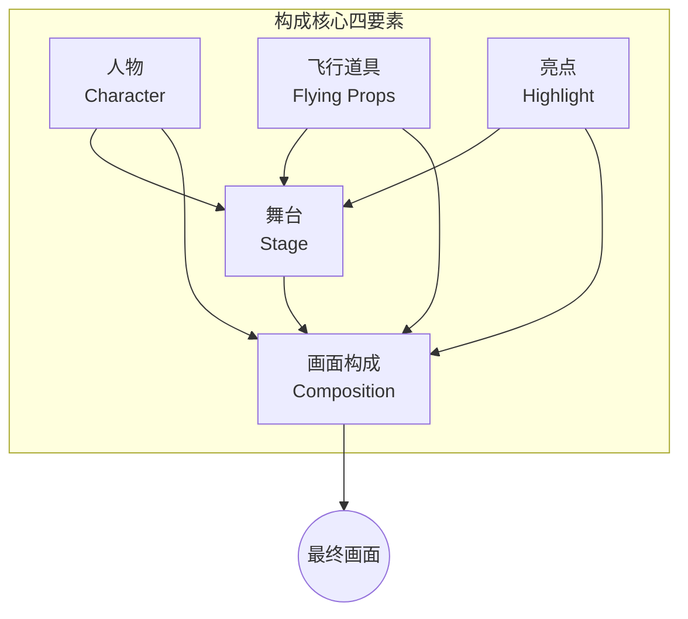
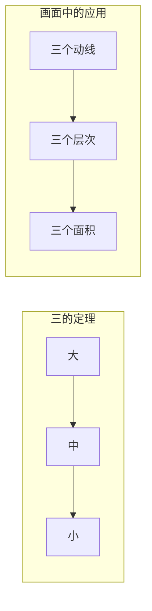
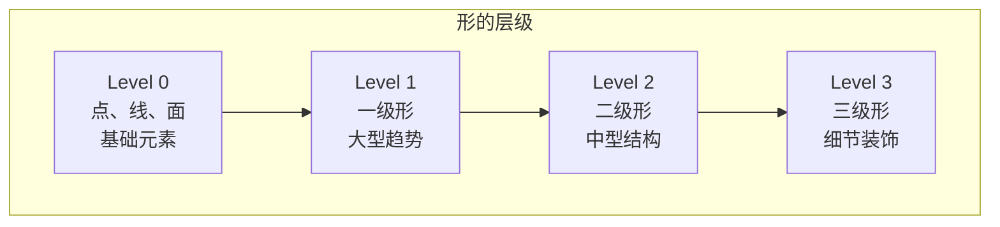
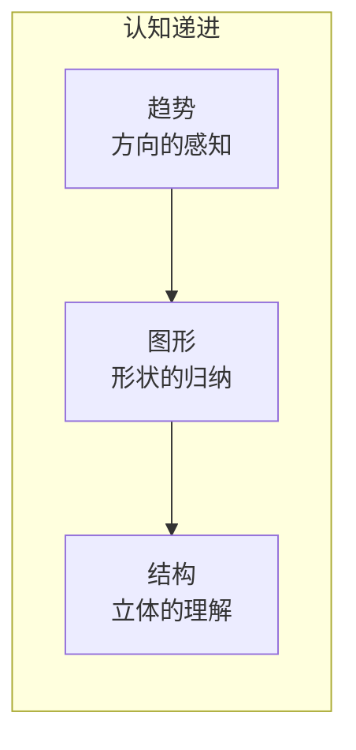
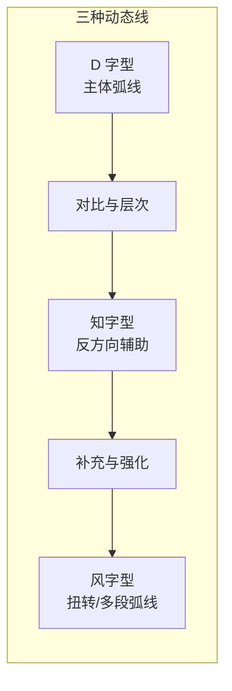
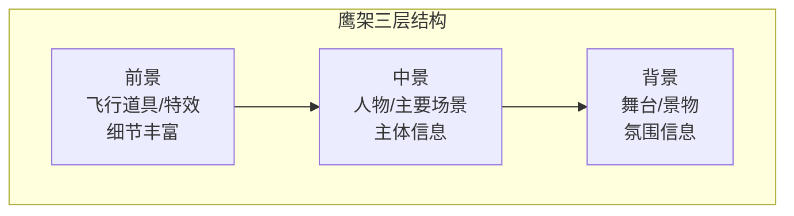
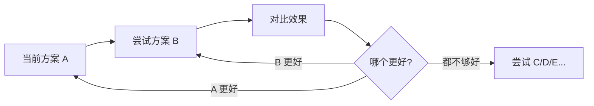
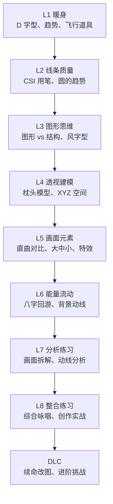

# Krenz 构成框架总览

> 构成课的完整知识体系地图。所有技巧最终在第八课汇流为"综合咏唱"。

---

## 核心框架总图

构成课的终极目标是将以下四个层面的元素组合成一张完整的画面：

| 要素 | 说明 | 对应课程 |
|------|------|----------|
| **人物** | 主要角色的动态与造型 | L1-L4 |
| **舞台** | 背景、场景、空间环境 | L5-L6 |
| **飞行道具** | 前景元素、特效、辅助动态 | L1, L5 |
| **亮点** | 视觉焦点、对比最强的区域 | L5, L7 |

---

## 三的定理（Rule of Three）

贯穿整个构成课程的核心原则——**重复三次**是最舒适的视觉编排。

> 无论画什么，寻找"三"的结构：三个大小层级、三个方向、三个节奏点。

---

## 形的四个层级

| 层级 | 名称 | 说明 | 关注点 |
|------|------|------|--------|
| Lv.0 | 基础元素 | 点、线、面、CSI 用笔 | 绘画的原子单位 |
| Lv.1 | 一级形 | 大型趋势、整体动线 | 画面的大方向 |
| Lv.2 | 二级形 | 中型结构、主要块面 | 物件的立体感 |
| Lv.3 | 三级形 | 细节装饰、纹理 | 精致的完成度 |

> 正确的绘画顺序：Lv.0 → Lv.1 → Lv.2 → Lv.3。跳过任何一层都会导致画面问题。

---

## 趋势 -> 图形 -> 结构 的递进关系

这是构成学习中三个相互关联又各自独立的维度：

| 维度 | 英文 | 核心问题 | 典型练习 |
|------|------|----------|----------|
| **趋势** | Trend / Gesture | 这条线往哪个方向走？ | 抓趋势线、CSI 用笔 |
| **图形** | Graphic / Shape | 这个形状长什么样？ | 拆图形、Q版翻译 |
| **结构** | Structure | 它在 3D 空间中如何存在？ | 透视建模、体块分析 |

> **关键认知**：趋势是图形的基础，图形是结构的基础。但这不是绝对的先后顺序——最终需要"同时咏唱"。

---

## D 字型 / 知字型 / 风字型

这是构成课中最核心的三种动态线类型：

### D 字型（D-Shape）

- **特征**：一个大弧线内含直线切角，形状如字母 D
- **作用**：表现主动态、主体趋势
- **位置**：人物脊柱、主要肢体

### 知字型（Knowledge-Shape）

- **特征**：与 D 字型方向相反的辅助曲线
- **作用**：制造对比、丰富动态层次
- **位置**：四肢、服饰、次要元素

### 风字型（Wind-Shape）

- **特征**：S 形或多段扭转的弧线
- **作用**：制造扭转感、复杂动态
- **位置**：全身扭转、复杂道具

> **组合使用**：D 字型为主 + 知字型为辅 + 风字型强化，形成丰富的动态层次。

---

## 直曲对比（Straight vs Curve）

画面中**直线与曲线的对比**是制造张力的核心手段：

| 直线特征 | 曲线特征 | 组合效果 |
|----------|----------|----------|
| 力量感 | 优美感 | 刚柔并济 |
| 方向明确 | 流动自由 | 动静结合 |
| 稳定 | 动感 | 戏剧张力 |

> 一条好的动态线往往是在**大曲线中插入直线切角**，或者**在直线框架中嵌入曲线细节**。

---

## 鹰架与八字回游

### 鹰架（Scaffolding）

鹰架是建立画面空间层次的"施工架构"：

### 八字回游（Figure-8 Flow）

八字回游是画面能量的**循环流动路径**：

- 能量从画面一侧进入
- 经过主体人物
- 通过辅助元素回旋
- 回到起始点形成闭环

> 八字回游让观众视线在画面中循环，增加观看时长和趣味性。

---

## 研究方法论

### AB test

AB test 是贯穿整个构成课程的核心研究方法：

**AB test 三原则**：
1. **锁定主题**：每次只测试一个变量的不同参数
2. **小规模**：20-40 分钟的集中测试
3. **记录结果**：记录不同方案的优缺点

### 研究精神（Research Spirit）

Krenz 强调的"研究精神"：

- **顿悟时刻**（Eureka Moment）：经过多次试错后突然想通的瞬间
- **享受枯燥**：研究过程中 60-70% 的时间是枯燥的，但这是抵达顿悟的必经之路
- **持续探索**：将绘画视为一种"做实验"——提出假设、验证、调整

---

## 学习路径总览

### 技能解锁路线图

| 课程 | 核心技能 | 解锁内容 |
|------|----------|----------|
| L1 | 趋势感知 | D 字型、基本动线、飞行道具 |
| L2 | 线条控制 | CSI 用笔、C/S/I 线型 |
| L3 | 图形思维 | 图形 vs 结构、风字型、夸张变形 |
| L4 | 空间理解 | 透视建模、枕头模型、XYZ |
| L5 | 画面组织 | 直曲对比、大中小、特效 |
| L6 | 能量循环 | 八字回游、鱼尾巴、背景呼应 |
| L7 | 分析能力 | 名作解析、动线拆解 |
| L8 | 综合应用 | 所有技巧整合、创作实战 |

---

## 学习建议备忘

### 练习频次

| 周期 | 习作 | 摸鱼 | 创作 |
|------|------|------|------|
| 每天 | - | 可做 | - |
| 每周 | 1-2 组 | 3-5 次 | 持续进展 |
| 每两周 | 累积 | - | 完成一张 |

### 常见痛点与对策

| 痛点 | 可能原因 | 建议对策 |
|------|----------|----------|
| 画得不准 | 趋势感知不够 | 专练抓趋势，放慢速度 |
| 画面僵硬 | 图形思维缺失 | 练 Q 版/美式，大胆变形 |
| 透视画不对 | 空间想象力不足 | 单独做透视建模练习 |
| 构图平淡 | 缺少直曲对比 | 分析名作的直曲分布 |
| 创作卡关 | 越过 30% 未知区 | 单独拆开做研究再回来 |

### 关于"防守范围"

> 你的技能范围越宽，你越能自由地调整到目标风格。不要只练一种——**同时练习写实与夸张，结构思维与图形思维**。

---

## 相关文档

- [[0008-integration|第08课：整合练习]]
- [[glossary|术语表 Glossary]]