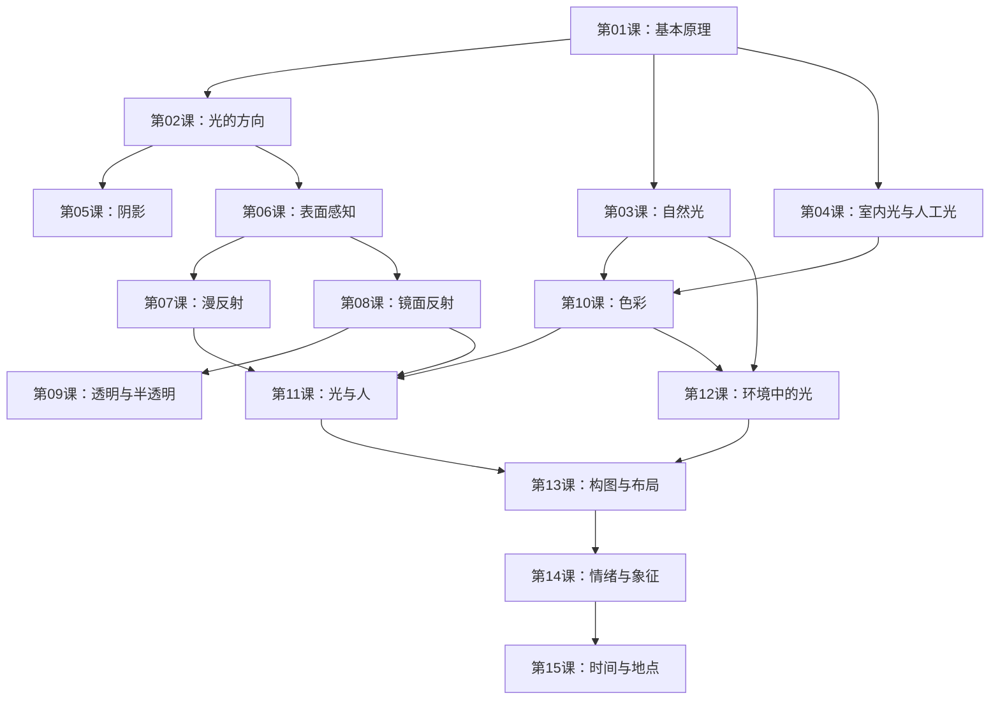

# 课程地图

## 推荐学习路径

1. **核心基础**（必修）：第01课 → 第02课 → 第05课 → 第06课
2. **光源与色彩**（必修）：第03课 + 第04课 → 第10课
3. **反射专题**（建议顺序）：第07课 → 第08课 → 第09课
4. **实践应用**：第11课 + 第12课
5. **创意进阶**：第13课 → 第14课 → 第15课

## 学习建议

- 每课都包含观察练习，**不要跳过**
- 建议准备相机或手机，拍摄不同光照条件下的场景
- Part 1（第01-10课）建议按顺序学习
- Part 2-3（第11-15课）可以根据兴趣调整顺序