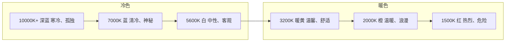

# 色温参考

## 常见光源色温表

| 光源 | 色温 (K) | 色调 | 典型场景 |
|------|----------|------|---------|
| 烛光 | 1500-1800 | 深红/橙 | 烛光晚餐、暗光氛围 |
| 日出/日落 | 2000-3000 | 暖橙 | 黄金时刻 |
| 家用钨丝灯 | 2800-3200 | 暖黄/橙 | 室内夜晚 |
| 摄影棚钨丝灯 | 3200-3400 | 暖白 | 摄影棚 |
| 荧光灯（暖白） | 3000-4000 | 暖白/微绿 | 办公室 |
| 荧光灯（冷白） | 4000-5000 | 冷白/绿 | 商场、学校 |
| 晨光/午后光 | 4500-5000 | 中性 | 白天户外 |
| 标准日光 | 5500-5600 | 纯白 | 摄影/视频白平衡基准 |
| 电子闪光灯 | 5500-6000 | 白 | 摄影 |
| 阴天 | 6000-7000 | 冷白/微蓝 | 阴天户外 |
| 开放阴影 | 7000-8000 | 蓝 | 晴天阴影处 |
| 蓝色天光 | 8000-10000 | 深蓝 | 晴朗天空 |
| 多云天空 | 10000+ | 紫蓝 | 高海拔/阴天 |

## 色温与情绪



> [!TIP] 色温的两套体系
> **科学**：蓝色=高温（如蓝焰），红色=低温
> **艺术**：红色=暖色，蓝色=冷色
> 在视觉艺术中使用艺术的冷暖体系，在技术参数（如白平衡设置）中使用科学体系。

## 互补色对照

| 主光颜色 | 色温 | 补光/阴影颜色 | 效果 |
|---------|------|-------------|------|
| 暖黄（日落） | 3000K | 冷蓝（天光） | 经典自然的冷暖对比 |
| 暖橙（钨丝灯） | 3200K | 冷蓝（窗外天光） | 温馨+神秘混合氛围 |
| 冷白（阴天） | 6500K | —（均匀单一光源） | 柔和、无强烈对比 |
| 中性白（日光） | 5600K | 蓝色（天光阴影） | 户外标准光照 |

## 色温在创作中的应用

### 1. 营造时间感
- **清晨**：低角度暖光（2500-3500K）+ 长阴影
- **正午**：白色强光（5600K）+ 极短阴影
- **黄昏**：深暖色（2000-3000K）+ 蓝色阴影补光
- **夜晚**：极低环境光 + 暖色点光源（烛光/台灯1800-3200K）

### 2. 控制情绪
- **统一色温**：整个场景用一种色温统治→强烈的情绪表达
- **对比色温**：冷暖光源混合→复杂、有故事感
- **渐变**：色温在场景中缓慢变化→自然、优雅

### 3. 混合色温的注意事项
```
室内黄昏场景：
- 窗边：冷蓝（6500-8000K 天光）
- 台灯：暖黄（2800-3200K 钨丝灯）
- 中间区域：两种色温混合
效果：自然且富有层次感的视觉呈现
```

> [!WARNING] 关于白平衡
> 人眼会自动校准色偏——在钨丝灯下白纸看起来还是白色。但相机不会！如果用日光白平衡拍钨丝灯场景，照片会非常橙。**两种都是"真实"的**——选择权在你手中。

## 实际参考

### 色温判断技巧
- **从室外看窗户**：晚上看邻居家的窗户——里面是明亮的橙色。在室外不受白平衡影响时，钨丝灯的真实颜色一目了然
- **阴影检查**：晴天站在阴影里看阴影外——你会看到阴影有明显的蓝色调，但站在阴影里时感觉不到
- **相机测试**：用日光白平衡模式拍摄，才能看到光线的真实颜色

---

## 相关课程

- [[reference/glossary|术语表]]
- [[reference/lighting-setups|光照设置速查]]
- [[lessons/0010-se-cai|第10课：色彩]]