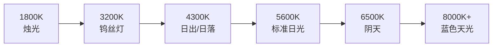

# 光照术语表

## 基础光学

| 术语 (English) | 中文 | 简要解释 |
|---------------|------|---------|
| Photon | 光子 | 光的能量粒子，无质量，不同波长的光子呈现不同颜色 |
| Wavelength | 波长 | 决定光颜色的物理属性，可见光波长范围约 380-750nm |
| Spectrum | 光谱 | 可见光中从紫到红的连续波长分布 |
| Scattering | 散射 | 光线与大气粒子相互作用后改变方向的现象 |
| Refraction | 折射 | 光线穿过透明介质时速度改变导致方向弯曲 |
| Dispersion | 色散 | 不同波长光在折射时弯曲角度不同导致白光分离为彩色 |
| Inverse-square law | 反平方定律 | 光的强度与距离的平方成反比 |
| Falloff | 衰减 | 光源附近光强度随距离增加而减弱的效应 |

## 光源类型

| 术语 (English) | 中文 | 简要解释 |
|---------------|------|---------|
| Key light / Main light | 主光 | 场景中最主要的光源 |
| Fill light | 补光/辅光 | 补充阴影区域的次级光源 |
| Back light / Rim light | 背光/轮廓光 | 从背后照亮物体边缘的光 |
| Ambient light | 环境光 | 环境中普遍存在的散射光 |
| Bounced light | 反射光/弹射光 | 从一个表面反射到另一个表面的光 |
| Hard light | 硬光 | 来自小光源的光，产生锐利阴影 |
| Soft light / Diffuse light | 柔光/漫射光 | 来自大光源的光，产生柔和阴影 |
| Skylight | 天光 | 大气散射形成的蓝色漫射光 |
| Tungsten light | 钨丝灯 | 色温约 3200K 的黄色/橙色家用灯泡 |
| Fluorescent light | 荧光灯 | 常带绿色调的经济型照明 |
| Daylight | 日光 | 色温约 5600K 的标准白光 |

## 阴影

| 术语 (English) | 中文 | 简要解释 |
|---------------|------|---------|
| Form shadow | 形态阴影 | 物体表面光源照不到的区域 |
| Cast shadow | 投影 | 物体遮挡光线后投射到其他表面的阴影 |
| Terminator | 明暗分界 | 物体上受光面与背光面之间的临界线 |
| Umbra | 本影 | 阴影中最暗的核心区域 |
| Penumbra | 半影 | 阴影边缘较柔和的过渡区域 |
| Ambient occlusion | 环境光遮蔽 | 表面靠近处因光线被阻挡而变暗的效应 |
| Base shadow | 基础阴影 | 物体底部与接触面之间的阴影 |
| Core shadow | 核心阴影 | 明暗分界附近最暗的区域 |

## 反射

| 术语 (English) | 中文 | 简要解释 |
|---------------|------|---------|
| Diffuse reflection | 漫反射 | 光线被表面向各个方向散射的反射 |
| Specular reflection | 镜面反射/直接反射 | 光线按入射角=反射角反射，形成清晰镜像 |
| Fresnel effect | 菲涅耳效应 | 视线与表面夹角越小，反射越强的现象 |
| Anisotropic reflection | 各向异性反射 | 因表面加工纹理导致反射沿特定方向拉伸 |
| Highlight | 高光 | 表面上最亮的光源反射点 |
| Gloss | 光泽度 | 表面镜面反射的强度 |
| Index of refraction (IOR) | 折射率 | 光在真空中速度与在介质中速度的比值 |

## 色彩

| 术语 (English) | 中文 | 简要解释 |
|---------------|------|---------|
| Hue | 色相 | 颜色在色环上的位置（如红、蓝、绿） |
| Saturation | 饱和度 | 颜色的纯度或强度 |
| Value / Lightness | 明度/亮度 | 颜色的明暗程度 |
| Additive color (RGB) | 加色法 | 红绿蓝三色光混合产生其他颜色（屏幕） |
| Subtractive color (CMYK) | 减色法 | 青品黄黑四色混合（印刷） |
| Color temperature | 色温 | 光源颜色的数值描述，单位为开尔文(K) |
| Local color | 固有色 | 物体在标准白光下本身的颜色 |
| Radiance | 辐射 | 表面反射的颜色光会影响相邻表面的现象 |
| Gamut | 色域 | 设备或介质能显示/再现的颜色范围 |
| Color cast | 色偏 | 光源或环境导致的整体色调偏移 |

## 表面与材质

| 术语 (English) | 中文 | 简要解释 |
|---------------|------|---------|
| Dielectric | 电介质 | 不导电的非金属材料（玻璃、塑料、皮肤等） |
| Translucency | 半透明 | 光线可以穿过但被散射，无法看清背后物体 |
| Transparency | 透明 | 光线穿过且不被散射，可以清晰看到背后物体 |
| Sub-surface scattering (SSS) | 次表面散射 | 光线进入半透明表面内部后从另一位置射出 |
| Caustics | 焦散 | 曲面折射或反射光汇聚形成的亮斑图案 |
| Roughness | 粗糙度 | 表面微观不平整度，影响反射清晰度 |

## 光照类型

| 术语 (English) | 中文 | 简要解释 |
|---------------|------|---------|
| High-key | 高调 | 画面以亮色调为主，轻快明亮 |
| Low-key | 低调 | 画面以暗色调为主，戏剧性强 |
| Three-point lighting | 三点照明 | 主光+补光+背光的经典布光方案 |
| Golden hour | 黄金时刻 | 日落前约一小时的温暖金色光线 |
| Alpenglow | 高山辉 | 日落后东方天空出现的粉色辉光 |
| Open shade | 开放阴影 | 没有直射阳光但被蓝天光照亮的阴影区域 |
| North light | 北向光 | 北向窗户提供的稳定柔光 |
| Motivated lighting | 动机照明 | 有可见/合理光源依据的布光 |

## 边缘类型

| 术语 (English) | 中文 | 简要解释 |
|---------------|------|---------|
| Hard edge | 硬边 | 明暗之间截然分明的过渡 |
| Firm edge | 坚固边 | 明暗之间有明确但不锐利的过渡 |
| Soft edge | 软边 | 明暗之间有渐变的过渡 |
| Lost edge | 消失边 | 明暗之间几乎没有可辨识的过渡 |

## 参考色温值

> [!NOTE] 色温与感受相反
> 科学上，蓝色色温更高（更热），红色色温更低（更冷）。艺术上正好相反——我们称红色为暖色，蓝色为冷色。两种用法都有其价值。

---

## 相关课程

- [[reference/color-temperature|色温参考]]
- [[reference/lighting-setups|光照设置速查]]